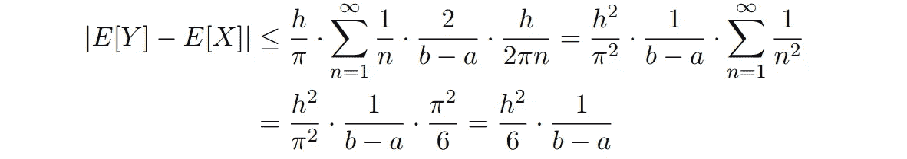
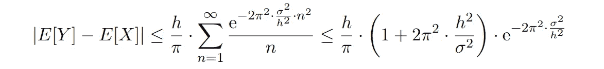
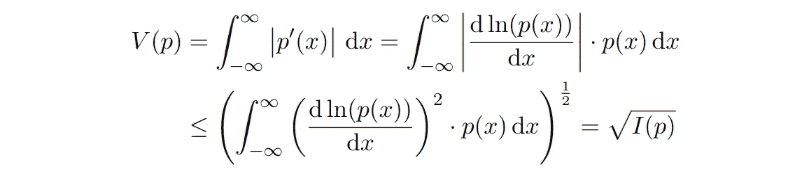

# 关于四舍五入或分箱数据的统计分析

> 原文：[`towardsdatascience.com/on-the-statistical-analysis-of-rounded-or-binned-data-e24147a12fa0?source=collection_archive---------17-----------------------#2024-01-04`](https://towardsdatascience.com/on-the-statistical-analysis-of-rounded-or-binned-data-e24147a12fa0?source=collection_archive---------17-----------------------#2024-01-04)

## 谢普德修正提供了近似值，但误差依然存在。分析界限为这些误差的大小提供了洞察。

 [Matthias Plaue](https://medium.com/@mplaue?source=post_page---byline--e24147a12fa0--------------------------------)

·发表于 [Towards Data Science](https://towardsdatascience.com/?source=post_page---byline--e24147a12fa0--------------------------------) ·阅读时间 9 分钟·2024 年 1 月 4 日

--

图片由 [charlesdeluvio](https://unsplash.com/@charlesdeluvio?utm_source=medium&utm_medium=referral) 提供，来自 [Unsplash](https://unsplash.com/?utm_source=medium&utm_medium=referral)

想象一下有一份以英寸为单位、精确到英寸的长度测量数据。这份数据可能代表着某个医学研究中参与者的身高，形成了一个来自感兴趣群体的样本。我们的目标是估计这个群体的平均身高。

假设有一个算术平均值为 70.08 英寸。关键的问题是：这个数据有多准确？尽管样本量很大，实际上每个测量值的精度仅限于英寸。因此，即使有大量数据，我们也只能谨慎地假设真实的平均身高在 69.5 英寸到 70.5 英寸之间，并将其四舍五入到 70 英寸。

这不仅仅是一个可以轻易忽视的理论问题。例如，假设我们要计算以公制单位表示的平均身高。1 英寸等于正好 2.54 厘米，因此我们可以轻松地将测量值从英寸转换为更精细的厘米刻度，然后计算平均值。然而，考虑到英寸级别的精度，我们只能自信地断言，平均身高在 177 厘米到 179 厘米之间。问题是：我们能否自信地得出结论，平均身高是*精确的*178 厘米？

舍入误差或[量化误差](https://en.wikipedia.org/wiki/Quantization_(signal_processing))可能会带来[巨大的后果](https://slate.com/technology/2019/10/round-floor-software-errors-stock-market-battlefield.html)——比如改变[选举结果](https://catless.ncl.ac.uk/Risks/13/37#subj4)，或改变弹道导弹的航向，导致[意外死亡和伤害](https://www-users.cse.umn.edu/~arnold/disasters/patriot.html)。舍入误差如何影响统计分析是一个复杂的问题，本文将对此进行阐明。

# Sheppard 修正

假设我们观察到由连续随机变量***X***生成的值，这些值已被舍入或分箱*.* 这些观察值遵循离散随机变量***Y***的分布，定义如下：

其中***h***是箱宽，⌊ ⋅ ⌋表示下取整函数。例如，***X***可以生成长度测量值。由于舍入不是可逆操作，仅从舍入后的值重建原始数据是不可能的。

以下近似关系涉及这些分布的均值和方差，称为[Sheppard 修正](https://en.wikipedia.org/wiki/Sheppard%27s_correction) [[Sheppard 1897](https://doi.org/10.1112/plms/s1-29.1.353)]：

例如，如果我们给定的是四舍五入到英寸的测量值，***h*** = 2.54 cm，并观察到标准差为 10.0 cm，则 Sheppard 的第二矩修正要求我们假设原始数据的标准差实际上是**σ** = 9.97 cm。对于许多实际应用，修正值非常小。即使标准差与箱宽的量级相似，修正也仅占原值的 5%。

如果满足以下条件，则可以应用 Sheppard 修正[[Kendall 1938](https://doi.org/10.2307/2980630), [Heitjan 1989](https://doi.org/10.1214/ss/1177012601)]：

+   ***X***的概率密度函数应足够平滑，并且其导数在尾部趋向于零，

+   箱宽***h***不应过大（***h*** < 1.6 **σ**），

+   样本大小***N***不应过小也不应过大（5 < ***N*** < 100）。

前两个要求呈现为典型的“无免费午餐”情况：为了检查这些条件是否成立，我们首先必须知道真实的分布。特别是第一个条件是局部条件，因为它涉及密度的导数，而仅凭舍入或分箱数据我们无法稳健地估计这些导数。

样本大小不宜过于*大*的要求并不意味着随着样本大小增大，四舍五入误差的传播（绝对值）变得更加难以控制。相反，这个要求是针对当试图将四舍五入/分箱引入的偏差与较大样本中标准误差的减小进行比较时，Sheppard 修正可能不再充分的情况。

# 对均值估计中四舍五入误差的总变差界限

Sheppard 修正只是近似值。例如，通常情况下，估计均值的偏差，*E*[***Y***] - *E*[***X***]，实际上是非零的。我们想要计算该偏差绝对值的一些上界。最简单的界限是期望值单调性的结果，以及四舍五入/分箱最多可以将值改变***h*** / 2 的事实：

如果没有关于***X***分布的额外信息，我们无法改进这个界限：假设***X***的概率质量高度集中在一个分箱的中点之上，那么所有由***X***生成的值都将被+ ***h*** / 2 平移，最终得到一个***Y***值，从而实现上界。

然而，可以根据[定理 2.3 (i), [Janson 2006](https://doi.org/10.1214/009117906000000232)]给出以下精确公式：

这里，**φ**( ⋅ )表示***X***的[特征函数](https://en.wikipedia.org/wiki/Characteristic_function_(probability_theory))，即未知概率密度函数***p***( ⋅ )的傅里叶变换。这个公式意味着以下界限：

我们可以为我们最喜爱的分布计算这个界限，例如支持在区间[***a***, ***b***]上的均匀分布：

在这里，我们使用了[平方倒数和](https://en.wikipedia.org/wiki/Basel_problem)的著名值。例如，如果我们从区间***b*** - ***a*** = 10 cm 的均匀分布中抽样，并计算已四舍五入到精度***h*** = 2.54 cm 的数据的均值，那么估算均值的偏差最多为 1.1 毫米。

通过与[[Ushakov & Ushakov 2022](https://doi.org/10.1002/sta4.478)]中进行的计算非常相似的计算，我们还可以给出当从方差为**σ**²的正态分布中抽样时的四舍五入误差界限：

指数项随着分箱宽度减小而快速衰减。例如，给定标准差**σ** = 10 cm 和分箱宽度***h*** = 2.54 cm，估计均值的四舍五入误差约为 10^(-133)，即对于任何实际应用来说，它是可以忽略不计的。

应用[[Ushakov 1999](https://doi.org/10.1515/9783110935981)]的定理 2.5.3，我们可以给出一个更一般的界限，用概率密度函数***p***( ⋅ )的总变差*V*(***p***)来表示，而不是其特征函数：

其中

该计算类似于[[Ushakov & Ushakov 2018](https://doi.org/10.1007/s10958-018-4042-3)]中提供的计算。例如，具有区间[***a***, ***b***]的均匀分布的总变差为 2 / (***b*** - ***a***)，因此上述公式通过特征函数的模提供与之前计算相同的界限。

总变差界限使我们能够提供一个实际使用的公式，用于估算基于直方图（具有箱宽***h***）的四舍五入误差上界：

这里，***n_k***是落入第***k***个箱的观察值数量。

作为一个数值示例，我们分析了由美国疾病控制与预防中心（[CDC 2022](https://www.cdc.gov/brfss/annual_data/annual_2022.html)）调查的***N*** = 412,659 人的身高数据，单位为英寸。该数据的平均身高以公制单位表示为 170.33 厘米。由于样本量较大，标准误差***σ*** / √***N***非常小，仅为 0.02 厘米。然而，由于四舍五入的误差可能更大，总变差的界限可以估算为 0.05 厘米。在这种情况下，统计误差可以忽略不计，因为身高差异在不到一厘米的范围内通常不会有实际意义。然而，对于其他需要高精度估算平均值的测量数据，当数据受到量化处理时，仅计算标准误差可能不足够。

# 基于 Fisher 信息的界限

如果概率密度函数***p***( ⋅ )是连续可微的，我们可以将其总变差*V*(***p***)表示为对导数模的积分。应用[Hölder 不等式](https://en.wikipedia.org/wiki/H%C3%B6lder%27s_inequality)，我们可以通过 Fisher 信息*I*(***p***)的平方根对总变差进行界定：

因此，我们可以写下一个额外的上界，用于计算四舍五入或分箱数据的均值时的偏差：

这个新的界限具有（理论上的）兴趣，因为 Fisher 信息是密度函数的一个特征，通常比其总变差更常用。

更多的界限可以通过已知的 Fisher 信息上界找到，许多可以在[[Bobkov 2022](https://doi.org/10.1214/22-ejp834)]中找到，其中包括以下涉及概率密度函数三阶导数的内容：

值得注意的是，Fisher 信息在某些量子力学的表述中也具有重要意义，其中它作为哈密顿量的一部分，负责引发量子效应[[Curcuraci & Ramezani 2019](https://doi.org/10.1016/j.physa.2019.121570)]。人们可能会思考，是否存在一个具体而有意义的联系，将量子化的物理物质与受到“常规”量子化的经典测量联系起来。然而，值得注意的是，这种推测可能源于数学上的错觉。

# 结论

Sheppard 修正是一种可以用来修正基于舍入或分箱数据计算均值、方差和其他（中心）矩时的误差的近似方法。

尽管 Sheppard 修正对于均值的影响为零，但实际误差可能与标准误差相当，甚至超过，尤其是在样本量较大的情况下。我们可以通过考虑概率密度函数的总变差来约束基于舍入或分箱数据计算均值时的误差，这一数量可以从分箱数据中估算出来。

在估计均值时，舍入误差的额外约束可以通过 Fisher 信息以及未知分布的概率密度函数的高阶导数来表达。

# 参考文献

[[Sheppard 1897](https://doi.org/10.1112/plms/s1-29.1.353)] Sheppard, W.F. (1897). “关于根据等距分割量表排列的数据，计算最可能的频率常数值。”伦敦数学会会刊 s1–29: 353–380。

[[Kendall 1938](https://doi.org/10.2307/2980630)] Kendall, M. G. (1938). “Sheppard 修正有效的条件。”皇家统计学会会刊 101(3): 592–605。

[[Heitjan 1989](https://doi.org/10.1214/ss/1177012601)] Daniel F. Heitjan (1989). “从分组的连续数据中推断：综述。”Statist. Sci. 4 (2): 164–179。

[[Janson 2006](https://doi.org/10.1214/009117906000000232)] Janson, Svante (2005). “连续随机变量的舍入和振荡渐近行为。”*概率年鉴* 34 (5): 1807–1826。

[[Ushakov & Ushakov 2022](https://doi.org/10.1002/sta4.478)] Ushakov, N. G., & Ushakov, V. G. (2022). “样本量较大时舍入对假设检验的影响。”Stat 11(1): e478。

[[Ushakov 1999](https://doi.org/10.1515/9783110935981)] Ushakov, N. G. (1999). “特征函数的选定主题。”De Gruyter。

[[Ushakov & Ushakov 2018](https://doi.org/10.1007/s10958-018-4042-3)] Ushakov, N. G., Ushakov, V. G. 统计分析舍入数据：测量误差与舍入误差。J Math Sci 234 (2018): 770–773。

[[CDC 2022](https://www.cdc.gov/brfss/annual_data/annual_2022.html)] 美国疾病控制与预防中心（CDC）。行为风险因素监测系统调查数据 2022 年。乔治亚州亚特兰大：美国卫生与公共服务部，疾病控制与预防中心。

[[Bobkov 2022](https://doi.org/10.1214/22-ejp834)] Bobkov, Sergey G. (2022). “Fisher 信息的上界。”《电子概率杂志》27: 1–44。

[[Curcuraci & Ramezani 2019](https://doi.org/10.1016/j.physa.2019.121570)] L. Curcuraci, M. Ramezani (2019). “量子势能和波函数温度的热力学推导。”《物理学 A：统计力学及其应用》530: 121570。
