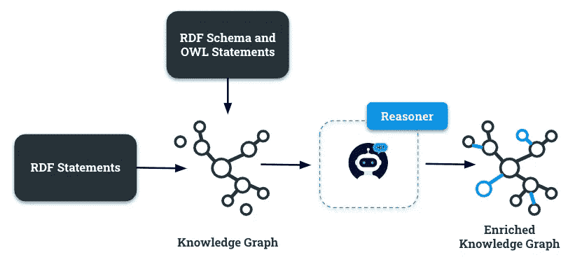

# 知识图谱中的本体推理

> 原文：[`towardsdatascience.com/ontology-reasoning-in-knowledge-graphs-7e563cc5b62a?source=collection_archive---------0-----------------------#2024-11-15`](https://towardsdatascience.com/ontology-reasoning-in-knowledge-graphs-7e563cc5b62a?source=collection_archive---------0-----------------------#2024-11-15)

## [KGs Insights](https://towardsdatascience.com/tagged/kgs-insights)

## 一本 Python 实操指南，帮助理解通过遵循逻辑过程生成新知识的原理

 [Giuseppe Futia](https://medium.com/@giuseppefutia?source=post_page---byline--7e563cc5b62a--------------------------------)

·发布于[数据科学前沿](https://towardsdatascience.com/?source=post_page---byline--7e563cc5b62a--------------------------------) ·阅读时间 9 分钟·2024 年 11 月 15 日

--

图 1 — 一种端到端的过程，展示了如何通过本体推理将初始语句推导出推论

# 介绍

推理能力是 AI 系统中广泛讨论的话题。这些能力通常与大型语言模型（LLMs）相关，后者在从大量数据中提取模式方面特别有效。

在这个学习过程中捕获的知识使得大型语言模型（LLMs）能够执行各种语言任务，例如问答和文本摘要，展示了类似于人类推理的技能。

> 仅仅说“LLMs 无法推理”并没有帮助，因为显然它们可以完成一些人类会用推理来做的事情。 — *Jeremy Howard |
> 
> Fast.AI 联合创始人 — 斯坦福大学数字学者*

尽管 LLMs 能够识别和匹配数据中的模式，但在需要结构化和正式推理的任务中，LLMs 仍然存在局限性，尤其是在需要严谨逻辑过程的领域。

这些局限性突出了模式识别与正确逻辑推理之间的区别，而人类并不总是能察觉到这种区别。
