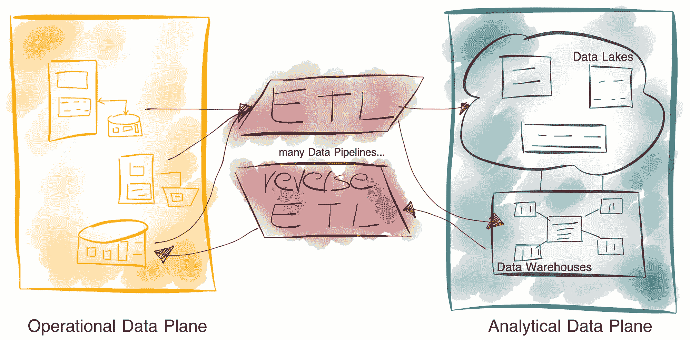

# 运营数据与分析数据

> 原文：[`towardsdatascience.com/operational-and-analytical-data-54fc9de05330?source=collection_archive---------5-----------------------#2024-11-07`](https://towardsdatascience.com/operational-and-analytical-data-54fc9de05330?source=collection_archive---------5-----------------------#2024-11-07)

## 在企业中，数据的区别是什么，我们应该如何对待数据？

 [Bernd Wessely](https://medium.com/@bernd.wessely?source=post_page---byline--54fc9de05330--------------------------------)

·发布于[Towards Data Science](https://towardsdatascience.com/?source=post_page---byline--54fc9de05330--------------------------------) ·7 分钟阅读·2024 年 11 月 7 日

--

不幸的是，我们仍然对运营数据和分析数据的确切含义存在很大的困惑。因此，我们仍在努力寻找一种合适的方式，从企业层面整体处理数据。

所谓“数据的巨大分界”，是我们今天在数据架构中面临的许多挑战的根源。运营数据与分析数据之间的区分，在当前的定义下并没有实际帮助。

图片来源：作者，灵感来自[Zhamak Dehghani 的《数据的巨大分界》](https://martinfowler.com/articles/data-mesh-principles.html#TheGreatDivideOfData)

我在之前的文章中已经讨论过这个问题，并在[《数据网格中的挑战与解决方案》系列的第一部分](https://medium.com/towards-data-science/challenges-and-solutions-in-data-mesh-part-1-24cd45290805)中做出了关键声明：

> 为了解决脆弱的 ETL 管道问题，我们不妨完全不在运营数据与分析数据之间划定严格的界限。相反，我们应该只区分**源数据**与**衍生数据**——这两者都可以用于运营和分析目的。

这一点非常基础，我想在这里进一步阐述，以明确为什么我如此坚持[**普遍数据供应**](https://medium.com/@bernd.wessely/towards-universal-data-supply-98ff53158183)，它能有效弥合两者之间的差距。

# 误解
