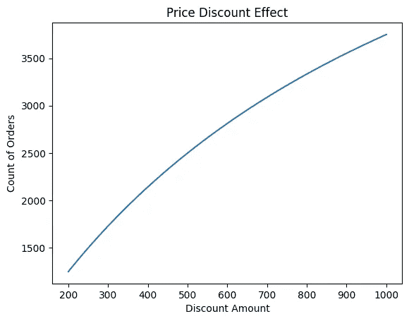
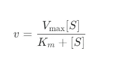
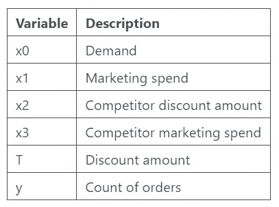
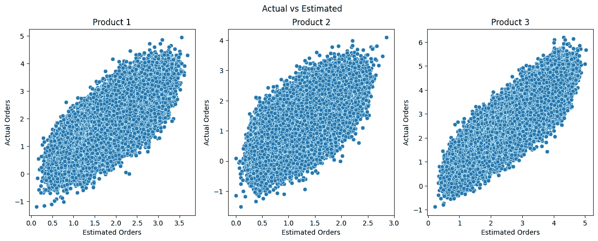
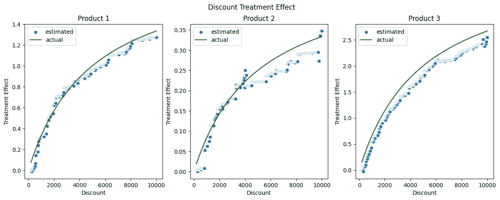
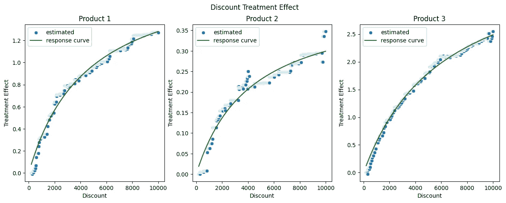
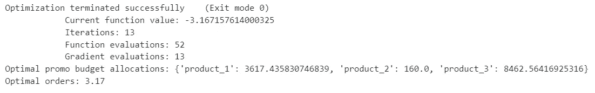

# 优化定价和促销中的非线性处理效应

> 原文：[`towardsdatascience.com/optimising-non-linear-treatment-effects-in-pricing-and-promotions-011ce140d180?source=collection_archive---------2-----------------------#2024-05-24`](https://towardsdatascience.com/optimising-non-linear-treatment-effects-in-pricing-and-promotions-011ce140d180?source=collection_archive---------2-----------------------#2024-05-24)

## 因果 AI，探索因果推理与机器学习的结合

[](https://medium.com/@raz1470?source=post_page---byline--011ce140d180--------------------------------)[](https://towardsdatascience.com/?source=post_page---byline--011ce140d180--------------------------------) [Ryan O'Sullivan](https://medium.com/@raz1470?source=post_page---byline--011ce140d180--------------------------------)

·发表于[Towards Data Science](https://towardsdatascience.com/?source=post_page---byline--011ce140d180--------------------------------) ·12 分钟阅读·2024 年 5 月 24 日

--


由[Ernest Ojeh](https://unsplash.com/@namzo?utm_source=medium&utm_medium=referral)拍摄，[图片来源于 Unsplash](https://unsplash.com/?utm_source=medium&utm_medium=referral)

# 这系列文章讲了什么？

欢迎来到我的因果 AI 系列文章，在这里我们将探索因果推理与机器学习模型的结合。你将看到多个不同业务情境下的实际应用。

在上一篇文章中，我们讨论了*使用双重机器学习和线性规划来优化处理策略*。这次我们将继续优化的主题，探讨*优化定价与促销中的非线性处理效应*。

如果你错过了上一篇关于双重机器学习和线性规划的文章，可以在这里查看：

[](/using-double-machine-learning-and-linear-programming-to-optimise-treatment-strategies-920c20a29553?source=post_page-----011ce140d180--------------------------------) ## 使用双重机器学习和线性规划优化处理策略

### 因果 AI，探索因果推理与机器学习的结合

towardsdatascience.com

# 介绍

本文将展示我们如何优化定价中的非线性处理效应（但这些理念也可以应用于市场营销和其他领域）。

**在本文中，我将帮助你理解：**

+   为什么在定价中非线性处理效应如此常见？

+   我们的因果人工智能工具箱中有哪些工具适用于估算非线性处理效应？

+   非线性编程如何用于优化定价？

+   一个使用 Python 的案例研究，展示了我们如何结合因果人工智能工具箱和非线性编程来优化定价预算。

完整的笔记本可以在这里找到：

[](https://github.com/raz1470/causal_ai/blob/main/notebooks/using%20dml%20and%20lp%20to%20optimise%20treatment%20strategies.ipynb?source=post_page-----011ce140d180--------------------------------) [## causal_ai/notebooks/using dml and lp to optimise treatment strategies.ipynb at main ·…

### 本项目介绍了因果人工智能（Causal AI）及其如何推动业务价值。- causal_ai/notebooks/using dml and lp to…

github.com](https://github.com/raz1470/causal_ai/blob/main/notebooks/using%20dml%20and%20lp%20to%20optimise%20treatment%20strategies.ipynb?source=post_page-----011ce140d180--------------------------------)

# 为什么在定价中非线性处理效应如此常见？

## 递减收益

让我们以零售商调整产品价格为例。最初，降低价格可能会导致销售量显著增加。然而，随着价格继续降低，销售的增长可能会开始趋于平稳。我们称之为递减收益。如下面所示，递减收益的效果通常是非线性的。



用户生成的图片

递减收益可以在定价之外的多个领域观察到。一些常见的例子包括：

+   营销 — 增加社交媒体投入可以提高客户获取，但随着时间的推移，瞄准新的、未开发的受众会变得越来越困难。

+   农业 — 向田地添加肥料最初可以显著提高作物产量，但这种效果很快就会开始递减。

+   制造 — 向生产过程中添加更多工人将提高效率，但每增加一名工人对整体产出的贡献可能会减少。

这让我开始思考，如果递减收益如此常见，那么我们的因果人工智能工具箱中有哪些技术可以应对这一问题？

# 我们的因果人工智能工具箱中有哪些方法适合估算非线性处理效应？

## 工具箱

我们将提出两个关键问题，帮助我们识别哪些因果人工智能工具箱中的方法适合解决定价问题：

+   它能处理连续性处理吗？

+   它能捕捉非线性处理效应吗？

以下是我们如何评估每种方法适用性的总结：

+   倾向得分匹配（PSM）— 处理需要是二元的 ❌

+   倾向得分逆向匹配（IPSM）— 处理需要是二元的 ❌

+   T 学习者（T-Learner）— 处理需要是二元的 ❌

+   双重机器学习（DML）— 处理效应是线性的 ❌

+   双重鲁棒学习者（DR）— 处理需要是二元的 ❌

+   S-Learner — 如果使用适当的机器学习算法（例如梯度提升），它可以处理连续处理和处理与结果之间的非线性关系💚

## S-Learner

S-Learner 中的“S”来自于它是一个“单一模型”。一个任意的机器学习模型被用来预测结果，使用处理、混杂因素和其他协变量作为特征。这个模型随后被用来估计在不同处理条件下潜在结果的差异（从而给我们带来处理效应）。

S-Learner 有许多优点：

+   它可以处理二元和连续性处理。

+   它可以使用任何机器学习算法，赋予我们灵活性来捕捉特征和处理之间的非线性关系。

一个警告：正则化偏差！现代机器学习算法使用正则化来防止过拟合——但这可能对因果问题产生负面影响。以梯度提升树方法中的超参数*max features*为例——在多个树中，可能会出现处理未被包含在模型中的情况。这会削弱处理效应。

在使用 S-Learner 时，我建议仔细考虑正则化参数，例如将*max features*设置为 1.0（有效地关闭特征正则化）。

# 如何使用非线性编程来优化定价？

## 价格优化

假设我们有多种产品，并且想要在给定的促销预算下优化它们的价格。对于每个产品，我们训练一个 S-Learner（使用梯度提升），将处理设置为折扣水平，将结果设置为总订单数。我们的 S-Learner 输出一个复杂模型，可以用来估计不同折扣水平的效应。那么我们如何优化每个产品的折扣水平呢？

## 响应曲线

优化技术，如线性（甚至非线性）编程，依赖于响应的清晰函数形式。像随机森林和梯度提升这样的机器学习技术并不会给我们提供这个（与线性回归不同）。然而，响应曲线可以将 S-Learner 的输出转化为一种综合形式，展示结果如何响应处理。

如果你还不太能想象我们如何创建响应曲线，别担心，我们将在 Python 案例研究中详细讲解！

## 米哈利斯-门农方程

有几种方程可以用来将 S-Learner 映射到响应曲线。其中之一就是米哈利斯-门农方程。

米哈利斯-门农方程通常用于酶动力学（研究酶催化化学反应的速率）中，用来描述酶促反应的速率。



用户生成的图片

+   v — 是反应速度（这是我们转化后的响应，所以在我们的定价示例中是订单的总数）

+   Vmax — 是最大反应速度（我们称之为 alpha，这是一个我们需要学习的参数）

+   Km — 是底物浓度（我们称之为 lambda，这是一个我们需要学习的参数）

+   S — 是迈克利斯常数（这是我们的处理变量，所以在定价示例中是折扣水平）

它的原理也可以应用于其他领域，特别是在处理那些由于饱和因素导致输入增加不能按比例增加输出的系统时。下面我们展示不同的 alpha 和 lambda 值如何影响曲线：

```py
def michaelis_menten(x, alpha, lam):
    return alpha * x / (lam + x)
```


用户生成的图像

一旦我们获得了响应曲线，接下来我们可以考虑优化问题。迈克利斯-孟东方程给出了一个非线性函数。因此，非线性规划是一个合适的选择。

## 非线性规划

在我上一篇文章中我们介绍了线性规划。非线性规划类似，但目标函数和/或约束条件本质上是非线性的。

序列最小二乘法规划（SLSQP）是一种用于解决非线性规划问题的算法。它允许同时处理等式约束和不等式约束，因此在我们的使用场景中是一个合理的选择。

+   等式约束，例如总促销预算等于£100k

+   不等式约束，例如每个产品的折扣在£1 到£10 之间

SciPy 提供了一个易于使用的 SLSQP 实现：

[](https://docs.scipy.org/doc/scipy/reference/optimize.minimize-slsqp.html?source=post_page-----011ce140d180--------------------------------) [## minimize(method='SLSQP') - SciPy v1.13.0 Manual

### 如果 jac 在['2-point', '3-point', 'cs']中，使用相对步长进行数值近似 jac。绝对…

[docs.scipy.org](https://docs.scipy.org/doc/scipy/reference/optimize.minimize-slsqp.html?source=post_page-----011ce140d180--------------------------------)

接下来，我们将展示 S-Learner、迈克利斯-孟东方程和非线性规划结合的强大威力！

# 案例研究

## 背景

历史上，促销团队一直依靠他们的专家判断来为他们的三大主打产品设置折扣。考虑到当前的经济状况，他们被迫将整体促销预算削减 20%。于是，他们求助于数据科学团队，咨询如何在减少订单量损失的同时做到这一点。

## 数据生成过程

我们设置了一个具有以下特点的数据生成过程：

+   4 个与订单数量有复杂关系的特征

+   一个遵循迈克利斯-孟东方程的处理效果

```py
def data_generator(n, tau_weight, alpha, lam):

    # Set number of features
    p=4

    # Create features
    X = np.random.uniform(size=n * p).reshape((n, -1))

    # Nuisance parameters
    b = (
        np.sin(np.pi * X[:, 0])
        + 2 * (X[:, 1] - 0.5) ** 2
        + X[:, 2] * X[:, 3]
    )

    # Create treatment and treatment effect
    T = np.linspace(200, 10000, n)
    T_mm = michaelis_menten(T, alpha, lam) * tau_weight
    tau = T_mm / T

    # Calculate outcome
    y = b + T * tau + np.random.normal(size=n) * 0.5

    y_train = y
    X_train = np.hstack((X, T.reshape(-1, 1)))

    return y_train, X_train, T_mm, tau
```

X 特征是混杂变量：



用户生成的图像

我们使用数据生成器为三个产品创建样本，每个产品有不同的处理效果：

```py
np.random.seed(1234)

n=100000

y_train_1, X_train_1, T_mm_1, tau_1 = data_generator(n, 1.00, 2, 5000)
y_train_2, X_train_2, T_mm_2, tau_2 = data_generator(n, 0.25, 2, 5000)
y_train_3, X_train_3, T_mm_3, tau_3 = data_generator(n, 2.00, 2, 5000)
```

## S-Learner

我们可以通过使用任何机器学习算法，并将处理和协变量作为特征来训练一个 S-Learner：

```py
def train_slearner(X_train, y_train):

    model = LGBMRegressor(random_state=42)
    model.fit(X_train, y_train)

    yhat_train = model.predict(X_train)

    mse_train = mean_squared_error(y_train, yhat_train)
    r2_train = r2_score(y_train, yhat_train)

    print(f'MSE on train set is {round(mse_train)}')
    print(f'R2 on train set is {round(r2_train, 2)}')

    return model, yhat_train
```

我们为每个产品训练一个 S-Learner：

```py
np.random.seed(1234)

model_1, yhat_train_1 = train_slearner(X_train_1, y_train_1)
model_2, yhat_train_2 = train_slearner(X_train_2, y_train_2)
model_3, yhat_train_3 = train_slearner(X_train_3, y_train_3)
```

目前这只是一个预测模型——下面我们可视化它在这项工作中的表现：



用户生成的图像

## 提取处理效果

接下来我们将使用我们的 S-learner 来提取整个处理值范围（折扣金额）的处理效果，同时将其他特征保持在其平均值。

我们首先提取整个处理值范围的预期结果（订单数量）：

```py
def extract_treated_effect(n, X_train, model):

    # Set features to mean value
    X_mean_mapping = {'X1': [X_train[:, 0].mean()] * n,
                      'X2': [X_train[:, 1].mean()] * n,
                      'X3': [X_train[:, 2].mean()] * n,
                      'X4': [X_train[:, 3].mean()] * n}

    # Create DataFrame
    df_scoring = pd.DataFrame(X_mean_mapping)

    # Add full range of treatment values
    df_scoring['T'] = X_train[:, 4].reshape(-1, 1)

    # Calculate outcome prediction for treated
    treated = model.predict(df_scoring)

    return treated, df_scoring
```

我们对每个产品执行此操作：

```py
treated_1, df_scoring_1 = extract_treated_effect(n, X_train_1, model_1)
treated_2, df_scoring_2 = extract_treated_effect(n, X_train_2, model_2)
treated_3, df_scoring_3 = extract_treated_effect(n, X_train_3, model_3)
```

然后我们提取当处理设置为 0 时的预期结果（订单数量）：

```py
def extract_untreated_effect(n, X_train, model):

    # Set features to mean value
    X_mean_mapping = {'X1': [X_train[:, 0].mean()] * n,
                      'X2': [X_train[:, 1].mean()] * n,
                      'X3': [X_train[:, 2].mean()] * n,
                      'X4': [X_train[:, 3].mean()] * n,
                      'T': [0] * n}

    # Create DataFrame
    df_scoring = pd.DataFrame(X_mean_mapping)

    # Add full range of treatment values
    df_scoring

    # Calculate outcome prediction for treated
    untreated = model.predict(df_scoring)

    return untreated
```

再次，我们对每个产品执行此操作：

```py
untreated_1 = extract_untreated_effect(n, X_train_1, model_1)
untreated_2 = extract_untreated_effect(n, X_train_2, model_2)
untreated_3 = extract_untreated_effect(n, X_train_3, model_3)
```

我们现在可以计算整个处理值范围的处理效果：

```py
treatment_effect_1 = treated_1 - untreated_1
treatment_effect_2 = treated_2 - untreated_2
treatment_effect_3 = treated_3 - untreated_3
```

当我们将其与从数据生成器保存的实际处理效果进行比较时，我们可以看到 S-Learner 在估计整个处理值范围的处理效果方面非常有效：



用户生成的图像

现在我们拥有了这些处理效果数据，可以用它为每个产品构建响应曲线。

## 米氏-孟东方程（Michaelis-Menton）

为了构建响应曲线，我们需要一个曲线拟合工具。SciPy 有一个很好的实现，我们将使用它：

[](https://docs.scipy.org/doc/scipy/reference/generated/scipy.optimize.curve_fit.html?source=post_page-----011ce140d180--------------------------------) [## scipy.optimize.curve_fit - SciPy v1.13.0 手册]

### scipy.optimize. curve_fit ( f , xdata , ydata , , , , , bounds = (-inf, inf) , , , * , , , ** kwargs ) [source] 使用…

docs.scipy.org](https://docs.scipy.org/doc/scipy/reference/generated/scipy.optimize.curve_fit.html?source=post_page-----011ce140d180--------------------------------)

我们首先设置我们想要学习的函数：

```py
def michaelis_menten(x, alpha, lam):
    return alpha * x / (lam + x)
```

然后我们可以使用 curve_fit 来学习 alpha 和 lambda 参数：

```py
def response_curves(treatment_effect, df_scoring):

    maxfev = 100000
    lam_initial_estimate = 0.001
    alpha_initial_estimate = max(treatment_effect)
    initial_guess = [alpha_initial_estimate, lam_initial_estimate]

    popt, pcov = curve_fit(michaelis_menten, df_scoring['T'], treatment_effect, p0=initial_guess, maxfev=maxfev)

    return popt, pcov
```

我们对每个产品执行此操作：

```py
popt_1, pcov_1 = response_curves(treatment_effect_1, df_scoring_1)
popt_2, pcov_2 = response_curves(treatment_effect_2, df_scoring_2)
popt_3, pcov_3 = response_curves(treatment_effect_3, df_scoring_3)
```

我们现在可以将学习到的参数输入到米氏孟东方程中，帮助我们可视化曲线拟合的效果：

```py
treatment_effect_curve_1 = michaelis_menten(df_scoring_1['T'], popt_1[0], popt_1[1])
treatment_effect_curve_2 = michaelis_menten(df_scoring_2['T'], popt_2[0], popt_2[1])
treatment_effect_curve_3 = michaelis_menten(df_scoring_3['T'], popt_3[0], popt_3[1])
```

我们可以看到曲线拟合做得非常好！



用户生成的图像

现在我们拥有了每个产品的 alpha 和 lambda 参数，我们可以开始考虑非线性优化……

## 非线性编程

我们首先开始收集所有优化所需的信息：

+   所有产品的列表

+   总促销预算

+   每个产品的预算范围

+   从米氏-孟东反应曲线中提取的每个产品的参数

```py
# List of products
products = ["product_1", "product_2", "product_3"]

# Set total budget to be the sum of the mean of each product reduced by 20%
total_budget = (df_scoring_1['T'].mean() + df_scoring_2['T'].mean() + df_scoring_3['T'].mean()) * 0.80

# Dictionary with min and max bounds for each product - set as +/-20% of max/min discount
budget_ranges = {"product_1": [df_scoring_1['T'].min() * 0.80, df_scoring_1['T'].max() * 1.2], 
                 "product_2": [df_scoring_2['T'].min() * 0.80, df_scoring_2['T'].max() * 1.2], 
                 "product_3": [df_scoring_3['T'].min() * 0.80, df_scoring_3['T'].max() * 1.2]}

# Dictionary with response curve parameters
parameters = {"product_1": [popt_1[0], popt_1[1]], 
              "product_2": [popt_2[0], popt_2[1]], 
              "product_3": [popt_3[0], popt_3[1]]}
```

接下来我们设置目标函数——我们希望最大化订单数，但由于我们将使用最小化方法，因此返回预期订单总数的负值。

```py
def objective_function(x, products, parameters):

    sum_orders = 0.0

    # Unpack parameters for each product and calculate expected orders
    for product, budget in zip(products, x, strict=False):
        L, k = parameters[product]
        sum_orders += michaelis_menten(budget, L, k)

    return -1 * sum_orders
```

最后我们可以运行优化，确定分配给每个产品的最优预算：

```py
# Set initial guess by equally sharing out the total budget
initial_guess = [total_budget // len(products)] * len(products)

# Set the lower and upper bounds for each product
bounds = [budget_ranges[product] for product in products]

# Set the equality constraint - constraining the total budget
constraints = {"type": "eq", "fun": lambda x: np.sum(x) - total_budget}

# Run optimisation
result = minimize(
    lambda x: objective_function(x, products, parameters),
    initial_guess,
    method="SLSQP",
    bounds=bounds,
    constraints=constraints,
    options={'disp': True, 'maxiter': 1000, 'ftol': 1e-9},
)

# Extract results
optimal_treatment = {product: budget for product, budget in zip(products, result.x, strict=False)}
print(f'Optimal promo budget allocations: {optimal_treatment}')
print(f'Optimal orders: {round(result.fun * -1, 2)}')
```

输出向我们展示了每个产品的最优促销预算：



用户生成的图像

如果你仔细检查响应曲线，你会发现优化结果是直观的：

+   稍微减少产品 1 的预算。

+   显著减少产品 2 的预算。

+   显著增加产品 3 的预算。

# 结语。

今天我们讨论了 S-Learner、Michaelis-Menten 方程和非线性规划的强大结合！以下是一些结语：

+   如前所述，使用 S-Learner 时要小心正则化偏差！

+   S-Learner 的一个很好的替代方法是使用 DML，但在训练模型之前对处理进行转换——然而，这意味着你需要对处理的函数形式有一定的先验知识。

+   我选择使用 Michaelis-Menten 方程来构建我的响应曲线——然而，这可能不适合你的问题，可以通过其他更合适的转换方法来替代。

+   使用 SLSQP 来解决非线性规划问题可以让你灵活地使用等式和不等式约束。

+   你收集的数据很可能是观察性数据——这带来了一些挑战，尤其是在你将收集到的折扣值范围上——这些值可能会集中在一个特定的区域。使用某种 Shapley 方法来创建用于生成响应曲线的数据，在这种情况下可能更为合适。

+   我选择专注于定价和促销，但这个框架可以扩展到营销预算。

如果你想继续深入了解因果 AI，关注我——在下一篇文章中，我们将讨论如何衡量营销活动的内在因果影响。
