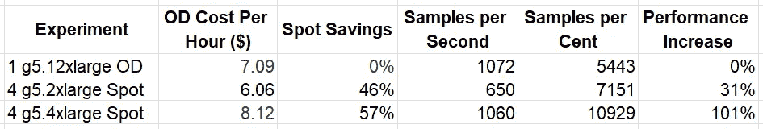

# 优化云端 Spot 市场中的 AI 开发实例类型选择

> 原文：[`towardsdatascience.com/optimizing-instance-type-selection-for-ai-development-in-cloud-spot-markets-a6e94804e8f3?source=collection_archive---------9-----------------------#2024-01-22`](https://towardsdatascience.com/optimizing-instance-type-selection-for-ai-development-in-cloud-spot-markets-a6e94804e8f3?source=collection_archive---------9-----------------------#2024-01-22)

## 深度学习实例选择——第二部分

[](https://chaimrand.medium.com/?source=post_page---byline--a6e94804e8f3--------------------------------)[](https://towardsdatascience.com/?source=post_page---byline--a6e94804e8f3--------------------------------) [Chaim Rand](https://chaimrand.medium.com/?source=post_page---byline--a6e94804e8f3--------------------------------)

·发布于[Towards Data Science](https://towardsdatascience.com/?source=post_page---byline--a6e94804e8f3--------------------------------) ·9 分钟阅读·2024 年 1 月 22 日

--


图片来源：[Mike Enerio](https://unsplash.com/@mikeenerio?utm_source=medium&utm_medium=referral) 来自[Unsplash](https://unsplash.com/?utm_source=medium&utm_medium=referral)

本文由[Tomer Berkovich](https://www.linkedin.com/in/tomerberkovich/)、[Yitzhak Levi](https://www.linkedin.com/in/yitzhak-levi-49a217201/)和[Max Rabin](https://www.linkedin.com/in/maxrabin/)合作撰写。

对于机器学习（ML）工作负载，选择合适的实例是一个重要的决策，可能对开发的速度和成本产生重大影响。在上一篇文章中，我们详细阐述了这一过程，提出了一个用于做出这一重要决策的度量标准，并强调了在做决策时应考虑的许多因素。在本文中，我们将展示通过在选择云端实例时考虑[Spot 实例](https://aws.amazon.com/ec2/spot/?cards.sort-by=item.additionalFields.startDateTime&cards.sort-order=asc)的可用性来降低 AI 模型训练成本的机会。

# 使用 Spot 实例降低成本

在云计算中，最重要的节省成本的机会之一就是利用低成本的[Amazon EC2 Spot 实例](https://aws.amazon.com/ec2/spot/?cards.sort-by=item.additionalFields.startDateTime&cards.sort-order=asc)。Spot 实例是来自多余云服务容量的折扣计算引擎。作为交换，AWS 保留在几乎没有预警的情况下中断实例的权利。因此，Spot 实例的使用仅适用于容错性强的工作负载。幸运的是，通过有效使用[模型检查点](https://pytorch.org/tutorials/recipes/recipes/saving_and_loading_a_general_checkpoint.html)，可以设计出具有容错能力并能够利用 Spot 实例的机器学习训练工作负载。事实上，Amazon SageMaker，AWS 的机器学习开发管理服务，通过[管理完整的 Spot 生命周期](https://docs.aws.amazon.com/sagemaker/latest/dg/model-managed-spot-training.html)使得在 Spot 实例上进行训练变得更加简单。

# 预测 Spot 实例容量的挑战

不幸的是，*Spot 实例容量*（用于衡量 Spot 实例的可用性）会不断波动，且很难预测。Amazon 提供了部分帮助，通过[Spot placement score](https://docs.aws.amazon.com/AWSEC2/latest/UserGuide/spot-placement-score.html)（SPS）功能评估所选实例类型的*Spot 实例容量*，该功能可以指示 Spot 请求在特定[区域或可用区（AZ）](https://docs.aws.amazon.com/AWSEC2/latest/UserGuide/using-regions-availability-zones.html)成功的可能性。当你有自由选择在多个不同位置训练模型时，这个功能尤其有用。然而，SPS 功能并不提供任何保证。

当你选择在一个或多个 Spot 实例上训练模型时，你将面临风险，即所选实例类型可能没有任何 Spot 容量（即你的训练任务无法启动），或者更糟糕的是，你可能会进入一个反复迭代的周期，在这个周期中，训练仅仅进行了少数训练步骤，并在没有任何实质性进展的情况下被停止——这可能会增加你的训练成本而没有任何回报。

在过去几年里，Spot 实例的使用挑战在多 GPU [EC2](https://aws.amazon.com/ec2/) 实例类型（如 [g5.12xlarge](https://aws.amazon.com/ec2/instance-types/g5/) 和 [p4d.24xlarge](https://aws.amazon.com/ec2/instance-types/p4/)）中尤为突出。对强大训练加速器的需求大幅增加（部分受生成式 AI 领域进展推动），再加上全球供应链的中断，使得几乎不可能依赖多 GPU Spot 实例进行 ML 训练。自然的应对措施是使用更昂贵的 [按需实例](https://docs.aws.amazon.com/AWSEC2/latest/UserGuide/ec2-on-demand-instances.html)（OD）或 [预留实例](https://aws.amazon.com/ec2/pricing/reserved-instances/)。然而，在我们 之前的文章 中，我们强调了考虑多种不同备选方案来选择实例类型的价值。在本帖中，我们将展示通过将多 GPU 按需实例替换为多个单 GPU Spot 实例所带来的潜在收益。

尽管我们的演示将使用亚马逊 Web 服务（AWS），但在其他云服务平台（CSPs）上也能得出类似的结论。请不要将我们选择的 CSP 或服务解读为一种推荐。最适合您的选项将取决于项目的具体细节。此外，请考虑到我们展示的成本节省类型可能无法在您的项目中复现，和/或我们提出的解决方案可能不适用（例如，出于本帖讨论范围之外的某些原因）。在将其应用到您的用例之前，请务必对提案的相关性和有效性进行详细评估。

# 当多个单 GPU 实例比单个多 GPU 实例更好时

如今，在多个 GPU 设备上并行训练 AI 模型——这一过程被称为*分布式训练*——已经变得很常见。如果不考虑实例定价，当您在选择一个多 GPU 实例和多个单 GPU 实例（相同类型）之间做出选择时，通常会选择多 GPU 实例。分布式训练通常需要大量的数据通信（例如，梯度共享）在 GPU 之间。单个实例中 GPU 的近距离位置有助于更高的网络带宽和更低的延迟。此外，一些多 GPU 实例还包括专用的 GPU 到 GPU 互连，可以进一步加速通信（例如，[NVLink](https://www.nvidia.com/en-eu/data-center/nvlink/) 在 [p4d.24xlarge](https://aws.amazon.com/ec2/instance-types/p4/) 实例上）。然而，当 Spot 容量仅限于单个 GPU 实例时，以更低的成本在多个单 GPU 实例上训练就显得更具吸引力。至少，这值得评估其节省成本的潜力。

# 优化多个 EC2 实例之间的数据通信

当分布式训练在多个实例上运行时，GPU 通过宿主机之间的网络相互通信。为了优化训练速度并减少网络瓶颈的可能性和/或影响，我们需要确保最小的网络延迟和最大的数据信息流量。这些因素可能会受到多个因素的影响。

## 实例并置

网络延迟会受到 EC2 实例相对位置的巨大影响。理想情况下，当我们请求多个云端实例时，希望它们都位于同一个物理机架上。实际上，如果没有适当的配置，它们甚至可能不在同一个城市。我们将在下面的示范中使用一个[VPC 配置](https://docs.aws.amazon.com/sagemaker/latest/APIReference/API_VpcConfig.html)对象，通过编程将 Amazon SageMaker 训练任务指定为使用一个[Amazon 虚拟私有云（VPC）](https://docs.aws.amazon.com/sagemaker/latest/dg/train-vpc.html)的单一子网。这种方法将确保所有请求的训练实例都在同一个[可用区（AZ）](https://docs.aws.amazon.com/AWSEC2/latest/UserGuide/using-regions-availability-zones.html)中。然而，仅仅在同一可用区并置可能不足以满足需求。此外，我们描述的方法涉及选择与特定可用区（例如，具有最高[Spot 放置分数](https://docs.aws.amazon.com/AWSEC2/latest/UserGuide/spot-placement-score.html)）关联的子网。理想的 API 应能在任何具有足够容量的可用区内满足请求。

控制实例位置的更好方法是将它们启动在一个[放置组](https://docs.aws.amazon.com/AWSEC2/latest/UserGuide/placement-groups.html)中，特别是一个[集群放置组](https://docs.aws.amazon.com/AWSEC2/latest/UserGuide/placement-groups.html#placement-groups-cluster)。这样不仅能保证所有实例都在同一个[可用区](https://docs.aws.amazon.com/AWSEC2/latest/UserGuide/using-regions-availability-zones.html)，还会将它们放置在“网络的同一高带宽分割段”上，从而最大化它们之间网络流量的性能。然而，截至本文撰写时，SageMaker *不*提供指定[放置组](https://docs.aws.amazon.com/AWSEC2/latest/UserGuide/placement-groups.html)的选项。为了利用放置组，我们需要使用替代的训练服务解决方案（如下所示）。

## EC2 网络**带宽**约束

确保考虑你选择的 EC2 实例所支持的最大[网络带宽](https://docs.aws.amazon.com/AWSEC2/latest/UserGuide/ec2-instance-network-bandwidth.html)。特别注意，单 GPU 机器的网络带宽通常被描述为“最多”某个 Gbps 值。确保理解这意味着什么，以及它如何影响训练过程中的速度。

请记住，GPU 之间的数据通信（例如，梯度共享）可能需要与其他通过网络流动的数据共享有限的网络带宽，例如流入训练实例的训练样本或上传到持久存储的训练产物。考虑减少每类数据负载的方式，以最小化网络瓶颈的可能性。

## 弹性网络适配器（EFA）

越来越多的 EC2 实例类型支持 [弹性网络适配器（EFA）](https://aws.amazon.com/hpc/efa/)，这是一种专用网络接口，用于优化节点间的通信。使用 EFA 可以对训练工作负载的运行时性能产生决定性影响。请注意，EFA 网络通道的带宽与标准网络的带宽不同。在写作时，EFA 功能的详细文档很难获得，通常最好通过试验和错误来评估其影响。在相关情况下，考虑使用支持 EFA 类型的[EC2 实例](https://docs.aws.amazon.com/AWSEC2/latest/UserGuide/efa.html#efa-instance-types)。

# 玩具示例

我们现在将演示在四个单 GPU [EC2 g5](https://aws.amazon.com/ec2/instance-types/g5/) Spot 实例（ml.g5.2xlarge 和 ml.g5.4xlarge）与一个单四 GPU 按需实例（ml.g5.12xlarge）上的训练性能对比。我们将使用下面的训练脚本，该脚本包含一个基于 Vision Transformer（ViT）的分类模型（在合成数据上进行训练）。

```py
import os, torch, time
import torch.distributed as dist
from torch.utils.data import Dataset, DataLoader
from torch.cuda.amp import autocast
from torch.nn.parallel import DistributedDataParallel as DDP
from timm.models.vision_transformer import VisionTransformer

batch_size = 128
log_interval = 10

# use random data
class FakeDataset(Dataset):
    def __len__(self):
        return 1000000

    def __getitem__(self, index):
        rand_image = torch.randn([3, 224, 224], dtype=torch.float32)
        label = torch.tensor(data=[index % 1000], dtype=torch.int64)
        return rand_image, label

def mp_fn():
    local_rank = int(os.environ['LOCAL_RANK'])
    dist.init_process_group("nccl")
    torch.cuda.set_device(local_rank)

    # model definition
    model = VisionTransformer()
    loss_fn = torch.nn.CrossEntropyLoss()
    model.to(torch.cuda.current_device())
    model = DDP(model)
    optimizer = torch.optim.Adam(params=model.parameters())

    # dataset definition
    num_workers = os.cpu_count()//int(os.environ['LOCAL_WORLD_SIZE'])
    dl = DataLoader(FakeDataset(), batch_size=batch_size, num_workers=num_workers)

    model.train()
    t0 = time.perf_counter()
    for batch_idx, (x, y) in enumerate(dl, start=1):
        optimizer.zero_grad(set_to_none=True)
        x = x.to(torch.cuda.current_device())
        y = torch.squeeze(y.to(torch.cuda.current_device()), -1)
        with autocast(enabled=True, dtype=torch.bfloat16):
            outputs = model(x)
            loss = loss_fn(outputs, y)
        loss.backward()
        optimizer.step()
        if batch_idx % log_interval == 0 and local_rank == 0:
            time_passed = time.perf_counter() - t0
            samples_processed = dist.get_world_size() * batch_size * log_interval
            print(f'{samples_processed / time_passed} samples/second')
            t0 = time.perf_counter()

if __name__ == '__main__':
    mp_fn()
```

以下代码块演示了我们如何使用 [SageMaker Python 包](https://sagemaker.readthedocs.io/en/stable/)（版本 2.203.1）运行实验。请注意，对于四实例的实验，我们配置了使用一个具有单一子网的 VPC，如上所述。

```py
from sagemaker.pytorch import PyTorch

# Toggle flag to switch between multiple single-GPU nodes and
# single multi-GPU node
multi_inst = False

inst_count=1
inst_type='ml.g5.12xlarge'
use_spot_instances=False
max_wait=None #max seconds to wait for Spot job to complete
subnets=None
security_group_ids=None

if multi_inst:
    inst_count=4
    inst_type='ml.g5.4xlarge' #  optinally change to ml.g5.2xlarge
    use_spot_instances=True
    max_wait=24*60*60 #24 hours
    # configure vpc settings
    subnets=['<VPC subnet>']
    security_group_ids=['<Security Group>']

estimator = PyTorch(
    role='<sagemaker role>',
    entry_point='train.py',
    source_dir='<path to source dir>',
    instance_type=inst_type,
    instance_count=inst_count,
    framework_version='2.1.0',
    py_version='py310',
    distribution={'torch_distributed': {'enabled': True}},
    subnets=subnets,
    security_group_ids=security_group_ids,
    use_spot_instances=use_spot_instances,
    max_wait=max_wait
)

# start job
estimator.fit()
```

请注意，我们的代码依赖于第三方[*timm*](https://pypi.org/project/timm/)Python 包，且我们在源代码目录根目录中的 requirements.txt 文件中指定了该包。这假设 VPC 已配置为[启用互联网访问](https://docs.aws.amazon.com/vpc/latest/userguide/VPC_Internet_Gateway.html)。另外，您可以定义一个私有的 PyPI 服务器（如[此处](https://aws.amazon.com/blogs/machine-learning/hosting-a-private-pypi-server-for-amazon-sagemaker-studio-notebooks-in-a-vpc/)所述），或者创建一个预先安装了第三方依赖项的自定义镜像（如此处所述）。

# 结果

我们在下表中总结了实验结果。按需定价来自于[SageMaker 定价页面](https://aws.amazon.com/sagemaker/pricing/)（截至本文写作时，2024 年 1 月）。竞价节省的值是从已完成任务的*托管竞价训练节省*报告中收集的。请参阅[EC2 竞价定价文档](https://docs.aws.amazon.com/AWSEC2/latest/UserGuide/using-spot-instances-history.html)以了解报告的竞价节省是如何计算的。



实验结果（作者）

我们的结果清楚地表明，当使用四个单 GPU 竞价实例而不是一个四 GPU 按需实例时，节省的潜力是相当大的。进一步的结果表明，尽管按需 g5.4xlarge 实例的成本较高，但由于增加的 CPU 功率和/或网络带宽，以及更高的竞价节省，最终导致了更大的节省。

重要的是，请记住，相对性能结果可能会根据您的任务细节以及实验运行时的竞价价格而大幅变化。

# 使用集群放置组强制执行 EC2 实例协同定位

在上一篇文章中，我们描述了如何在未管理的服务之上创建一个自定义的管理环境，例如[Amazon EC2](https://aws.amazon.com/ec2/)。其中列出的一个动机因素是希望在多实例设置中对设备放置进行更大的控制，例如，使用[集群放置组](https://docs.aws.amazon.com/AWSEC2/latest/UserGuide/placement-groups.html#placement-groups-cluster)，如上所述。在本节中，我们展示了如何使用集群放置组创建多节点设置。

我们的代码假设存在一个[默认 VPC](https://docs.aws.amazon.com/vpc/latest/userguide/default-vpc.html)，并且（一次性）创建了一个[集群放置组](https://docs.aws.amazon.com/AWSEC2/latest/UserGuide/placement-groups.html#placement-groups-cluster)，这里演示使用了[AWS Python SDK](https://boto3.amazonaws.com/v1/documentation/api/latest/index.html)（版本 1.34.23）：

```py
import boto3

ec2 = boto3.client('ec2')
ec2.create_placement_group(
    GroupName='cluster-placement-group',
    Strategy='cluster'
) 
```

在下面的代码块中，我们使用[AWS Python SDK](https://boto3.amazonaws.com/v1/documentation/api/latest/index.html)来启动我们的 Spot 实例：

```py
import boto3

ec2 = boto3.resource('ec2')
instances = ec2.create_instances(
    MaxCount=4,
    MinCount=4,
    ImageId='ami-0240b7264c1c9e6a9', # replace with image of choice
    InstanceType='g5.4xlarge',
    Placement={'GroupName':'cluster-placement-group'},
    InstanceMarketOptions={
        'MarketType': 'spot',
        'SpotOptions': {
            "SpotInstanceType": "one-time",
            "InstanceInterruptionBehavior": "terminate"
        }
    },
)
```

请参阅我们的上一篇文章，了解如何一步步将其扩展为自动化训练解决方案的提示。

# 摘要

在这篇文章中，我们演示了如何通过选择灵活的训练实例类型来提高利用 Spot 实例容量的能力，从而降低整体训练成本。

随着 AI 模型规模的不断扩大以及 AI 训练加速器成本的不断上涨，探索减少训练开销的方式变得愈加重要。这里介绍的技术只是优化成本性能的几种方法之一。我们鼓励你查阅我们的[上一篇文章](https://chaimrand.medium.com/)，以获取更多关于该领域其他机会的见解。
