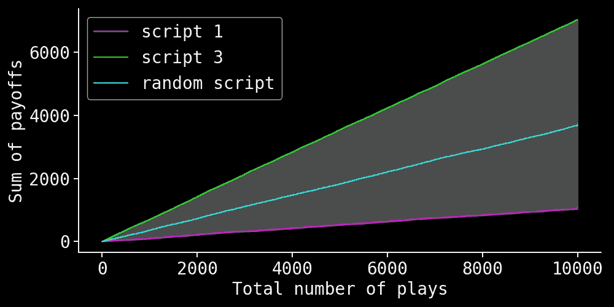
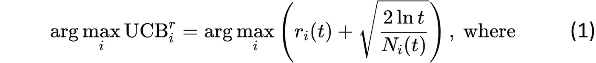
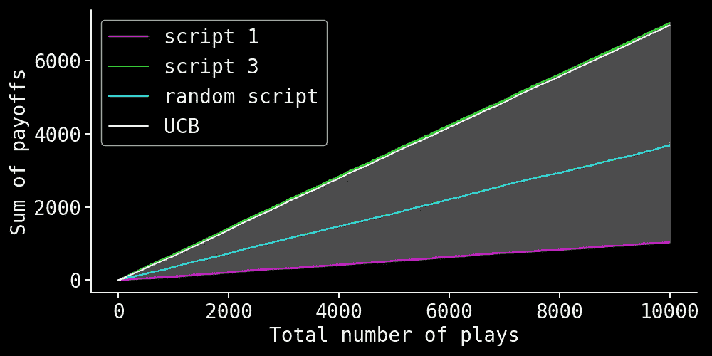
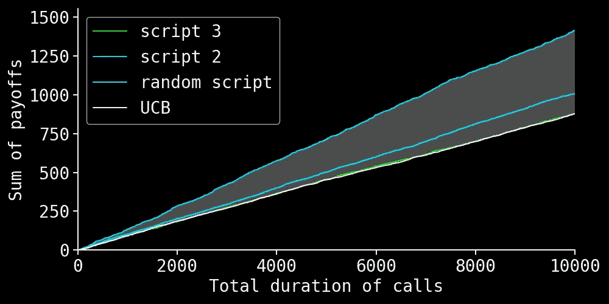
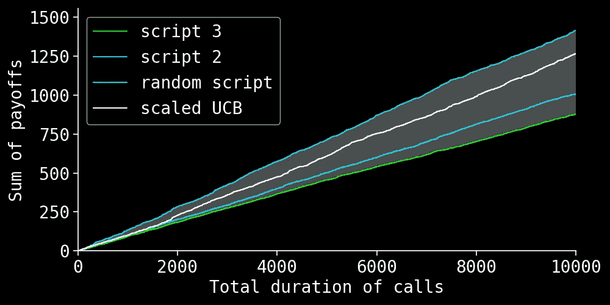
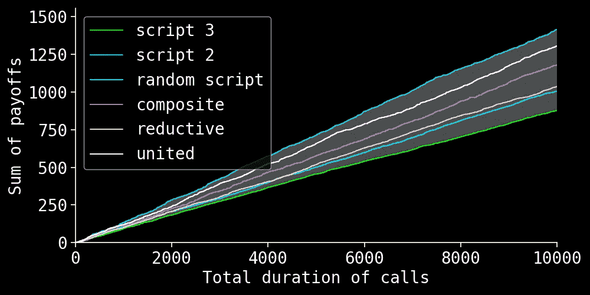
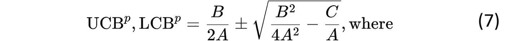
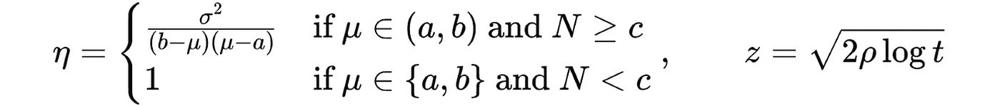
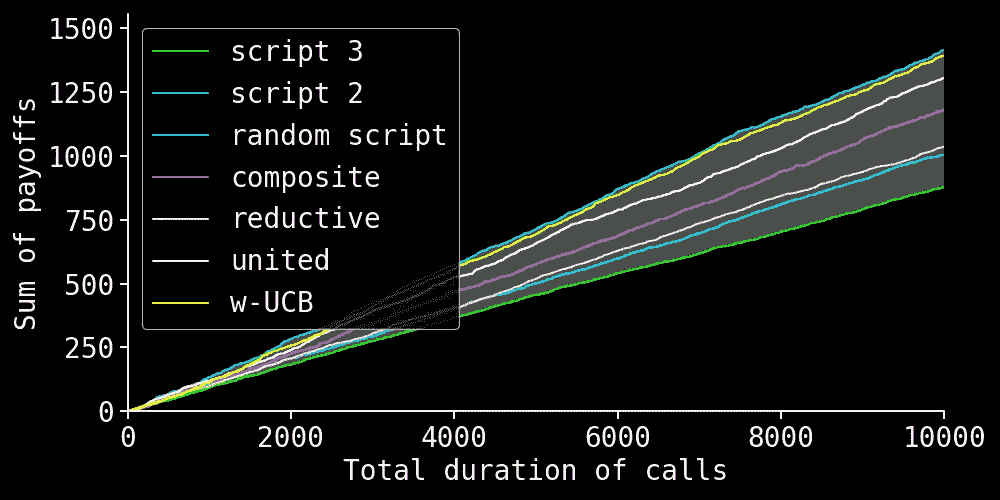

# 优化营销活动：使用预算化的多臂赌博机

> 原文：[`towardsdatascience.com/optimizing-marketing-campaigns-with-budgeted-multi-armed-bandits-a65fccd61878?source=collection_archive---------5-----------------------#2024-08-16`](https://towardsdatascience.com/optimizing-marketing-campaigns-with-budgeted-multi-armed-bandits-a65fccd61878?source=collection_archive---------5-----------------------#2024-08-16)

## 通过演示、我们的新解决方案和一段视频

 [Vadim Arzamasov](https://medium.com/@vadim.arzamasov?source=post_page---byline--a65fccd61878--------------------------------)

·发表于 [Towards Data Science](https://towardsdatascience.com/?source=post_page---byline--a65fccd61878--------------------------------) ·9 分钟阅读·2024 年 8 月 16 日

--

图片由作者使用 GPT-4o 创建

让我们直接进入一个实际的例子。假设一家银行或电信公司为现有客户推出一款新产品/计划。为了推广这款产品，公司为其销售代表创建了多个呼叫模板（脚本）。目标是有效地说服客户购买新产品或注册新计划。

以下是该活动的运作方式：

+   **呼叫脚本创建：** 市场团队开发了多个版本的呼叫脚本，每个脚本采用不同的方法来推广新产品或新计划。

+   **代理呼叫：** 销售代理使用这些脚本来呼叫一部分客户。每次客户互动时，都会使用预定义的脚本之一。

+   **数据收集：** 在呼叫过程中，公司收集客户的回应数据，如表现出的兴趣、提出的问题，以及最终的转化率（即有多少客户购买新产品或注册新计划）。

+   **实时分析：** 公司实时分析这些数据，以评估每个脚本的有效性。这一分析有助于确定哪些脚本在将客户转化为新计划/产品方面更成功。

+   **策略更新：** 基于持续分析，公司动态调整每个脚本的使用频率。转化率较高的脚本会使用得更频繁，确保随着时间推移活动变得越来越有效。

接下来，我们展示如何使用传统的多臂老虎机问题来建模这个简单版本的活动。随着我们加入更多细节使得该模型更具现实性，我们展示了现有解决方案及其简单适配的不足之处。然后，我们提出了一种新的预算化多臂老虎机算法，该算法来自我们为 KDD 2024 会议提交并接受的论文，在这项任务中表现非常出色。我们还提供了代码链接和一段简短的视频，总结了这篇论文。

> 在这个故事中，使用“我们”是因为我和 Marco Heyden 一起撰写了这篇文章（[Linkedin](https://www.linkedin.com/in/marco-heyden-036375156/)，[Github](https://github.com/heymarco)），他是算法思想和我们论文[1]的作者。所有后续的图表都是由我们创建的，并使用了这个[Jupyter notebook](https://github.com/heymarco/OmegaUCB/blob/medium_post/MediumGraphs.ipynb)中的代码。

## 多臂老虎机问题的解决方案

我们的场景类似于多臂老虎机（MAB）问题。假设一个玩家在赌场里面对一台带有多个臂的老虎机（“老虎机”），每个臂的回报（奖励）分布未知。玩家的目标是通过决定玩哪些臂以及每个臂玩多少次来最大化他们的总奖金。挑战在于平衡**探索**（尝试不同的臂以收集有关它们奖励的信息）和**利用**（使用收集到的信息来玩具有最高已知奖励的臂）。

在我们的示例中，每个电话脚本就像一只老虎机的机械臂，其中奖励是脚本的成功。如果客户注册了新计划或购买了新产品，奖励为 1，否则为 0。例如，三个电话脚本的转化率分别为*0.1*、*0.3*和*0.7*，其成功率遵循伯努利分布，期望值分别为*0.1*、*0.3*和*0.7*。下图展示了不同策略的累计奖励。紫色线代表使用**脚本 1**，转化率为*0.1*，而绿色线代表使用**脚本 3**，转化率为*0.7*。这些线定义了可能奖励的范围。浅蓝色线显示了每次呼叫随机选择一个脚本的策略的累计奖励。在一个现实的环境中，只有**转化率的估计值**可用，优秀策略的累计奖励应该接近绿色线，并且至少高于浅蓝色线。

解决多臂老虎机问题的一个流行策略是上置信界限（UCB）算法[2]。它为每个臂（电话脚本）的期望奖励分配一个上置信界限，并选择具有最高上置信界限的臂进行执行。通过这种方式，算法在利用已知高奖励的同时，积极探索不确定性高的动作。从数学上讲，UCB 算法选择臂*i*，其解为：

+   *rᵢ(t)* 是手臂 *i* 在时间 *t* 时的**经验**平均奖励。

+   *Nᵢ(t)* 是手臂 *i* 到时间 *t* 时已被拉动的次数。

+   *t* 是到目前为止总共进行的游戏次数。

下图中的白线展示了这个策略在我们示例中的应用。

> 这个上界是基于 Chernoff-Hoeffding 上界，假设收益分布支持区间为 [0,1]，这正是我们的情况。对于支持区间不同的奖励分布 [a*ᵢ*ʳ, b*ᵢ*ʳ]，其中 aᵢʳ 和 a*ᵢ*ʳ 是有限的，UCB 应相应地进行缩放：

## 预算的重要性

到目前为止，我们关注的是在给定次数的调用后最大化奖励总和。然而，期望不同脚本的调用具有相同的持续时间是不现实的。如果市场营销团队的能力不足以在给定时间预算内（例如几个月）接触到所有客户，那么更实际的做法是最大化给定通话持续时间内的累积奖励，而不是调用次数。

在我们的示例中，假设 **脚本 1**、**脚本 2** 和 **脚本 3** 的通话持续时间（即成本）是常数（我们稍后会放宽这个假设），分别为 *1*、*2* 和 *8* 分钟。如果我们现在根据总通话持续时间而不是通话次数来绘制结果，那么始终使用 **脚本 2** 的策略将成为最佳选择，而使用 **脚本 3** 的策略将成为最差选择。仅考虑转化率的上述 UCB 策略现在表现远不如随机策略。

通过用 *rᵢ(t)* 与 cᵢ* 对应值标准化奖励估计，并按照上述公式（2）调整 UCB 策略，可以不难修正 UCB 策略：

通过这种方式更新的 UCB 策略再次表现得相当好：

## 随机通话持续时间

请注意，假设固定通话时长也是不现实的。当奖励和成本都不固定时，有几种方法可以将 UCB 策略扩展到这种情况，例如：

**约简型：** 通过将奖励与成本比率 *vᵢ=rᵢ/cᵢ* 视为单一随机变量，并拉动具有最高上界 UCB*ᵢᵛ* 的手臂：

**联合型：** 通过忽略成本的变化，使用它们的估计值 *cᵢ(t)* 来缩放奖励的 UCB*ᵢʳ*，类似于公式（3）：

**组合型：** 通过拉动最大化上界奖励与下界成本比率 UCB*ᵢʳ/*LCB*ᵢᶜ* 的手臂：

在（6）中，我们假设奖励来自 *[0,1]* 区间，为了简化公式。

上述所有策略都有问题，要么过于乐观，要么过于悲观，要么仅仅优化了错误的量。

**简约**策略（4）旨在最大化奖励-成本比的期望值 𝔼(*vᵢ*)=𝔼(*rᵢ/cᵢ*)。这与最大化奖励同时保持成本在给定预算范围内的目标不同。对于足够高的预算，后者等同于最大化奖励和成本期望值的比率 𝔼(*rᵢ*)*/*𝔼(*cᵢ*)。要理解为何 𝔼(*rᵢ/cᵢ*)*≠*𝔼(*rᵢ*)*/*𝔼(*cᵢ*)，请注意，如果*rᵢ*和*cᵢ*是独立同分布的伯努利随机变量，则 𝔼(*rᵢ*)*/*𝔼(*cᵢ*)*=1，而 𝔼(*rᵢ/cᵢ*) 是无穷大或未定义，具体取决于如何处理除以零的情况。在这种情况下，*vᵢ=rᵢ/cᵢ*的支持也是无限的，导致 UCB 公式（4）无效。

因为**联合**策略没有考虑成本变化，它通常会产生过于紧凑的上置信界限，从而限制了策略的探索部分。每当成本的经验均值超过真实均值时，例如在对称成本分布的 50%的情况下，就会发生这种情况。

**复合**策略明确地对成本的不确定性进行了建模。然而，这种模型过于保守，允许分母为零甚至负数（！）。因此，复合策略在探索上花费了过多资源，并低估了开发步骤的价值。

还需要注意的是，至今讨论的平均奖励的上界可能远高于 1，尽管我们知道奖励的取值范围是*{0,1}*。在这种情况下，这个界限显然过于宽松，这可能增加探索，从而部分抵消考虑**联合**策略中固定成本的效果。

以下图展示了我们示例设置中三种策略的表现，在该设置中，我们现在使用支持范围为*[1,10]*的贝塔分布来建模通话时长，且**脚本 1**、**脚本 2**和**脚本 3**的期望值分别为*1*、*2*和*8*分钟。**简约**策略的表现几乎与随机选择脚本一样差，**复合**策略表现稍好，而**联合**策略则是明显的赢家。但是，是否有方法能够超越**联合**策略呢？

## 我们的解决方案：不对称置信区间

我们的ω-UCB 策略解决了之前描述的解决方案的不足之处。虽然我们与复合策略使用相同的 UCB*ᵢʳ*/LCB*ᵢᶜ*比例开始，但我们采用不同的方法来计算这些界限。我们的置信区间更为精确，并且始终保持在奖励或成本的支持范围内。具体来说，设*p*为一个有界随机变量——可以是奖励或成本——其支持范围为*[a,b]*。我们按如下方式计算*p*的置信区间[*LCB*ᵖ*, UCB*ᵖ*]。

+   *μ* 是时间 *t* 时刻 *p* 的经验均值，

+   *σ²* 是时间 *t* 时刻 *p* 的经验方差，

+   *N* 是到时间 *t* 为止对 *p* 的观察次数，

+   *t* 是当前的时间，

+   *c* 是期望能可靠估计均值和方差所需的臂拉次数；在实际操作中，*c=30* 效果良好，

+   *ρ* 是 ω-UCB 的参数；*ρ=1* 提供了更好的渐近性质，但对于实际应用，当游戏次数为 *~10⁴* 或更少时，我们推荐使用 *ρ=1/4*。

以下图展示了 ω-UCB 的表现。使用它几乎能够获得最大可能的累积奖赏。

我们还制作了一个 2 分钟的视频，概述了 ω-UCB 的思想：

该视频由 Marco Heyden 为 KDD 2024 制作。如果你喜欢它，请随时在 YouTube 上为它点赞

## 最后的想法

到现在为止，你已经掌握了如何通过即时客户反馈实时优化营销活动的洞察力。我们已经描述了一种强大的算法来帮助你做到这一点。然而，单凭这一点来保证成功，未免过于乐观。下面，我们概述了一些额外的考虑因素，这些因素可以进一步增强活动的效果。

首先，奖赏不太可能立即得知。通常，最好的期望是来自客户的兴趣信号。因此，构建一个可靠的奖赏代理，可能通过使用来自之前活动的数据，是至关重要的。

接下来，本讨论集中在为平均或代表性客户选择最佳脚本。稍微深入一点，可能不同的脚本对不同的客户群体效果更好。最佳脚本可能因群体而异。一种简单的方法是对客户进行细分，并将每个细分-脚本组合视为我们之前描述的预算化多臂强盗算法中的一个独立臂。在之前的文章中，我讨论了识别有趣客户细分的方法；对于一个活动来说，选择适当的目标变量来应用该方法是非常重要的。

 ## 使用子群发现方法在数据中查找不寻常的片段

### 患者规则归纳法发现了比以往报告的好 35% 的片段

[towardsdatascience.com

最后，除了客户特征外，“环境”因素如一天中的时间或一周中的某天，也可能影响脚本的相对表现。为了考虑所有这些因素，你可能会考虑将方法扩展到**上下文预算化强盗问题**，这也是另一篇文章的主题。

## 参考文献

[1] Marco Heyden, Vadim Arzamasov, Edouard Fouché, 和 Klemens Böhm。“带有非对称置信区间的预算化多臂强盗问题。”*KDD* ’24

[2] 彼得·奥尔（Peter Auer）、尼科洛·切萨-比安基（Nicolo Cesa-Bianchi）和保罗·费舍尔（Paul Fischer）。 “多臂赌博机问题的有限时间分析。” *机器学习* 47 (2002)：235–256。
