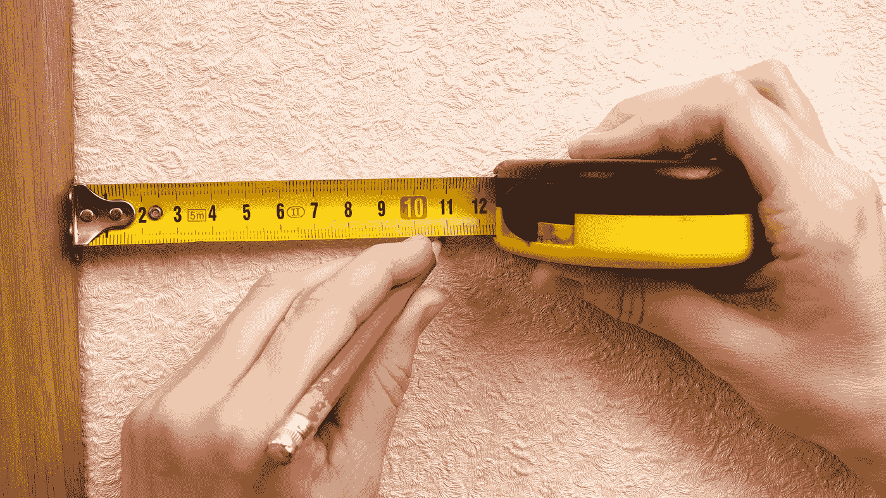

# 使用 Python 优化数据分析的内存消耗——从 400 到 0.1

> 原文：[`towardsdatascience.com/optimizing-memory-consumption-for-data-analytics-using-python-from-400-to-0-1-4085108af497?source=collection_archive---------1-----------------------#2024-06-03`](https://towardsdatascience.com/optimizing-memory-consumption-for-data-analytics-using-python-from-400-to-0-1-4085108af497?source=collection_archive---------1-----------------------#2024-06-03)

作者在 Canva 中创建

## 降低代码的内存消耗意味着降低硬件需求

 [Christopher Tao](https://christophertao.medium.com/?source=post_page---byline--4085108af497--------------------------------)

·发表于[Towards Data Science](https://towardsdatascience.com/?source=post_page---byline--4085108af497--------------------------------) ·阅读时长 9 分钟·2024 年 6 月 3 日

--

有许多文章告诉我们如何提高代码的性能。当然，性能非常关键，尤其是在我们使用 Python 进行数据分析时。

然而，我认为内存消耗同样重要，尤其是在处理大型数据集或当我们有有限的硬件资源来运行任务时，内存消耗有时甚至更为重要。

在本文中，我将介绍几种有效的技巧，用于在不降低性能的情况下减少常见数据分析活动中的内存消耗。

# 1\. 内存消耗测量

作者在 Canva 中创建

在我分享任何减少内存消耗的技巧之前，我们需要有测量内存消耗的方法。上周，我写了一篇文章，详细介绍了几种测量内存消耗的方法。如果你感兴趣，请查看它。 
