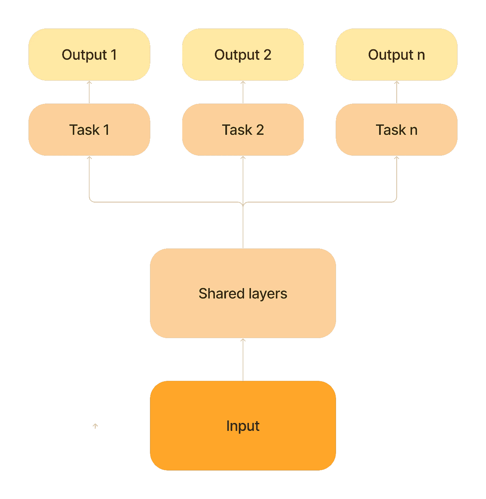

# 实践中的多任务学习模型优化

> 原文：[`towardsdatascience.com/optimizing-multi-task-learning-models-in-practice-bde4f18f0bd8?source=collection_archive---------10-----------------------#2024-03-29`](https://towardsdatascience.com/optimizing-multi-task-learning-models-in-practice-bde4f18f0bd8?source=collection_archive---------10-----------------------#2024-03-29)

## 什么是多任务学习模型，如何优化它们

 [Thao Vu](https://medium.com/@vuphuongthao9611?source=post_page---byline--bde4f18f0bd8--------------------------------)

·发表于[Towards Data Science](https://towardsdatascience.com/?source=post_page---byline--bde4f18f0bd8--------------------------------) ·阅读时长 6 分钟·2024 年 3 月 29 日

--

图片来自[Laura Rivera](https://unsplash.com/@laurar1vera?utm_source=medium&utm_medium=referral)，[来自 Unsplash](https://unsplash.com/?utm_source=medium&utm_medium=referral)

# **为什么选择多任务学习**

## 多任务学习

多任务学习（MTL）[1]是机器学习领域的一项技术，我们利用单一模型同时学习多个任务。

多任务学习模型（图源：作者）

从理论上讲，这种方法允许任务之间的知识共享，并且比单任务训练取得更好的结果。此外，由于模型试图学习一个表示来优化多个任务，因此过拟合的可能性较低，从而实现更好的泛化能力。

> 多任务学习是一种归纳迁移方法，通过使用相关任务训练信号中包含的领域信息作为归纳偏置，从而改善泛化能力。它通过在并行学习任务的同时使用共享表示来实现；每个任务所学到的知识可以帮助其他任务更好地学习。[2]

在实际应用中，大型推荐和搜索系统通常基于多个指标来衡量用户满意度，例如停留时间、点击率等…
