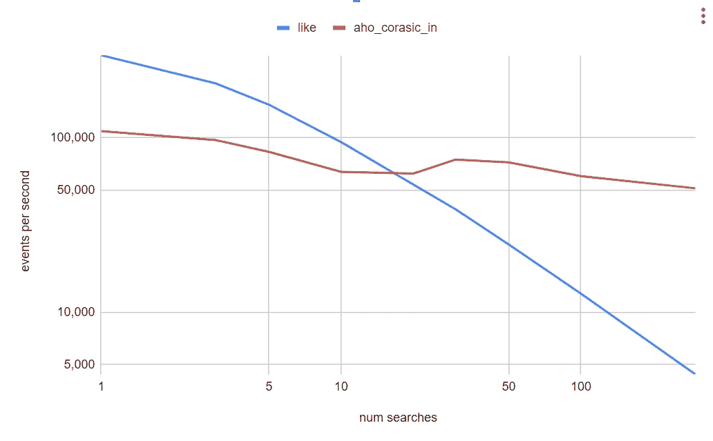
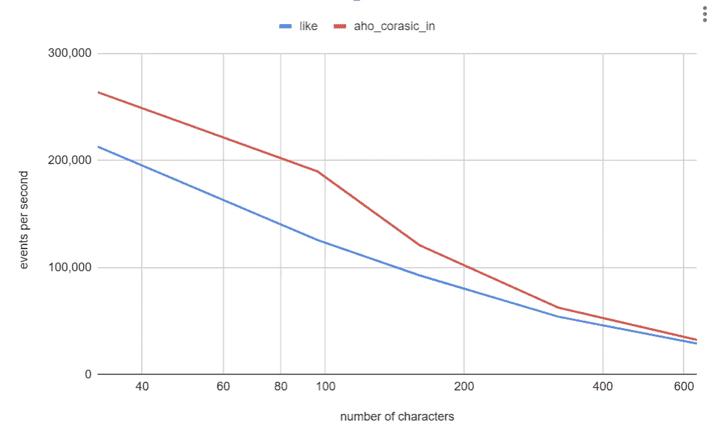
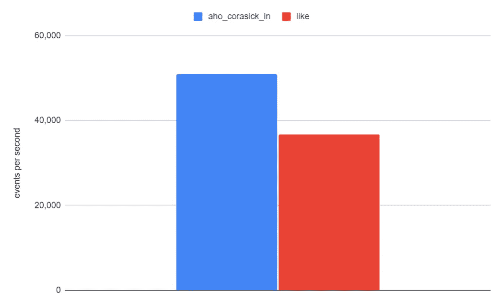

# 使用 Aho-Corasick 算法优化 Spark 中的 Sigma 规则

> 原文：[`towardsdatascience.com/optimizing-sigma-rules-in-spark-with-the-aho-corasick-algorithm-52ebd5d8105e?source=collection_archive---------9-----------------------#2024-06-20`](https://towardsdatascience.com/optimizing-sigma-rules-in-spark-with-the-aho-corasick-algorithm-52ebd5d8105e?source=collection_archive---------9-----------------------#2024-06-20)

## 扩展 Spark 以提高处理多个搜索词的性能

[](https://medium.com/@jean-claude.cote?source=post_page---byline--52ebd5d8105e--------------------------------)[](https://towardsdatascience.com/?source=post_page---byline--52ebd5d8105e--------------------------------) [Jean-Claude Cote](https://medium.com/@jean-claude.cote?source=post_page---byline--52ebd5d8105e--------------------------------)

·发布于 [Towards Data Science](https://towardsdatascience.com/?source=post_page---byline--52ebd5d8105e--------------------------------) ·8 分钟阅读·2024 年 6 月 20 日

--


图片来自 Unsplash 上的 Aditya Chinchure

在将我们的入侵检测系统部署到[CCCS](https://www.cyber.gc.ca/en)的生产环境时，我们观察到许多 SigmaHQ 规则使用了非常庞大的搜索模式列表。这些列表用于测试`CommandLine`是否包含特定字符串，或者`CommandLine`是否以某个子字符串开始或结束。

我们特别感兴趣的是研究涉及“包含”条件的规则，因为我们怀疑这些条件可能会让 Spark 的评估变得耗时。以下是一个典型的 Sigma 规则示例：

```py
detection:
    selection_image:
        - Image|contains:
              - '\CVE-202'
              - '\CVE202'
        - Image|endswith:
              - '\poc.exe'
              - '\artifact.exe'
              - '\artifact64.exe'
              - '\artifact_protected.exe'
              - '\artifact32.exe'
              - '\artifact32big.exe'
              - 'obfuscated.exe'
              - 'obfusc.exe'
              - '\meterpreter'
    selection_commandline:
        CommandLine|contains:
            - 'inject.ps1'
            - 'Invoke-CVE'
            - 'pupy.ps1'
            - 'payload.ps1'
            - 'beacon.ps1'
            - 'PowerView.ps1'
            - 'bypass.ps1'
            - 'obfuscated.ps1'
```

完整的可疑程序名称规则可以在这里找到

[`github.com/SigmaHQ/sigma/blob/master/rules/windows/process_creation/proc_creation_win_susp_progname.yml`](https://github.com/SigmaHQ/sigma/blob/master/rules/windows/process_creation/proc_creation_win_susp_progname.yml)

该规则说明了如何使用`CommandLine|contains`和`Image|endswith`。一些 Sigma 规则在`<field>|contains`条件下有成百上千的搜索词。

## 在 Spark SQL 中应用 Sigma 规则

在[CCCS](https://www.cyber.gc.ca/en)我们将 Sigma 规则转换为可执行的 Spark SQL 语句。为此，我们扩展了 SQL Sigma 编译器，并加入了一个自定义后端。它将上述规则转换成如下语句：

```py
select
map(
   'Suspicious Program Names',
   (
     (
            (
                Imagepath LIKE '%\\cve-202%'
                OR Imagepath LIKE '%\\cve202%'
            )
            OR (
                Imagepath LIKE '%\\poc.exe'
                OR Imagepath LIKE '%\\artifact.exe'
                ...
                OR Imagepath LIKE '%obfusc.exe'
                OR Imagepath LIKE '%\\meterpreter'
            )
        )
        OR (
            CommandLine LIKE '%inject.ps1%'
            OR CommandLine LIKE '%invoke-cve%'
            OR CommandLine LIKE '%pupy.ps1%'
            ...
            OR CommandLine LIKE '%encode.ps1%'
            OR CommandLine LIKE '%powercat.ps1%'
        )
    )
) as sigma_rules_map
```

我们在一个 Spark 结构化流处理作业中运行上述语句。在对事件进行单次扫描时，Spark 评估了多个（数百个）Sigma 规则。`sigma_rules_map`列保存了所有这些规则的评估结果。通过这个映射，我们可以确定哪些规则是命中的，哪些不是。

正如我们所看到的，这些规则通常涉及将事件的属性（如`CommandLine`）与多个字符串模式进行比较。

其中一些测试是精确匹配的，如`CommandLine = ‘something’`。其他则使用`startswith`，并呈现为`Imagepath LIKE ‘%\\poc.exe’`。

`Equals`、`startswith`和`endswith`执行得非常快，因为这些条件都在事件的某个特定位置上锚定。

然而，像`contains`这样的测试呈现为`CommandLine LIKE ‘%hound.ps1%’`，这需要 Spark 扫描整个属性，以找到字母‘h’的可能起始位置，然后检查它后面是否跟着字母‘o’、‘u’等。

在内部，Spark 使用`UTF8String`，它抓取第一个字符，扫描缓冲区，如果找到匹配项，就继续使用`matchAt`函数比较剩余的字节。以下是`UTF8String.contains`函数的实现。

```py
 public boolean contains(final UTF8String substring) {
    if (substring.numBytes == 0) {
      return true;
    }

    byte first = substring.getByte(0);
    for (int i = 0; i <= numBytes - substring.numBytes; i++) {
      if (getByte(i) == first && matchAt(substring, i)) {
        return true;
      }
    }
    return false;
  }
```

`equals`、`startswith`和`endswith`条件也使用`matchAt`函数，但与`contains`不同，这些条件知道从哪里开始比较，因此执行速度非常快。

为了验证我们关于`contains`条件执行成本高的假设，我们进行了一个快速且简单的实验。我们删除了所有 Sigma 规则中的`contains`条件，看看这会如何影响整体执行时间。结果差异显著，这鼓励我们继续推进实现自定义 Spark Catalyst 函数来处理涉及大量搜索词的`contains`操作的想法。

## Aho-Corasick 算法

一些研究使我们找到了[Aho-Corasick 算法](https://en.wikipedia.org/wiki/Aho%E2%80%93Corasick_algorithm)，它似乎非常适合这个用例。Aho-Corasick 算法构建一个前缀树（字典树），并且可以在一次扫描要测试的文本时评估多个`contains`表达式。

这是如何使用 Robert Bor 在 GitHub 上提供的 Aho-Corasick Java 实现：[`github.com/robert-bor/aho-corasick`](https://github.com/robert-bor/aho-corasick)

```py
// create the trie
val triBuilder = Trie.builder()
triBuilder.addKeyword("test1")
triBuilder.addKeyword("test2")
trie = triBuilder.build()

// apply the trie to some text
aTextColumn = "some text to scan for either test1 or test2"
found = trie.containsMatch(aTextColumn)
```

## 设计一个`aho_corasick_in` Spark 函数

我们的函数需要两样东西：要测试的列和要查找的搜索模式。我们将实现一个具有以下签名的函数：

```py
boolean aho_corasick_in(string text, array<string> searches)
```

我们修改了 CCCS Sigma 编译器，使其生成使用`aho_corasick_in`函数的 SQL 语句，而不是生成多个 OR 连接的 LIKE 谓词。在下面的输出中，您会注意到使用了`aho_corasick_in`函数。我们传递了要测试的字段和一个包含搜索词的字符串数组。以下是我们自定义编译器处理多个`contains`条件的输出：

```py
select 
map(
'Suspicious Program Names',
(
    (
        (
            Imagepath LIKE '%\\cve-202%'
            OR Imagepath LIKE '%\\cve202%'
        )
        OR (
            Imagepath LIKE '%\\poc.exe'
            OR Imagepath LIKE '%\\artifact.exe'
            ...
            OR Imagepath LIKE '%\\meterpreter'
        )
    )
    OR (
        aho_corasick_in(
            CommandLine,
            ARRAY(
                'inject.ps1',
                'invoke-cve',
                ...
                'hound.ps1',
                'encode.ps1',
                'powercat.ps1'
            )
        )
    )
)
) as sigma_rules_map
```

注意，`aho_corasick_in`函数接受两个参数：第一个是列，第二个是字符串数组。现在，让我们实际实现`aho_corasick_in`函数。

## 实现 Catalyst 函数

我们没有找到很多关于如何实现 Catalyst 函数的文档，因此，我们使用了现有函数的源代码作为参考。我们以[regexp(str, regexp)](https://spark.apache.org/docs/3.3.1/api/sql/index.html#regexp)函数为例，因为它会预编译其正则表达式模式，然后在处理行时使用该模式。这类似于预构建 Aho-Corasick 字典树，然后将其应用于每一行。

我们的自定义 Catalyst 表达式接受两个参数。因此，它是一个`BinaryExpression`，有两个字段，Spark 将其命名为`left`和`right`。我们的 AhoCorasickIn 构造函数将`text`列参数赋值给`left`字段，将`searches`字符串数组赋值给`right`字段。

在初始化 AhoCorasickIn 时，我们还会评估`cacheTrie`字段。该评估测试`searches`参数是否为可折叠表达式，即常量表达式。如果是，它会进行求值，并期望得到一个字符串数组，然后使用该数组调用`createTrie(searches)`。

`createTrie`函数遍历搜索词并将它们添加到`trieBuilder`，最终构建出一个 Aho-Corasick 字典树。

```py
case class AhoCorasickIn(text: Expression, searches: Expression) 
extends BinaryExpression 
with CodegenFallback 
with ImplicitCastInputTypes 
with NullIntolerant 
with Predicate {

  override def prettyName: String = "aho_corasick_in"
  // Assign text to left field 
  override def left: Expression = text
  // Assign searches to right field 
  override def right: Expression = searches

  override def inputTypes: Seq[DataType] = Seq(StringType, ArrayType(StringType))

  // Cache foldable searches expression when AhoCorasickIn is constructed
  private lazy val cacheTrie: Trie = right match {
    case p: Expression if p.foldable => {
      val searches = p.eval().asInstanceOf[ArrayData]
      createTrie(searches)
    }
    case _ => null
  }

  protected def createTrie(searches: ArrayData): Trie = {
      val triBuilder = Trie.builder()
      searches.foreach(StringType, (i, s) => triBuilder.addKeyword(s.toString()))
      triBuilder.build()
  }

  protected def getTrie(searches: ArrayData) = if (cacheTrie == null) createTrie(searches) else cacheTrie

  override protected def nullSafeEval(text: Any, searches: Any): Any = {
    val trie = getTrie(searches.asInstanceOf[ArrayData])
    trie.containsMatch(text.asInstanceOf[UTF8String].toString())
  }

  override protected def withNewChildrenInternal(
      newLeft: Expression, newRight: Expression): AhoCorasickIn =
    copy(text = newLeft, searches = newRight)
}
```

`nullSafeEval`方法是 AhoCorasickIn 的核心。Spark 会为数据集中的每一行调用 eval 函数。在`nullSafeEval`中，我们检索`cacheTrie`并使用它来测试`text`字符串参数。

## 评估性能

为了比较`aho_corasick_in`函数的性能，我们编写了一个小型基准测试脚本。我们比较了执行多个`LIKE`操作与单个`aho_corasick_in`调用的性能。

```py
select
  *
from (
  select
      text like '%' || uuid() || '%' OR
      text like '%' || uuid() || '%' OR
      text like '%' || uuid() || '%' OR
      ...
      as result
  from (
      select
          uuid()||uuid()||uuid()... as text
      from
          range(0, 1000000, 1, 32)
  )
)
where
    result = TRUE
```

使用`aho_corasick_in`的相同实验：

```py
select
  *
from (
  select
      aho_corasick_in(text, array(uuid(), uuid(),...) as result
  from (
      select
          uuid()||uuid()||uuid()... as text
      from
          range(0, 1000000, 1, 32)
  )
)
where
    result = TRUE
```

我们进行了这两个实验（like 与 aho_corasick_in），在一个包含 200 个字符的`text`列上，变化了搜索词的数量。下面是一个对数图，比较了这两个查询。



作者提供的图片

该图显示了随着我们向“LIKE”查询中添加更多搜索词，性能如何下降，而使用`aho_corasick_in`函数的查询在搜索词数量增加时保持相对稳定。在 100 个搜索词时，`aho_corasick_in`函数的运行速度比多个 LIKE 语句快五倍。

我们发现，使用 Aho-Corasick 只有在超过 20 个搜索时才有利。这可以通过构建字典树的初始成本来解释。然而，随着搜索词数量的增加，前期成本逐渐得到回报。这与 LIKE 表达式相反，增加更多 LIKE 表达式会使查询的成本变得更高。

接下来，我们将搜索词的数量设置为 20，并改变 `text` 字符串的长度。我们观察到，在不同的字符串长度下，LIKE 函数和 `aho_corasick_in` 函数的耗时大致相同。在这两个实验中，执行时间取决于 `text` 字符串的长度。



图片来源：作者

需要注意的是，构建字典树所产生的开销将取决于查询执行计划中的 Spark 任务数量。Spark 会为执行计划中的每个任务实例化表达式（即：为每个任务实例化新的 AhoCorasickIn 对象）。换句话说，如果你的查询使用了 200 个任务，那么 AhoCorasickIn 构造函数将被调用 200 次。

总结来说，使用的策略将取决于搜索词的数量。我们将这一优化集成到我们的 Sigma 编译器中。在给定的阈值下（例如 20 个词），它会使用 LIKE 语句；而超过这个阈值时，它则会使用 `aho_corasick_in` 函数进行查询。

当然，这个阈值将取决于你的实际数据以及 Spark 执行计划中的任务数量。

我们在生产数据和真实的 SigmaHQ 规则上进行的初步实验结果表明，应用 `aho_corasick_in` 函数可以将我们的处理速率（每秒事件数）提高 1.4 倍。



图片来源：作者

## 结论

在本文中，我们展示了如何实现一个原生的 Spark 函数。这个 Catalyst 表达式利用了 Aho-Corasick 算法，可以同时测试多个搜索词。然而，和任何方法一样，它也有其权衡。使用 Aho-Corasick 需要构建一个字典树（前缀树），当仅使用少量搜索词时，这可能会导致性能下降。我们的编译器使用一个阈值（即搜索词的数量）来选择最优策略，从而确保查询执行的最高效率。
