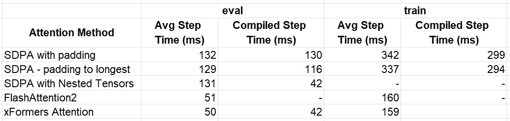
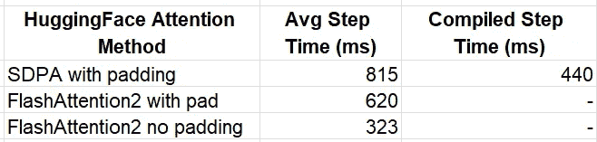

# 针对变长输入序列优化 Transformer 模型

> 原文：[`towardsdatascience.com/optimizing-transformer-models-for-variable-length-input-sequences-19fb88fddf71?source=collection_archive---------3-----------------------#2024-11-26`](https://towardsdatascience.com/optimizing-transformer-models-for-variable-length-input-sequences-19fb88fddf71?source=collection_archive---------3-----------------------#2024-11-26)

## PyTorch NestedTensors、FlashAttention2 和 xFormers 如何提升性能并降低 AI 成本

[](https://chaimrand.medium.com/?source=post_page---byline--19fb88fddf71--------------------------------)[](https://towardsdatascience.com/?source=post_page---byline--19fb88fddf71--------------------------------) [Chaim Rand](https://chaimrand.medium.com/?source=post_page---byline--19fb88fddf71--------------------------------)

·发表于[Towards Data Science](https://towardsdatascience.com/?source=post_page---byline--19fb88fddf71--------------------------------) ·阅读时间：14 分钟·2024 年 11 月 26 日

--


图片来源：[Tanja Zöllner](https://unsplash.com/@tanjazoellner?utm_source=medium&utm_medium=referral) 于[Unsplash](https://unsplash.com/?utm_source=medium&utm_medium=referral)

随着生成型 AI（genAI）模型的普及和规模不断扩大，与其训练和部署相关的计算需求和成本也在增加。优化这些模型对于提升其运行时性能和降低运营成本至关重要。现代生成型 AI 系统的核心是 Transformer 架构及其注意力机制，而该机制通常计算密集型。

在上一篇文章中，我们展示了如何通过优化注意力核显著加速 Transformer 模型的性能。在本文中，我们继续探讨如何解决变长输入序列的挑战——这是现实世界数据的固有特性，包括文档、代码、时间序列等。

## 批处理变长输入的挑战

在典型的深度学习工作负载中，单个样本会在被复制到 GPU 并馈送给 AI 模型之前，被分成多个批次。批处理可以提高计算效率，并且通常有助于模型在训练中的收敛。通常，批处理涉及沿着一个新的维度—*批次*维度—将所有样本张量进行[堆叠](https://pytorch.org/docs/stable/generated/torch.stack.html)。然而，[torch.stack](https://pytorch.org/docs/stable/generated/torch.stack.html)要求所有张量具有相同的形状，而这对于可变长度的序列并不适用。

## 填充及其低效性

解决这个挑战的传统方法是将输入序列填充到一个固定长度，然后执行[堆叠](https://pytorch.org/docs/stable/generated/torch.stack.html)。这个解决方案需要在模型内部进行适当的掩码处理，以确保输出不受无关张量元素的影响。在注意力层的情况下，填充掩码表示哪些标记是填充的，不应该被关注（例如，见[PyTorch MultiheadAttention](https://github.com/pytorch/pytorch/blob/v2.5.1/torch/nn/modules/activation.py#L1139)）。然而，填充可能会浪费大量的 GPU 资源，增加成本并减慢开发进程。对于大规模 AI 模型来说，这一点尤其如此。

## 不填充，拼接

避免填充的一种方法是将序列沿着现有的维度进行[拼接](https://pytorch.org/docs/stable/generated/torch.cat.html#torch.cat)，而不是将它们沿着新维度进行[堆叠](https://pytorch.org/docs/stable/generated/torch.stack.html)。与[torch.stack](https://pytorch.org/docs/stable/generated/torch.stack.html)不同，[torch.cat](https://pytorch.org/docs/stable/generated/torch.cat.html#torch.cat)允许形状不同的输入。拼接的输出是一个单一的序列，其长度等于所有单个序列的长度之和。为了使这个解决方案有效，我们的单一序列需要通过一个注意力掩码进行补充，以确保每个标记只关注同一原始序列中的其他标记，这个过程有时被称为[文档掩码](https://pytorch.org/blog/flexattention/#document-maskingjagged-sequences)。设所有单个序列的长度之和为*N*，并采用[“大 O”符号](https://en.wikipedia.org/wiki/Big_O_notation)，该掩码的大小需要是*O(N²)*，就像一个朴素的注意力层的计算复杂度一样（该层只在计算完注意力分数后才应用掩码），使得这个解决方案极其低效。

## 注意力层优化

解决此问题的方案是专门化的注意力层。与标准的注意力层需要执行完整的 *O(N²) 注意力分数*，然后屏蔽掉无关的部分不同，这些优化过的注意力内核只计算 *重要的分数*。在本文中，我们将探讨几种不同的解决方案，每种都有其独特的特点。这些方案包括：

+   [PyTorch 的 SDPA（缩放点积注意力）与 NestedTensors](https://pytorch.org/tutorials/intermediate/scaled_dot_product_attention_tutorial.html#nestedtensor-and-dense-tensor-support)，

+   [FlashAttention2](https://github.com/Dao-AILab/flash-attention)，以及

+   [xFormers 的内存高效注意力](https://facebookresearch.github.io/xformers/components/ops.html)。

## 集成到现有的 HuggingFace 模型中

对于使用预训练模型的团队来说，转向这些优化可能看起来具有挑战性。我们将展示 [HuggingFace](https://huggingface.co/) 的 API 如何简化这一过程，使开发者能够以最小的代码修改和努力将这些技术集成进来。

## **免责声明**

+   请不要将我们使用任何平台、库或优化技术的做法解读为对其使用的推荐。适合您的最佳选择将很大程度上依赖于您具体的应用场景。

+   此处讨论的部分 API 处于原型或测试阶段，未来可能会有所变化。

+   提供的代码示例仅用于演示目的。我们不对其准确性、最优性或稳健性做出任何声明。

特别感谢 [Yitzhak Levi](https://www.linkedin.com/in/yitzhak-levi-49a217201/) 和 [Peleg Nahaliel](https://www.linkedin.com/in/peleg-nahaliel-b304a61a5/?originalSubdomain=il) 对本文的贡献。

# 玩具 LLM 模型

为了方便讨论，我们将定义一个简单的生成模型（部分灵感来自于 [GPT](https://en.wikipedia.org/wiki/GPT) 模型，详见 [这里](https://github.com/karpathy/nanoGPT/tree/master)）。有关构建语言模型的更全面指南，请参阅在线的诸多优秀教程之一（例如，[这里](https://www.youtube.com/watch?v=kCc8FmEb1nY)）。

## Transformer 模块

我们首先构建一个基本的 Transformer 模块，特别设计用于便于实验不同的注意力机制和优化方法。尽管我们的模块执行与标准 Transformer 模块相同的计算，但我们对常规操作符的选择做了些微调整，以支持 PyTorch [NestedTensor](https://pytorch.org/docs/stable/nested.html#supported-operations) 输入（如 [这里](https://pytorch.org/tutorials/intermediate/scaled_dot_product_attention_tutorial.html#causal-self-attention) 所述）。

```py
# general imports
import time, functools

# torch imports
import torch
from torch.utils.data import Dataset, DataLoader
import torch.nn as nn

# Define Transformer settings
BATCH_SIZE = 32
NUM_HEADS = 16
HEAD_DIM = 64
DIM = NUM_HEADS * HEAD_DIM
DEPTH = 24
NUM_TOKENS = 1024
MAX_SEQ_LEN = 1024
PAD_ID = 0
DEVICE = 'cuda'

class MyAttentionBlock(nn.Module):
    def __init__(
            self,
            attn_fn,
            dim,
            num_heads,
            format=None,
            **kwargs
    ):
        super().__init__()
        self.attn_fn = attn_fn
        self.num_heads = num_heads
        self.dim = dim
        self.head_dim = dim // num_heads
        self.norm1 = nn.LayerNorm(dim, bias=False)
        self.norm2 = nn.LayerNorm(dim, bias=False)
        self.qkv = nn.Linear(dim, dim * 3)
        self.proj = nn.Linear(dim, dim)

        # mlp layers
        self.fc1 = nn.Linear(dim, dim * 4)
        self.act = nn.GELU()
        self.fc2 = nn.Linear(dim * 4, dim)

        self.permute = functools.partial(torch.transpose, dim0=1, dim1=2)
        if format == 'bshd':
            self.permute = nn.Identity()

    def mlp(self, x):
        x = self.fc1(x)
        x = self.act(x)
        x = self.fc2(x)
        return x

    def reshape_and_permute(self,x, batch_size):
        x = x.view(batch_size, -1, self.num_heads, self.head_dim)
        return self.permute(x)

    def forward(self, x_in, attn_mask=None):
        batch_size = x_in.size(0)
        x = self.norm1(x_in)
        qkv = self.qkv(x)

        # rather than first reformatting and then splitting the input
        # state, we first split and then reformat q, k, v in order to
        # support PyTorch Nested Tensors
        q, k, v = qkv.chunk(3, -1)
        q = self.reshape_and_permute(q, batch_size)
        k = self.reshape_and_permute(k, batch_size)
        v = self.reshape_and_permute(v, batch_size)

        # call the attn_fn with the input attn_mask
        x = self.attn_fn(q, k, v, attn_mask=attn_mask)

        # reformat output
        x = self.permute(x).reshape(batch_size, -1, self.dim)
        x = self.proj(x)
        x = x + x_in
        x = x + self.mlp(self.norm2(x))
        return x
```

## Transformer 解码器模型

基于我们可编程的 Transformer 模块，我们构建了一个典型的 Transformer 解码器模型。

```py
class MyDecoder(nn.Module):
    def __init__(
            self,
            block_fn,
            num_tokens,
            dim,
            num_heads,
            num_layers,
            max_seq_len,
            pad_idx=None
    ):
        super().__init__()
        self.num_heads = num_heads
        self.pad_idx = pad_idx
        self.embedding = nn.Embedding(num_tokens, dim, padding_idx=pad_idx)
        self.positional_embedding = nn.Embedding(max_seq_len, dim)
        self.blocks = nn.ModuleList([
            block_fn(
                dim=dim,
                num_heads=num_heads
            )
            for _ in range(num_layers)])
        self.output = nn.Linear(dim, num_tokens)

    def embed_tokens(self, input_ids, position_ids=None):
        x = self.embedding(input_ids)
        if position_ids is None:
            position_ids = torch.arange(input_ids.shape[1],
                                        device=x.device)
        x = x + self.positional_embedding(position_ids)
        return x

    def forward(self, input_ids, position_ids=None, attn_mask=None):
        # Embed tokens and add positional encoding
        x = self.embed_tokens(input_ids, position_ids)
        if self.pad_idx is not None:
            assert attn_mask is None
            # create a padding mask - we assume boolean masking
            attn_mask = (input_ids != self.pad_idx)
            attn_mask = attn_mask.view(BATCH_SIZE, 1, 1, -1) \
                .expand(-1, self.num_heads, -1, -1)

        for b in self.blocks:
            x = b(x, attn_mask)

        logits = self.output(x)
        return logits
```

## 可变长度序列输入

接下来，我们创建一个包含可变长度序列的数据集，其中每个序列由随机生成的令牌组成。为简便起见，我们（任意）选择了一个固定的序列长度分布。在实际场景中，序列长度的分布通常反映了数据的性质，例如文档或音频片段的长度。需要注意的是，长度分布直接影响由填充引起的计算低效。

```py
# Use random data
class FakeDataset(Dataset):
    def __len__(self):
        return 1000000

    def __getitem__(self, index):
        length = torch.randint(1, MAX_SEQ_LEN, (1,))
        sequence = torch.randint(1, NUM_TOKENS, (length + 1,))
        inputs = sequence[:-1]
        targets = sequence[1:]
        return inputs, targets

def pad_sequence(sequence, length, pad_val):
    return torch.nn.functional.pad(
        sequence,
        (0, length - sequence.shape[0]),
        value=pad_val
    )

def collate_with_padding(batch):
    padded_inputs = []
    padded_targets = []
    for b in batch:
        padded_inputs.append(pad_sequence(b[0], MAX_SEQ_LEN, PAD_ID))
        padded_targets.append(pad_sequence(b[1], MAX_SEQ_LEN, PAD_ID))
    padded_inputs = torch.stack(padded_inputs, dim=0)
    padded_targets = torch.stack(padded_targets, dim=0)
    return {
        'inputs': padded_inputs,
        'targets': padded_targets
    }

def data_to_device(data, device):
    if isinstance(data, dict):
        return {
            key: data_to_device(val,device)
            for key, val in data.items()
        }
    elif isinstance(data, (list, tuple)):
        return type(data)(
            data_to_device(val, device) for val in data
        )
    elif isinstance(data, torch.Tensor):
        return data.to(device=device, non_blocking=True)
    else:
        return data.to(device=device)
```

## 训练/评估循环

最后，我们实现了一个 *main* 函数，用于在可变长度的输入序列上执行训练/评估。

```py
def main(
    block_fn, 
    data_collate_fn=collate_with_padding,
    pad_idx=None,
    train=True,
    compile=False
):
    torch.random.manual_seed(0)
    device = torch.device(DEVICE)
    torch.set_float32_matmul_precision("high")

    # Create dataset and dataloader
    data_set = FakeDataset()
    data_loader = DataLoader(
        data_set,
        batch_size=BATCH_SIZE,
        collate_fn=data_collate_fn,
        num_workers=12,
        pin_memory=True,
        drop_last=True
    )

    model = MyDecoder(
        block_fn=block_fn,
        num_tokens=NUM_TOKENS,
        dim=DIM,
        num_heads=NUM_HEADS,
        num_layers=DEPTH,
        max_seq_len=MAX_SEQ_LEN,
        pad_idx=pad_idx
    ).to(device)

    if compile:
        model = torch.compile(model)

    # Define loss and optimizer
    criterion = torch.nn.CrossEntropyLoss(ignore_index=PAD_ID)
    optimizer = torch.optim.SGD(model.parameters())

    def train_step(model, inputs, targets, 
                   position_ids=None, attn_mask=None):
        with torch.amp.autocast(DEVICE, dtype=torch.bfloat16):
            outputs = model(inputs, position_ids, attn_mask)
            outputs = outputs.view(-1, NUM_TOKENS)
            targets = targets.flatten()
            loss = criterion(outputs, targets)
        optimizer.zero_grad(set_to_none=True)
        loss.backward()
        optimizer.step()

    @torch.no_grad()
    def eval_step(model, inputs, targets, 
                  position_ids=None, attn_mask=None):
        with torch.amp.autocast(DEVICE, dtype=torch.bfloat16):
            outputs = model(inputs, position_ids, attn_mask)
            if outputs.is_nested:
                outputs = outputs.data._values
                targets = targets.data._values
            else:
                outputs = outputs.view(-1, NUM_TOKENS)
                targets = targets.flatten()
            loss = criterion(outputs, targets)
        return loss

    if train:
        model.train()
        step_fn = train_step
    else:
        model.eval()
        step_fn = eval_step

    t0 = time.perf_counter()
    summ = 0
    count = 0

    for step, data in enumerate(data_loader):
        # Copy data to GPU
        data = data_to_device(data, device=device)
        step_fn(model, data['inputs'], data['targets'],
                       position_ids=data.get('indices'),
                       attn_mask=data.get('attn_mask'))

        # Capture step time
        batch_time = time.perf_counter() - t0
        if step > 20:  # Skip first steps
            summ += batch_time
            count += 1
        t0 = time.perf_counter()
        if step >= 100:
            break
    print(f'average step time: {summ / count}')
```

## 带填充的 PyTorch SDPA

在我们的基准实验中，我们配置了 Transformer 块，以使用 PyTorch 的 [SDPA](https://pytorch.org/tutorials/intermediate/scaled_dot_product_attention_tutorial.html) 机制。在我们的实验中，我们分别进行了训练和评估，分别使用和不使用 [torch.compile](https://pytorch.org/tutorials/intermediate/torch_compile_tutorial.html)。这些实验在 [NVIDIA H100](https://www.nvidia.com/en-eu/data-center/h100/) 上运行，使用 [CUDA 12.4](https://developer.nvidia.com/cuda-toolkit) 和 [PyTorch](https://pytorch.org/) 2.5.1。

```py
from torch.nn.functional import scaled_dot_product_attention as sdpa
block_fn = functools.partial(MyAttentionBlock, attn_fn=sdpa)
causal_block_fn = functools.partial(
    MyAttentionBlock,
    attn_fn=functools.partial(sdpa, is_causal=True)
)

for mode in ['eval', 'train']:
    for compile in [False, True]:
        block_func = causal_block_fn\
            if mode == 'train' else block_fn
        print(f'{mode} with {collate}, '
              f'{"compiled" if compile else "uncompiled"}')
        main(block_fn=block_func,
             pad_idx=PAD_ID,
             train=mode=='train',
             compile=compile)
```

性能结果：

+   **评估**：没有 torch.compile 时为 132 毫秒 (ms)，使用 torch.compile 时为 130 毫秒

+   **训练**：没有 torch.compile 时为 342 毫秒，使用 torch.compile 时为 299 毫秒

# 优化可变长度输入

在本节中，我们将探讨几种优化技术，用于处理 Transformer 模型中的可变长度输入序列。

## 填充优化

我们的第一个优化并不是针对注意力内核，而是针对我们的填充机制。我们不再将每批次中的序列填充到一个固定长度，而是将它们填充到批次中最长序列的长度。以下代码块展示了我们修改后的拼接函数和更新的实验。

```py
def collate_pad_to_longest(batch):
    padded_inputs = []
    padded_targets = []
    max_length = max([b[0].shape[0] for b in batch])
    for b in batch:
        padded_inputs.append(pad_sequence(b[0], max_length, PAD_ID))
        padded_targets.append(pad_sequence(b[1], max_length, PAD_ID))
    padded_inputs = torch.stack(padded_inputs, dim=0)
    padded_targets = torch.stack(padded_targets, dim=0)
    return {
        'inputs': padded_inputs,
        'targets': padded_targets
    }

for mode in ['eval', 'train']:
    for compile in [False, True]:
        block_func = causal_block_fn\
            if mode == 'train' else block_fn
        print(f'{mode} with {collate}, '
              f'{"compiled" if compile else "uncompiled"}')
        main(block_fn=block_func,
             data_collate_fn=collate_pad_to_longest,
             pad_idx=PAD_ID,
             train=mode=='train',
             compile=compile)
```

将每批次中最长期列的长度作为填充目标会略微加速性能：

+   **评估**：没有 torch.compile 时为 129 毫秒，使用 torch.compile 时为 116 毫秒

+   **训练**：没有 torch.compile 时为 337 毫秒，使用 torch.compile 时为 294 毫秒

## 使用 PyTorch NestedTensors 的 SDPA

接下来，我们利用 [PyTorch NestedTensors](https://pytorch.org/tutorials/intermediate/scaled_dot_product_attention_tutorial.html#nestedtensor-and-dense-tensor-support) 在评估模式下对 SDPA 的内置支持。目前这是一个原型功能，[PyTorch NestedTensors](https://pytorch.org/tutorials/prototype/nestedtensor.html) 支持将不同长度的张量进行分组，这些张量有时被称为 *锯齿状* 或 *不规则* 张量。在下面的代码块中，我们定义了一个拼接函数，将我们的序列组合成 NestedTensors。我们还定义了一个 *indices* 条目，以便我们能够正确计算 [位置嵌入](https://pytorch.org/docs/stable/generated/torch.nn.Embedding.html)。

PyTorch 的 NestedTensors 支持由[有限数量的 PyTorch 操作](https://pytorch.org/tutorials/prototype/nestedtensor.html#nested-tensor-operations)提供。解决这些限制可能需要一些创造性。例如，只有在 NestedTensors 具有完全相同的“锯齿”形状时，才能支持它们之间的加法。在下面的代码中，我们使用一种变通方法，确保*indices*条目与模型输入共享相同的形状。

```py
def nested_tensor_collate(batch):
    inputs = torch.nested.as_nested_tensor([b[0] for b in batch],
                                           layout=torch.jagged)
    targets = torch.nested.as_nested_tensor([b[1] for b in batch],
                                            layout=torch.jagged)
    indices = torch.concat([torch.arange(b[0].shape[0]) for b in batch])

    # workaround for creating a NestedTensor with identical "jagged" shape
    xx = torch.empty_like(inputs)
    xx.data._values[:] = indices

    return {
        'inputs': inputs,
        'targets': targets,
        'indices': xx
    }

for compile in [False, True]:
    print(f'eval with nested tensors, '
          f'{"compiled" if compile else "uncompiled"}')
    main(
        block_fn=block_fn,
        data_collate_fn=nested_tensor_collate,
        train=False,
        compile=compile
    )
```

尽管使用 torch.compile 时，NestedTensor 优化导致的步长时间为 131 毫秒，接近我们的基线结果，但在编译模式下，步长时间降至 42 毫秒，取得了令人印象深刻的约 3 倍的提升。

## FlashAttention2

在我们之前的文章中，我们演示了使用[FlashAttention](https://github.com/Dao-AILab/flash-attention)及其对 Transformer 模型性能的影响。在本文中，我们演示了使用[flash_attn_varlen_func](https://github.com/Dao-AILab/flash-attention/blob/v2.7.0/hopper/flash_attn_interface.py#L429)来自[flash-attn (2.7.0)](https://pypi.org/project/flash-attn/)，这是一个专为可变大小输入设计的 API。使用此功能时，我们将批次中的所有序列拼接成一个单一的序列。我们还创建了一个*cu_seqlens*张量，它指向拼接张量中每个单独序列开始的位置。下面的代码块包括我们的整理函数，接着是评估和训练实验。请注意，[flash_attn_varlen_func](https://github.com/Dao-AILab/flash-attention/blob/v2.7.0/hopper/flash_attn_interface.py#L429)目前不支持 torch.compile（截至本文撰写时）。

```py
def collate_concat(batch):
    inputs = torch.concat([b[0] for b in batch]).unsqueeze(0)
    targets = torch.concat([b[1] for b in batch]).unsqueeze(0)
    indices = torch.concat([torch.arange(b[0].shape[0]) for b in batch])
    seqlens = torch.tensor([b[0].shape[0] for b in batch])
    seqlens = torch.cumsum(seqlens, dim=0, dtype=torch.int32)
    cu_seqlens = torch.nn.functional.pad(seqlens, (1, 0))

    return {
        'inputs': inputs,
        'targets': targets,
        'indices': indices,
        'attn_mask': cu_seqlens
    }

from flash_attn import flash_attn_varlen_func
fa_varlen = lambda q, k, v, attn_mask: flash_attn_varlen_func(
    q.squeeze(0),
    k.squeeze(0),
    v.squeeze(0),
    cu_seqlens_q=attn_mask,
    cu_seqlens_k=attn_mask,
    max_seqlen_q=MAX_SEQ_LEN,
    max_seqlen_k=MAX_SEQ_LEN
).unsqueeze(0)

fa_varlen_causal = lambda q, k, v, attn_mask: flash_attn_varlen_func(
    q.squeeze(0),
    k.squeeze(0),
    v.squeeze(0),
    cu_seqlens_q=attn_mask,
    cu_seqlens_k=attn_mask,
    max_seqlen_q=MAX_SEQ_LEN,
    max_seqlen_k=MAX_SEQ_LEN,
    causal=True
).unsqueeze(0)

block_fn = functools.partial(MyAttentionBlock,
                             attn_fn=fa_varlen,
                             format='bshd')

causal_block_fn = functools.partial(MyAttentionBlock,
                                    attn_fn=fa_varlen_causal,
                                    format='bshd')

print('flash-attn eval')
main(
    block_fn=block_fn,
    data_collate_fn=collate_concat,
    train=False
)

print('flash-attn train')
main(
    block_fn=causal_block_fn,
    data_collate_fn=collate_concat,
    train=True,
)
```

这一优化的影响是显著的，评估时间为 51 毫秒，训练时间为 160 毫秒，分别比我们的基线实验提高了 2.6 倍和 2.1 倍的性能。

## XFormers 内存高效注意力

在我们之前的文章中，我们演示了使用[xFormers (0.0.28)](https://pypi.org/project/xformers/)中的[memory_efficient_attention](https://facebookresearch.github.io/xformers/components/ops.html#xformers.ops.memory_efficient_attention)操作。在这里，我们演示了使用[BlockDiagonalMask](https://facebookresearch.github.io/xformers/_modules/xformers/ops/fmha/attn_bias.html#BlockDiagonalMask)，该操作专为任意长度的输入序列设计。所需的整理函数出现在下面的代码块中，接着是评估和训练实验。请注意，在训练模式下，torch.compile 失败。

```py
from xformers.ops import fmha
from xformers.ops import memory_efficient_attention as mea

def collate_xformer(batch):
    inputs = torch.concat([b[0] for b in batch]).unsqueeze(0)
    targets = torch.concat([b[1] for b in batch]).unsqueeze(0)
    indices = torch.concat([torch.arange(b[0].shape[0]) for b in batch])
    seqlens = [b[0].shape[0] for b in batch]
    batch_sizes = [1 for b in batch]
    block_diag = fmha.BlockDiagonalMask.from_seqlens(seqlens, device='cpu')
    block_diag._batch_sizes = batch_sizes

    return {
        'inputs': inputs,
        'targets': targets,
        'indices': indices,
        'attn_mask': block_diag
    }

mea_eval = lambda q, k, v, attn_mask: mea(
    q,k,v, attn_bias=attn_mask)

mea_train = lambda q, k, v, attn_mask: mea(
    q,k,v, attn_bias=attn_mask.make_causal())

block_fn = functools.partial(MyAttentionBlock,
                             attn_fn=mea_eval,
                             format='bshd')

causal_block_fn = functools.partial(MyAttentionBlock,
                             attn_fn=mea_train,
                             format='bshd')

print(f'xFormer Attention ')
for compile in [False, True]:
    print(f'eval with xFormer Attention, '
          f'{"compiled" if compile else "uncompiled"}')
    main(block_fn=block_fn,
         train=False,
         data_collate_fn=collate_xformer,
         compile=compile)

print(f'train with xFormer Attention')
main(block_fn=causal_block_fn,
     train=True,
     data_collate_fn=collate_xformer)
```

在没有 torch.compile 的情况下，评估和训练的步长时间分别为 50 毫秒和 159 毫秒。使用 torch.compile 进行评估时，步长时间为 42 毫秒。

## 结果

以下表格总结了我们优化方法的结果。



不同优化方法的步长时间结果（越低越好）—— 作者

我们玩具模型的最佳表现是[xFormer 的 memory_efficient_attention](https://facebookresearch.github.io/xformers/components/ops.html#xformers.ops.memory_efficient_attention)，它在评估时提供了约 3 倍的性能提升，在训练时提供了约 2 倍的性能提升。我们提醒不要根据这些结果得出任何结论，因为不同的注意力函数的性能影响可能会根据特定的模型和用例有显著的变化。

# 为可变长度输入优化 HuggingFace 模型

上述描述的工具和技术在从头创建模型时很容易实现。然而，现如今，ML 开发人员采用现有的（预训练的）模型并对其进行微调以适应其用例并不罕见。虽然我们描述的优化可以在不改变模型权重集和不改变模型行为的情况下集成，但目前尚不完全清楚如何做才是最好的方法。在理想情况下，我们的 ML 框架将允许我们编程使用针对可变长度输入优化的注意力机制。在本节中，我们演示了如何为可变长度输入优化 HuggingFace 模型。

## 玩具 HuggingFace 模型 - GPT2LMHeadModel

为了便于讨论，我们创建了一个玩具示例，在其中我们训练了一个 HuggingFace 的[GPT2LMHead](https://huggingface.co/docs/transformers/v4.46.3/en/model_doc/gpt2#transformers.GPT2LMHeadModel)模型，处理可变长度的序列。这需要根据 HuggingFace 的输入规范调整我们的随机数据集和数据填充整理函数。

```py
from transformers import GPT2Config, GPT2LMHeadModel

# Use random data
class HuggingFaceFakeDataset(Dataset):
    def __len__(self):
        return 1000000

    def __getitem__(self, index):
        length = torch.randint(1, MAX_SEQ_LEN, (1,))
        input_ids = torch.randint(1, NUM_TOKENS, (length,))
        labels = input_ids.clone()
        labels[0] = PAD_ID # ignore first token
        return {
            'input_ids': input_ids,
            'labels': labels
        }
        return input_ids, labels

def hf_collate_with_padding(batch):
    padded_inputs = []
    padded_labels = []
    for b in batch:
        input_ids = b['input_ids']
        labels = b['labels']
        padded_inputs.append(pad_sequence(input_ids, MAX_SEQ_LEN, PAD_ID))
        padded_labels.append(pad_sequence(labels, MAX_SEQ_LEN, PAD_ID))
    padded_inputs = torch.stack(padded_inputs, dim=0)
    padded_labels = torch.stack(padded_labels, dim=0)
    return {
        'input_ids': padded_inputs,
        'labels': padded_labels,
        'attention_mask': (padded_inputs != PAD_ID)
    }
```

## 训练函数

我们的训练函数实例化了一个基于请求的[GPT2LMHeadModel](https://huggingface.co/docs/transformers/v4.46.3/en/model_doc/gpt2#transformers.GPT2LMHeadModel)的[GPT2Config](https://huggingface.co/docs/transformers/v4.46.3/en/model_doc/gpt2#transformers.GPT2Config)，并在我们的可变长度序列上进行训练。

```py
def hf_main(
    config,
    collate_fn=hf_collate_with_padding,
    compile=False
):
    torch.random.manual_seed(0)
    device = torch.device(DEVICE)
    torch.set_float32_matmul_precision("high")

    # Create dataset and dataloader
    data_set = HuggingFaceFakeDataset()
    data_loader = DataLoader(
        data_set,
        batch_size=BATCH_SIZE,
        collate_fn=collate_fn,
        num_workers=12 if DEVICE == "CUDA" else 0,
        pin_memory=True,
        drop_last=True
    )

    model = GPT2LMHeadModel(config).to(device)

    if compile:
        model = torch.compile(model)

    # Define loss and optimizer
    criterion = torch.nn.CrossEntropyLoss(ignore_index=PAD_ID)
    optimizer = torch.optim.SGD(model.parameters())

    model.train()

    t0 = time.perf_counter()
    summ = 0
    count = 0

    for step, data in enumerate(data_loader):
        # Copy data to GPU
        data = data_to_device(data, device=device)
        input_ids = data['input_ids']
        labels = data['labels']
        position_ids = data.get('position_ids')
        attn_mask = data.get('attention_mask')
        with torch.amp.autocast(DEVICE, dtype=torch.bfloat16):
            outputs = model(input_ids=input_ids,
                            position_ids=position_ids,
                            attention_mask=attn_mask)
            logits = outputs.logits[..., :-1, :].contiguous()
            labels = labels[..., 1:].contiguous()
            loss = criterion(logits.view(-1, NUM_TOKENS), labels.flatten())

        optimizer.zero_grad(set_to_none=True)
        loss.backward()
        optimizer.step()

        # Capture step time
        batch_time = time.perf_counter() - t0
        if step > 20:  # Skip first steps
            summ += batch_time
            count += 1
        t0 = time.perf_counter()
        if step >= 100:
            break
    print(f'average step time: {summ / count}')
```

## 带填充的 SDPA

在下面的回调中，我们使用默认的序列填充整理器调用我们的训练函数。

```py
config = GPT2Config(
        n_layer=DEPTH,
        n_embd=DIM,
        n_head=NUM_HEADS,
        vocab_size=NUM_TOKENS,
    )

for compile in [False, True]:
    print(f"HF GPT2 train with SDPA, compile={compile}")
    hf_main(config=config, compile=compile)
```

结果的步骤时间在未使用 torch.compile 时为 815 毫秒，使用 torch.compile 时为 440 毫秒。

## FlashAttention2

我们现在利用 HuggingFace 的[内置支持 FlashAttention2](https://huggingface.co/docs/transformers/v4.46.3/en/model_doc/gpt2#using-flash-attention-2)，通过将*attn_implementation*参数设置为“flash_attention_2”。在后台，HuggingFace 将[*取消填充*](https://github.com/huggingface/transformers/blob/v4.46.3/src/transformers/modeling_flash_attention_utils.py#L246)填充的数据输入，然后将其传递给我们上面看到的优化过的[flash_attn_varlen_func](https://github.com/Dao-AILab/flash-attention/blob/v2.7.0/hopper/flash_attn_interface.py#L429)函数：

```py
flash_config = GPT2Config(
        n_layer=DEPTH,
        n_embd=DIM,
        n_head=NUM_HEADS,
        vocab_size=NUM_TOKENS,
        attn_implementation='flash_attention_2'
    )

print(f"HF GPT2 train with flash")
hf_main(config=flash_config)
```

结果的时间步长为 620 毫秒，相较于未编译模式提高了 30%（仅通过一个简单的开关切换）。

## FlashAttention2 与未填充输入

当然，在合并函数中填充序列，结果却又将其解填充，这似乎毫无意义。在最近的[HuggingFace 更新](https://huggingface.co/blog/packing-with-FA2)中，已增加了对将连接（未填充）序列传递给选定模型的支持。不幸的是（截至本文写作时），我们的 GPT2 模型未包括在内。然而，添加支持只需要在[modeling_gpt2.py](https://github.com/huggingface/transformers/blob/v4.46.3/src/transformers/models/gpt2/modeling_gpt2.py)中增加五行代码，即可将序列[*position_ids*](https://github.com/huggingface/transformers/blob/v4.46.3/src/transformers/models/gpt2/modeling_gpt2.py#L985)传播到[flash-attention 内核](https://github.com/huggingface/transformers/blob/v4.46.3/src/transformers/models/gpt2/modeling_gpt2.py#L436)。完整的*补丁*如下所示：

```py
@@ -370,0 +371 @@
+        position_ids = None
@@ -444,0 +446 @@
+            position_ids=position_ids
@@ -611,0 +614 @@
+        position_ids=None
@@ -621,0 +625 @@
+            position_ids=position_ids
@@ -1140,0 +1145 @@
+                    position_ids=position_ids
```

我们定义了一个合并函数，将我们的序列连接在一起，并在未填充的序列上训练我们的 HuggingFace 模型。（另请参见内置的[DataCollatorWithFlattening](https://huggingface.co/docs/transformers/main/en/main_classes/data_collator#transformers.DataCollatorWithFlattening)工具。）

```py
def collate_flatten(batch):
    input_ids = torch.concat([b['input_ids'] for b in batch]).unsqueeze(0)
    labels = torch.concat([b['labels'] for b in batch]).unsqueeze(0)
    position_ids = [torch.arange(b['input_ids'].shape[0]) for b in batch]
    position_ids = torch.concat(position_ids)

    return {
        'input_ids': input_ids,
        'labels': labels,
        'position_ids': position_ids
    }

print(f"HF GPT2 train with flash, no padding")
hf_main(config=flash_config, collate_fn=collate_flatten)
```

结果的步骤时间为 323 毫秒，比在填充输入上运行 flash-attention 快了 90%。

## 结果

我们的 HuggingFace 实验结果总结如下。



不同优化方法的步骤时间结果（越低越好）——作者

通过一点小努力，我们将运行时性能提升了 2.5 倍，相比未编译的基线实验，提升了 36%，相较于编译版本。

在本节中，我们展示了 HuggingFace APIs 如何让我们利用 FlashAttention2 中的优化内核，显著提升现有模型在不同长度序列上的训练性能。

# 总结

随着 AI 模型在流行度和复杂度上的不断增长，优化它们的性能已成为减少运行时间和成本的关键，尤其是对于像注意力层这样的计算密集型组件。在这篇文章中，我们继续探索注意力层的优化，并展示了提升 Transformer 模型性能的新工具和技术。欲了解更多关于 AI 模型优化的见解，请务必查看本系列的第一篇文章以及我们在这个话题上的[其他多篇文章](https://chaimrand.medium.com/)。
