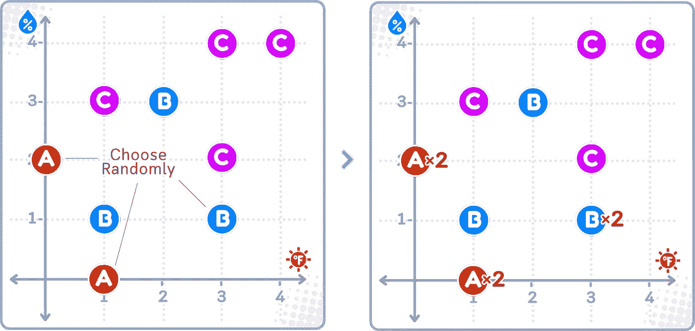
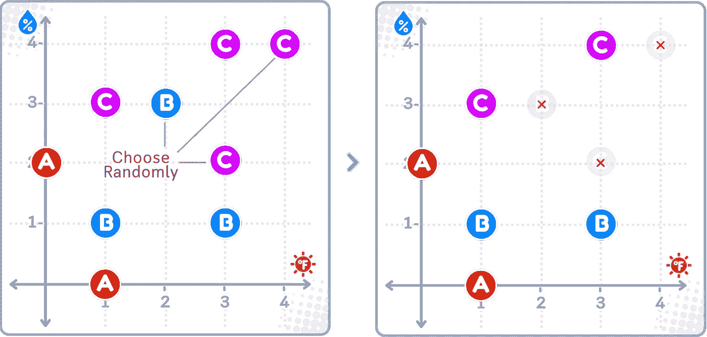
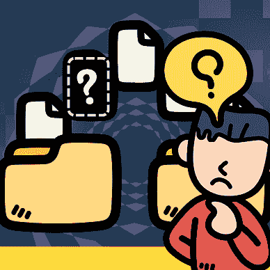
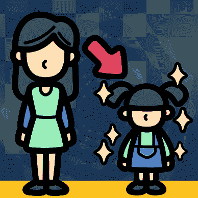
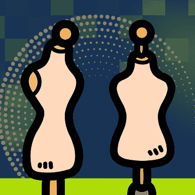
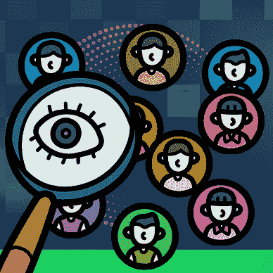

# 过采样与欠采样，详解：带有迷你二维数据集的视觉指南

> 原文：[`towardsdatascience.com/oversampling-and-undersampling-explained-a-visual-guide-with-mini-2d-dataset-1155577d3091?source=collection_archive---------1-----------------------#2024-10-26`](https://towardsdatascience.com/oversampling-and-undersampling-explained-a-visual-guide-with-mini-2d-dataset-1155577d3091?source=collection_archive---------1-----------------------#2024-10-26)

## 数据预处理

## 人为地生成和删除数据，以实现更大的利益

[](https://medium.com/@samybaladram?source=post_page---byline--1155577d3091--------------------------------)[](https://towardsdatascience.com/?source=post_page---byline--1155577d3091--------------------------------) [Samy Baladram](https://medium.com/@samybaladram?source=post_page---byline--1155577d3091--------------------------------)

·发表于[Towards Data Science](https://towardsdatascience.com/?source=post_page---byline--1155577d3091--------------------------------) ·阅读时间：9 分钟·2024 年 10 月 26 日

--


`⛳️ 更多的[数据预处理](https://medium.com/@samybaladram/list/data-preprocessing-17a2c49b44e4)，详解：· 缺失值填补 · 分类编码 · 数据缩放 · 离散化 ▶ 过采样与欠采样 · 数据泄漏在预处理中的影响`

收集一个每个类别的样本数量完全相同的数据集可能是一项挑战。实际上，情况很少是完美平衡的，在构建分类模型时，这可能成为一个问题。当一个模型在这样的数据集上进行训练时，如果某一类的样本比另一类多，通常它会更擅长预测较大的类别，而在预测较小的类别时表现较差。为了解决这个问题，我们可以使用过采样和欠采样等策略——为较小类别创造更多样本，或从较大类别中删除一些样本。

有许多不同的过采样和欠采样方法（如 SMOTE、ADASYN 和 Tomek Links 等这些令人害怕的名字），但是似乎没有很多资源可以直观地比较它们的工作方式。所以，在这里，我们将使用一个简单的二维数据集来展示应用这些方法后数据发生的变化，以便我们看到每种方法的输出有多大不同。你将会在可视化中看到，这些不同的方法给出了不同的解决方案，谁知道，也许其中某个方法适合你的具体机器学习挑战！


所有可视化：作者使用 Canva Pro 创建。优化为移动设备使用；在桌面上可能会显得过大。

# 定义

## 过采样

过采样可以使数据集更平衡，当一个组的样本比另一个组少得多时，它通过增加较小组的样本副本来工作。这有助于数据集更均衡地代表两个组。

## 欠采样

另一方面，欠采样通过删除较大组中的一些样本，直到它几乎与较小组的大小相同。最终，数据集确实会变小，但两个组的样本数量会更为相似。

## **混合采样**

将过采样和欠采样结合起来，称为“混合采样”。它通过增加较小组样本的副本来增大较小组的规模，同时也通过删除较大组中的一些样本来缩小较大组的规模。它试图创建一个更加平衡的数据集——既不太大也不太小。


# 📊 使用的数据集

让我们使用一个简单的人工高尔夫数据集来展示过采样和欠采样。这个数据集展示了在特定天气条件下，一个人做什么类型的高尔夫活动。


列：温度（0–3），湿度（0–3），高尔夫活动（A=标准球场，B=练习场，C=室内高尔夫）。训练数据集有 2 个维度和 9 个样本。

⚠️ 请注意，虽然这个小数据集有助于理解概念，但在实际应用中，你应该在应用这些技术之前使用更大的数据集，因为使用过少的数据进行采样可能会导致结果不可靠。

# 过采样方法

## 随机过采样

[随机过采样](https://imbalanced-learn.org/stable/references/generated/imblearn.over_sampling.RandomOverSampler.html)是一种简单的方法，通过复制较小组的样本，直到所有类别平衡。

👍 最适合需要快速平衡的小型数据集

👎 不推荐用于复杂的数据集



随机过采样简单地复制较小组（A）中选定的样本，同时保持较大组（B 和 C）中的所有样本不变，如右图中的 A×2 标记所示。

## SMOTE

[SMOTE](https://imbalanced-learn.org/stable/references/generated/imblearn.over_sampling.SMOTE.html)（合成少数类过采样技术）是一种过采样技术，通过对较小组进行插值来生成新样本。与随机过采样不同，它不仅仅是复制已有的样本，而是利用较小组的样本生成它们之间的样本。

👍 最适合在你有足够的样本并且需要数据多样性的情况

👎 如果样本数量非常少，不推荐使用

👎 如果数据点过于分散或噪声过大，不推荐使用


SMOTE 通过选择 A 点的成对样本，并在它们之间的某个位置生成新样本，从而创建新的 A 样本。类似地，一个新的 B 点会在随机选取的 B 点对之间生成。

## ADASYN

[ADASYN](https://imbalanced-learn.org/stable/references/generated/imblearn.over_sampling.ADASYN.html)（自适应合成）类似于 SMOTE，但专注于在较小组的难学部分生成新的样本。它会找到那些最难分类的样本，并在这些样本周围生成更多的新点。这有助于模型更好地理解具有挑战性的区域。

👍 如果数据的某些部分比其他部分更难分类，最佳选择

👍 最适合处理具有挑战性区域的复杂数据集

👎 如果你的数据相对简单直接，不推荐使用


ADASYN 在较小组（A）的“难学区域”生成更多合成点，这些区域是 A 点与其他组（B 和 C）接近的地方。它还会在类似区域生成新的 B 点。

# 欠采样方法

欠采样通过缩小较大组的大小，使其与较小组的大小更为接近。有几种方法可以做到这一点：

## 随机欠采样

[随机欠采样](https://imbalanced-learn.org/stable/references/generated/imblearn.under_sampling.RandomUnderSampler.html)通过随机移除较大组中的样本，直到其大小与较小组相同。与随机过采样一样，这种方法相当简单，但它可能会丢失一些重要信息，这些信息展示了各组之间的差异。

👍 最适合处理非常大的数据集，尤其是当样本重复较多时

👍 如果你需要一个快速、简单的解决方案，最佳选择

👎 如果你较大组中的每个样本都很重要，不推荐使用

👎 如果你不能接受丢失任何信息，不推荐使用



随机欠采样通过从较大的组（B 和 C）中随机删除样本，同时保持较小组（A）中的所有样本不变。

## Tomek 链接

[Tomek Links](https://imbalanced-learn.org/stable/references/generated/imblearn.under_sampling.TomekLinks.html)是一种欠采样方法，它使得组之间的“边界”更清晰。它搜索来自不同组的非常相似的示例对。当它找到一对示例，这些示例是彼此最接近的邻居但属于不同的组时，它会从较大组中移除这个示例。

👍 当你的组之间重叠过多时，效果最佳

👍 最适合清理杂乱或噪声数据

👍 当你需要组之间清晰的边界时，效果最佳

👎 如果你的组已经很分开，不推荐使用


Tomek Links 识别来自不同组（A-B，B-C）的点对，这些点对是彼此最接近的邻居。然后，从较大组（B 和 C）中移除这些点对，而保留所有较小组（A）中的点。

## Near Miss

[Near Miss](https://imbalanced-learn.org/stable/references/generated/imblearn.under_sampling.NearMiss.html)是一组基于不同规则的欠采样技术：

+   *Near Miss-1*：保留较大组中与较小组中的示例最接近的示例。

+   *Near Miss-2*：保留较大组中与较小组中三个最接近邻居的平均距离最小的示例。

+   *Near Miss-3*：保留较大组中距离自己组内其他示例最远的示例。

这里的主要思想是保留较大组中最具信息量的示例，去除那些不太重要的示例。

👍 当你需要控制保留哪些示例时，效果最佳

👎 如果你需要一个简单、快速的解决方案，不推荐使用


NearMiss-1 保留来自较大组（B 和 C）中与较小组（A）最接近的点，同时去除其他点。这里，仅保留距离 A 点最近的 B 和 C 点。

## ENN

[Edited Nearest Neighbors](https://imbalanced-learn.org/stable/references/generated/imblearn.under_sampling.EditedNearestNeighbours.html)（ENN）方法去除那些可能是噪声或离群点的示例。对于较大组中的每个示例，它检查其大多数最近邻是否属于同一组。如果不属于同一组，它会移除该示例。这有助于创建更清晰的组边界。

👍 最适合清理杂乱的数据

👍 当你需要移除离群点时，效果最佳

👍 最适合创建更清晰的组边界

👎 如果你的数据已经干净且组织良好，不推荐使用


ENN 从较大组（B 和 C）中移除其大多数最近邻属于不同组的点。在右侧的图中，划掉的点被移除，因为它们的大多数最近邻来自其他组。

# 混合采样方法

## SMOTETomek

[SMOTETomek](https://imbalanced-learn.org/stable/references/generated/imblearn.combine.SMOTETomek.html)的工作原理是，首先使用 SMOTE 为较小的类别创建新样本，然后通过使用 Tomek 链接去除“混淆”样本来清理杂乱的边界。这有助于创建一个更加平衡、边界更清晰且噪声更少的数据集。

👍 最适用于极度不平衡的数据

👍 最适合当你需要更多样本并且边界更清晰时

👍 最适合处理噪声较多且重叠的类别

👎 如果数据已经清理和整理得很好，建议不要使用

👎 不推荐用于小型数据集


SMOTETomek 结合了两个步骤：首先应用 SMOTE，在现有 A 点之间的线段上创建新的 A 点（如中间图所示），然后从较大类别（B 和 C）中去除 Tomek 链接。最终结果是更加平衡的类别，且它们之间的边界更加清晰。

## SMOTEENN

[SMOTEENN](https://imbalanced-learn.org/stable/references/generated/imblearn.combine.SMOTEENN.html)的工作原理是，首先使用 SMOTE 为较小类别创建新样本，然后通过使用 ENN 清理两个类别，去除那些与邻近样本不匹配的样本。像 SMOTETomek 一样，这有助于创建一个更干净的数据集，并使类别之间的边界更加清晰。

👍 最适合同时清理两个类别

👍 最适合当你需要更多样本但又希望数据更干净时

👍 最适合处理大量离群点时

👎 如果数据已经清理和整理得很好，建议不要使用

👎 不推荐用于小型数据集


SMOTEENN 结合了两个步骤：首先使用 SMOTE 在现有 A 点之间的线段上创建新的 A 点（如中间图所示），然后应用 ENN 去除那些邻近点大多来自不同类别的较大类别（B 和 C）中的点。最终图显示了清理后的平衡数据集。

# ⚠️ 使用重采样方法时的风险

重采样方法可以很有帮助，但也存在一些潜在的风险：

**过采样：**

+   生成人工样本可能会**给出不真实的模式**，这些模式在现实生活中并不存在。

+   模型可能因为合成样本而**变得过于自信**，这会在应用于实际情况时导致严重失败。

+   如果重采样操作不当（比如在数据拆分用于交叉验证之前），可能会发生**数据泄漏**的风险。

**欠采样：**

+   你可能会**永久丢失重要信息**。

+   你可能会**意外地破坏类别之间的重要边界**，从而导致对问题的误解。

+   你可能会**创建与真实世界条件差异过大的人工类别分布**。

**混合方法：**

+   **结合两种方法的错误**可能会**使问题变得更糟**，而不是更好。

在使用重采样方法时，很难找到在不改变数据中重要模式的情况下，既能解决类别不平衡问题又不影响模型性能的平衡点。根据我的经验，错误的重采样实际上可能会损害模型性能，而不是提高它。

在进行重采样之前，尝试使用那些自然能更好处理不平衡数据的模型，例如基于树的算法。重采样应作为更广泛策略的一部分，而不是解决类别不平衡的唯一方案。

# 🌟 超采样与欠采样代码总结

对于代码示例，我们将使用由 `[imblearn](https://imbalanced-learn.org/stable/index.html)` 库提供的方法：

```py
import pandas as pd
from imblearn.over_sampling import SMOTE, ADASYN, RandomOverSampler
from imblearn.under_sampling import TomekLinks, NearMiss, RandomUnderSampler
from imblearn.combine import SMOTETomek, SMOTEENN

# Create a DataFrame from the dataset
data = {
    'Temperature': [1, 0, 1, 3, 2, 3, 1, 3, 4],
    'Humidity': [0, 2, 1, 1, 3, 2, 3, 4, 4],
    'Activity': ['A', 'A', 'B', 'B', 'B', 'C', 'C', 'C', 'C']
}
df = pd.DataFrame(data)

# Split the data into features (X) and target (y)
X, y = df[['Temperature', 'Humidity']], df['Activity'].astype('category')

# Initialize a resampling method
# sampler = RandomOverSampler()       # Random OverSampler for oversampling
sampler = SMOTE()                     # SMOTE for oversampling
# sampler = ADASYN()                  # ADASYN for oversampling
# sampler = RandomUnderSampler()      # Random UnderSampler for undersampling
# sampler = TomekLinks()              # Tomek Links for undersampling
# sampler = NearMiss(version=1)       # NearMiss-1 for undersampling
# sampler = EditedNearestNeighbours() # ENN for undersampling
# sampler = SMOTETomek()              # SMOTETomek for a combination of oversampling & undersampling
# sampler = SMOTEENN()                # SMOTEENN for a combination of oversampling & undersampling

# Apply the resampling method
X_resampled, y_resampled = sampler.fit_resample(X, y)

# Print the resampled dataset
print("Resampled dataset:")
print(X_resampled)
print(y_resampled)
```

## 技术环境

本文使用 Python 3.7、pandas 1.3 和 imblearn 1.2。虽然讨论的概念普遍适用，但不同版本的具体代码实现可能会有所不同。

## 关于插图

除非另有说明，所有图片均由作者创作，包含了来自 Canva Pro 的授权设计元素。

𝙎𝙚𝙚 𝙢𝙤𝙧𝙚 𝘿𝙖𝙩𝙖 𝙋𝙧𝙚𝙥𝙧𝙤𝙘𝙚𝙨𝙨𝙞𝙣𝙜 𝙢𝙚𝙩𝙝𝙤𝙙𝙨 𝙝𝙚𝙧𝙚:


[Samy Baladram](https://medium.com/@samybaladram?source=post_page-----1155577d3091--------------------------------)

## 数据预处理

[查看列表](https://medium.com/@samybaladram/list/data-preprocessing-17a2c49b44e4?source=post_page-----1155577d3091--------------------------------)6 个故事

𝙔𝙤𝙪 𝙢𝙞𝙜𝙝𝙩 𝙖𝙡𝙨𝙤 𝙡𝙞𝙠𝙚:


[Samy Baladram](https://medium.com/@samybaladram?source=post_page-----1155577d3091--------------------------------)

## 分类算法

[查看列表](https://medium.com/@samybaladram/list/classification-algorithms-b3586f0a772c?source=post_page-----1155577d3091--------------------------------)8 个故事

[Samy Baladram](https://medium.com/@samybaladram?source=post_page-----1155577d3091--------------------------------)

## 回归算法

[查看列表](https://medium.com/@samybaladram/list/regression-algorithms-b0b6959f1b39?source=post_page-----1155577d3091--------------------------------)5 个故事！一个戴着粉色帽子、扎着辫子的卡通娃娃。这个“假人”娃娃，凭借其简单的设计和心形图案的衬衫，在视觉上代表了机器学习中的假回归模型（dummy regressor）概念。就像这个玩具般的形象是一个简化的、静态的人物表达，假回归模型是一些基本的模型，用作更复杂分析的基准。
