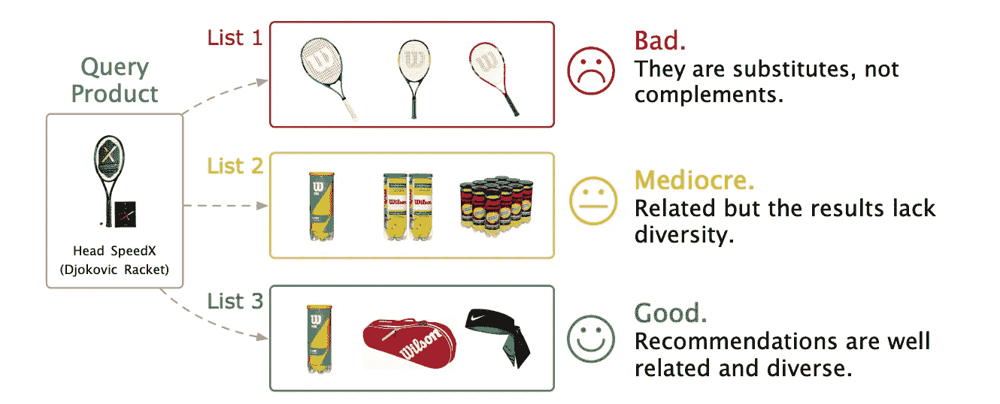

# P-Companion：亚马逊的多元化补充产品推荐原则框架

> 原文：[`towardsdatascience.com/p-companion-amazons-principled-framework-for-diversified-complementary-product-recommendation-971d504b0889?source=collection_archive---------15-----------------------#2024-10-01`](https://towardsdatascience.com/p-companion-amazons-principled-framework-for-diversified-complementary-product-recommendation-971d504b0889?source=collection_archive---------15-----------------------#2024-10-01)

## 深入探讨亚马逊的补充产品推荐框架

 [Saankhya Mondal](https://saankhya.medium.com/?source=post_page---byline--971d504b0889--------------------------------)

·发布于 [Towards Data Science](https://towardsdatascience.com/?source=post_page---byline--971d504b0889--------------------------------) ·11 分钟阅读·2024 年 10 月 1 日

--

# 介绍

补充产品推荐（CPR）在电子商务平台的成功中变得越来越重要。CPR 的目标是提供最相关的产品，这些产品通常是一起购买的。手机和手机壳经常一起购买；网球拍购买时，通常会一起购买网球；购买笔记本电脑后，通常会购买鼠标。本文将讨论亚马逊如何将 CPR 作为一种产品到产品的推荐问题解决：

> 给定一个“查询”产品，目标是推荐与该“查询”产品相关且多样的补充产品，使其可以一起购买，从而满足共同的需求。

补充产品推荐场景（图片来源 [[1]](https://dl.acm.org/doi/pdf/10.1145/3340531.3412732)）

预测这样的补充产品是一个非平凡的任务。让我们通过一个简单的例子来了解在解决这个问题时所面临的挑战。假设网球拍是“查询产品”，平台会显示三份相关产品列表。

1.  列表 1 包括其他三款相似的网球拍。

1.  列表 2 包括三款网球。
