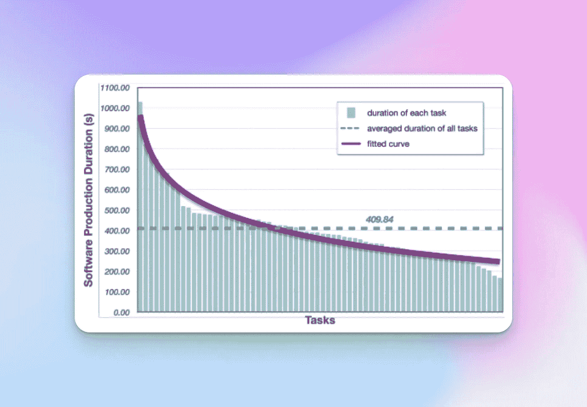

# 论文回顾 — 用于软件开发的交互式代理

> 原文：[`towardsdatascience.com/paper-review-communicative-agents-for-software-development-103d4d816fae?source=collection_archive---------9-----------------------#2024-06-08`](https://towardsdatascience.com/paper-review-communicative-agents-for-software-development-103d4d816fae?source=collection_archive---------9-----------------------#2024-06-08)

## 对“ChatDev”AI 代理论文的详细回顾

 [Eddie Forson](https://medium.com/@Ed_Forson?source=post_page---byline--103d4d816fae--------------------------------)

·发表于 [Towards Data Science](https://towardsdatascience.com/?source=post_page---byline--103d4d816fae--------------------------------) ·11 分钟阅读·2024 年 6 月 8 日

--

[ChatDev](https://arxiv.org/abs/2307.07924)论文封面截图

在阅读并回顾了[生成代理](https://medium.com/generative-ai/paper-review-generative-agents-72f4c2d2642c)论文后，我决定探索 AI 编码代理的世界。我这段旅程的下一站是题为“[用于软件开发的交互式代理](https://arxiv.org/abs/2307.07924)”的论文，也被称为*ChatDev*。

ChatDev 通过利用大型语言模型，通过人类用户与 AI 代理之间仅用自然语言交流，简化整个软件开发过程，从而为软件开发呈现了一种创新的范式。

正如你所猜测的，这是一个雄心勃勃的任务，这也使得这篇论文成为一篇同样令人兴奋的阅读材料。

从本质上讲，ChatDev 是一个虚拟的、由聊天驱动的软件开发公司，将*软件代理*聚集在一起，进行编码、设计、测试并生产指定的应用程序。

在这篇文章中，我们将解释这项工作的动机，接着深入探讨 ChatDev 的架构。最后，我们将展示这篇论文的发现，并分享我们对这项工作的个人看法。开始吧！

# 为什么我们希望 AI 来构建软件应用程序？

对许多人来说，软件是我们世界的魔法。就像在神秘的领域里，巫师能够施展魔法创造物理对象一样，在我们现实中，软件工程师能够创建各种程序，来增强、自动化并提升我们的生活。

然而，构建软件并非易事。它需要硬技能、团队合作、经验、直觉和品味。它也是昂贵的。

这些因素使得自动化创建软件变得困难。

世界各地的许多人和企业都希望创建软件程序以获取利润或娱乐，但他们没有足够的技能和资本去实现这一目标。这使得我们面临着巨大的未开发潜力和无法满足的机会，这些机会本可以改善人们的生活并丰富经济。

然而，近年来人工智能，特别是深度学习和大型语言模型的进步，使得我们能够在适度的成功水平上应对这一挑战。

在 ChatDev 中，研究人员提出了一个雄心勃勃的任务，旨在通过利用大型语言模型的力量生成整个软件程序。

# ChatDev 架构

ChatDev 是一家虚拟的、由聊天驱动的软件开发公司，模仿了传统的瀑布模型来构建软件。它通过精确地将开发过程分为四个不同的时间顺序*阶段*：设计、编码、测试和文档编写。

每个*阶段*开始时，会招聘一组专业的软件代理。例如，一个阶段可能涉及招聘首席技术官（CTO）、程序员和设计师代理。

截图 — 阶段 + 聊天链 — 来自 [ChatDev 论文](https://arxiv.org/abs/2307.07924)

每个阶段进一步细分为原子级的聊天，这些聊天被称为*聊天链*，代表着两个代理之间的中间任务解决聊天序列。每个聊天的设计目的是实现一个特定目标，并计入构建所需应用程序的总体目标中。

这些聊天按顺序连接在一起，以便将来自两个 AI 代理的先前聊天结果传播到后续的涉及两个其他 AI 代理的聊天中。

# 解决代码幻觉问题

ChatDev 解决的关键挑战之一是代码幻觉问题，这种问题可能出现在直接使用大型语言模型（LLM）生成整个软件系统时。

这些幻觉可能包括不完整的功能实现、缺失的依赖关系和未发现的错误。研究人员将这一现象归因于两个主要原因：

1\. **缺乏细粒度和具体性**：尝试一次性生成所有代码，而不是将目标分解为如语言选择和需求分析等阶段，可能会导致大型语言模型（LLM）的混乱。

2\. **缺乏交叉检查和自我反思**：对某个代理所做工作的反馈不充分或不具针对性，导致生成的代码不正确，而大型语言模型（LLM）没有纠正这些错误。

为了解决这些挑战，ChatDev 采用了一种新颖的方法，将开发过程分解为顺序的原子子任务，每个子任务涉及两个角色之间的协作互动和交叉检查。

这是一个高效的框架，能够促进代理之间的强大合作，从而提高目标软件的质量控制，确保代理能够成功构建所需的软件。

# ChatDev 阶段的结构

每个阶段都以*角色* *专业化*步骤开始，在该步骤中为该阶段招募合适的代理并赋予他们必须执行的角色。

链条中的每个聊天都由两个代理组成，它们分别承担以下角色之一：

+   ***指导者* 代理**：发起对话，并引导对话朝向任务完成。

+   ***助手* 代理**：遵循指导者代理给出的指令，并朝着完成任务的方向努力。

指导者和助手通过多轮对话进行合作，直到他们一致认为已经成功完成任务。

# 阶段 1 — 设计

该阶段涉及 CEO、CTO 和 CPO 代理。

在初始阶段，角色专业化是通过*初始提示*实现的。初始提示是一种来自[CAMEL 论文](https://arxiv.org/pdf/2303.17760)的技术，旨在将原始陈述扩展为更具体的提示，并为指导者和助手代理提供明确的目标，以便它们共同完成任务。

截图 — 初始提示示例 — 来自于[CAMEL 论文](https://arxiv.org/pdf/2303.17760)

类似于在[生成代理](https://medium.com/generative-ai/paper-review-generative-agents-72f4c2d2642c)中，ChatDev 中也使用了记忆流（Memory Stream）。记忆流包含了每个阶段和每个特定链条的对话历史。

与生成代理中的记忆流不同，ChatDev 的研究人员没有使用检索模块，也没有实现记忆反射。这可能是由于阶段和链条的顺序性质，使得从前一步骤流动的信息是可预测且容易访问的。

为了完成一个聊天，指导者和助手在多轮对话结束时通过相同的格式发出相同的消息，例如“<MODALITY>: 桌面应用程序”。

*自我反思*机制用于当两个代理已达成共识，但没有使用预期的字符串来结束他们的对话时。在这种情况下，系统会创建一个助手的*伪自我*，并与后者发起一个新的聊天（更多细节请参见上图）。

截图 — 设计阶段的步骤 — 来自于[ChatDev 论文](https://arxiv.org/abs/2307.07924)

在此聊天中，伪自我要求助手总结助手与指导者之间的对话历史，以便从对话中提取结论性信息。

# 阶段 2 — 编码

该阶段涉及 CTO、程序员和设计师代理。

编码阶段进一步分解为以下几个聊天：

**生成完整代码：** CTO 指示程序员根据设计阶段产生的规范编写代码。这些规范包括所选的编程语言（例如 Python），当然还包括要构建的应用程序类型。程序员认真地生成代码。

**设计图形用户界面：** 程序员指示设计师设计相关的用户界面。设计师则通过文本到图像的工具（如稳定扩散或 OpenAI 的 DALLe 等扩散模型）提出一个具有图标的友好图形用户界面供用户交互。然后，程序员将这些视觉资产集成到应用程序中。

ChatDev 使用面向对象编程语言（如 Python）生成代码，因为它具有强大的封装性和通过继承实现的重用性。此外，系统只向代理展示代码的最新版本，并从记忆流中删除之前的代码版本，以减少幻觉现象。

截图 — 思维指令 — 来自 [ChatDev 论文](https://arxiv.org/abs/2307.07924)

为了进一步抵抗幻觉，采用了*思维指令*。在思维指令中，代理之间的角色暂时交换。例如，CTO 和程序员交换角色片刻。这时，CTO 询问未实现的方法，使得程序员能够专注于代码库的特定部分。

本质上，通过思维指令，将一个大的任务（例如实现所有未实现的方法）拆分成更小的任务（例如，先实现方法 1，再实现方法 2，依此类推）。思维指令本身来源于*链式思维*提示。

# 第三阶段 — 测试

测试阶段涉及将所有组件集成到系统中，并使用来自解释器的反馈信息进行调试。此阶段涉及三个角色：程序员、审查者和测试者。

参与的聊天内容如下：

**同行评审：** 审查者代理检查源代码，识别潜在问题而不运行它（静态调试）。审查者代理尝试发现明显的错误、遗漏和可以改进的代码。

**系统测试：** 测试者代理通过程序员代理使用解释器（动态调试）进行的测试，验证软件的执行，重点评估通过黑盒测试应用程序的性能。

此处再次使用思维指令来调试程序的特定部分，测试者分析错误、提出修改建议，并根据这些建议指导程序员。

此外，ChatDev 允许人类客户以自然语言提供反馈和建议，这些反馈和建议会被纳入审查和测试过程。

# 第四阶段 — 文档编写

文档编写阶段包括生成软件系统的环境规范和用户手册。此阶段涉及四个角色：CEO、CPO、CTO 和程序员。

使用少量示例的提示，通过上下文示例，代理生成各种文档文件。

首席技术官指示程序员提供配置说明和依赖要求（例如 Python 的 requirements.txt），而首席执行官将需求和系统设计传达给首席产品官，后者生成用户手册。

截图 — 文档编写阶段步骤 — 来自[ChatDev 论文](https://arxiv.org/abs/2307.07924)

大型语言模型用于根据提供的提示和示例生成文档，生成一整套完整的文档文件，以支持软件系统的部署和使用。

# 评估与观察

在 70 个软件任务的评估中，ChatDev 展示了令人印象深刻的结果：

+   每个软件平均生成 17.04 个文件，包括代码文件、设计师创建的资产文件和文档文件。

+   生成的软件通常包含 39 到 359 行代码，平均为 131.61 行，这部分是由于通过面向对象编程实现代码复用。

+   审阅者和程序员之间的讨论导致了近 20 种代码漏洞的识别和修改，例如“模块未找到”，“属性错误”和“未知选项”错误。

+   测试人员和程序员之间的互动导致识别和解决了 10 多种潜在的错误，其中最常见的是由于令牌长度限制或外部依赖问题导致的执行失败。

+   使用 ChatDev 开发的软件平均成本为 0.2967 美元，显著低于传统定制软件开发公司的开支。

+   开发小型软件平均需要 409.84 秒，当然与人类软件公司开发类似应用所需的几周（或几个月）时间相比，表现得非常有利。

截图 — ChatDev 生成软件所需时间分析 — 来自[ChatDev 论文](https://arxiv.org/abs/2307.07924)

# 研究人员承认的局限性

尽管这些结果令人鼓舞，研究人员也承认了若干局限性。

即使使用低温（例如 0.2），研究人员仍然观察到生成的代码输出中存在随机性。这意味着同一个应用程序的代码在不同的运行之间可能会有所不同。因此，研究人员承认在此阶段，ChatDev 最好用于头脑风暴或创意工作。

有时，由于用户体验差或需求理解错误，软件无法满足用户需求。

此外，设计师代理缺乏视觉和风格一致性可能会显得突兀。这是因为生成与给定风格或品牌一致的视觉资产仍然困难（现在可以通过 LoRAs 来解决这个问题）。

截图 — ChatDev 生成的五子棋游戏示例 — 来自[ChatDev 论文](https://arxiv.org/abs/2307.07924)

研究人员还强调了当前 LLM（大语言模型）的偏见，这导致生成的代码看起来不像任何一个人类开发者可能写的代码。

最后，研究人员指出，利用他们的资源，很难对 ChatDev 生成的软件进行全面评估。对所生成应用程序的真正评估需要人类的参与，包括：

+   软件工程师

+   设计师/用户体验专家

+   测试人员

+   用户

# 个人批评

就个人而言，尽管这项工作是一个令人兴奋的进展，我也想表达我对其中一些内容的保留意见。

首先，现在大多数软件团队都采用敏捷开发方法，这使得在面对变化的用户需求时能提供更多的灵活性。瀑布式开发虽然仍用于某些项目，但如今已不再是常态。看看 ChatDev 如何迭代以适应更动态的软件开发生命周期将会非常有趣。

我建议我们用一个更直接、更精炼的提示替代*起始提示*，这个提示应直接来自用户。起始提示可能会编造需求，或者无法完全捕捉最终用户的意图。

当时使用的模型（gpt 3.5 turbo）仅有 16K tokens 的上下文窗口，这大大限制了使用 ChatDev 构建应用程序的范围和复杂度。

看起来 ChatDev 生成的代码并不是在沙盒内执行，而是直接在用户的机器上运行。这带来了许多安全风险，未来需要加以解决。

动画 — ChatDev 可视化工具 — 来自[ChatDev 源代码](https://github.com/OpenBMB/ChatDev)

ChatDev 对我来说并不完全有效。当我尝试运行它生成一个棋盘游戏时，它确实生成了一些代码，但在运行时，我只看到一个空白的桌面应用程序。这可能是因为我使用的是 Python 3.12，而论文中使用的是 Python 3.8。

# 结语

ChatDev 代表了实现为软件开发构建具有代理能力的 AI 系统愿景的令人兴奋的一步。通过使用一个多阶段过程，结合具有记忆和反思能力的大型语言模型，ChatDev 展示了高效且具有成本效益的软件生成潜力。

虽然仍然存在一些挑战需要克服，比如解决基础语言模型的偏差问题以及确保系统的鲁棒性评估，但 ChatDev 范式代表了我们继续推动 AI 能力边界时，展现出来的令人兴奋的可能性。

如果你对 AI 代理感兴趣并希望进一步探索这个领域，我强烈建议阅读 ChatDev 论文。你可以在[这里](https://arxiv.org/abs/2307.07924)访问它。

此外，研究人员已开源了一个名为 SRDD（软件需求描述数据集）的多样化数据集，旨在促进基于自然语言的软件创建研究。你可以在[这里](https://github.com/OpenBMB/ChatDev/tree/main/SRDD)找到该数据集。

至于我，我将继续探索 AI 代理，研究我自己的[Python AI 代理库](https://github.com/kenshiro-o/nagato-ai)，阅读更多论文，并通过每日推文在 Twitter/X 上分享我的思考和发现。

*我最近推出了* ***Kiseki Labs****，一家通过工作坊、战略咨询和定制解决方案帮助企业实施生成式 AI 的咨询公司。如果你有兴趣合作，可以在* [*kisekilabs.com*](https://kisekilabs.com/) *预约免费咨询，或者通过* [*X*](https://x.com/Ed_Forson) *或* [*LinkedIn*](https://www.linkedin.com/in/eddie-forson) *与我联系*。
