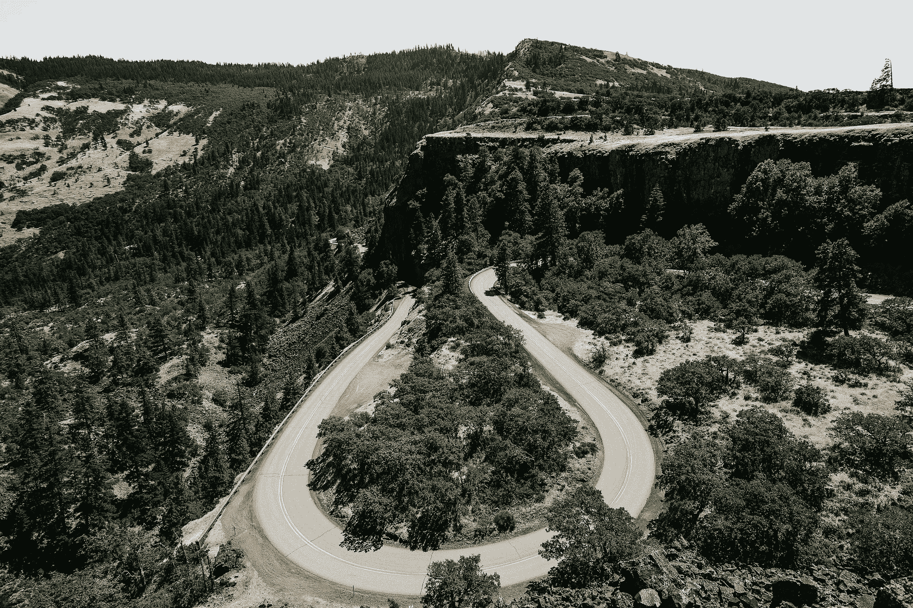
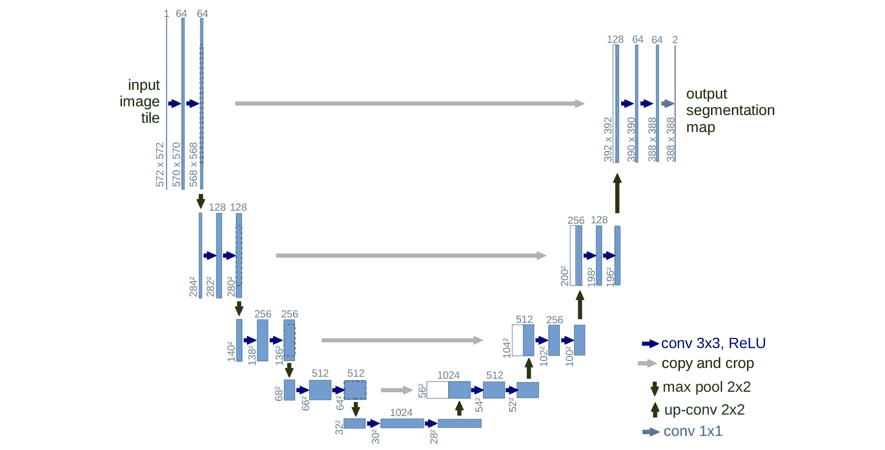

# 论文解读：U-Net

> 原文：[`towardsdatascience.com/paper-walkthrough-u-net-98877a2cd33c?source=collection_archive---------4-----------------------#2024-09-20`](https://towardsdatascience.com/paper-walkthrough-u-net-98877a2cd33c?source=collection_archive---------4-----------------------#2024-09-20)

## 一个关于最流行的语义分割模型之一的 PyTorch 实现。

 [Muhammad Ardi](https://medium.com/@muhammad_ardi?source=post_page---byline--98877a2cd33c--------------------------------)

·发表在[Towards Data Science](https://towardsdatascience.com/?source=post_page---byline--98877a2cd33c--------------------------------)·阅读 17 分钟·2024 年 9 月 20 日

--

照片由[Caleb Jones](https://unsplash.com/@gcalebjones?utm_source=medium&utm_medium=referral)在[Unsplash](https://unsplash.com/?utm_source=medium&utm_medium=referral)拍摄

# U-Net 简介

当我们谈论图像分割时，我们不应忘记 U-Net，这是一个神经网络架构，最早由 Ronneberger 等人于 2015 年提出[1]。该模型最初旨在执行医学图像的分割任务。后来，其他研究人员发现该架构实际上也可用于一般的语义分割任务。此外，还可以利用该模型进行其他任务，如超分辨率（即将低分辨率图像放大为高分辨率图像）和扩散（即从噪声生成图像）。在本文中，我想向您展示如何使用 PyTorch 从头开始实现 U-Net。您可以在图 1 中看到整个 U-Net 架构。通过查看这个结构，我认为这个网络是如何得名的就很明显了。

图 1\. U-Net 架构[1]。

架构中有几个关键组件。首先是收缩路径，也称为编码器。该组件负责逐渐缩小空间维度…
