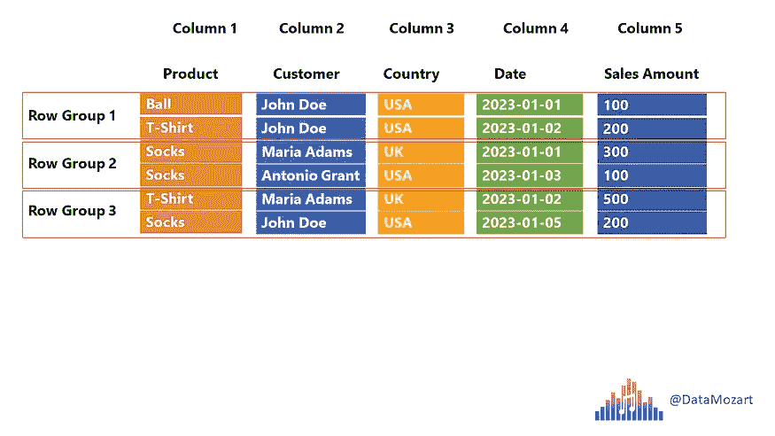

# Parquet 文件格式：你需要了解的一切

> 原文：[`towardsdatascience.com/parquet-file-format-everything-you-need-to-know-ea54e27ffa6e?source=collection_archive---------2-----------------------#2024-07-18`](https://towardsdatascience.com/parquet-file-format-everything-you-need-to-know-ea54e27ffa6e?source=collection_archive---------2-----------------------#2024-07-18)

## 新的数据格式需要新的存储方式。了解你需要知道的关于 Parquet 文件格式的所有内容

 [Nikola Ilic](https://datamozart.medium.com/?source=post_page---byline--ea54e27ffa6e--------------------------------)

·发表于 [Towards Data Science](https://towardsdatascience.com/?source=post_page---byline--ea54e27ffa6e--------------------------------) ·8 分钟阅读·2024 年 7 月 18 日

--

作者提供的图片

随着近年来数据量呈指数增长，最大的挑战之一是找到最优的方式存储各种数据格式。与（不久前的）过去不同，当时关系型数据库被视为唯一的选择，现在的组织希望能够对原始数据进行分析——比如社交媒体情感分析、音频/视频文件等——这些数据通常无法以传统（关系型）方式存储，或者以传统方式存储需要大量的努力和时间，这样会增加整体的分析时间。

另一个挑战是如何坚持使用传统的方法以结构化的方式存储数据，但又不需要设计复杂且耗时的 ETL 工作负载，将这些数据迁移到企业数据仓库中。此外，如果你组织中的一半数据专业人员精通 Python（如数据科学家、数据工程师），另一半（如数据工程师、数据分析师）精通 SQL，那么你会坚持让“Python 用户”学习 SQL 吗？还是反过来呢？
