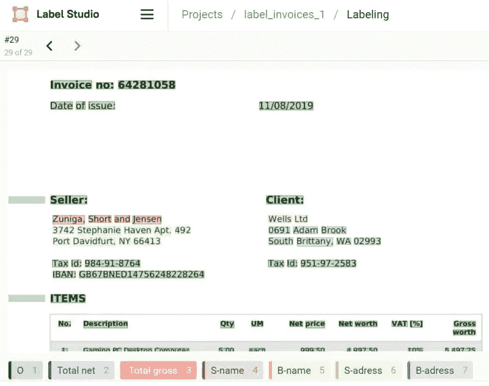

# 使用 LayoutLM 和 Label Studio 解析您的发票

> 原文：[`towardsdatascience.com/parse-your-invoices-with-layoutlm-and-label-studio-6055ce3c14fe?source=collection_archive---------1-----------------------#2024-04-16`](https://towardsdatascience.com/parse-your-invoices-with-layoutlm-and-label-studio-6055ce3c14fe?source=collection_archive---------1-----------------------#2024-04-16)

## 使用 Transformers 库、Label Studio 和 AWS S3 对您的发票进行 LayoutLM 的微调。

 [Jeremy Arancio](https://medium.com/@jeremyarancio?source=post_page---byline--6055ce3c14fe--------------------------------)

·发表于[Towards Data Science](https://towardsdatascience.com/?source=post_page---byline--6055ce3c14fe--------------------------------) ·阅读时长 34 分钟·2024 年 4 月 16 日

--

从发票中提取信息长期以来一直是公司、机构和会计人员重复且繁琐的任务。

这个任务可以自动化吗？答案是肯定的。

这就是机器学习的承诺：处理成千上万的文档并提取所有相关信息。

许多公司，如[Rossum](https://rossum.ai/)、[Digitoo](https://www.digitoo.cz/)或[Docsumo](https://www.docsumo.com/)，都是基于这一简单想法创建的，并且累计筹集了[数亿美元](https://rossum.ai/blog/rossum-raises-record-100-million-series-a-from-general-catalyst-to-reinvent-b2b-document-communication/)，证明了这种技术的需求。

您也可以创建自己的解决方案。

在本文中，我将引导您通过构建一个微调您公司文档的发票解析器的过程。

我们介绍**LayoutLM**，这是由微软开发的一个著名模型，用于从文档中提取信息。为了定制适合我们特定需求的解决方案，我们使用**Label Studio**进行文档标注，这是一款开源标注工具，并将其与我们的远程存储**AWS S3**连接。

让我们开始吧！

使用 Label Studio 进行发票标注，以便进行 LayoutLM 训练（图片来自作者）

# LayoutLM：文档图像理解的布局
