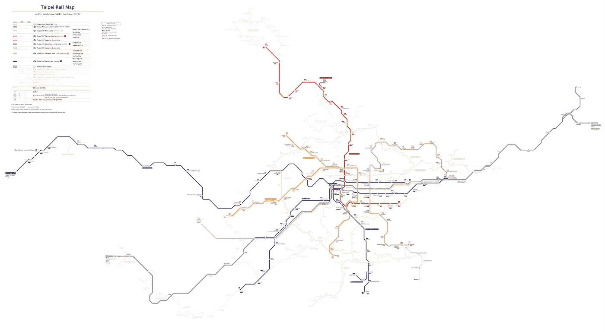
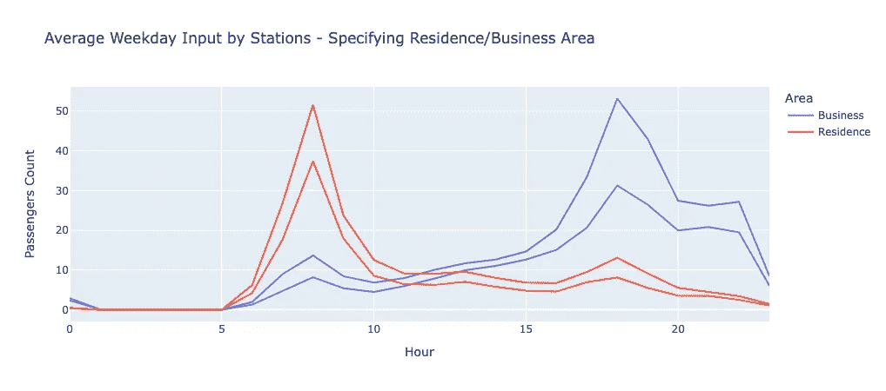
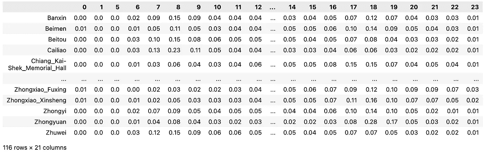
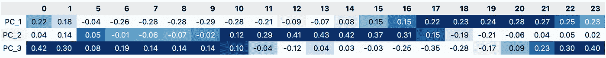
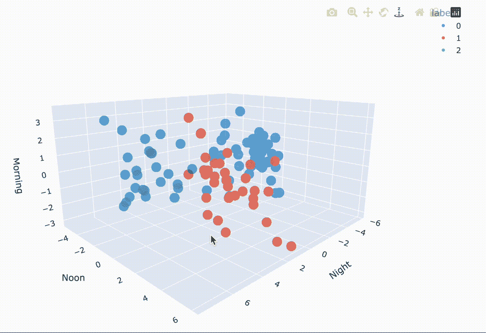
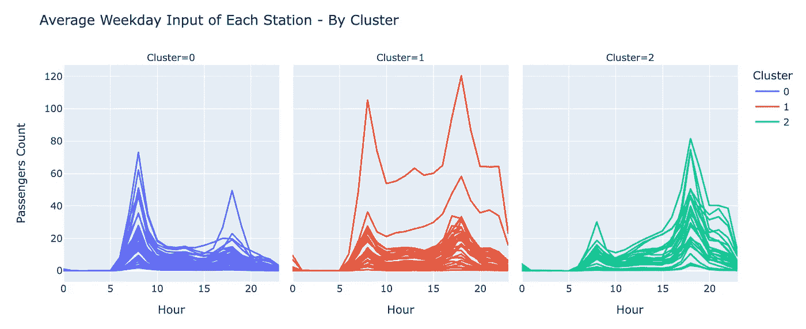
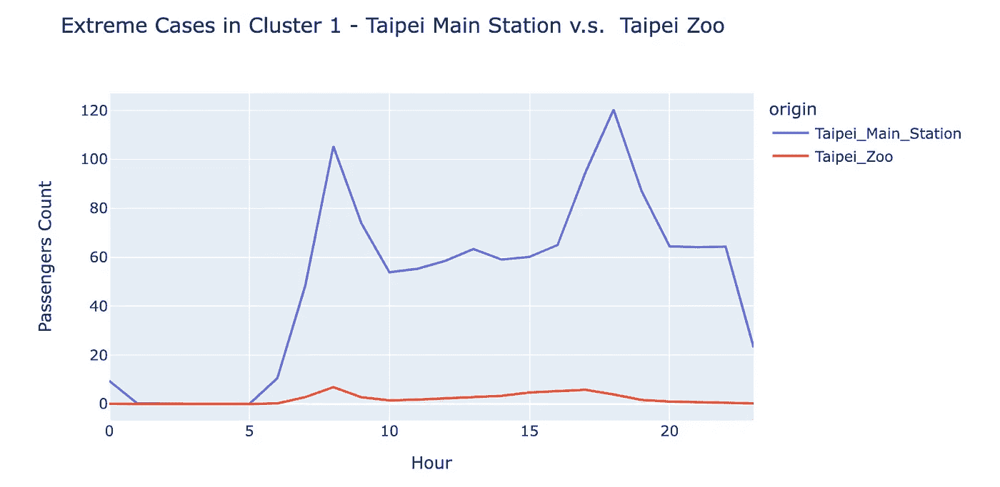

# 在 Python 中使用 PCA 和 K-Means 进行交通数据分析

> 原文：[`towardsdatascience.com/pca-k-means-for-traffic-data-in-python-a0ec66ab4789?source=collection_archive---------2-----------------------#2024-05-07`](https://towardsdatascience.com/pca-k-means-for-traffic-data-in-python-a0ec66ab4789?source=collection_archive---------2-----------------------#2024-05-07)

## 基于每小时交通数据，减少维度并对台北捷运车站进行聚类

[](https://medium.com/@beth-ouyang?source=post_page---byline--a0ec66ab4789--------------------------------)[](https://towardsdatascience.com/?source=post_page---byline--a0ec66ab4789--------------------------------) [Beth Ou Yang](https://medium.com/@beth-ouyang?source=post_page---byline--a0ec66ab4789--------------------------------)

·发表于 [Towards Data Science](https://towardsdatascience.com/?source=post_page---byline--a0ec66ab4789--------------------------------) ·阅读时间 8 分钟·2024 年 5 月 7 日

--



台北铁路地图（实际上基于罗马化标准引入）包括高铁、台铁、台北捷运及其他线路。图片来源：[Taiwan J](https://commons.wikimedia.org/wiki/User:Taiwan_Junior)。

主成分分析（PCA）已经在交通数据中用于检测异常，但它也可以用于捕捉交通站点历史数据的模式，类似于它在顾客购买数据上的应用。

## **在本文中，我们将讨论：**

1.  PCA 做了什么技巧

1.  应用 PCA 后我们可以做什么

1.  **玩得开心！**

    看看我们的数据集：

    [台北捷运系统每小时交通数据](https://www.kaggle.com/datasets/bethouyang/taipei-mrt-hourly-traffic-data)

    [完整代码](https://www.kaggle.com/code/bethouyang/pca-k-means-for-traffic-data-in-python)也包含在上述的 Kaggle 数据集中。

1.  在每小时交通数据上使用 PCA

1.  对 PCA 结果进行聚类

1.  关于台北捷运交通的洞察

1.  主要收获

## 1\. PCA 做了什么技巧

简而言之，PCA 通过找到特征的线性组合来总结数据，这可以理解为拍摄一个三维物体的几张照片，并且它会在交给你之前自然地按最具代表性的照片到最不具代表性的照片进行排序。

输入是我们的原始数据，PCA 会输出 2 个有用的结果：**Z** 和 **W**。通过将它们相乘，我们可以得到重构数据，即原始数据，但有一些可以容忍的信息丢失（因为我们已经减少了维度）。

我们将在下面的实践中解释这 2 个输出矩阵与我们的数据的关系。

## 2\. 应用 PCA 后我们可以做什么

在将 PCA 应用于我们的数据以降维后，我们可以将其用于其他机器学习任务，如聚类、分类和回归。

在本文稍后的台北捷运案例中，我们将在较低维度的数据上进行聚类，其中几个维度可以解释为一天中不同时间段的乘客比例，例如早晨、午间和傍晚。那些白天具有相似乘客比例的车站会被认为在同一簇中（它们的模式相似！）。

## 3. 看看**我们的交通数据集！**

我们这里使用的数据是[台北捷运系统每小时交通数据](https://www.kaggle.com/datasets/bethouyang/taipei-mrt-hourly-traffic-data)，包含列：`date, hour, origin, destination, passenger_count`。

在我们的案例中，我只保留工作日的数据，因为在工作日不同车站之间有更多有趣的模式。例如，位于住宅区的车站白天可能有更多的通勤乘客进入，而在晚上，位于商业区的车站可能有更多人进站。



位于住宅区的车站白天可能有更多的通勤乘客进入。

上面的图是 4 个不同车站的每小时交通趋势（乘客进入车站的数量）。红色的两条线是新埔和永安市场，这两个车站实际上位于新北市的超拥挤区域。另一方面，蓝色的两条线是台北市政府和忠孝复兴站，这里是大多数公司所在地，也是商业活动发生的地方。

这些趋势反映了这些区域和车站的特点，我们可以注意到，比较它们在通勤时间（早上 7 点到 9 点，以及下午 5 点到 7 点）期间的趋势时，差异最为明显。

## 4. 使用 PCA 处理每小时交通数据

为什么在进行进一步的机器学习任务之前要进行降维？

有两个主要原因：

1.  **随着维度的增加**，所有数据点在许多方面看起来都变得稀疏且不相似，这就是所谓的“维度灾难”。

1.  由于交通数据的**高维**特性，它**难以可视化**和**解释**。

通过应用 PCA，我们可以识别出不同车站的交通趋势最为明显和具有代表性的时间段。直观地，通过之前显示的图，我们可以假设早上 8 点和下午 6 点左右的时间段可能足够具有代表性，能够对车站进行聚类。

记得我们在上一节提到过 PCA 的有用输出矩阵 Z 和 W 吗？在这里，我们将用 MRT 案例来解释它们。

***原始数据，X***



+   索引：车站

+   列：小时

+   数值：特定小时进入的乘客比例（对于每个车站：#乘客 / #总乘客数）

通过这样的 X，我们可以通过以下代码应用 PCA：

```py
from sklearn.decomposition import PCA

n_components = 3
pca = PCA(n_components=n_components)

X_tran = StandardScaler().fit_transform(X)

pca.fit(X_tran)
```

在这里，我们指定参数**n_components**为 3，这意味着 PCA 将为我们提取最重要的三个主成分。

请注意，这就像是“*拍摄多个三维物体的照片，并按最具代表性的顺序排序，我们选择前三张照片*”，因此如果我们将**n_components**设为 5，我们将得到两张额外的照片，但我们的前三张照片仍然保持不变！

***PCA 输出，W 矩阵***

**W**可以被视为每个特征（即小时数）相对于我们的“图片”的权重，或者更具体地说，**主成分**。

```py
pd.set_option('precision', 2)

W = pca.components_
W_df = pd.DataFrame(W, columns=hour_mapper.keys(), index=[f'PC_{i}' for i in range(1, n_components+1)])
W_df.round(2).style.background_gradient(cmap='Blues')
```



对于我们的三个主成分，我们可以看到 PC_1 在夜间时段的权重大，而 PC_2 在中午时段的权重大，PC_3 则与早晨时间相关。

***PCA 输出，Z 矩阵***

我们可以将**Z**矩阵解读为车站的表现。

```py
Z = pca.fit_transform(X)

# Name the PCs according to the insights on W matrix
Z_df = pd.DataFrame(Z, index=origin_mapper.keys(), columns=['Night', 'Noon', 'Morning'])

# Look at the stations we demonstrated earlier
Z_df = Z_df.loc[['Zhongxiao_Fuxing', 'Taipei_City_Hall', 'Xinpu', 'Yongan_Market'], :]
Z_df.style.background_gradient(cmap='Blues', axis=1)
```


在我们的案例中，既然我们已经解读了 W 矩阵并理解了每个成分的潜在含义，我们可以为这些主成分命名。

这四个车站的 Z 矩阵表明，前两个车站的夜间时段占比更大，而另外两个车站则更多是在早晨时段。这一分布也支持我们在 EDA 中的发现（回想一下早期部分这四个车站的折线图）。

## 5. 使用 K 均值聚类对 PCA 结果进行聚类

在得到 PCA 结果后，我们将进一步根据车站的交通模式（由 3 个主成分表示）对车站进行聚类。

在最后一部分中，Z 矩阵表示了各个车站在夜间、中午和早晨的表现。

我们将根据这些表示对车站进行聚类，使得同一组中的车站在这三个时间段的客流分布相似。

聚类方法有很多种，比如 K 均值、DBSCAN、层次聚类等等。由于这里的主要话题是展示 PCA 的便捷性，我们将跳过实验哪些方法更合适的过程，直接使用**K 均值**。

```py
from sklearn.cluster import KMeans

# Fit Z matrix to K-Means model 
kmeans = KMeans(n_clusters=3)
kmeans.fit(Z)
```

在拟合 K 均值模型后，让我们通过[plotly](https://plotly.com/python/3d-scatter-plots/)绘制三维散点图来可视化这些聚类结果。

```py
import plotly.express as px

cluster_df = pd.DataFrame(Z, columns=['PC1', 'PC2', 'PC3']).reset_index()

# Turn the labels from integers to strings, 
# such that it can be treated as discrete numbers in the plot.
cluster_df['label'] = kmeans.labels_
cluster_df['label'] = cluster_df['label'].astype(str)

fig = px.scatter_3d(cluster_df, x='PC1', y='PC2', z='PC3', 
                       color='label', 
                       hover_data={"origin": (pca_df['index'])},
                       labels={
                          "PC1": "Night",
                          "PC2": "Noon",
                          "PC3": "Morning",
                          },
                      opacity=0.7,
                      size_max=1,
                      width = 800, height = 500
                    ).update_layout(margin=dict(l=0, r=0, b=0, t=0)
                    ).update_traces(marker_size = 5) 
```



## 6. 台北捷运交通洞察——聚类结果



+   **Cluster 0**：白天有更多的乘客，因此它可能是“居住区”组。

+   **Cluster 2**：傍晚时段有更多的乘客，因此它可能是“商业区”组。

+   **Cluster 1**：白天和夜间都有大量的乘客进入车站，解释这些车站的特性更加复杂，因为不同车站可能有不同的原因。接下来，我们将深入分析该聚类中的两个极端案例。



例如，在**集群 1**中，拥有最多乘客的台北车站——台北车站，是台北的一个重要交通枢纽，通勤者可以在这里从公交和铁路系统换乘到地铁。因此，早晚高峰时段的高流量模式是显而易见的。

相反，台北动物园站也位于集群 1 中，但“白天和晚上的人流都很大”并不适用。实际上，在这两个时段，那里的人不多，因为周围没有多少居民，而且大多数市民平日很少去台北动物园。

这两座车站的模式并不相似，尽管它们在同一集群中。这意味着集群 1 可能包含了许多实际上并不相似的车站。因此，未来我们需要对 K-Means 的超参数进行微调，例如集群的数量，像**轮廓系数**和**肘部法则**这样的方式会很有帮助。

# 结论

总结来说，

1.  在交通数据上应用 PCA 来降低维度可以通过提取 3 个重要时段（早晨、中午、晚间）来实现，这些时段来自 21 个工作小时**。**

1.  PCA 的输出是 W 和 Z 矩阵，其中 Z 可以视为车站在主成分（时间段）上的表示，而 W 可以视为主成分（时间段）在原始特征（小时）上的表示。

1.  考虑到 W 矩阵有助于我们理解每个主成分的潜在含义。

1.  聚类方法可以应用于 PCA 输出的 Z 矩阵。

> 请注意，为了专注于本文的主题，我们在这里跳过了 EDA 和超参数调优部分，但它们实际上非常重要。

感谢你读到这里！

希望你在台北的线上之旅愉快 🫶

## 进一步阅读

+   KMeans 超参数解释与示例，Sujeewa Kumaratunga 博士

+   [如何在 Python 中结合 PCA 与 K-means 聚类？](https://365datascience.com/tutorials/python-tutorials/pca-k-means/)，Elitsa Kaloyanova

## 参考文献

+   DSCI 563 讲义，UBC 数据科学硕士课程，Varada Kolhatkar

+   [高维数据上的 K 均值聚类](https://medium.com/swlh/k-means-clustering-on-high-dimensional-data-d2151e1a4240)，shivangi singh

+   维度灾难 — 机器学习的“诅咒”，Shashmi Karanam

*除非另有说明，所有图片均来自作者。*
