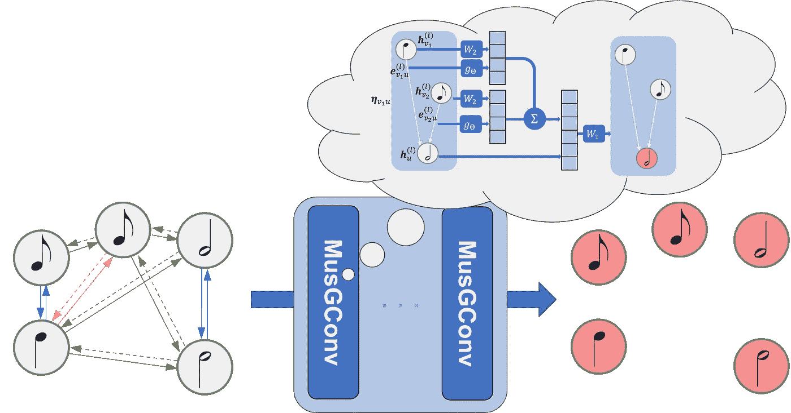
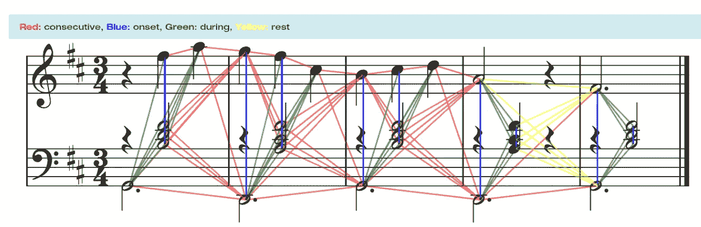
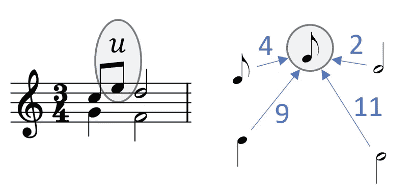
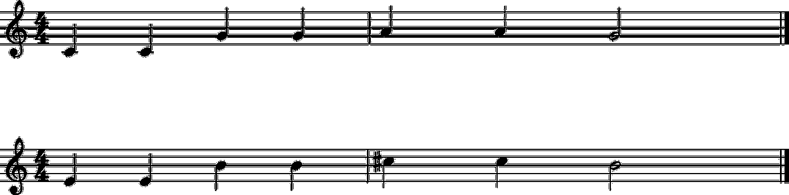
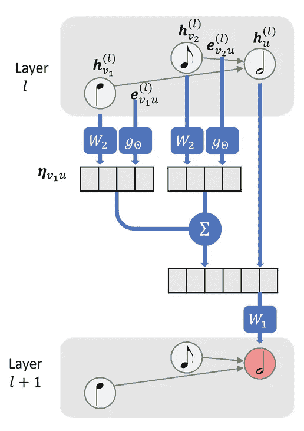
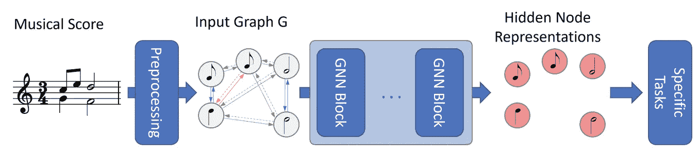
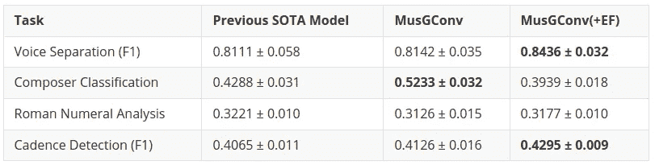

# 受感知启发的图卷积用于音乐理解任务

> 原文：[`towardsdatascience.com/perception-inspired-graph-convolution-for-music-understanding-tasks-4d2ba1be48e7?source=collection_archive---------3-----------------------#2024-07-09`](https://towardsdatascience.com/perception-inspired-graph-convolution-for-music-understanding-tasks-4d2ba1be48e7?source=collection_archive---------3-----------------------#2024-07-09)

## 这篇文章讨论了**MusGConv**，一种受感知启发的图卷积模块，适用于符号音乐应用。

 [Emmanouil Karystinaios](https://manoskary.medium.com/?source=post_page---byline--4d2ba1be48e7--------------------------------)

·发表于[Towards Data Science](https://towardsdatascience.com/?source=post_page---byline--4d2ba1be48e7--------------------------------) ·阅读时间 10 分钟·2024 年 7 月 9 日

--

# 引言

在音乐信息研究（MIR）领域，理解和处理乐谱的挑战一直在不断引入新的方法和途径。最近，许多基于图的技术被提出，作为解决音乐理解任务的方法，如声音分离、拍子检测、作曲家分类和罗马数字分析。

本文讨论了我最近的一篇论文，其中我介绍了一种新的图卷积模块，名为**MusGConv**，专门用于处理乐谱数据。**MusGConv**利用音乐感知原理，提升了图卷积在应用于音乐理解任务中的效率和性能。

# 理解问题

传统的 MIR 方法通常依赖于音乐的音频或符号表示。音频能够捕捉声音波的强度随时间变化，而符号表示如 MIDI 文件或乐谱则编码了离散的音乐事件。符号表示特别有价值，因为它们提供了更高层次的信息，这对于音乐分析和生成等任务至关重要。

然而，现有的基于符号音乐表示的技术通常借鉴计算机视觉（CV）或自然语言处理（NLP）方法。例如，将音乐表示为矩阵格式的“钢琴卷轴”并将其类似于图像，或将音乐表示为一系列符号并通过序列模型或变换器处理。这些方法虽然有效，但可能无法完全捕捉到音乐的复杂多维特性，包括音符的层次关系和复杂的音高-时间关系。一些最新的方法已经提出将音乐乐谱建模为图，并应用图神经网络来解决各种任务。

## 将音乐乐谱作为图

基于图神经网络（GNN）的方法在音乐乐谱中的基本思想是将音乐乐谱建模为一个图，其中音符是顶点，边是基于音符之间的时间关系构建的。为了从音乐乐谱创建图，我们可以考虑四种类型的边（请参见下图以查看乐谱上图的可视化）：

+   *起始边*：连接具有相同起始时间的音符；

+   *连续边*（或*下一个边*）：如果音符 x 的偏移量与音符 y 的起始时间对应，则连接音符 x 和音符 y；

+   *期间边*：如果音符 y 的起始时间落在音符 x 的起始时间和结束时间之间，则连接音符 x 和音符 y；

+   *休止边*（或*静音边*）：连接休止符前的最后一个音符和其后的第一个音符。

GNN 可以处理从音符和这四种类型关系中创建的图。

# 介绍 MusGConv

MusGConv 旨在利用音乐乐谱图并通过将音乐感知原理融入图卷积过程来增强这些图。它专注于音乐的两个基本维度：音高和节奏，考虑它们的相对表示和绝对表示。

绝对表示指的是可以归属于每个音符的特征，例如音符的音高或拼写、持续时间或任何其他特征。另一方面，相对特征是通过音符对之间计算的，例如两个音符之间的音程、它们的起始时间差，即它们发生的时间等。

## MusGConv 的主要特征

1.  **边特征计算**：MusGConv 基于音符之间的起始时间、持续时间和音高计算边特征。可以对边特征进行归一化，以确保它们在神经网络计算中更加有效。

1.  **相对和绝对表示**：通过同时考虑相对特征（作为边特征的音高之间的距离）和绝对值（作为节点特征的实际音高和时间），MusGConv 可以根据实际情况调整和使用更相关的表示。

1.  **与图神经网络的集成**：MusGConv 模块可以轻松与现有的 GNN 架构集成，几乎不增加额外的计算成本，并且可以用于改进音乐理解任务，例如声部分离、和声分析、节奏检测或作曲家识别。

相对表示和绝对表示的重要性与共存，可以从音乐中的移调角度理解。想象一下相同的音乐内容被移调。那么，音符之间的音程关系保持不变，但每个音符的音高发生了变化。

相同内容通过大三度移调。顶部和底部音符之间的关系相同，但绝对音高发生了变化。

# 理解图神经网络（GNNs）中的消息传递

为了充分理解 MusGConv 卷积模块的内部工作原理，首先需要解释消息传递的原理。

## 什么是消息传递？

在 GNN 的上下文中，消息传递是一个过程，其中图中的顶点与它们的邻居交换信息，以更新自身的表示。这种交换使每个节点能够从图中收集上下文信息，然后用于预测任务。

消息传递过程通过以下步骤定义：

1.  **初始化**：每个节点被分配一个特征向量，其中可以包含一些重要的属性。例如，在乐谱中，这可能包括每个节点/音符的音高、时值和起始时间。

1.  **消息生成**：每个节点生成一条消息发送给它的邻居。消息通常包含节点的当前特征向量以及描述节点之间关系的任何边特征。消息可以是邻居节点特征的线性变换。

1.  **消息聚合**：每个节点从其邻居处收集消息。聚合函数通常是一个置换不变的函数，例如求和、平均值或最大值，它将这些消息合并成一个单一的向量，确保节点能够捕获来自其整个邻域的信息。

1.  **节点更新**：聚合后的消息用于更新节点的特征向量。此更新通常涉及应用神经网络层（如全连接层），然后是非线性激活函数（如 ReLU）。

1.  **迭代**：步骤 2 至步骤 4 会根据指定的迭代次数或层数重复执行，从而使信息能够在图中传播。每次迭代时，节点会将来自越来越大邻域的信息整合进来。

## MusGConv 中的消息传递

MusGConv 通过将绝对特征作为节点特征以及相对音乐特征作为边特征来改变标准的消息传递过程。这个设计是为了适应音乐数据的特点。

MusGConv 卷积通过以下步骤定义：

1.  **边缘特征计算**：在 MusGConv 中，边缘特征通过音符的起始时间、持续时间和音高的差异来计算。此外，还包括音高类间隔（不考虑八度的音符间距离），提供了一种简化但有效的方法来量化音乐间隔。

1.  **消息计算**：MusGConv 中的消息不仅包括源节点的当前特征向量，还包括从源节点到目标节点的上述边缘特征，使得网络在消息传递过程中能够利用邻居的绝对和相对信息。

1.  **聚合与更新**：MusGConv 使用求和作为聚合函数，然而，它将当前节点的表示与其邻居信息的总和进行连接。

MusGConv 图卷积模块。

通过这样设计消息传递机制，MusGConv 试图保持音乐的相对感知特性（如音程和节奏），从而产生更有意义的音乐数据表示。

如果缺少边缘特征或故意不提供，则 MusGConv 计算两个节点之间的边缘特征为它们节点特征的绝对差异。带有边缘特征的 MusGConv 版本在实验中被称为 MusGConv(+EF)。

# 应用与实验

为了展示 MusGConv 的潜力，我将在下面讨论论文中进行的任务和实验。所有模型无论任务如何，都按下图所示的管道设计。当使用 MusGConv 时，GNN 模块被 MusGConv 模块替代。

我决定将 MusGConv 应用于四个任务：声音分离、作曲家分类、罗马数字分析和和弦进行检测。这些任务从图学习的角度呈现了不同的分类。声音分离是一个链路预测任务，作曲家分类是一个全局分类任务，和弦进行检测是一个节点分类任务，而罗马数字分析可以看作是一个子图分类任务。因此，我们不仅从音乐分析的角度，而且从整个图深度学习任务分类的范围来探索 MusGConv 的适用性。

一般图形管道在符号音乐理解任务中的示例

## 声音分离

声音分离是从多声部音乐片段中检测出各个单声部流的方法。以往的方法采用了 GNN 来解决这个任务。从 GNN 的角度来看，声音分离可以视为一个链路预测任务，即对于每一对音符，我们预测它们是否被一条边连接。链路预测的结果应当是一个图，其中在同一声部中的连续音符应该是连接在一起的。然后，声部就是预测图的连通分量。关于使用 GNN 进行声音分离的更多信息，请参考[这篇论文](https://arxiv.org/abs/2304.14848)。

对于声音分离，上述图中的流程适用于架构中的 GNN 编码器部分。链路预测部分则作为任务特定模块进行处理。使用 MusGConv 时，只需将 GNN 编码器中的卷积块替换为 MusGConv。这个简单的替换使得预测更加准确，错误更少。

由于深度学习系统的解释并非易事，因此很难准确指出性能提升的原因。从音乐的角度来看，同一声部中的连续音符通常具有较小的相对音高差异。MusGConv 的设计确实通过相对边特征突出了音高差异。然而，我还需要补充说，从个别观察来看，音乐并不严格遵循任何规则。

## 作曲家分类

作曲家分类是根据某些音乐片段识别作曲家的过程。以前基于 GNN 的方法处理此任务时，类似于上面展示的流程，它们接收一个分数图作为输入，然后包含一些全局池化层，将音乐片段的图转化为一个向量。然后，从该向量进行分类处理，类别即为预定义的作曲家。

再次强调，MusGConv 通过替换 GNN 卷积块，易于实现。在实验中，使用 MusGConv 确实在解决这个任务中非常有益。我的直觉是，相对特征与绝对特征相结合，能为作曲风格的组成提供更好的洞察。

## 罗马数字分析

罗马数字分析是一种和声分析方法，其中和弦用罗马数字表示。预测罗马数字的任务相当复杂。先前的架构使用了 GNN 和顺序模型的混合。此外，罗马数字分析是一个多任务分类问题，通常一个罗马数字会被分解成更简单的单独任务，以减少独特罗马数字的类别词汇量。最后，罗马数字分析的图形化架构还包括在图卷积之后的一个起始收缩层，该层将图转换为有序序列。这个起始收缩层收缩同时发生的音符组，并在分类时将它们分配到相同的标签。因此，这可以视为一个子图分类任务。我认为这个模型的解释值得单独写一篇文章，因此，我建议阅读[这篇论文](https://arxiv.org/abs/2307.03544)以获取更多见解。

然而，图中的一般图形管道仍然适用。顺序模型与多任务分类过程以及起始收缩模块完全属于任务特定的部分。然而，用 MusGConv 模块替换图卷积块似乎对这个任务和架构没有影响。我将此归因于任务和模型架构本身过于复杂。

## 终止式检测

最后，让我们讨论终止式检测。检测终止式可以视为与检测乐句结尾相似，它是音乐分析中的一个重要方面。之前的终止式检测方法采用了带有编码器-解码器 GNN 架构的 GNN。每个音符，直到现在我们知道它也对应图中的一个节点，被分类为终止式音符或非终止式音符。终止式检测任务包括许多特殊情况，如非常严重的类别不平衡以及注释歧义。如果你感兴趣，我再次建议查阅[这篇论文](https://arxiv.org/abs/2208.14819)。

在编码器中使用 MusGConv 卷积有助于检测终止式。我认为，相对和绝对特征的结合以及 MusGConv 的设计能够追踪在终止式附近经常发生的声部连接模式。

## 结果与评估

广泛的实验表明，MusGConv 在上述音乐理解任务中能够超越最先进的模型。下表总结了这些改进：

(F1)表示宏 F1 得分，其他情况下显示的是简单的准确率得分。

然而，不管表格多么没有生气，我更倾向于不深入探讨更多细节，以保持这篇博客的生动性和讨论的方向。因此，我邀请你查看原始[论文](https://arxiv.org/pdf/2405.09224)，以获取有关结果和数据集的更多细节。

# 总结与讨论

**MusGConv** 是一个用于音乐的图卷积模块。它提供了一种简单的、受感知启发的图卷积方法，当应用于音乐理解任务时，能够提高 GNN（图神经网络）的表现。它的简洁性是其有效性的关键。在某些任务中，它非常有益，而在其他任务中则不那么明显。音乐中相对和绝对特征的归纳偏向是一个巧妙的技巧，可以神奇地提升你的 GNN 结果，但我的建议是始终保持一些保留意见。尽管可以尝试 MusGConv，但也不要忘记探索其他所有有趣的图卷积模块可能性。

如果你有兴趣尝试 **MusGConv**，相关代码和模型可以在 [**GitHub**](https://github.com/manoskary/musgconv) 上找到。

## **备注与致谢**

本文中的所有图片均由作者提供。我想感谢我的共同作者 Francesco Foscarin，他为这项工作的贡献。
