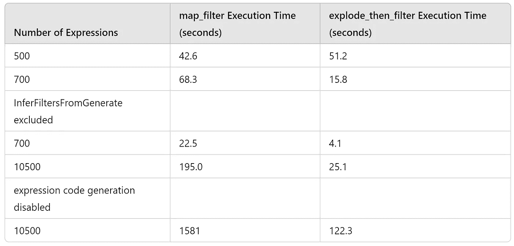
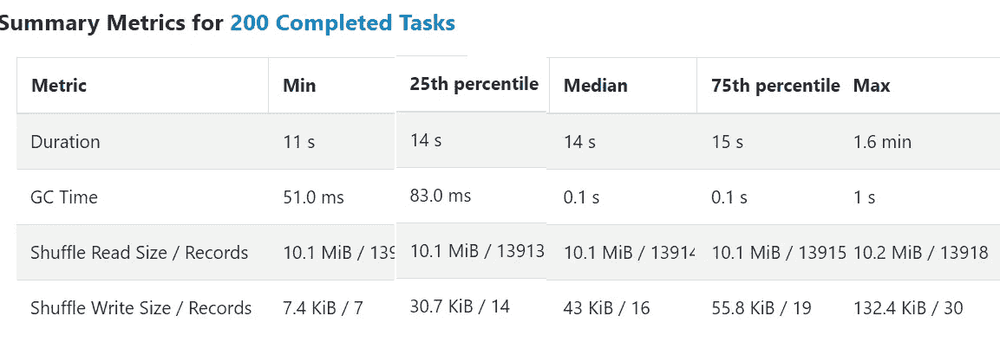
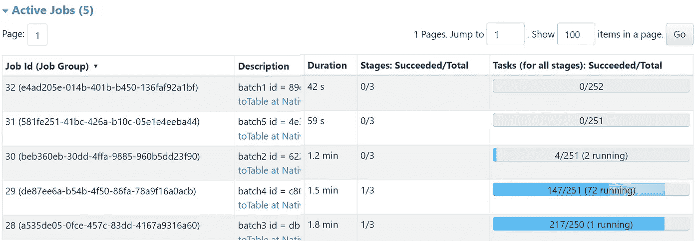

# Spark 流处理中 Sigma 规则检测的性能洞察

> 原文：[`towardsdatascience.com/performance-insights-from-sigma-rule-detections-in-spark-streaming-fac8c67d37b8?source=collection_archive---------3-----------------------#2024-06-01`](https://towardsdatascience.com/performance-insights-from-sigma-rule-detections-in-spark-streaming-fac8c67d37b8?source=collection_archive---------3-----------------------#2024-06-01)

## 在网络安全日志中利用 Sigma 规则进行异常检测：关于性能优化的研究

[](https://medium.com/@jean-claude.cote?source=post_page---byline--fac8c67d37b8--------------------------------)[](https://towardsdatascience.com/?source=post_page---byline--fac8c67d37b8--------------------------------) [Jean-Claude Cote](https://medium.com/@jean-claude.cote?source=post_page---byline--fac8c67d37b8--------------------------------)

·发布于 [Towards Data Science](https://towardsdatascience.com/?source=post_page---byline--fac8c67d37b8--------------------------------) ·14 分钟阅读·2024 年 6 月 1 日

--


图片来源：Ed Vazquez，Unsplash

[加拿大网络安全中心](https://www.cyber.gc.ca/en)（CCCS）的职责之一是尽快检测异常并发布缓解措施。

在将我们的 Sigma 规则检测投入生产时，我们在 Spark 流处理应用程序中发现了一个有趣的现象。运行一个包含 1000 条 Sigma 检测规则的大型 SQL 语句的速度比运行五个单独的查询要慢，每个查询应用 200 条 Sigma 规则。这令人惊讶，因为运行五个查询会迫使 Spark 阅读源数据五次，而不是一次。有关更多细节，请参考我们的系列文章：

[](/anomaly-detection-using-sigma-rules-part-1-leveraging-spark-sql-streaming-246900e95457?source=post_page-----fac8c67d37b8--------------------------------) ## 使用 Sigma 规则进行异常检测（第一部分）：利用 Spark SQL 流处理

### Sigma 规则用于检测网络安全日志中的异常。我们使用 Spark 结构化流处理来评估 Sigma…

towardsdatascience.com

鉴于我们需要执行的大量遥测数据和检测规则，每一点性能提升都能带来显著的成本节省。因此，我们决定调查这个奇特的观察结果，旨在解释它并可能发现额外的性能提升机会。在这个过程中我们学到了一些东西，并希望与更广泛的社区分享。

## **简介**

我们的直觉是，我们达到了 Spark 代码生成的限制。因此，了解一下这个主题的背景是必要的。2014 年，Spark 引入了代码生成来评估形如`(id > 1 and id > 2) and (id < 1000 or (id + id) = 12)`的表达式。Databricks 的一篇文章对此做了很好的解释：[Spark SQL 的激动人心的性能提升即将来临](https://www.databricks.com/blog/2014/06/02/exciting-performance-improvements-on-the-horizon-for-spark-sql.html)

两年后，Spark 引入了全阶段代码生成。这项优化将多个操作符合并成一个单一的 Java 函数。像表达式代码生成一样，全阶段代码生成消除了虚拟函数调用，并利用 CPU 寄存器处理中间数据。然而，它与表达式级别的生成不同，它是应用于操作符级别的。操作符是执行计划中的节点。欲了解更多信息，请阅读[Apache Spark 作为编译器：在笔记本电脑上每秒连接十亿行数据](https://www.databricks.com/blog/2016/05/23/apache-spark-as-a-compiler-joining-a-billion-rows-per-second-on-a-laptop.html)

为了总结这些文章，让我们生成这个简单查询的执行计划：

```py
explain codegen
select
    id,
    (id > 1 and id > 2) and (id < 1000 or (id + id) = 12) as test  
from
    range(0, 10000, 1, 32)
```

在这个简单的查询中，我们使用了两个操作符：Range 用于生成行，Select 用于执行投影。我们可以在查询的物理计划中看到这些操作符。注意节点旁边的星号（*）以及它们相关的`[codegen id : 1]`。这表示这两个操作符通过全阶段代码生成被合并为一个单一的 Java 函数。

```py
|== Physical Plan ==
* Project (2)
+- * Range (1)

(1) Range [codegen id : 1]
Output [1]: [id#36167L]
Arguments: Range (0, 10000, step=1, splits=Some(32))

(2) Project [codegen id : 1]
Output [2]: [id#36167L, (((id#36167L > 1) AND (id#36167L > 2)) AND ((id#36167L < 1000) OR ((id#36167L + id#36167L) = 12))) AS test#36161]
Input [1]: [id#36167L]
```

生成的代码清楚地展示了这两个操作符是如何被合并的。

```py
Generated code:
/* 001 */ public Object generate(Object[] references) {
/* 002 */   return new GeneratedIteratorForCodegenStage1(references);
/* 003 */ }
/* 004 */
/* 005 */ // codegenStageId=1
/* 006 */ final class GeneratedIteratorForCodegenStage1 extends org.apache.spark.sql.execution.BufferedRowIterator {
/* 007 */   private Object[] references;
/* 008 */   private scala.collection.Iterator[] inputs;
/* 009 */   private boolean range_initRange_0;
/* 010 */   private long range_nextIndex_0;
/* 011 */   private TaskContext range_taskContext_0;
/* 012 */   private InputMetrics range_inputMetrics_0;
/* 013 */   private long range_batchEnd_0;
/* 014 */   private long range_numElementsTodo_0;
/* 015 */   private org.apache.spark.sql.catalyst.expressions.codegen.UnsafeRowWriter[] range_mutableStateArray_0 = new org.apache.spark.sql.catalyst.expressions.codegen.UnsafeRowWriter[3];
/* 016 */
/* 017 */   public GeneratedIteratorForCodegenStage1(Object[] references) {
/* 018 */     this.references = references;
/* 019 */   }
/* 020 */
/* 021 */   public void init(int index, scala.collection.Iterator[] inputs) {
/* 022 */     partitionIndex = index;
/* 023 */     this.inputs = inputs;
/* 024 */
/* 025 */     range_taskContext_0 = TaskContext.get();
/* 026 */     range_inputMetrics_0 = range_taskContext_0.taskMetrics().inputMetrics();
/* 027 */     range_mutableStateArray_0[0] = new org.apache.spark.sql.catalyst.expressions.codegen.UnsafeRowWriter(1, 0);
/* 028 */     range_mutableStateArray_0[1] = new org.apache.spark.sql.catalyst.expressions.codegen.UnsafeRowWriter(1, 0);
/* 029 */     range_mutableStateArray_0[2] = new org.apache.spark.sql.catalyst.expressions.codegen.UnsafeRowWriter(2, 0);
/* 030 */
/* 031 */   }
/* 032 */
/* 033 */   private void project_doConsume_0(long project_expr_0_0) throws java.io.IOException {
/* 034 */     // common sub-expressions
/* 035 */
/* 036 */     boolean project_value_4 = false;
/* 037 */     project_value_4 = project_expr_0_0 > 1L;
/* 038 */     boolean project_value_3 = false;
/* 039 */
/* 040 */     if (project_value_4) {
/* 041 */       boolean project_value_7 = false;
/* 042 */       project_value_7 = project_expr_0_0 > 2L;
/* 043 */       project_value_3 = project_value_7;
/* 044 */     }
/* 045 */     boolean project_value_2 = false;
/* 046 */
/* 047 */     if (project_value_3) {
/* 048 */       boolean project_value_11 = false;
/* 049 */       project_value_11 = project_expr_0_0 < 1000L;
/* 050 */       boolean project_value_10 = true;
/* 051 */
/* 052 */       if (!project_value_11) {
/* 053 */         long project_value_15 = -1L;
/* 054 */
/* 055 */         project_value_15 = project_expr_0_0 + project_expr_0_0;
/* 056 */
/* 057 */         boolean project_value_14 = false;
/* 058 */         project_value_14 = project_value_15 == 12L;
/* 059 */         project_value_10 = project_value_14;
/* 060 */       }
/* 061 */       project_value_2 = project_value_10;
/* 062 */     }
/* 063 */     range_mutableStateArray_0[2].reset();
/* 064 */
/* 065 */     range_mutableStateArray_0[2].write(0, project_expr_0_0);
/* 066 */
/* 067 */     range_mutableStateArray_0[2].write(1, project_value_2);
/* 068 */     append((range_mutableStateArray_0[2].getRow()));
/* 069 */
/* 070 */   }
/* 071 */
/* 072 */   private void initRange(int idx) {
/* 073 */     java.math.BigInteger index = java.math.BigInteger.valueOf(idx);
/* 074 */     java.math.BigInteger numSlice = java.math.BigInteger.valueOf(32L);
/* 075 */     java.math.BigInteger numElement = java.math.BigInteger.valueOf(10000L);
/* 076 */     java.math.BigInteger step = java.math.BigInteger.valueOf(1L);
/* 077 */     java.math.BigInteger start = java.math.BigInteger.valueOf(0L);
/* 078 */     long partitionEnd;
/* 079 */
/* 080 */     java.math.BigInteger st = index.multiply(numElement).divide(numSlice).multiply(step).add(start);
/* 081 */     if (st.compareTo(java.math.BigInteger.valueOf(Long.MAX_VALUE)) > 0) {
/* 082 */       range_nextIndex_0 = Long.MAX_VALUE;
/* 083 */     } else if (st.compareTo(java.math.BigInteger.valueOf(Long.MIN_VALUE)) < 0) {
/* 084 */       range_nextIndex_0 = Long.MIN_VALUE;
/* 085 */     } else {
/* 086 */       range_nextIndex_0 = st.longValue();
/* 087 */     }
/* 088 */     range_batchEnd_0 = range_nextIndex_0;
/* 089 */
/* 090 */     java.math.BigInteger end = index.add(java.math.BigInteger.ONE).multiply(numElement).divide(numSlice)
/* 091 */     .multiply(step).add(start);
/* 092 */     if (end.compareTo(java.math.BigInteger.valueOf(Long.MAX_VALUE)) > 0) {
/* 093 */       partitionEnd = Long.MAX_VALUE;
/* 094 */     } else if (end.compareTo(java.math.BigInteger.valueOf(Long.MIN_VALUE)) < 0) {
/* 095 */       partitionEnd = Long.MIN_VALUE;
/* 096 */     } else {
/* 097 */       partitionEnd = end.longValue();
/* 098 */     }
/* 099 */
/* 100 */     java.math.BigInteger startToEnd = java.math.BigInteger.valueOf(partitionEnd).subtract(
/* 101 */       java.math.BigInteger.valueOf(range_nextIndex_0));
/* 102 */     range_numElementsTodo_0  = startToEnd.divide(step).longValue();
/* 103 */     if (range_numElementsTodo_0 < 0) {
/* 104 */       range_numElementsTodo_0 = 0;
/* 105 */     } else if (startToEnd.remainder(step).compareTo(java.math.BigInteger.valueOf(0L)) != 0) {
/* 106 */       range_numElementsTodo_0++;
/* 107 */     }
/* 108 */   }
/* 109 */
/* 110 */   protected void processNext() throws java.io.IOException {
/* 111 */     // initialize Range
/* 112 */     if (!range_initRange_0) {
/* 113 */       range_initRange_0 = true;
/* 114 */       initRange(partitionIndex);
/* 115 */     }
/* 116 */
/* 117 */     while (true) {
/* 118 */       if (range_nextIndex_0 == range_batchEnd_0) {
/* 119 */         long range_nextBatchTodo_0;
/* 120 */         if (range_numElementsTodo_0 > 1000L) {
/* 121 */           range_nextBatchTodo_0 = 1000L;
/* 122 */           range_numElementsTodo_0 -= 1000L;
/* 123 */         } else {
/* 124 */           range_nextBatchTodo_0 = range_numElementsTodo_0;
/* 125 */           range_numElementsTodo_0 = 0;
/* 126 */           if (range_nextBatchTodo_0 == 0) break;
/* 127 */         }
/* 128 */         range_batchEnd_0 += range_nextBatchTodo_0 * 1L;
/* 129 */       }
/* 130 */
/* 131 */       int range_localEnd_0 = (int)((range_batchEnd_0 - range_nextIndex_0) / 1L);
/* 132 */       for (int range_localIdx_0 = 0; range_localIdx_0 < range_localEnd_0; range_localIdx_0++) {
/* 133 */         long range_value_0 = ((long)range_localIdx_0 * 1L) + range_nextIndex_0;
/* 134 */
/* 135 */         project_doConsume_0(range_value_0);
/* 136 */
/* 137 */         if (shouldStop()) {
/* 138 */           range_nextIndex_0 = range_value_0 + 1L;
/* 139 */           ((org.apache.spark.sql.execution.metric.SQLMetric) references[0] /* numOutputRows */).add(range_localIdx_0 + 1);
/* 140 */           range_inputMetrics_0.incRecordsRead(range_localIdx_0 + 1);
/* 141 */           return;
/* 142 */         }
/* 143 */
/* 144 */       }
/* 145 */       range_nextIndex_0 = range_batchEnd_0;
/* 146 */       ((org.apache.spark.sql.execution.metric.SQLMetric) references[0] /* numOutputRows */).add(range_localEnd_0);
/* 147 */       range_inputMetrics_0.incRecordsRead(range_localEnd_0);
/* 148 */       range_taskContext_0.killTaskIfInterrupted();
/* 149 */     }
/* 150 */   }
/* 151 */
/* 152 */ }
```

`project_doConsume_0`函数包含了评估`(id > 1 and id > 2) and (id < 1000 or (id + id) = 12)`的代码。请注意，这段代码是如何被生成来评估这个特定表达式的。这是表达式代码生成的一个示例。

整个类是一个具有`processNext`方法的操作符。这个生成的操作符同时执行投影（Projection）和范围（Range）操作。在第 117 行的 while 循环中，我们可以看到生成行的代码和一个特定的调用（不是虚拟函数）`project_doConsume_0`。这展示了全阶段代码生成（Whole-Stage Code Generation）是如何工作的。

## **性能分析**

现在我们对 Spark 的代码生成有了更好的理解，让我们尝试解释为什么将一个包含 1000 个 Sigma 规则的查询拆分成较小的规则会表现得更好。我们来考虑一个评估两个 Sigma 规则的 SQL 语句。这些规则非常简单：Rule1 匹配 `Imagepath` 以 ‘schtask.exe’ 结尾的事件，Rule2 匹配 `Imagepath` 以 ‘d:’ 开头的事件。

```py
 select /* #3 */
    Imagepath,
    CommandLine,
    PID,
    map_keys(map_filter(results_map, (k,v) -> v = TRUE)) as matching_rules
from (
    select /* #2 */
        *,
        map('rule1', rule1, 'rule2', rule2) as results_map
    from (
        select /* #1 */
            *,
            (lower_Imagepath like '%schtasks.exe') as rule1,
            (lower_Imagepath like 'd:%') as rule2
        from (
            select 
                lower(PID) as lower_PID,
                lower(CommandLine) as lower_CommandLine,
                lower(Imagepath) as lower_Imagepath,
                *
            from (
                select
                    uuid() as PID,
                    uuid() as CommandLine,
                    uuid() as Imagepath,
                    id 
                from
                    range(0, 10000, 1, 32)
            )
        )
    )
)
```

标记为 #1 的选择执行检测，并将结果存储在名为 rule1 和 rule2 的新列中。选择 #2 将这些列重新组合到一个名为 `results_map` 的单一列中，最后选择 #3 将映射转换为一个匹配规则的数组。它使用 `map_filter` 仅保留实际匹配的规则条目，然后使用 `map_keys` 将映射条目转换为匹配规则名称的列表。

让我们打印出这个查询的 Spark 执行计划：

```py
 == Physical Plan ==
Project (4)
+- * Project (3)
   +- * Project (2)
      +- * Range (1)

...

(4) Project
Output [4]: [Imagepath#2, CommandLine#1, PID#0, map_keys(map_filter(map(rule1, EndsWith(lower_Imagepath#5, schtasks.exe), rule2, StartsWith(lower_Imagepath#5, d:)), lambdafunction(lambda v#12, lambda k#11, lambda v#12, false))) AS matching_rules#9]
Input [4]: [lower_Imagepath#5, PID#0, CommandLine#1, Imagepath#2]
```

请注意，节点 Project (4) 不是由代码生成的。节点 4 包含一个 lambda 函数，它是否阻止了整个阶段的代码生成？稍后会详细讨论这个问题。

这个查询并不是我们想要的。我们希望生成一个事件表，并且有一列显示匹配的规则。如下所示：

```py
+--------------------+--------------------+--------------------+--------------+
|           Imagepath|         CommandLine|                 PID|  matched_rule|
+--------------------+--------------------+--------------------+--------------+
|09401675-dc09-4d0...|6b8759ee-b55a-486...|44dbd1ec-b4e0-488...|         rule1|
|e2b4a0fd-7b88-417...|46dd084d-f5b0-4d7...|60111cf8-069e-4b8...|         rule1|
|1843ee7a-a908-400...|d1105cec-05ef-4ee...|6046509a-191d-432...|         rule2|
+--------------------+--------------------+--------------------+--------------+
```

这很简单。我们只需要展开 `matching_rules` 列。

```py
 select
    Imagepath,
    CommandLine,
    PID,
    matched_rule
from (
    select
        *,
        explode(matching_rules) as matched_rule
    from (
        /* original statement */
    )
)
```

这会产生两个额外的操作符：Generate (6) 和 Project (7)。然而，还有一个新的 Filter (3)。

```py
== Physical Plan ==
* Project (7)
+- * Generate (6)
   +- Project (5)
      +- * Project (4)
         +- Filter (3)
            +- * Project (2)
               +- * Range (1)

...

(3) Filter
Input [3]: [PID#34, CommandLine#35, Imagepath#36]
Condition : (size(map_keys(map_filter(map(rule1, EndsWith(lower(Imagepath#36),
 schtasks.exe), rule2, StartsWith(lower(Imagepath#36), d:)), 
lambdafunction(lambda v#47, lambda k#46, lambda v#47, false))), true) > 0)
...

(6) Generate [codegen id : 3]
Input [4]: [PID#34, CommandLine#35, Imagepath#36, matching_rules#43]
Arguments: explode(matching_rules#43), [PID#34, CommandLine#35, Imagepath#36], false, [matched_rule#48]

(7) Project [codegen id : 3]
Output [4]: [Imagepath#36, CommandLine#35, PID#34, matched_rule#48]
Input [4]: [PID#34, CommandLine#35, Imagepath#36, matched_rule#48]
```

`explode` 函数会为数组中的每个元素生成一行。当数组为空时，`explode` 不会生成任何行，实际上过滤掉了那些数组为空的行。

Spark 有一个优化规则，用于检测 `explode` 函数，并产生这个额外的条件。该过滤器是 Spark 尝试尽可能短路处理的做法。这个规则的源代码，名为 `org.apache.spark.sql.catalyst.optimizer.InferFiltersFromGenerate`，是这样解释的：

> 从 Generate 推断过滤器，以便可以在连接和数据源之前，提前移除本该被此 Generate 移除的行。

有关 Spark 如何优化执行计划的更多细节，请参阅 David Vrba 的文章 Mastering Query Plans in Spark 3.0。

另一个问题出现了：我们是否从这个额外的过滤器中受益？注意，这个额外的过滤器同样没有被整个阶段的代码生成，可能是因为 lambda 函数的原因。让我们尝试表达相同的查询，但不使用 lambda 函数。

另外，我们可以将规则结果放入映射中，展开映射，并过滤掉不需要的行，从而绕过 `map_filter`。

```py
 select
    Imagepath,
    CommandLine,
    PID,
    matched_rule
from (
    select
        *
    from (
        select
            *,
            explode(results_map) as (matched_rule, matched_result)
        from (
            /* original statement */
        )
    )
    where
        matched_result = TRUE
)
```

选择 #3 操作将映射展开成两个新列。`matched_rule` 列将保存键，表示规则名称，而 `matched_result` 列将包含检测测试的结果。为了过滤行，我们只保留 `matched_result` 为正的行。

物理计划表明，所有节点都被整个阶段的代码生成，合并成一个 Java 函数，这非常有前景。

```py
 == Physical Plan ==
* Project (8)
+- * Filter (7)
   +- * Generate (6)
      +- * Project (5)
         +- * Project (4)
            +- * Filter (3)
               +- * Project (2)
                  +- * Range (1)
```

让我们进行一些测试，以比较使用 `map_filter` 和使用 explode 然后 filter 的查询性能。

我们在一台配备 4 个 CPU 的机器上运行了这些测试。我们生成了 100 万行数据，每行包含 100 条规则，每条规则评估 5 个表达式。这些测试共运行了 5 次。

平均而言

+   map_filter 耗时 42.6 秒

+   explode_then_filter 耗时 51.2 秒

所以，map_filter 略微更快，尽管它没有使用 WholeStageCodeGen。

然而，在我们的生产查询中，我们执行了更多的 Sigma 规则——共计 1000 条规则。这包括 29 个正则表达式，529 个等号，115 个以“开始”为前缀，2352 个以“结束”为后缀的表达式，以及 5838 个包含表达式。让我们再次测试查询，但这次我们将每条规则的表达式数量从 5 增加到 7。当这样做时，我们在日志中遇到了以下错误：

```py
Caused by: org.codehaus.commons.compiler.InternalCompilerException: Code grows beyond 64 KB
```

我们尝试增加了`spakr.sql.codegen.maxFields`和`spark.sql.codegen.hugeMethodLimit`，但从根本上讲，Java 类的函数大小限制为 64 KB。此外，JVM JIT 编译器限制其只能编译小于 8 KB 的函数。

然而，查询仍然能够正常运行，因为 Spark 会在某些执行计划的部分回退到火山执行模型（Volcano execution model）。毕竟，WholeStageCodeGen 只是一个优化。

运行与之前相同的测试，但每条规则使用 7 个表达式而不是 5 个时，explode_then_filter 比 map_filter 快得多。

+   map_filter 耗时 68.3 秒

+   explode_then_filter 耗时 15.8 秒

增加表达式数量导致 explode_then_filter 的部分代码不再进行 WholeStageCodeGen 优化。特别是，由规则 `org.apache.spark.sql.catalyst.optimizer.InferFiltersFromGenerate` 引入的 Filter 操作符过大，无法包含在 WholeStageCodeGen 中。让我们看看如果排除 InferFiltersFromGenerate 规则会发生什么：

```py
spark.sql("SET spark.sql.optimizer.excludedRules=org.apache.spark.sql.catalyst.optimizer.InferFiltersFromGenerate")
```

正如预期的那样，两个查询的物理计划中都不再有额外的 Filter 操作符。

```py
 == Physical Plan ==
* Project (6)
+- * Generate (5)
   +- Project (4)
      +- * Project (3)
         +- * Project (2)
            +- * Range (1)

== Physical Plan ==
* Project (7)
+- * Filter (6)
   +- * Generate (5)
      +- * Project (4)
         +- * Project (3)
            +- * Project (2)
               +- * Range (1)
```

移除规则确实对性能产生了显著影响：

+   map_filter 耗时 22.49 秒

+   explode_then_filter 耗时 4.08 秒

这两个查询在移除规则后都受益匪浅。鉴于性能的改善，我们决定将 Sigma 规则的数量增加到 500，并将复杂度提高到 21 个表达式：

结果：

+   map_filter 耗时 195.0 秒

+   explode_then_filter 耗时 25.09 秒

尽管复杂性增加了，但两个查询仍然能提供相当不错的性能，其中 explode_then_filter 显著优于 map_filter。

探讨 Spark 所采用的不同代码生成方式是很有趣的。尽管我们目前可能没有从 WholeStageCodeGen 中获益，但我们仍然可以从表达式生成中获得优势。

表达式生成不受与整体代码生成相同的限制。非常大的表达式树可以被拆分成更小的树，Spark 的 `spark.sql.codegen.methodSplitThreshold` 控制如何拆分这些树。虽然我们尝试了这一属性，但并没有观察到显著的改进。默认设置似乎已足够令人满意。

Spark 提供了一个名为 `spark.sql.codegen.factoryMode` 的调试属性，可以设置为 FALLBACK、CODEGEN_ONLY 或 NO_CODEGEN。我们可以通过设置 `spark.sql.codegen.factoryMode=NO_CODEGEN` 来关闭表达式代码生成，这会导致性能急剧下降：

使用 500 条规则和 21 个表达式：

+   map_filter 花费了 1581 秒

+   explode_then_filter 花费了 122.31 秒。

即使并非所有操作符都参与整体代码生成，我们仍然观察到表达式代码生成带来了显著的好处。

## 结果



图片由作者提供

在我们的最佳案例中，评估 10,500 个表达式所需的时间为 25.1 秒，处理 100 万行数据时，我们实现了每个 CPU 每秒处理 1.04 亿个表达式的非常可观的速度。

本研究的启示是，在评估大量表达式时，我们通过将使用 `map_filter` 的查询转换为使用先 explode 后 filter 的方法可以获得好处。此外，`org.apache.spark.sql.catalyst.optimizer.InferFiltersFromGenerate` 规则在我们的使用案例中似乎并不有利，因此我们应该将该规则从查询中排除。

## 它解释了我们最初的观察结果吗？

在生产工作中实施这些经验教训带来了显著的好处。然而，即使在进行了这些优化后，将大型查询拆分为多个较小查询仍然提供了优势。经过进一步调查，我们发现这不仅仅是由于代码生成，实际上有一个更简单的解释。

Spark 流处理通过运行微批次直到完成，然后在开始新的微批次之前检查点其进度来工作。

在每个微批次中，Spark 必须完成所有任务，通常是 200 个。然而，并非所有任务的难度相同。Spark 采用轮询策略将行分配给这些任务。因此，某些任务可能会包含大属性的事件，例如非常大的命令行，导致某些任务快速完成，而其他任务则需要更长时间。例如，这里展示了微批任务执行时间的分布。中位数任务时间为 14 秒。然而，最慢的任务竟然需要 1.6 分钟！



图片由作者提供

这确实揭示了一个不同的现象。每个微批中，Spark 会等待一些滞后任务，这导致许多 CPU 空闲，这也解释了为什么将大型查询拆分为多个较小的查询会导致整体性能更快。

这张图展示了 5 个较小的查询在同一个 Spark 应用中并行运行。Batch3 在等待一个拖慢的任务，而其他查询继续进展。



图片由作者提供

在这些等待期间，Spark 可以利用空闲的 CPU 来处理其他查询，从而最大化资源利用率和整体吞吐量。

## 结论

在本文中，我们概述了 Spark 的代码生成过程，并讨论了内置优化可能并不总是产生理想的结果。此外，我们展示了将查询从使用 lambda 函数重构为使用简单的 explode 操作后，性能得到了提升。最后，我们得出结论，尽管拆分大查询确实提升了性能，但推动这些提升的主要因素是执行拓扑结构，而非查询本身。
