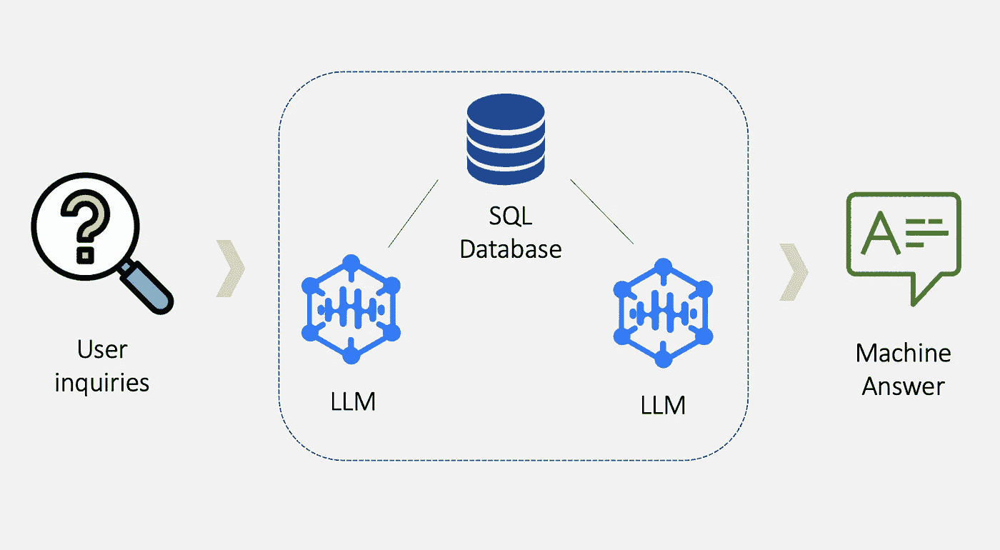
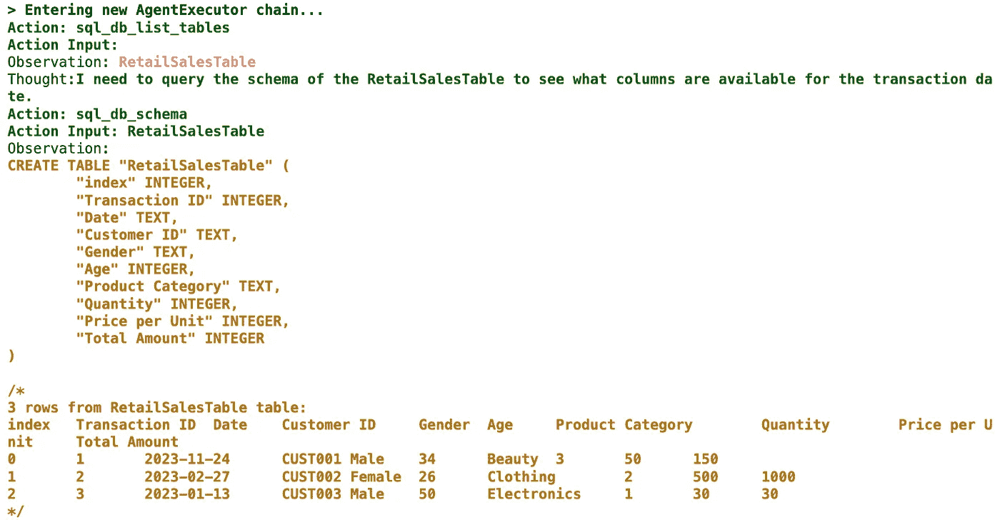
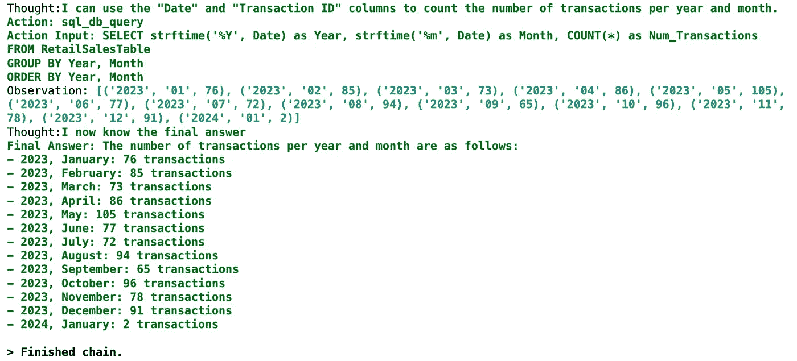
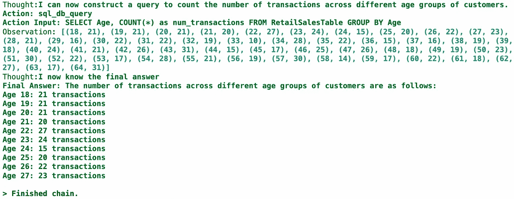
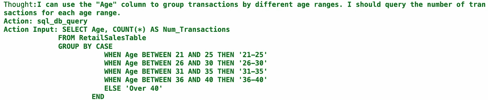
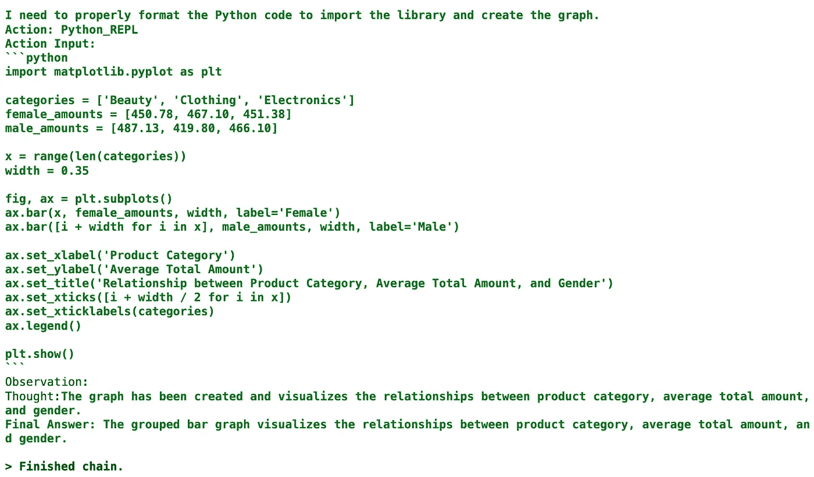
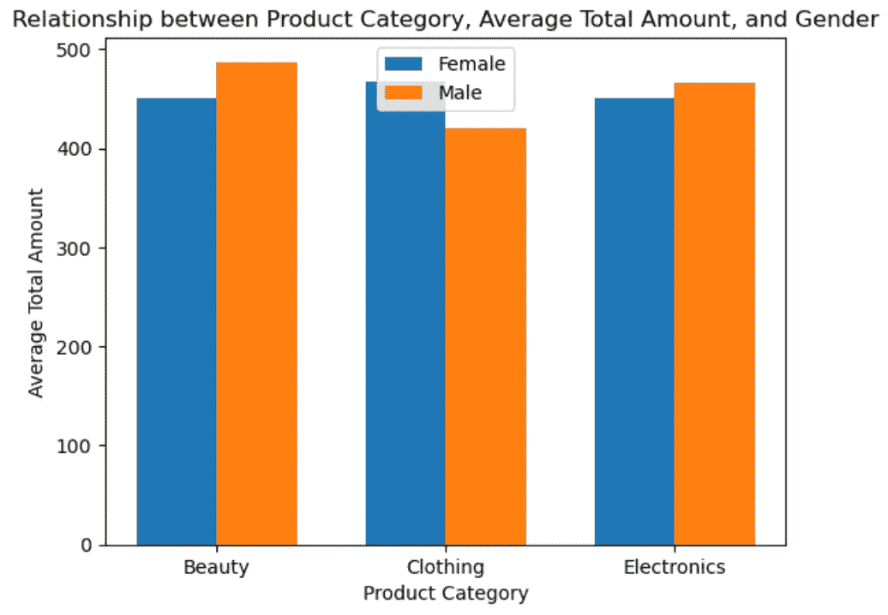
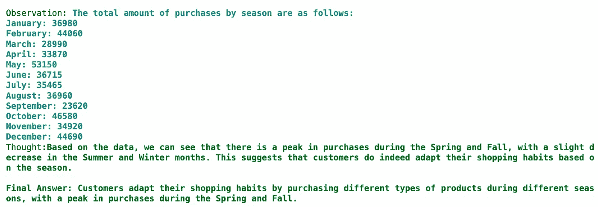
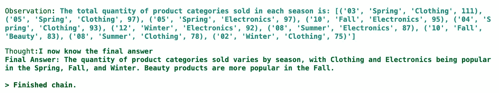

# 使用 LangChain 和 LLM 进行客户分析

> 原文：[`towardsdatascience.com/performing-customer-analytics-with-langchain-and-llms-0af4ea38f7b5?source=collection_archive---------6-----------------------#2024-02-13`](https://towardsdatascience.com/performing-customer-analytics-with-langchain-and-llms-0af4ea38f7b5?source=collection_archive---------6-----------------------#2024-02-13)

## 发现 LangChain 在统计计算、洞察生成、可视化以及为客户分析进行对话中的潜力与限制——包括实现代码

[](https://medium.com/@johnleungTJ?source=post_page---byline--0af4ea38f7b5--------------------------------)[](https://towardsdatascience.com/?source=post_page---byline--0af4ea38f7b5--------------------------------) [John Leung](https://medium.com/@johnleungTJ?source=post_page---byline--0af4ea38f7b5--------------------------------)

·发布于[Towards Data Science](https://towardsdatascience.com/?source=post_page---byline--0af4ea38f7b5--------------------------------) ·阅读时长 11 分钟·2024 年 2 月 13 日

--

许多企业拥有大量存储在数据库中的专有数据。然而，这些数据复杂且难以被用户接触，因此他们常常难以识别趋势并提取可操作的洞察。这就是商业智能（BI）仪表盘发挥重要作用的地方，它是用户与数据汇总视图互动的起点。

## BI 仪表盘的瓶颈

一个有效的 BI 仪表盘[/how-to-build-effective-and-useful-dashboards-711759534639]应该只包含对目标受众相关的信息，避免将杂乱的视觉元素堆砌在一起。但这并不能很好地解决一个挑战。有时候，用户可能突然有了额外的查询，或者希望探索仪表盘上没有显示的新分析视角。如果他们没有任何技术背景，无法动态调整可视化的底层逻辑，那么仪表盘可能无法满足他们的需求。


图片由[Emily Morter](https://unsplash.com/@emilymorter?utm_source=medium&utm_medium=referral)提供，来源于[Unsplash](https://unsplash.com/?utm_source=medium&utm_medium=referral)

最近的框架[LangChain](https://www.langchain.com/)通过其先进的语言处理能力，降低了与数据交互的技术门槛，从而为企业提供了潜在的新机遇。让我们来探讨一下它的基本工作原理。

## LangChain 的工作原理

大语言模型（LLMs），如 ChatGPT 和 Llama，具有强大的语言理解和文本生成能力。作为一个开源库，LangChain 将 LLMs 集成到应用程序中。它提供了多个模块，以便高效交互和简化工作流，例如：

+   [**文档加载器:**](https://python.langchain.com/docs/modules/data_connection/document_loaders/) 促进从各种来源加载数据，包括 CSV 文件、SQL 数据库和公共数据集（如 Wikipedia）。

+   [**代理:**](https://python.langchain.com/docs/modules/agents/) 使用语言模型作为推理引擎，决定采取哪些行动以及行动的顺序。它通过不断循环思考-行动-观察，直到任务完成。

+   [**链:**](https://python.langchain.com/docs/modules/chains) 与代理不同，链由预定的动作序列组成，这些序列是硬编码的。它通过引导多个工具执行高级指令来解决复杂和明确的任务。

+   [**记忆**:](https://python.langchain.com/docs/modules/memory/) 目前的测试版支持访问过去消息的窗口，这为应用程序提供了对话接口。

以这些模块为基础，我们将开始编写一个简单的应用程序，利用大语言模型（LLM）。在这个实践过程中，我们将扮演商业用户的角色，尝试通过输入自然语言查询来进行探索性数据分析。



LLM 驱动的应用程序工作流程（图片来自作者）

假设你计划为一家零售店进行客户分析，因此你收集了过去 12 个月的销售数据。你的目标是更好地了解客户的不同方面，如人口统计、消费行为和产品类别。

从 Kaggle 获得的[数据集](https://www.kaggle.com/datasets/mohammadtalib786/retail-sales-dataset/data)，其许可证为[CC0: 公共领域](https://creativecommons.org/publicdomain/zero/1.0/)，包含多个字段，包括交易 ID、交易日期、客户 ID、性别、年龄、产品类别、购买的产品单位数、单价以及交易的总金额。我们可以开始分析了。

## 初始设置

我们需要正确设置环境和配置，才能在 Python 中使用 LangChain。

1.  配置 Python 环境，并安装 LangChain 库以及其他必要的依赖项，如[SQLite](https://docs.python.org/3/library/sqlite3.html)和 Pandas

1.  [配置 OpenAI 密钥](https://platform.openai.com/docs/quickstart?context=python)以查询 GPT 模型

1.  将 CSV 文件‘retail_sales_dataset.csv’导入 SQLite 数据库中的表格

```py
# Import necessary libraries and modules
from langchain.chat_models import ChatOpenAI
import sqlite3
import pandas as pd

# Set the OpenAI API key
OPENAI_API_KEY = "<OpenAI API key>"

# Initialize the Langchain ChatOpenAI model
llm = ChatOpenAI(openai_api_key=OPENAI_API_KEY, model_name="gpt-3.5-turbo-1106")

# Connect to the SQLite database
connection = sqlite3.connect("customer.db")

# Convert DataFrame to a SQLite table named "RetailSalesTable"
df.to_sql("RetailSalesTable", connection, if_exists='replace')
```

## 创建一个 LangChain 应用程序

## #1 生成基础统计数据

> 每年每月的交易数量是多少**？

要查询与销售 SQL 表相关的基本统计数据，我们使用`create_sql_agent`代理助手。两个参数`verbose`和`return_intermediate_steps`都设置为 True，以便在执行过程中显示内部状态和步骤。这将帮助我们迭代评估并优化与代理的沟通方式。

```py
# Import necessary libraries and modules
from langchain.agents import create_sql_agent
from langchain.agents.agent_toolkits import SQLDatabaseToolkit
from langchain.agents.agent_types import AgentType
from langchain.sql_database import SQLDatabase

# Create an instance of SQLDatabase using the 'customer.db' SQLite database
db = SQLDatabase.from_uri('sqlite:///customer.db')

# Create an SQL agent executor with specified parameters
agent_executor = create_sql_agent(
    llm=llm,
    toolkit=SQLDatabaseToolkit(db=db, llm=llm),
    agent_type=AgentType.ZERO_SHOT_REACT_DESCRIPTION,
    handle_parsing_errors=True,
    verbose=True,
    return_intermediate_steps=True
)

# Define user input
user_inquiry = "What is the number of transactions per year and month?"

# Run the agent to generate a response
agent_executor.run(user_inquiry)
```

输出的完整内容如下所示。



代理的输出步骤——基础统计（1/2）（图由作者提供）



代理的输出步骤——基础统计（2/2）（图由作者提供）

代理编写了查询，包括纠正“日期”列的格式并生成正确的结果。它成功展示了从 2023 年 1 月到 2024 年 1 月的交易次数分解。

## #2 执行特征工程

> 不同**年龄组**客户的交易数量是多少？

这一次，我们稍微修改了查询，重点关注“年龄组”维度。这旨在评估代理生成不直接来自数据集的新特征的能力。应用类似的概念，您还可以探索按工作日/周末分类的交易日期、购买频率等维度的统计信息。



代理输出步骤的一部分——特征工程（图由作者提供）

代理尝试编写查询，但不幸的是给出了错误的答案。看起来代理过于简化了“年龄组”这一概念，因此没有将其归类为一个独立的维度，而只是将其视为“年龄”。

**改进：使用带背景信息的提示模板**

当我们发现模型误解了我们的意图，或者缺乏某些知识时，可以使用类`PromptTemplate`为语言模型创建参数化的[提示](https://python.langchain.com/docs/modules/model_io/prompts/)。在这种情况下，我在显示用户查询之前补充了有关客户分析中额外特征的示例背景信息。这样做旨在为模型提供更清晰的指南，并传达我们的人工意图，以生成适当的机器生成响应。

```py
from langchain_core.prompts import PromptTemplate

# Create the prompt template
template = PromptTemplate(
    input_variables=["user_inquiry", "background_info"],
    template="""{background_info}
    Question: {user_inquiry}
    """
)

# Define the background information
background_info = """
As the customer analyst, my role is to analyze the transaction patterns of customers. The feature engineering in table 'RetailSalesTable' is crucial for statistical exploration. For example:
- column 'Age' can be grouped into bins of age ranges, such as 21-25, 26-30, and so on.
Understanding the data in these columns helps us gain insights about our customers, enabling us to offer personalized services and develop effective marketing strategies.
"""

# Define user input
user_inquiry = "What is the number of transactions across different age ranges of customers?"

# Run the agent with the formatted template
agent_executor.run(template.format(background_info=background_info, user_inquiry=user_inquiry))
```

以下是相应输出的关键亮点。



代理的改进输出——特征工程（图由作者提供）

在提示的帮助下，代理现在成功地将交易分类到多个年龄组中。值得一提的是，可能还有其他方式实现相同目标，例如使用少量示例来演示问答对。

## #3 为多维特征绘制图表

我们使用`create_sql_agent`代理计算基本统计数据并生成洞察。通过提示设计的艺术，代理能够执行任务。为了支持提出 SQL 查询无法独立完成的新问题，我们需要开发我们的[自定义工具](https://python.langchain.com/docs/modules/agents/tools/custom_tools)。

> 显示一个**分组条形图**，可视化以下问题的答案：产品类别、平均总金额和性别之间的关系是什么？

在这个例子中，查询涉及数据探索和可视化。我们将基于`create_sql_agent`创建我们的代理，并添加工具`PythonREPLTool`以执行 Python 命令，如使用`Matplotlib`进行可视化。

让我们看看这些工具在实践中的实现。

```py
from langchain import LLMChain
from langchain.agents import (AgentExecutor, Tool, ZeroShotAgent)
from langchain_experimental.tools import PythonREPLTool

# Define a description to suggest how to determine the choice of tool
description = (
    "Useful when you require to answer analytical questions about customers. "
    "Use this more than the Python REPL tool if the question is about customer analytics,"
    "like 'How many customers are there?' or 'count the number of transactions by age group'. "
    "Try not to use clause in the SQL."
)

# Create a Tool object for customer data with the previously defined agent executor 'create_sql_agent' and description
customer_data_tool = Tool(
    name="Customer",
    func=agent_executor.run,
    description=description,
)

# Create the whole list of tools
tools = [PythonREPLTool()]
tools.append(customer_data_tool)

# Define the prefix and suffix for the prompt
prefix = "Below are tools that you can access:"
suffix = (
    "Pass the relevant part of the request directly to the Customer tool.\n\n"
    "Request: {input}\n"
    "{agent_scratchpad}"
)

# Create the prompt using ZeroShotAgent
# Use agent_scratchpad to store the actions previously used, guiding the subsequent responses.
agent_prompt = ZeroShotAgent.create_prompt(
    tools, prefix=prefix, suffix=suffix, input_variables=["input", "agent_scratchpad"]
)

# Create an instance of ZeroShotAgent with the LLMChain and the allowed tool names
zero_shot_agent = ZeroShotAgent(
    llm_chain=LLMChain(llm=llm, prompt=agent_prompt),
    allowed_tools=[tool.name for tool in tools]
)

# Create an AgentExecutor which enables verbose mode and handling parsing errors
agent_executor = AgentExecutor.from_agent_and_tools(
    agent=zero_shot_agent, tools=tools, verbose=True, handle_parsing_errors=True
)

# Define user input
user_inquiry = "Use a grouped bar graph to visualize the result of the following inquiry: " \
          "What are the relationships between product category, average total amount, and gender?"

# Run the agent to generate a response
agent_executor.run(user_inquiry)
```

SQL 代理输出的流程与我们之前讲解的例子相似，因此在此省略。接下来的 Python REPL 工具的输出如下所示。



代理的输出 — 绘图（1/2）（图片由作者提供）



代理的输出 — 绘图（2/2）（图片由作者提供）

自定义工具组合成功地将自然语言查询转化为 SQL 查询。然后，汇总的查询结果用于生成分组条形图，通过 x 轴、y 轴和图例清晰有效地展示关系。

尽管整体设计和执行过程看起来顺利，但当前设计确实存在一些限制。例如，假设我们想要生成一个包含大多数交易数据点的散点图，那么执行过程应该生成一个长查询输出，涵盖所有相关信息。然而，代理的输出可能并不理想，因为代理偶尔会使用`LIMIT`子句（该子句限制元组的数量），或者查询结果超出最大令牌限制（在我们的案例中为 4096 个令牌）。因此，生成的可视化种类可能会受到限制。

## #4 进行连贯对话

实际上，业务用户在收到客户分析结果后通常会有后续问题。为了解决这些情况，我们需要增强现有的基本 LLM 应用，使其更具对话性。我们添加了内存缓冲区以保留过去的互动，使 LLM 能够生成针对当前对话上下文的响应。这通过不断存储 LLM 输出并在生成响应前引用内存存储来实现。

> 初始问题：顾客在不同季节如何调整他们的购物习惯？
> 
> 后续问题：您能详细说明一下吗？

我们补充并修正了以下自定义工具组合：

```py
from langchain.memory import ConversationBufferMemory

# Skipped here - Define your own prefix, suffix, and description with "chat_history" for the prompt
# Keep the original list of tools

# Create the prompt using ZeroShotAgent with additonal "chat_history" as input variables
agent_prompt = ZeroShotAgent.create_prompt(
    tools, prefix=prefix, suffix=suffix, input_variables=["input", "chat_history", "agent_scratchpad"],
)

# Create an instance of ZeroShotAgent with the LLMChain and the allowed tool names
zero_shot_agent = ZeroShotAgent(
    llm_chain=LLMChain(llm=llm, prompt=agent_prompt),
    allowed_tools=[tool.name for tool in tools]
)

# Initiate memory which allows for storing and extracting messages
memory = ConversationBufferMemory(memory_key="chat_history")

# Create an AgentExecutor with memory parameter
agent_chain = AgentExecutor.from_agent_and_tools(
    agent=zero_shot_agent, tools=tools, verbose=True, handle_parsing_errors=True, memory=memory
)

# Define initial question as user input
user_inquiry = "How do customers adapt their shopping habits during different seasons?"

# Run the agent to generate a response
agent_executor.run(user_inquiry)

# Define follow-up question as user input
user_inquiry = "Can you elaborate more?"

# Run the agent to generate another response
agent_executor.run(user_inquiry)
```

代理的回答：



代理的输出 — 初始问题（1/2）（图片由作者提供）



代理的输出 —— 后续问题（2/2）（图片由作者提供）

在后续问题“你能详细说明一下吗？”中，我们故意没有提供任何提示/关键词来引导提问，但该代理展示了其在继续分析不同季节的购物习惯方面的能力。这表明使用内存的有效性，并通过提供跨产品类别和季节的更深入描述展示了其优势。

## 总结

我们进行了实验，探索了 LangChain 在基于 LLM 开发客户分析应用中的关键功能和潜在方法：

+   通过使用`create_sql_agent`代理查询数据库并获取相关的统计信息来计算统计数据。

+   洞察生成，通过应用提示模板来定义关键数据特征。

+   可视化，通过使用自定义代理和工具`PythonREPLTool`的组合。

+   会话功能，通过添加内存缓冲区来存储和检索聊天历史。

自然语言查询中的措辞选择通常与数据库模式中的措辞不完全一致。观察发现，LangChain 执行器有时不能按预期工作，甚至可能会[hypothesize](https://www.pinecone.io/learn/series/langchain/langchain-retrieval-augmentation/)，特别是在识别数据关系以生成图表时。因此，代码开发需要反复调试。虽然 LangChain 框架在处理多样化的客户分析任务时可能仅能提供有限的可靠性和效果，但当用户有迫切需求从传统分析仪表板之外发现洞察时，它仍然能提供一些边际优势。

这个应用程序的设计只是初步阶段，还有更多的可能性等待发掘。例如，客户数据有时以文本格式存在，如客户评论或产品描述。LangChain 提供了[tagging function](https://python.langchain.com/docs/use_cases/tagging)，我们可以通过标注情感、语言、风格等，进行全面分析。

## 在你离开之前

如果你喜欢这篇文章，邀请你关注我的[Medium 页面](https://medium.com/@johnleungTJ)和[LinkedIn 页面](https://www.linkedin.com/in/john-leung-639800115/)。这样，你可以保持对数据科学副项目、机器学习运维（MLOps）演示和项目管理方法论相关精彩内容的更新。

[](/managing-the-technical-debts-of-machine-learning-systems-5b85d420ab9d?source=post_page-----0af4ea38f7b5--------------------------------) ## 管理机器学习系统的技术债务

### 探索通过实现代码可持续减轻快速交付成本的实践

towardsdatascience.com [](/monitoring-machine-learning-models-in-production-why-and-how-13d07a5ff0c6?source=post_page-----0af4ea38f7b5--------------------------------) ## 在生产环境中监控机器学习模型：为何以及如何？

### 我们的模型在不断变化的世界中如何受到影响？这是一篇聚焦于漂移示例的分析，并实现了基于 Python 的…

towardsdatascience.com
