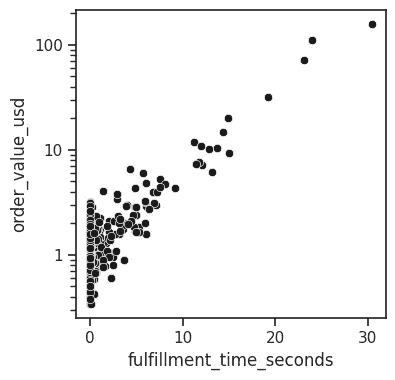
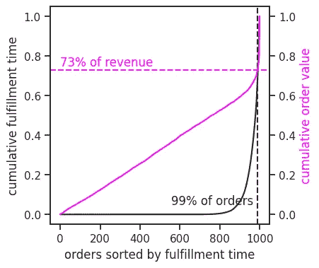

# 追求 p99 的危险

> 原文：[`towardsdatascience.com/perils-of-chasing-p99-578caefa9694?source=collection_archive---------10-----------------------#2024-06-05`](https://towardsdatascience.com/perils-of-chasing-p99-578caefa9694?source=collection_archive---------10-----------------------#2024-06-05)

## 隐藏的相关性可能误导优化策略

[](https://kkrao.medium.com/?source=post_page---byline--578caefa9694--------------------------------)[](https://towardsdatascience.com/?source=post_page---byline--578caefa9694--------------------------------) [Krishna Rao](https://kkrao.medium.com/?source=post_page---byline--578caefa9694--------------------------------)

·发表于[Towards Data Science](https://towardsdatascience.com/?source=post_page---byline--578caefa9694--------------------------------) ·阅读时间：5 分钟·2024 年 6 月 5 日

--


图片来源：[Chun Kit Soo](https://unsplash.com/@soochunkit?utm_source=medium&utm_medium=referral) 通过[Unsplash](https://unsplash.com/?utm_source=medium&utm_medium=referral)

p99，即 99%的观察值落在其下的值，在各行业中广泛用于跟踪和优化最差情况性能。例如，页面加载时间、购物订单的完成时间或货物配送时间都可以通过跟踪 p99 来优化。

虽然 p99 无疑具有价值，但我们必须认识到，它忽略了最顶部的 1%观察值，而这些值在与其他关键业务指标相关时，可能会产生出乎意料的大影响。如果盲目追求 p99 而不检查这些相关性，可能会破坏其他业务目标。

在本文中，我们将通过一个包含虚拟数据的例子分析 p99 的局限性，了解何时应依赖 p99，并探索替代的指标。

# 相关性难题

假设有一个电子商务平台，团队的任务是优化购物车结账体验。团队收到顾客的反馈，称结账速度相比其他平台较慢。因此，团队抓取了最新的 1,000 个结账数据并分析了结账所需的时间。（我为此创建了一些虚拟数据，你可以自由使用并进行修改）

```py
import pandas as pd
import matplotlib.pyplot as plt
import seaborn as sns
sns.set(style="ticks", font_scale = 1)
order_time = pd.read_csv('https://gist.githubusercontent.com/kkraoj/77bd8332e3155ed42a2a031ce63d8903/raw/458a67d3ebe5b649ec030b8cd21a8300d8952b2c/order_time.csv')
fig, ax = plt.subplots(figsize=(4,2))
sns.histplot(data = order_time, x = 'fulfillment_time_seconds', bins = 40, color = 'k', ax = ax)
print(f'p99 for fulfillment_time_seconds: {order_time.fulfillment_time_seconds.quantile(0.99):0.2f} s')
```


订单结账时间的分布。图像来源：作者。

正如预期，大多数购物车结账似乎在几秒钟内完成。99%的结账都发生在 12.1 秒内。换句话说，p99 是 12.1 秒。有一些长尾案例需要 30 秒才能完成。由于这些案例非常少，它们可能是异常值，可以安全忽略，对吧？

现在，如果我们不暂停并分析最后一句话的含义，可能会非常危险。**忽视前 1%真的安全吗？**我们确定结账时间与其他业务指标没有相关性吗？

假设我们的电商公司也关注总商品交易额（GMV），并且有一个整体的公司级目标是增加 GMV。在忽略前 1%之前，我们应该立即检查结账时间是否与 GMV 相关。

```py
from matplotlib.ticker import ScalarFormatter
order_value = pd.read_csv('https://gist.githubusercontent.com/kkraoj/df53cac7965e340356d6d8c0ce24cd2d/raw/8f4a30db82611a4a38a90098f924300fd56ec6ca/order_value.csv')
df = pd.merge(order_time, order_value, on='order_id')
fig, ax = plt.subplots(figsize=(4,4))  
sns.scatterplot(data=df, x="fulfillment_time_seconds", y="order_value_usd", color = 'k')
plt.yscale('log')
ax.yaxis.set_major_formatter(ScalarFormatter())
```



订单价值与履行时间的关系。图像由作者提供。

哦，天哪！不仅购物车价值与结账时间相关，而且结账时间越长，价值增加得越快。忽视结账时间前 1%的代价是什么？

```py
pct_revenue_ignored = order_value.loc[order_time.fulfillment_time_seconds>order_time.fulfillment_time_seconds.quantile(0.99), 'order_value_usd'].sum()/order_value.order_value_usd.sum()*100
print(f'If we only focussed on p99, we would ignore {pct_revenue_ignored:0.0f}% of revenue')
## >>> If we only focussed on p99, we would ignore 27% of revenue
```

如果我们只关注 p99，我们将忽视 27%的收入（这比我们认为忽视的 1%高出 27 倍）。**也就是说，结账时间的 p99 相当于收入的 p73。**在这种情况下，专注于 p99 无意中对业务造成了损害。它忽视了我们最高价值购物者的需求。

```py
df.sort_values('fulfillment_time_seconds', inplace = True)
dfc = df.cumsum()/df.cumsum().max() # percent cumulative sum
fig, ax = plt.subplots(figsize=(4,4))
ax.plot(dfc.fulfillment_time_seconds.values, color = 'k')
ax2 = ax.twinx()
ax2.plot(dfc.order_value_usd.values, color = 'magenta')
ax.set_ylabel('cumulative fulfillment time')
ax.set_xlabel('orders sorted by fulfillment time')
ax2.set_ylabel('cumulative order value', color = 'magenta')
ax.axvline(0.99*1000, linestyle='--', color = 'k')
ax.annotate('99% of orders', xy = (970,0.05), ha = 'right')
ax.axhline(0.73, linestyle='--', color = 'magenta')
ax.annotate('73% of revenue', xy = (0,0.75), color = 'magenta')
```



订单履行时间和订单价值的累积分布函数。图像由作者提供。

如上所示，我们可以看到结账时间的百分位数和 GMV 之间存在较大差异。GMV 曲线在订单的 99 百分位附近急剧上升，导致前 1%的订单对 GMV 的影响过大。

这不仅仅是我们虚拟数据的一个现象。这种极端相关性是相当常见的。例如，Slack 的前 1%客户占[50%的收入](https://thetaclv.com/resource/slack-very-attractive-unit-economics-but-with-a-very-long-payback-period/)。UPS 的约 12%的收入来自[仅 1 个客户](https://seekingalpha.com/article/4666085-united-parcel-service-inc-ups-q4-2023-earnings-call-transcript)（亚马逊）。

# 平衡的方法

为了避免仅优化 p99 带来的陷阱，我们可以采取一种更全面的方法。

一种解决方案是同时跟踪 p99 和 p100（最大值）。这样，我们就不会忽视高价值用户。

另一种解决方案是使用按收入加权的 p99（或按总商品交易额、利润或任何其他相关业务指标加权），这会赋予收入较高的观察数据更大的权重。该指标确保优化工作优先考虑最有价值的交易或流程，而不是将所有观察数据视为相同。

最后，当绩效与业务指标之间存在高度相关性时，更严格的 p99.5 或 p99.9 可以减少忽视高价值用户的风险。

# 小结

仅仅依赖于像 p99 这样的指标来进行优化是很有诱惑力的。然而，正如我们所看到的，忽略掉前 1% 的观测值可能会对其他大量业务结果产生负面影响。追踪 p99 和 p100，或使用基于收入加权的 p99，可以提供更全面的视角，并降低仅仅针对 p99 进行优化的风险。至少，让我们记住，避免狭隘地专注于某个性能指标，而忽视整体客户结果。

本文在 Perplexity（用于定义和背景研究，聊天 [这里](https://www.perplexity.ai/search/I-want-to-S6YgwU.GQnCh1tHTBpMvVQ)）和 ChatGPT（用于拼写检查，聊天 [这里](https://chatgpt.com/share/7df5deb8-fa8a-4279-bac6-6500f71f1b4f)）的帮助下完成。
