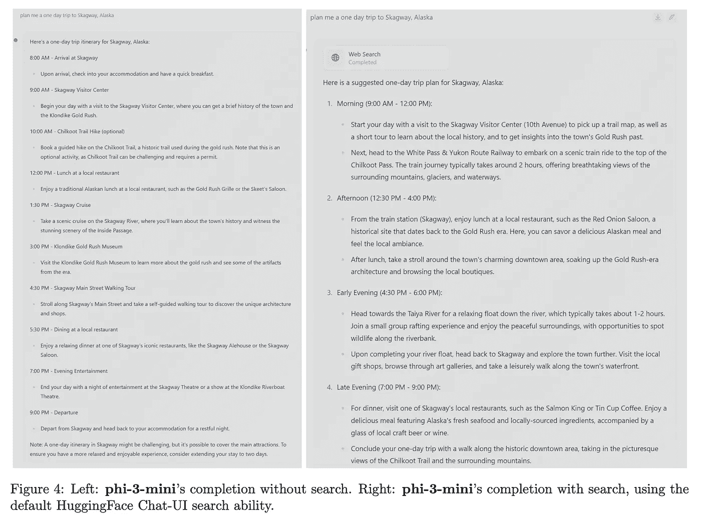

# Phi-3 与高度高效的 iPhone LLMs 开始

> 原文：[`towardsdatascience.com/phi-3-and-the-beginning-of-highly-performant-iphone-models-d413d8ea0714?source=collection_archive---------10-----------------------#2024-05-09`](https://towardsdatascience.com/phi-3-and-the-beginning-of-highly-performant-iphone-models-d413d8ea0714?source=collection_archive---------10-----------------------#2024-05-09)

## 本文将深入探讨 Phi-3 论文的发现，以及像 Phi-3 这样的模型发布所带来的一些影响。

 [Matthew Gunton](https://medium.com/@mgunton7?source=post_page---byline--d413d8ea0714--------------------------------)

·发表于 [Towards Data Science](https://towardsdatascience.com/?source=post_page---byline--d413d8ea0714--------------------------------) ·阅读时间 8 分钟 ·2024 年 5 月 9 日

--

图片来源：作者 — 由 Stable Diffusion 2.1 生成

我之前的文章的读者可能还记得我曾讨论过 [“教材就是你所需要的一切”](https://medium.com/@mgunton7/the-impact-of-better-data-on-llms-46153ba26795)，这是微软的一篇论文，展示了优质数据如何对模型性能产生超乎想象的影响。那里的研究结果直接反驳了“模型必须巨大才能具备能力”这一观点。该论文背后的研究人员继续进行相关工作，并发布了我认为非常令人兴奋的成果。

本文标题解释了或许是最大的发现：[“Phi-3 技术报告：在你的手机上本地运行的高度有能力的语言模型”。](https://arxiv.org/pdf/2404.14219)

让我们深入了解作者从 Phi-2 模型中做出的改变、他们如何训练模型以及它如何在你的 iPhone 上运行。

# 关键术语

在我们深入探讨架构之前，有几个关键概念需要了解。如果你已经知道这些内容，可以跳过到下一部分。

模型的**参数**是指模型在训练过程中学习的权重和偏置的数量。如果你有 10 亿个参数，那么你就有 10 亿个权重和偏置来决定模型的表现。参数越多，神经网络的复杂性也就越高。**头**指的是变换器中自注意力机制所拥有的键、值和查询向量的数量。**层**指的是变换器神经网络中存在的神经单元的数量，而隐藏维度则是指典型隐藏层内神经元的数量。

**分词器**是将输入文本转换为嵌入的程序，变换器（transformer）随后将处理这些嵌入。**词汇表大小**指的是模型训练时使用的唯一标记数量。变换器的**块结构**是指我们在为特定模型选择层、头、激活函数、分词器和层归一化时所采用的组合方式。

图 2 来自 [“GQA: 训练通用多查询变换器模型”](https://arxiv.org/pdf/2305.13245)

[多头检查点](https://arxiv.org/pdf/2305.13245)

**分组查询注意力（GQA）**是一种优化多头注意力的方法，旨在减少训练和推理过程中的计算开销。正如下面的图像所示，GQA 采取了中庸之道——我们不再将 1 个值和 1 个键与 1 个查询配对，而是采用 1:1:M 的方式，其中“多”的数量小于所有查询的总数。这样做是为了从多查询注意力（MQA）中仍然获得训练成本的好处，同时最大限度地减少因此而带来的性能下降。

# Phi 3 架构

让我们从该模型背后的架构开始。研究人员发布了 3 个不同的仅解码器模型，*phi-3-mini、phi-3-small* 和 *phi-3-medium*，每个模型都有不同的超参数。

+   *phi-3-mini*

    - 38 亿个参数

    - 32 个头

    - 32 层

    - 3072 个隐藏维度

    - 4k token 默认上下文长度

    - 32064 词汇表大小

    - 权重存储为 bfloat16

    - 训练于 3.3 万亿个标记

+   *phi-3-small*

    - 70 亿个参数

    - 32 个头

    - 32 层

    - 4096 个隐藏维度

    - 8k token 默认上下文长度

    - 100352 词汇表大小

    - 权重存储为 bfloat16

    - 训练于 4.8 万亿个标记

+   *phi-3-medium*

    - 140 亿个参数

    - 40 个头

    - 40 层

    - 3072 个隐藏维度

    - 训练于 4.8 万亿个标记

讲解一下这些模型之间的差异，*phi-3-mini*模型使用了典型的多头注意力进行训练。尽管论文中没有明确指出，但我怀疑由于该模型的规模大约是其他两个模型的一半，训练多头注意力的开销是可以接受的。自然地，当他们扩展到 *phi-3-small* 时，选择了分组查询注意力，每个键连接到 4 个查询。

此外，他们尽量使*phi-3-mini*的块结构与 LLaMa-2 结构保持一致。这里的目标是让开源社区能够继续在 LLaMa-2 的基础上，使用 Phi-3 进行研究。这是进一步理解该块结构能力的合理方式。

然而，*phi-3-small*并没有使用 LLaMa 的块结构，而是选择使用`tiktoken`分词器，交替使用密集注意力层和新的块稀疏注意力。此外，他们在这些模型的训练数据集中加入了 10%的多语言数据。

# 训练和数据的最佳组合

与 Phi-2 类似，研究人员主要投资于优质数据。他们采用了之前用于生成数据训练模型的相似“教育价值”范式，并选择使用比上次更多的数据。他们将数据生成分为两个阶段。

第一阶段涉及找到他们认为对用户具有高“教育价值”的网页数据。这里的目标是为模型提供一般知识。第二阶段则选取第一阶段数据的一个子集，生成能够教会模型如何进行逻辑推理或获得特定技能的数据。

这里的挑战在于确保来自每个语料库的数据组合适合正在训练的模型的规模（即*phi-3-small*与*phi-3-mini*）。这是“数据最优”机制的理念，意味着你提供给 LLM 进行训练的数据能够为其块结构提供最佳能力。换句话说，如果你认为数据是训练一个优秀 LLM 的关键，那么通过数据展示给模型的技能的正确组合，可能和找到优质数据一样重要。研究人员强调，他们希望模型具备比知识更强的推理能力，因此选择了更多来自第二阶段语料库的数据，而不是第一阶段的数据。

图 2 [来自论文](https://arxiv.org/pdf/2404.14219)，突出显示数据最优性的潜在关系

有趣的是，当他们用与训练*phi-3-small*时大致相同的数据组合来训练*phi-3-medium*时，他们发现从 7B 参数到 14B 的改进远不如从 3.8B 到 7B 的改进那么显著。作者怀疑这并非块结构的限制，而是他们用来训练*phi-3-medium*的数据组合的问题。

# 训练后

团队使用了监督微调（Supervised Fine Tuning, SFT）和直接偏好优化（Direct Preference Optimization, DPO）来提升模型的训练后性能。对于想要深入了解 DPO 的读者，可以参考我在[这里的博客文章](https://medium.com/towards-data-science/understanding-the-implications-of-direct-preference-optimization-a4bbd2d85841)。监督微调是一种迁移学习方法，通过使用自定义数据集来提高大语言模型（LLM）在该数据集上的能力。作者们通过 SFT 提升了模型在数学、编程、推理和安全等多个领域的能力。随后，他们使用 DPO 优化聊天功能，引导模型远离不希望的回答，朝向理想的回应。

正是在这一阶段，作者们将*phi-3-mini*的上下文窗口从 4k 个标记扩展到了 128k 个标记。他们使用的方法称为“长绳法”（Long Rope）。作者声称，在这两种上下文类型之间，性能是一致的，这一点非常重要，因为上下文长度大幅增加。如果有足够的兴趣，我将单独写一篇博客文章来探讨这篇论文中的发现。

# 手机使用的量化

尽管这些模型较小，但要让它们在手机上运行仍然需要进一步的优化。通常，LLM 的权重是以浮点数形式存储的；例如，Phi-3 的原始权重是`bfloat16`格式，这意味着每个权重在内存中占用 16 位。虽然 16 位看似微不足道，但当考虑到模型中有约 10⁹个参数时，你就会意识到每增加一位位数，所需的存储量就会迅速增加。

为了解决这个问题，作者们将权重从 16 位压缩到 4 位。基本思路是减少存储每个数字所需的位数。例如，数字 2.71828 可以压缩为 2.72。虽然这是一个有损操作，但它仍然能保留大部分信息，同时大大减少存储需求。

图 1 [来自论文](https://arxiv.org/pdf/2404.14219)

作者们在配备 A16 芯片的 iPhone 上运行了量化后的模型，发现该模型每秒能生成最多 12 个标记。作为对比，一台运行 LLaMa-2 量化 4 位的 M1 MacBook 每秒大约生成 107 个标记。我见过的最快标记生成速度（Groq）为每秒 853.35 个标记。考虑到这才是刚刚起步，能够在这款模型上看到 iPhone 生成标记的速度已经非常惊人。推理速度似乎只会越来越快。

# 将 Phi-3 与搜索结合使用

小型模型的一个局限性是它能够在网络中存储信息的位置较少。因此，我们看到 Phi-3 在需要广泛知识的任务上不如 LLaMa-2 等模型表现得那么好。

作者建议，将 Phi-3 与搜索引擎结合，模型的能力将得到显著提升。如果情况确实如此，这让我认为检索增强生成（RAG）可能会长期存在，成为帮助小型模型达到大型模型性能的关键部分。

图 4 [来自论文](https://arxiv.org/pdf/2404.14219)，展示了搜索如何提高 Phi-3 的性能

# 结论

总结来说，我们正在看到高性能小型模型的开端。虽然训练这些模型仍然在很大程度上依赖于高性能硬件，但它们的推理过程正变得越来越普及。这引入了一些有趣的现象。

首先，能够在本地运行的模型几乎可以完全保持私密性，允许用户向这些大型语言模型（LLM）提供他们可能不愿意通过互联网发送的数据。这为更多的使用场景打开了大门。

其次，这些模型将推动移动硬件的性能提升。因此，我预计高端智能手机上会有更多的系统级芯片（SoC），特别是具有共享内存的 SoC，以便在 CPU 和 GPU 之间共享内存，最大化推理速度。此外，拥有高质量接口的硬件将变得至关重要。像 MLX 这样的库，专为苹果硅设计，可能会成为任何新硬件进入消费硬件市场的必需品。

其次，正如本文所示，高质量数据在许多方面可以超越 LLM 中的网络复杂性，因此，不仅仅是寻找，而是生成高质量数据的竞争将只会加剧。

现在是构建的激动人心时刻。

[1] Abdin, M., 等人 [“Phi-3 技术报告：在手机本地运行的高性能语言模型”](https://arxiv.org/pdf/2404.14219)（2024 年），arXiv

[2] Ding, Y., 等人 [“LongRoPE：将 LLM 上下文窗口扩展到超过 200 万个令牌”](https://arxiv.org/pdf/2402.13753)（2024 年），arXiv

[3] Gerganov, G., 等人 [“llama.cpp 在苹果硅 M 系列上的性能”](https://github.com/ggerganov/llama.cpp/discussions/4167)（2023 年），GitHub

[4] Ainslie, J., 等人 [“GQA：从多头检查点训练通用多查询变换器模型”](https://arxiv.org/pdf/2305.13245)（2023 年），arXiv
