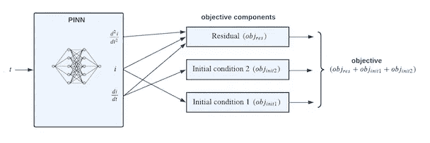
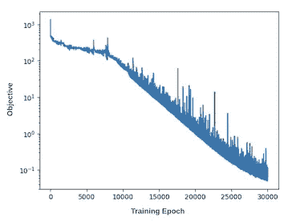
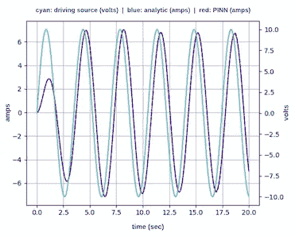
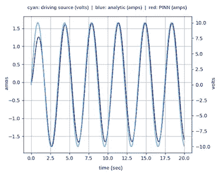
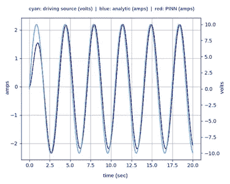

# 带强制函数的物理信息神经网络

> 原文：[`towardsdatascience.com/physics-informed-neural-network-with-forcing-function-81f59aa24c39?source=collection_archive---------1-----------------------#2024-05-27`](https://towardsdatascience.com/physics-informed-neural-network-with-forcing-function-81f59aa24c39?source=collection_archive---------1-----------------------#2024-05-27)

## **直接使用神经网络解微分方程*(附代码)***

 [John Morrow](https://medium.com/@john_morrow?source=post_page---byline--81f59aa24c39--------------------------------)

·发表于[Towards Data Science](https://towardsdatascience.com/?source=post_page---byline--81f59aa24c39--------------------------------) ·阅读时长 7 分钟·2024 年 5 月 27 日

--

图片由 agsandrew 提供，来自 iStock

在物理学、数学、经济学、工程学以及许多其他领域，微分方程通过变量的导数来描述一个函数。简单来说，当一个变量相对于其他变量的变化率涉及其中时，通常会遇到微分方程。许多[例子](https://en.wikipedia.org/wiki/List_of_named_differential_equations)描述了这些关系。微分方程的解通常通过解析或数值方法推导得出。

在推导解析解时，可能会遇到繁琐甚至在某些情况下无法完成的任务，而物理信息神经网络（PINN）则直接从微分方程中得到解，绕过了解析过程。这种解微分方程的创新方法是该领域的重要发展。

作者的[上一篇文章](https://medium.com/towards-data-science/inverse-physics-informed-neural-net-3b636efeb37e)中，使用 PINN 找到了解一个描述简单电子电路的微分方程的解。本文探讨了在通过强制函数驱动电路时，寻找解的更具挑战性的任务。考虑下列串联电子电路，其中包含电阻*R*、电容*C*、电感*L*，以及一个正弦电压源*V sin(ωt)*。该电路中电流* i(t)* 的行为由方程 1 描述，这是一个带有强制函数*Vω/L cos(ωt)*的二阶非齐次微分方程。

图 1: **带正弦电压源的 RLC 电路**

**方程 1**

## **解析解**

方程 1 的解析解要求根据*λ*和*ω₀*的关系解决三种不同情况。如下所示，每种情况都会得到一个复杂且独特的*i(t)*公式。在稍后的**结果**部分，将把这些解析解与 PINN 求解得到的结果进行比较。PINN 直接从微分方程中产生解，而无需考虑这些特殊情况。

（作者使用拉普拉斯变换技术的详细解析解可在[此处](https://github.com/jmorrow1000/PINN-with-forcing-function)查看。）

**案例 1：欠阻尼（***λ/2 < ω₀*）

阻尼指的是电路从初始过渡到平衡状态的速度。欠阻尼响应试图快速过渡，但通常会经历过度和欠调的周期性波动，才最终达到平衡。

**方程 2**

**案例 2：过阻尼（***λ/2 > ω₀*）

过阻尼响应会从初始过渡缓慢地过渡到平衡状态，而不会经历过度和欠调的周期性波动。

**方程 3**

**案例 3：临界阻尼（***λ/2 = ω₀*）

临界阻尼响应介于欠阻尼和过阻尼之间，提供了从初始过渡到平衡状态的最快响应。

**方程 4**

## **PINN 解**

PyTorch 代码可在[此处](https://github.com/jmorrow1000/PINN-with-forcing-function)获取。

神经网络通常通过输入和期望输出的配对进行训练。输入数据被传入神经网络，反向传播调整网络的权重和偏置，以最小化目标函数。目标函数表示神经网络输出与期望输出之间的误差。

相比之下，PINN 的目标函数需要三个分量：残差分量（*obj* *ᵣₑₛ*）和两个初始条件分量（*obj ᵢₙᵢₜ₁* 和 *obj* *ᵢₙᵢₜ*₂）。这些分量结合起来构成目标函数：

**方程 5**

**PINN 目标函数**

**残差**

残差分量是*物理信息*的关键所在。这个分量包含了输出的导数，约束网络必须符合定义的微分方程。残差方程（方程 6）是通过重新排列方程 1 得到的。

**方程 6**

在训练过程中，*t* 的值被输入到神经网络中，产生一个残差。然后反向传播将目标函数的残差部分减少到接近 *0* 的最小值，涵盖所有训练点。残差部分由以下公式给出：

**方程 7**

方程 6 所要求的第一和第二阶导数，*di/dt* 和 *d²i/dt²*，由 PyTorch 和 TensorFlow 神经网络平台中的自动微分功能提供。

**初始条件 1**

在这个电路示例中，第一个初始条件要求当输入 *t = 0* 时，PINN 的输出为 *i(t) = 0*。这是因为在 *t = 0* 时，正弦源 *V sin(t) = 0*，导致电路中没有电流流动。初始条件 1 的目标部分由方程 8 给出。在训练过程中，反向传播将减少该部分到接近 *0* 的值。

**方程 8**

**初始条件 2**

第二个初始条件要求当输入 *t = 0* 时，*L di/dt = 0*。这个条件源自于[基尔霍夫电压定律](https://en.wikipedia.org/wiki/Kirchhoff%27s_circuit_laws)（即，闭合回路中电压降的总和为零）。具体来说，在 *t = 0* 时，电路中存在以下条件：

+   电压源 *V sin(ωt) = 0*

+   电容器 *C* 的初始电荷为 *Q = 0*，因此电容器电压为 *V_cap = Q/C = 0*

+   电阻器 *R* 两端的电压为 *V_res = iR = 0*，因为 *i(t) = 0*（初始条件 1）

+   电感器 *L* 两端的电压为 *V_ind = L di/dt*

+   根据上述条件，电路中电压降的总和减少为 *L di/dt = 0*

初始条件 2 的目标部分由方程 9 给出。反向传播将减少该部分到接近 0 的值。

**方程 9**

**目标图**

以下图显示了训练过程中目标值的减少：

**目标图**

## 结果

以下测试案例比较了训练后的 PINN 对每种情况的适当解析解的响应。电路元件的值被选择以产生欠阻尼、过阻尼和临界阻尼响应，如上所讨论。所有三种情况都由一个正弦电压源驱动，*V = 10 伏特* 和 *ω = 1.8 弧度/秒*。对于每种情况，电容器和电感器的值分别为 *C = 0.3 法拉* 和 *L = 1.51 亨利*。每种情况的电阻器 *R* 的值如下所示。

**欠阻尼** (*R = 1.2 欧姆*)

**欠阻尼测试案例**

**过阻尼** (*R = 6.0 欧姆*)

**过阻尼测试案例**

**临界阻尼** (*R = 4.487 欧姆*)

**临界阻尼测试案例**

## 结论

本文使用具有自定义目标函数的神经网络成功解决了描述正弦源驱动电子电路的微分方程。通常，微分方程的解是通过繁琐的解析过程或数值方法推导出来的。这里提供的示例展示了神经网络能够以直接和高效的方式准确解决这些方程。如三个测试案例所示，神经网络的响应与解析解完全一致。

## 附录：PINN 训练笔记

+   PINN 结构：

    - 输入层，1 个输入

    - 隐藏层，128 个神经元，使用 GELU 激活函数

    - 隐藏层，128 个神经元，使用 GELU 激活函数

    - 输出层，1 个神经元，使用线性激活函数

+   PINN 在 0 到 20 秒的时间域内使用 220 个点进行训练。点的数量由域的持续时间和每秒点数的超参数控制，测试案例中每秒设置为 11 个点。这个值为每个正弦驱动源周期提供了足够的训练点，*ω = 1.8*。对于更高的*ω*值，需要更多的点每秒，例如，*ω = 4.0*需要 25 个点/秒。

+   PINN 在每次从所有训练点中采样 32 个点的批次中进行训练。训练点在每个 epoch 都会随机打乱。

+   学习率在训练开始时设置为 0.01，并且每 2000 个 epoch 减少 0.75 倍。

+   目标图是成功训练的重要指标。随着训练的进行，目标值应该下降几个数量级，并在接近 0 的一个小值处达到最低。如果训练没有产生这个结果，则需要调整超参数。建议首先尝试增加 epoch 数量，然后增加每秒训练点数。

**本文的 PDF 版本可通过** [**此处**](https://github.com/jmorrow1000/PINN-with-forcing-function)**获取。**

*除非另有说明，所有图片均由作者提供。*
