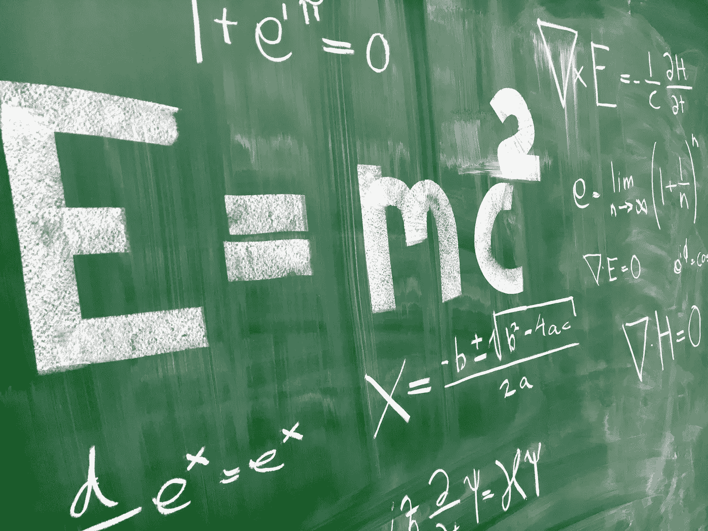

# physipy：使 Python 具备单位意识

> 原文：[`towardsdatascience.com/physipy-make-python-unit-aware-846162522889?source=collection_archive---------4-----------------------#2024-04-24`](https://towardsdatascience.com/physipy-make-python-unit-aware-846162522889?source=collection_archive---------4-----------------------#2024-04-24)

## 第一部分：physipy 将米和焦耳引入 Python

 [Yoann Mocquin](https://mocquin.medium.com/?source=post_page---byline--846162522889--------------------------------)

·发表于[Towards Data Science](https://towardsdatascience.com/?source=post_page---byline--846162522889--------------------------------) ·阅读时长 9 分钟·2024 年 4 月 24 日

--

你是否曾经使用 Python 进行工程/科学计算，却迷失或困惑于变量的单位，例如“这个值是米还是毫米？”或者你意识到在某一时刻你把电流与电阻相加了——这是不可能的？正如每个物理教师曾经说过的那样：你不能把胡萝卜和西红柿加在一起。

好的，[**physipy**](https://physipy.readthedocs.io/en/latest/)正是为了解决这些问题而存在的。

图片由[Artturi Jalli](https://unsplash.com/@artturijalli?utm_source=medium&utm_medium=referral)提供，来自[Unsplash](https://unsplash.com/?utm_source=medium&utm_medium=referral)

# **目录：**

**·** **什么是 physipy?** **·** **一步一步理解 physipy**

∘ 使用 physipy 计算体重指数 BMI

∘ 使用 numpy 数组的牛顿运动定律

∘ 使用 NumPy 函数的欧姆定律

∘ 爱因斯坦的质量-能量等价关系，适用于常见粒子，使用 favunit

∘ 自由落体与内置 favunit

∘ 使用 Matplotlib 绘制物体位置和速度

**·** **总结**

*所有图片由作者提供。*

# 什么是 physipy?
