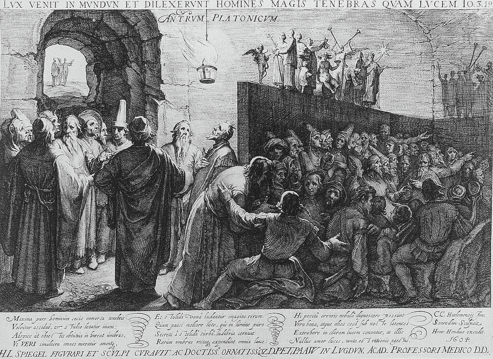
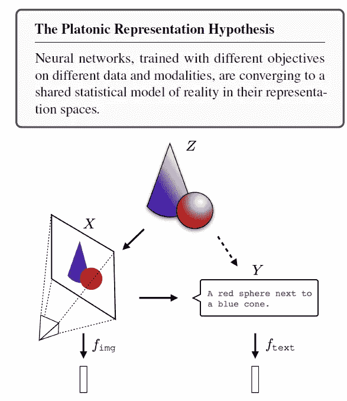
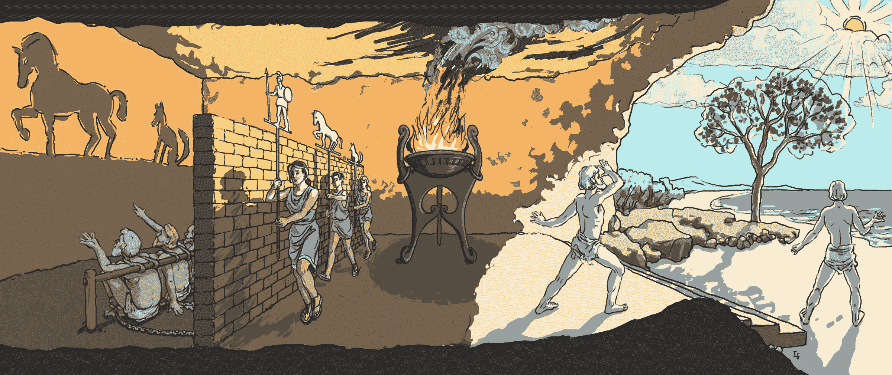
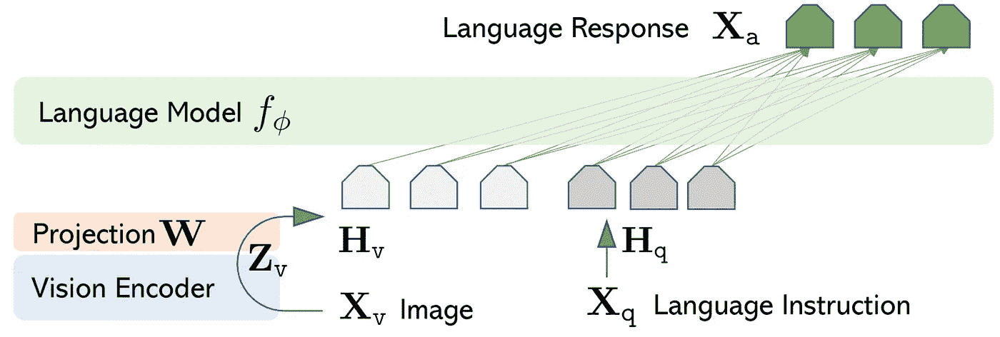
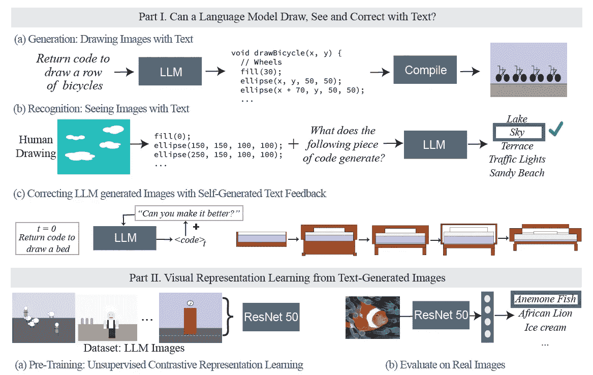
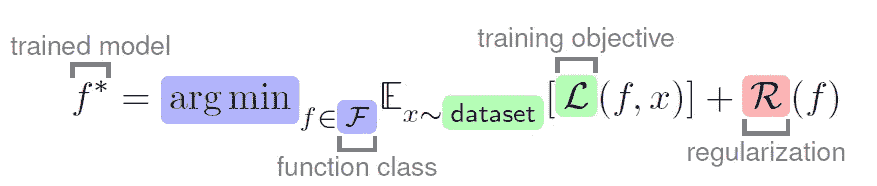
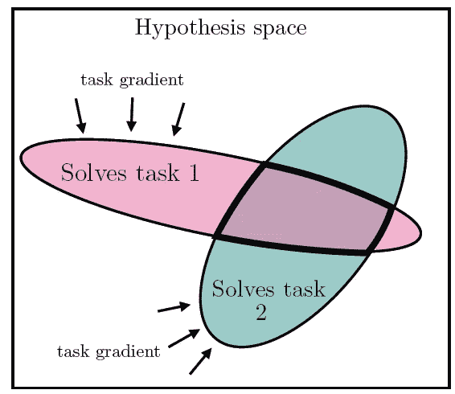
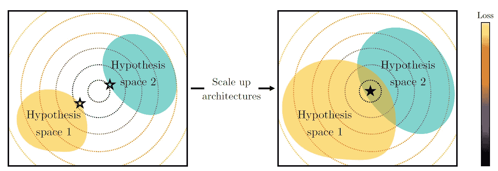
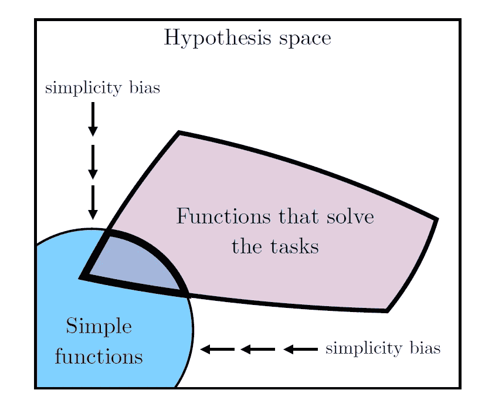
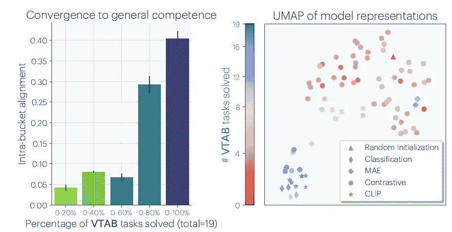

# 人工智能深度网络模型是否正在趋同？

> 原文：[`towardsdatascience.com/platonic-representation-hypothesis-c812813d7248?source=collection_archive---------9-----------------------#2024-05-23`](https://towardsdatascience.com/platonic-representation-hypothesis-c812813d7248?source=collection_archive---------9-----------------------#2024-05-23)

## 人工智能模型是否正在朝着统一的现实表征演化？柏拉图式表征假设认为，机器学习模型正在趋同。

 [Hesam Sheikh](https://medium.com/@itshesamsheikh?source=post_page---byline--c812813d7248--------------------------------)

·发表于[Towards Data Science](https://towardsdatascience.com/?source=post_page---byline--c812813d7248--------------------------------) ·8 分钟阅读·2024 年 5 月 23 日

--

一篇近期的 MIT 论文引起了我的注意，因为其提出了一个令人印象深刻的观点：人工智能模型正在趋同，即使是在不同的模态——视觉和语言之间。“*我们认为，人工智能模型中的表征，特别是深度网络的表征，正在趋同*”，这就是[**柏拉图式表征假设**](https://arxiv.org/abs/2405.07987)论文的开头。

但是，不同的模型，经过不同数据集的训练并用于不同的应用场景，如何能够趋同？是什么导致了这种趋同？

*✨这是付费文章。如果你不是 Medium 会员，你可以在我的新闻通讯中免费阅读此文：* [***Qiubyte***](https://hesamsheikh.substack.com/)***.***

柏拉图的洞穴寓言，由[Jan Saenredam](https://en.wikipedia.org/wiki/Allegory_of_the_cave#/media/File:Platon_Cave_Sanraedam_1604.jpg)（公有领域）创作。

# 1. 柏拉图式表征假设

> 我们认为，不同神经网络模型中数据点的表示方式正日益相似。这种相似性跨越了不同的模型架构、训练目标，甚至数据形式。

柏拉图式表征假设。视觉表征**X**和文本表征**Y**都是共同现实**Z**的投影。（来源：[论文](https://arxiv.org/abs/2405.07987)）

## 介绍

本文的核心论点是，来源和形式各异的模型正在趋向于一种*现实的表征*——即描述我们观察到并用于训练模型的世界事件的联合分布。

作者认为，这种趋向**柏拉图式表示**的收敛性是由模型所训练的底层数据结构和数据本身的性质驱动的，以及模型本身日益增长的复杂性和能力。随着模型接触到更多样的数据集和更广泛的应用，它们需要一种能够捕捉所有数据类型中常见的基本属性的表示。

《洞穴寓言》的插图，摘自柏拉图的《理想国》（艺术作品来自[4edges](https://commons.wikimedia.org/wiki/User:4edges)，来源：[Wikipedia](https://en.wikipedia.org/wiki/Allegory_of_the_cave#/media/File:An_Illustration_of_The_Allegory_of_the_Cave,_from_Plato%E2%80%99s_Republic.jpg))

# 2.  AI 模型会收敛吗？

各种规模的 AI 模型，即使是基于不同架构构建并为不同任务训练的模型，也开始表现出在数据表示上的收敛迹象。随着这些模型的规模和复杂度不断增长，输入数据变得更加庞大和多样，它们处理数据的方式开始*趋于一致。*

在不同数据模态——视觉或文本上训练的模型也会收敛吗？答案可能是*是的！*

## 2.1 能说话的视觉模型

这种对齐跨越了视觉和文本数据——论文随后确认，这一理论的局限性在于它只关注这两种模态，而没有涉及音频或机器人对世界的感知等其他模态。支持这一点的一个案例[1]是[***LLaVA***](https://llava-vl.github.io/)，该案例展示了通过 2 层 MLP 将视觉特征投影到语言特征中，从而实现了最先进的结果。

LLaVA 如何将视觉特征映射到语言模型的概述。（来源：[LLaVA](https://llava-vl.github.io/3)，CC-BY）

## 2.2 能看见的语言模型

另一个有趣的例子是***大型语言模型的视力检查***[2]，它探讨了大型语言模型在理解和处理视觉数据方面的程度。该研究使用代码作为图像和文本之间的桥梁，作为将视觉数据输入 LLM 的创新方法。论文揭示了 LLM 可以通过代码生成图像，这些图像虽然可能看起来不真实，但仍包含足够的视觉信息来训练视觉模型。

语言模型能看见吗？([source](https://arxiv.org/abs/2401.01862))

## 2.3 更大的模型，更强的对齐

不同模型的对齐与其规模相关。例如，训练用于*CIFAR-10 分类*的较大模型，表现出比小模型更强的对齐性。这意味着随着当前构建模型的趋势向 10 亿和 100 亿级别发展，这些巨型模型将会更加一致。

> “所有强大的模型都是相似的，每个弱模型都是以自己独特的方式弱。”

## 3. 为什么 AI 模型会收敛？

AI 模型的学习过程，f ∗ 是训练后的模型，𝐹 F 是函数类，𝐿 L 是依赖于模型 𝑓 f 和来自数据集的输入 𝑥 x 的损失函数，𝑅 R 表示正则化函数，𝐸 E 表示数据集的期望值。每种颜色代表收敛的一个原因。 (来源：[论文](https://arxiv.org/abs/2405.07987))

在训练一个 AI 模型时，有一些因素对 AI 模型为何会收敛贡献最大：

## 3.1 任务变得更加通用

随着模型被训练以同时解决越来越多的任务，其解决方案空间变得越来越小且更加受限。更高的通用性意味着尝试学习更接近*现实*的数据点。

一个模型能够解决的任务越多，它就被迫学习一个在解决所有这些任务时都有效的非重叠表示。 (来源：[论文](https://arxiv.org/abs/2405.07987))

*柏拉图表示假说* 论文将其表述为 ***多任务扩展假说：***

> “能够胜任 N 个任务的表示比能够胜任 M < N 个任务的表示要少。随着我们训练更多通用的模型以同时解决更多任务，我们应该预期可能的解决方案会更少。”

换句话说，解决复杂问题的方案比解决简单问题的方案要窄得多。当我们训练越来越通用的模型，且这些模型在庞大的、跨不同模态的互联网数据集上进行训练时，你可以想象解决方案空间会是多么的受限。

## 3.2 模型变得越来越大

随着模型的能力增强，通过更复杂的架构、更大的数据集或更复杂的训练算法，这些模型开发出的表示方式变得更加相似。

更大的假设空间比小的假设空间更容易收敛到一个解。 (来源：[论文](https://arxiv.org/abs/2405.07987))

尽管 *柏拉图表示假说* 论文并未为他们所称之为 **能力假说** 提供证明或示例——即“更大的模型比小的模型更容易收敛到共享表示”，但似乎显而易见的是，至少更大的模型有*更多的能力*去得出共同的解空间，远超过小模型。

随着 AI 模型的规模扩大，得益于它们的深度和复杂性，它们具备了更强的抽象能力。这使得它们能够捕捉数据的基本概念和模式，同时抛弃噪声或异常值，从而得出一个更加通用且可能更接近现实世界的表示。

## 3.3 简单性偏向

想象一下，在两个不同任务上训练两个**大规模**神经网络：一个模型必须能够识别图像中的面孔，另一个模型被训练来解读面孔的情绪。最初，这两个任务似乎没有什么关系——但是你会惊讶地发现两个模型最终会在面部特征表示上趋于相似吗？毕竟，一切归结于准确识别和解读面部关键点（眼睛、鼻子、嘴巴等）。

深度神经网络倾向于更简单的函数。（来源：[论文](https://arxiv.org/abs/2405.07987)）

有多篇文献指出深度神经网络有一种倾向，倾向于找到更简单、更通用的解决方案[3,4,5]。换句话说，深度网络偏爱简单的解决方案。通常被称为**简约偏差**，论文将其表述为：

> 深度网络偏向于找到对数据的简单拟合，并且模型越大，偏差越强。因此，随着模型的增大，我们应预期其收敛到更小的解决空间。

为什么神经网络会表现出这种行为？网络表现出简约偏差主要是因为用于训练它们的学习算法的基本属性。算法倾向于偏好更简单、可泛化的模型，这是为了防止过拟合并增强泛化能力。在训练过程中，简单的模型更有可能出现，因为通过捕捉数据中的主导模式，它们可以更有效地最小化损失函数。

简约偏差在训练过程中充当了一种自然的调节器。它推动模型朝向一种最佳的数据表示和处理方式，这种方式不仅能跨任务通用，而且足够简单，便于高效学习和应用，从而增加了模型学习到共同假设空间的机会。

# 4\. 这种收敛性的影响

那么，如果模型正在收敛，又会怎么样呢？首先，这表明不同模态的数据比以前认为的更有用。从预训练的 LLM 微调视觉模型，或反之，可能会得到出乎意料的好结果。

论文中指出的另一个影响是**“规模化可能减少幻觉和偏见”**。这一论点是，随着模型的规模扩大，它们可以从更大、更具多样性的数据库中学习，从而帮助它们形成更准确、更健壮的世界理解。这种增强的理解使得模型能够做出更加可靠且更少偏见的预测和输出。

VISION 模型随着**能力**的增加而收敛。（来源：[论文](https://arxiv.org/abs/2405.07987)）

# 5\. 一点怀疑

在考虑论文中提出的论点时，必须考虑一些局限性，几乎所有这些局限性都在论文中有所讨论。

首先，论文假设现实世界的**双射投影**，其中一个现实世界概念 Z 有可以学习的投影 X 和 Y。然而，某些概念是独特地固有于某一模态的。有时，语言能够表达一种概念或情感，而许多图像无法做到，反之，语言也可能无法替代图像来描述视觉概念。

其次，正如前面提到的，论文关注两种模态：视觉和语言。第三，关于“AI 模型正在趋同”的论点仅适用于多任务 AI 模型，而不适用于特定模型，如 ADAS 或情感分析模型。

最后，尽管论文表明不同模型的**对齐度**有所**增加**，但并未表明这些模型的表示变得相似。大模型之间的对齐分数确实高于小模型，但即使如此，0.16/1.00 的分数仍然留给研究一些悬而未解的问题。

**🌟 加入 1000+人一起学习** Python🐍，机器学习/机器学习操作/人工智能🤖，数据科学📈，以及大语言模型 🗯

[**关注我**](https://medium.com/@itshesamsheikh/subscribe)，并查看我的[**X/Twitter**](https://twitter.com/itsHesamSheikh)，我每天都会为你提供更新**。**

 [## QiuByte | Hesam Sheikh | Substack

### 人工智能、编程和机器学习，仅在简易的方式下。点击阅读《QiuByte》，由 Hesam Sheikh 主办，Substack…

[hesamsheikh.substack.com](https://hesamsheikh.substack.com/?source=post_page-----c812813d7248--------------------------------)

感谢阅读，

— Hesam

[1] 刘浩，李晨，吴奇，李洋杰。《视觉指令调优》。发表于 NeurIPS，2023。

[2] Sharma, P., Rott Shaham, T., Baradad, M., Fu, S., Rodriguez-Munoz, A., Duggal, S., Isola, P., and Torralba, A. 《语言模型的视觉检查》。发表于 arXiv 预印本，2024。

[3] H. Shah，K. Tamuly，《神经网络中简单性偏差的陷阱》，2020 年，[`arxiv.org/abs/2006.07710`](https://arxiv.org/abs/2006.07710)

[4] [关于简单性偏差的简短说明](https://www.lesswrong.com/posts/Gyggp2DJRMRLSnhid/a-brief-note-on-simplicity-bias-1)

[5] 深度神经网络在初始化时偏向简单函数
