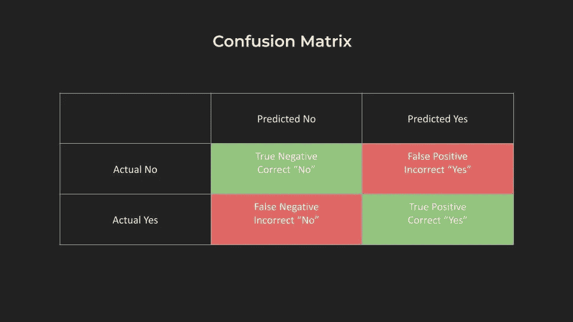

# 请让这个 AI 的准确性更低一点

> 原文：[`towardsdatascience.com/please-make-this-ai-less-accurate-47c4f1b0356a?source=collection_archive---------13-----------------------#2024-04-16`](https://towardsdatascience.com/please-make-this-ai-less-accurate-47c4f1b0356a?source=collection_archive---------13-----------------------#2024-04-16)

## 揭开“准确性”在数据科学和人工智能中的面纱

 [凯特·米诺格](https://medium.com/@kminoguem?source=post_page---byline--47c4f1b0356a--------------------------------)

·发布于[Towards Data Science](https://towardsdatascience.com/?source=post_page---byline--47c4f1b0356a--------------------------------) ·7 分钟阅读·2024 年 4 月 16 日

--

准确性是一个大家直觉上都认为自己理解的词，许多人也认为它越高越好。

随着人工智能（AI）受到越来越多关注以及人们对输出结果的可靠性或准确性问题的认知提升，了解数据产品（如 AI）并不遵循其他技术的一致性或准确性规则变得尤为重要。

**混淆矩阵**

为了说明这一点，我将介绍“混淆矩阵”这一概念。对于那些为分类目的构建预测模型的数据科学家来说，这个概念一定非常熟悉。虽然其他人可能不太了解，但我发现这个概念、方法论以及其中涉及的人类和商业互动是理解机器学习中准确性术语的一个有用案例研究。它是一个帮助理解这些术语中的细微差别和权衡的有用可视化工具。

作者提供的混淆矩阵模板

当我们谈论总准确性时，指的是所有预测结果中正确预测的数量（即上图中绿色框的总和），占所有预测结果的比例（即上图四个框的总和）。因此，在这里你可能会听到诸如“我们的孕妇测试准确率是 99%...”之类的术语。
