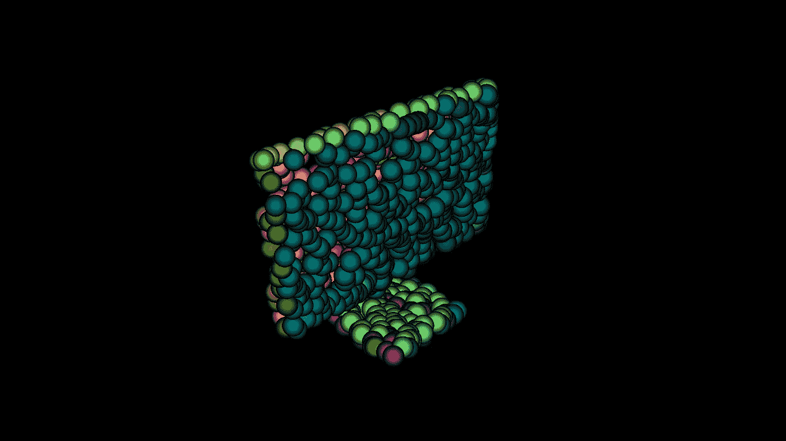

# 使用 PointNet 和 PyTorch3D 进行点云分类

> 原文：[`towardsdatascience.com/point-cloud-classification-with-pointnet-and-pytorch3d-af5e7a5530db?source=collection_archive---------7-----------------------#2024-03-22`](https://towardsdatascience.com/point-cloud-classification-with-pointnet-and-pytorch3d-af5e7a5530db?source=collection_archive---------7-----------------------#2024-03-22)

 [Mason McGough](https://medium.com/@masonmcgough?source=post_page---byline--af5e7a5530db--------------------------------)

·发表于 [Towards Data Science](https://towardsdatascience.com/?source=post_page---byline--af5e7a5530db--------------------------------) ·阅读时间：11 分钟·2024 年 3 月 22 日

--

来自 ModelNet 数据集的类别为“monitor”的物体

*通过此文章，您可以使用* [*Google Colab 笔记本*](https://colab.research.google.com/drive/1zKu3IZw_ZkgIWMDplp_tilMAp1hoQL-b?usp=sharing)*来跟进学习。*

在今天这个技术迅猛发展的时代，3D 技术正变得不可或缺。原型设计、[虚拟试穿](https://blog.google/products/shopping/ai-virtual-try-on-google-shopping/)、虚拟和增强现实体验、[数字双胞胎](https://blogs.nvidia.com/blog/lowes-retail-digital-twins-omniverse/)、测量、[医疗假肢](https://3d.nih.gov/collections/prosthetics)以及电影和游戏行业只是 3D 技术冰山一角。LinkedIn 估计，到 2028 年，全球对 3D 内容的需求将超过 30 亿美元，并且没有放缓的迹象。从《冰雪奇缘》到《堡垒之夜》，可以说，3D 模型正成为新的照片。

随着对 3D 数据需求的增加，对于有效分类和理解 3D 数据的方法的需求也在增长。2016 年由斯坦福大学研究人员发明的[PointNet](https://arxiv.org/abs/1612.00593)在快速发展的机器学习领域中可谓是一个化石，然而它经受住了时间的考验。直到 2023 年，研究人员仍然发布了基于 PointNet 架构的变种，适用于各种任务，包括：

+   脉冲神经网络

+   通过多孔介质预测流体流动

+   森林场景中的垂直结构分割

+   3D 人脸验证

+   基于雷达的人体活动识别

+   单孔膜冷却

+   以及更多内容
