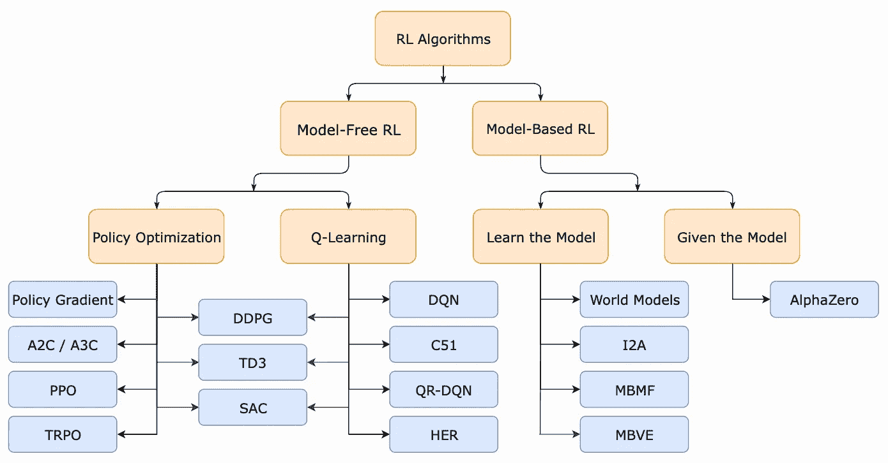

# 策略梯度：RLHF 的基础

> 原文：[`towardsdatascience.com/policy-gradients-the-foundation-of-rlhf-337346beef40?source=collection_archive---------7-----------------------#2024-02-06`](https://towardsdatascience.com/policy-gradients-the-foundation-of-rlhf-337346beef40?source=collection_archive---------7-----------------------#2024-02-06)

## 理解策略优化及其在强化学习中的应用

 [Cameron R. Wolfe, 博士](https://wolfecameron.medium.com/?source=post_page---byline--337346beef40--------------------------------)

·发表于[Towards Data Science](https://towardsdatascience.com/?source=post_page---byline--337346beef40--------------------------------) ·15 分钟阅读·2024 年 2 月 6 日

--

（照片由[WrongTog](https://unsplash.com/@wrongtog?utm_content=creditCopyText&utm_medium=referral&utm_source=unsplash)拍摄，来源于[Unsplash](https://unsplash.com/photos/blue-and-red-light-streaks-nYh3nHalEMA?utm_content=creditCopyText&utm_medium=referral&utm_source=unsplash)）

尽管强化学习（RL）在多种应用中非常有用，但它在大规模语言模型（LLMs）对齐过程中的作用至关重要，特别是在[强化学习与人类反馈（RLHF）](https://aman.ai/primers/ai/RLHF/)中的应用。不幸的是，RL 在 AI 社区中并不广为人知。也就是说，许多从业者（包括我自己）更熟悉监督学习技术，这导致了对使用 RL 的潜在偏见，尽管它具有巨大的实用性。在这一系列概述中，我们的目标是通过全面回顾 RL，从基本思想入手，逐步过渡到现代算法，如[近端策略优化（PPO）](https://openai.com/research/openai-baselines-ppo) [7]，这些算法在 RLHF 中被广泛使用，从而减少这种偏见。

现代强化学习算法的分类（来自[5]）

**本概述。** 如上所示，存在两种类型的无模型强化学习（RL）算法：Q 学习和策略优化。之前，我们学习了 Q 学习、强化学习的基础知识，以及这些思想如何可以推广到语言模型微调。在本概述中，我们将概述策略优化和策略梯度这两个在实践中广泛应用的思想……
