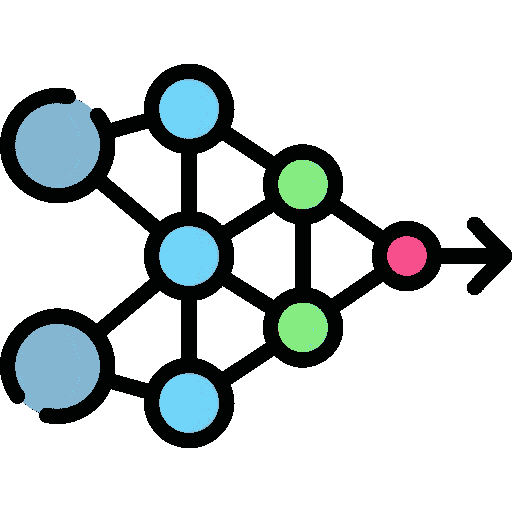
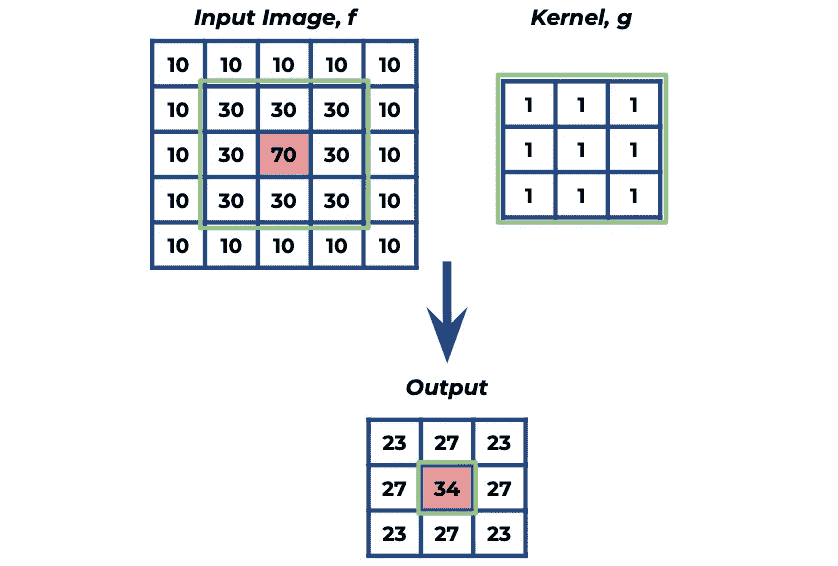

# 卷积神经网络（CNN）的池化层

> 原文：[`towardsdatascience.com/pooling-layers-for-convolutional-neural-networks-cnn-6cf2480668e2?source=collection_archive---------9-----------------------#2024-01-20`](https://towardsdatascience.com/pooling-layers-for-convolutional-neural-networks-cnn-6cf2480668e2?source=collection_archive---------9-----------------------#2024-01-20)

## 什么是池化层及其不同类型

 [Egor Howell](https://medium.com/@egorhowell?source=post_page---byline--6cf2480668e2--------------------------------)

·发表于 [Towards Data Science](https://towardsdatascience.com/?source=post_page---byline--6cf2480668e2--------------------------------) ·阅读时间 7 分钟·2024 年 1 月 20 日

--

”[`www.flaticon.com/free-icons/neural-network`](https://www.flaticon.com/free-icons/neural-network)" title=”神经网络图标”>由 Freepik 设计的神经网络图标 — Flaticon。

# 背景

在我之前的文章中，我们介绍了卷积神经网络（CNN）背后的关键组成部分——卷积层。

卷积层使得神经网络能够学习最佳的卷积核，以解码或分类我们的输入图像。

如果你不太了解，卷积核是一个小矩阵，它在输入图像上滑动，并且在每一步应用卷积操作。根据卷积核的结构，它会对输入图像产生不同的效果。它可以进行模糊、锐化，甚至检测边缘（[***Sobel 算子***](https://medium.com/towards-data-science/sobel-operator-in-image-processing-1d7cdda8cadb))。

> 在 CNN 中，卷积操作的输出称为特征图。

下面是一个卷积的示例图，其中我们对结果图像进行了模糊处理：

下面是一个示例卷积，应用于对灰度图像进行模糊效果处理。图示由作者创建。

如果你想了解卷积是如何工作的完整解析，可以查看我之前的相关文章：
