# 视觉变换器的位置嵌入解析

> 原文：[`towardsdatascience.com/position-embeddings-for-vision-transformers-explained-a6f9add341d5?source=collection_archive---------2-----------------------#2024-02-27`](https://towardsdatascience.com/position-embeddings-for-vision-transformers-explained-a6f9add341d5?source=collection_archive---------2-----------------------#2024-02-27)

## 视觉变换器解析系列

## 位置嵌入在视觉变换器中的数学原理与代码

[](https://medium.com/@sjcallis?source=post_page---byline--a6f9add341d5--------------------------------)[](https://towardsdatascience.com/?source=post_page---byline--a6f9add341d5--------------------------------) [Skylar Jean Callis](https://medium.com/@sjcallis?source=post_page---byline--a6f9add341d5--------------------------------)

·发表于 [Towards Data Science](https://towardsdatascience.com/?source=post_page---byline--a6f9add341d5--------------------------------) ·11 分钟阅读·2024 年 2 月 27 日

--

*自 2017 年“Attention is All You Need”*¹提出以来，变换器已确立为自然语言处理（NLP）领域的最新技术。2021 年，*An Image is Worth 16x16 Words*² 成功将变换器应用于计算机视觉任务。此后，许多基于变换器的架构被提出用于计算机视觉。*

**本文探讨了为何位置嵌入是视觉变换器中的必要组成部分，并分析了不同文献中位置嵌入的实现方式。文章包含了位置嵌入的开源代码和概念解释，所有代码均使用 PyTorch Python 包。**


图片来源：[BoliviaInteligente](https://unsplash.com/@boliviainteligente?utm_source=medium&utm_medium=referral) via [Unsplash](https://unsplash.com/?utm_source=medium&utm_medium=referral)

本文是一个系列文章的一部分，深入探讨了视觉变换器的内部工作原理。这些文章中的每一篇都可以通过 Jupyter 笔记本以可执行代码的形式查看。系列中的其他文章包括：

+   视觉变换器解析→ [Jupyter 笔记本](https://github.com/lanl/vision_transformers_explained/blob/main/notebooks/VisionTransformersExplained.ipynb)

+   视觉变换器的注意力机制解析

    → [Jupyter 笔记本](https://github.com/lanl/vision_transformers_explained/blob/main/notebooks/AttentionExplained.ipynb)

+   **视觉变换器的位置嵌入，解释**

    → [Jupyter Notebook](https://github.com/lanl/vision_transformers_explained/blob/main/notebooks/PositionEmbeddingExplained.ipynb)

+   标记到标记的视觉变换器，解释

    → [Jupyter Notebook](https://github.com/lanl/vision_transformers_explained/blob/main/notebooks/TokensToTokenViTExplained.ipynb)

+   [视觉变换器解释系列的 GitHub 仓库](https://github.com/lanl/vision_transformers_explained)

## 目录

+   为什么使用位置嵌入？

+   注意力不变性直到置换

+   文献中的位置嵌入

+   一个位置嵌入示例

    — 定义位置嵌入

    — 将位置嵌入应用于标记

+   结论

    — 进一步阅读

    — 引用

# 为什么使用位置嵌入？

*Attention is All You Need*¹中指出，由于变换器缺乏递归或卷积，它们无法学习关于一组标记顺序的信息。如果没有位置嵌入，变换器对标记的顺序是不可变的。对于图像来说，这意味着图像的各个块可以被打乱，而不影响预测的输出。

让我们来看一个关于块顺序的示例，图像为 Luis Zuno（[@ansimuz](http://twitter.com/ansimuz)）创作的像素艺术作品《黄昏山脉》³。原始作品已经被裁剪并转换为单通道图像。这意味着每个像素的值在零和一之间。单通道图像通常以灰度显示；然而，为了更容易观察，我们将其以紫色调显示。

```py
mountains = np.load(os.path.join(figure_path, 'mountains.npy'))

H = mountains.shape[0]
W = mountains.shape[1]
print('Mountain at Dusk is H =', H, 'and W =', W, 'pixels.')
print('\n')

fig = plt.figure(figsize=(10,6))
plt.imshow(mountains, cmap='Purples_r')
plt.xticks(np.arange(-0.5, W+1, 10), labels=np.arange(0, W+1, 10))
plt.yticks(np.arange(-0.5, H+1, 10), labels=np.arange(0, H+1, 10))
plt.clim([0,1])
cbar_ax = fig.add_axes([0.95, .11, 0.05, 0.77])
plt.clim([0, 1])
plt.colorbar(cax=cbar_ax);
#plt.savefig(os.path.join(figure_path, 'mountains.png'), bbox_inches='tight')
```

```py
Mountain at Dusk is H = 60 and W = 100 pixels.
```

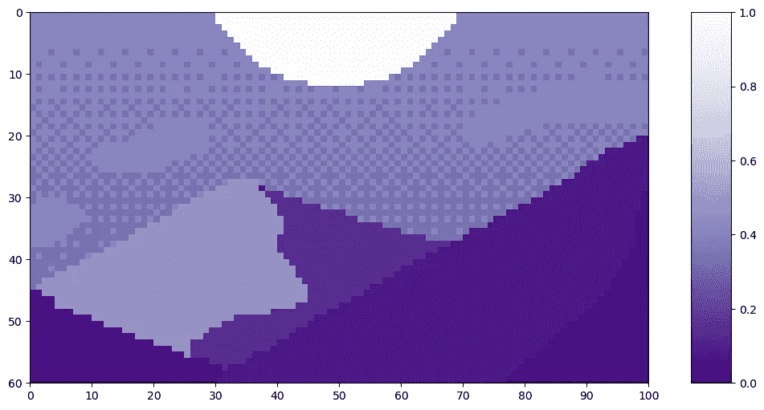

代码输出（图片由作者提供）

我们可以将这张图像分割成大小为 20 的块。（关于将图像分割成块的更深入解释，请参见视觉变换器文章。）

```py
P = 20
N = int((H*W)/(P**2))
print('There will be', N, 'patches, each', P, 'by', str(P)+'.')
print('\n')

fig = plt.figure(figsize=(10,6))
plt.imshow(mountains, cmap='Purples_r')
plt.clim([0,1])
plt.hlines(np.arange(P, H, P)-0.5, -0.5, W-0.5, color='w')
plt.vlines(np.arange(P, W, P)-0.5, -0.5, H-0.5, color='w')
plt.xticks(np.arange(-0.5, W+1, 10), labels=np.arange(0, W+1, 10))
plt.yticks(np.arange(-0.5, H+1, 10), labels=np.arange(0, H+1, 10))
x_text = np.tile(np.arange(9.5, W, P), 3)
y_text = np.repeat(np.arange(9.5, H, P), 5)
for i in range(1, N+1):
    plt.text(x_text[i-1], y_text[i-1], str(i), color='w', fontsize='xx-large', ha='center')
plt.text(x_text[2], y_text[2], str(3), color='k', fontsize='xx-large', ha='center');
#plt.savefig(os.path.join(figure_path, 'mountain_patches.png'), bbox_inches='tight')
```

```py
There will be 15 patches, each 20 by 20.
```

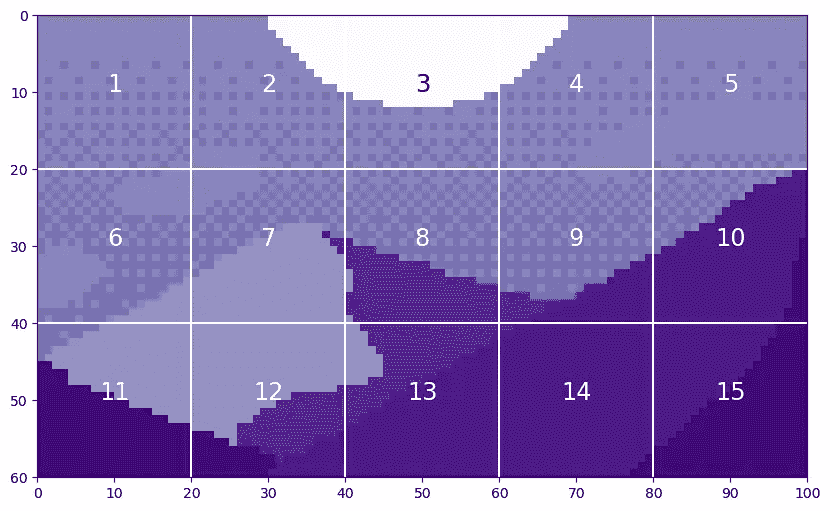

代码输出（图片由作者提供）

这个说法是，视觉变换器将无法区分原始图像和一个将块打乱后的版本。

```py
np.random.seed(21)
scramble_order = np.random.permutation(N)
left_x = np.tile(np.arange(0, W-P+1, 20), 3)
right_x = np.tile(np.arange(P, W+1, 20), 3)
top_y = np.repeat(np.arange(0, H-P+1, 20), 5)
bottom_y = np.repeat(np.arange(P, H+1, 20), 5)

scramble = np.zeros_like(mountains)
for i in range(N):
    t = scramble_order[i]
    scramble[top_y[i]:bottom_y[i], left_x[i]:right_x[i]] = mountains[top_y[t]:bottom_y[t], left_x[t]:right_x[t]]

fig = plt.figure(figsize=(10,6))
plt.imshow(scramble, cmap='Purples_r')
plt.clim([0,1])
plt.hlines(np.arange(P, H, P)-0.5, -0.5, W-0.5, color='w')
plt.vlines(np.arange(P, W, P)-0.5, -0.5, H-0.5, color='w')
plt.xticks(np.arange(-0.5, W+1, 10), labels=np.arange(0, W+1, 10))
plt.yticks(np.arange(-0.5, H+1, 10), labels=np.arange(0, H+1, 10))
x_text = np.tile(np.arange(9.5, W, P), 3)
y_text = np.repeat(np.arange(9.5, H, P), 5)
for i in range(N):
    plt.text(x_text[i], y_text[i], str(scramble_order[i]+1), color='w', fontsize='xx-large', ha='center')

i3 = np.where(scramble_order==2)[0][0]
plt.text(x_text[i3], y_text[i3], str(scramble_order[i3]+1), color='k', fontsize='xx-large', ha='center');
#plt.savefig(os.path.join(figure_path, 'mountain_scrambled_patches.png'), bbox_inches='tight')
```

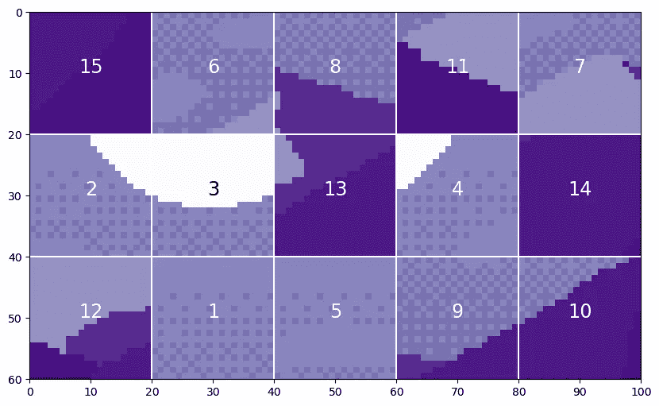

代码输出（图片由作者提供）

显然，这是与原始图像非常不同的图像，你不希望视觉变换器将这两张图像视为相同的。

# 注意力不变性直到置换

让我们探讨一下关于视觉 transformer 对标记顺序不变性的说法。与标记顺序不变的 transformer 组件是注意力模块。虽然本文不以详细解释注意力模块为重点，但我们需要具备基础理解。欲了解更多关于视觉 transformer 中注意力的详细讲解，请参见 注意力文章。

注意力是通过三个矩阵计算的——**Q** 查询、**K** 键和 **V** 值——每个矩阵都是通过将标记通过线性层生成的。一旦生成了 Q、K 和 V 矩阵，注意力就可以通过以下公式计算。

其中 *Q, K, V* 分别是查询、键和值；dₖ 是一个缩放值。为了展示注意力对标记顺序的不变性，我们将从三个随机生成的矩阵开始，表示 Q、K 和 V。Q、K 和 V 的形状如下：

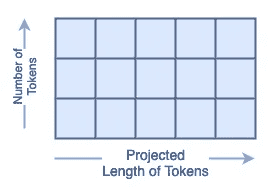

Q、K 和 V 的维度（图像来源：作者）

在这个示例中，我们将使用 4 个投影长度为 9 的标记。矩阵将包含整数，以避免浮动点乘法错误。一旦生成，我们将在所有三个矩阵中交换标记 0 和标记 2 的位置。交换位置的矩阵将用下标 *s* 表示。

```py
n_tokens = 4
l_tokens = 9
shape = n_tokens, l_tokens
mx = 20 #max integer for generated matricies

# Generate Normal Matricies
np.random.seed(21)
Q = np.random.randint(1, mx, shape)
K = np.random.randint(1, mx, shape)
V = np.random.randint(1, mx, shape)

# Generate Row-Swapped Matricies
swapQ = copy.deepcopy(Q)
swapQ[[0, 2]] = swapQ[[2, 0]]
swapK = copy.deepcopy(K)
swapK[[0, 2]] = swapK[[2, 0]]
swapV = copy.deepcopy(V)
swapV[[0, 2]] = swapV[[2, 0]]

# Plot Matricies
fig, axs = plt.subplots(nrows=3, ncols=2, figsize=(8,8))
fig.tight_layout(pad=2.0)
plt.subplot(3, 2, 1)
mat_plot(Q, 'Q')
plt.subplot(3, 2, 2)
mat_plot(swapQ, r'$Q_S$')
plt.subplot(3, 2, 3)
mat_plot(K, 'K')
plt.subplot(3, 2, 4)
mat_plot(swapK, r'$K_S$')
plt.subplot(3, 2, 5)
mat_plot(V, 'V')
plt.subplot(3, 2, 6)
mat_plot(swapV, r'$V_S$')
```

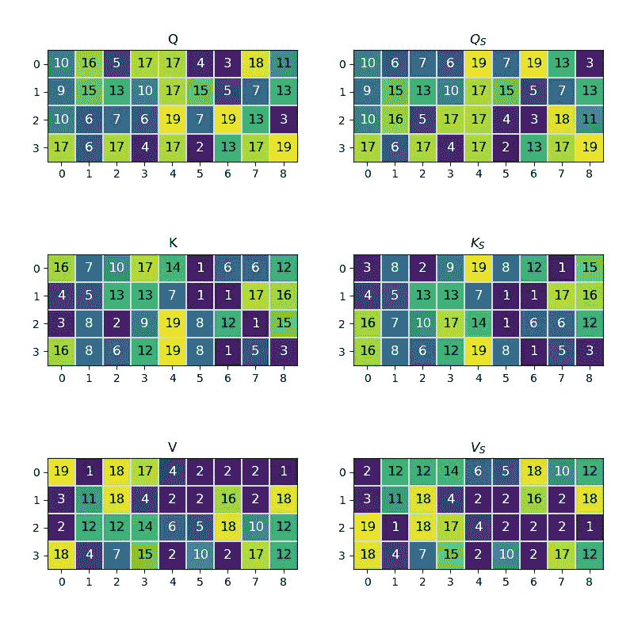

代码输出（图像来源：作者）

注意力公式中的第一次矩阵乘法是 *Q·Kᵀ=A*，其中结果矩阵 *A* 是一个正方形，大小等于标记的数量。当我们用 *Qₛ* 和 *Kₛ* 计算 *A*ₛ 时，结果 *A*ₛ 的行 [0, 2] 和列 [0,2] 会与 *A* 中的行和列交换。

```py
A = Q @ K.transpose()
swapA = swapQ @ swapK.transpose()
modA = copy.deepcopy(A)
modA[[0,2]] = modA[[2,0]] #swap rows
modA[:, [2, 0]] = modA[:, [0, 2]] #swap cols

fig, axs = plt.subplots(nrows=1, ncols=3, figsize=(8,3))
fig.tight_layout(pad=1.0)
plt.subplot(1, 3, 1)
mat_plot(A, r'$A = Q*K^T$')
plt.subplot(1, 3, 2)
mat_plot(swapA, r'$A_S = Q_S * K_S^T$')
plt.subplot(1, 3, 3)
mat_plot(modA, 'A\nwith rows [0,2] swaped\n and cols [0,2] swaped')
```

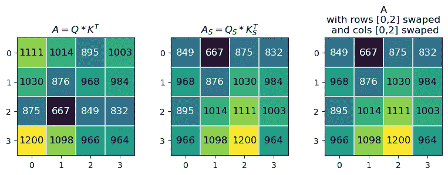

代码输出（图像来源：作者）

下一个矩阵乘法是 *A·V=A*，其中结果矩阵 *A* 的形状与初始的 *Q*、*K* 和 *V* 矩阵相同。当我们用 *A*ₛ 和 *V*ₛ 计算 *A*ₛ 时，结果 *A*ₛ 的行 [0,2] 会与 *A* 中的行交换。

```py
A = A @ V
swapA = swapA @ swapV
modA = copy.deepcopy(A)
modA[[0,2]] = modA[[2,0]] #swap rows

fig, axs = plt.subplots(nrows=2, ncols=2, figsize=(12, 7))
fig.tight_layout(pad=1.0)
plt.subplot(2, 2, 1)
mat_plot(A, r'$A = A*V$')
plt.subplot(2, 2, 2)
mat_plot(swapA, r'$A_S = A_S * V_S$')
plt.subplot(2, 2, 4)
mat_plot(modA, 'A\nwith rows [0,2] swaped')
axs[1,0].axis('off')
```

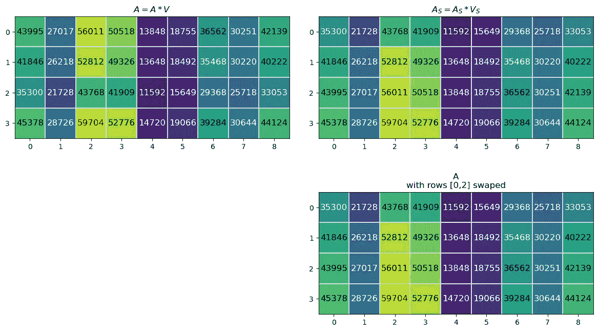

代码输出（图像来源：作者）

这证明了在输入到注意力层中的标记顺序发生变化时，输出的注意力矩阵中相应的标记行也会发生变化。这是直观的，因为注意力是在计算标记之间的关系。没有位置信息的情况下，改变标记顺序不会改变标记之间的关系。我不太明白为什么这种输出的排列不能传递位置信息给 transformer。然而，我所读的所有资料都表示这不够，因此我们接受这一点并继续前进。

# 文献中的位置嵌入

除了位置嵌入的理论依据外，使用位置嵌入的模型比不使用位置嵌入的模型具有更高的准确性。然而，目前没有明确的证据表明哪种类型的位置嵌入优于其他类型。

在*Attention is All You Need*¹中，他们使用了固定的正弦位置嵌入。他们指出，他们曾尝试过学习的位置嵌入，但观察到“几乎相同的结果”。请注意，这个模型是为 NLP 应用设计的，特别是翻译任务。作者最终选择了固定嵌入，因为它可以适应不同长度的短语。在计算机视觉应用中，这可能不会是一个问题。

在*An Image is Worth 16x16 Words²*中，他们将位置嵌入应用于图像。他们对四种不同的位置信息嵌入（包括固定和可学习的设置）进行了消融研究。该研究包括没有位置嵌入、1D 位置嵌入、2D 位置嵌入和相对位置嵌入。他们发现，带有位置嵌入的模型明显优于没有位置嵌入的模型。然而，不同类型的位置信息嵌入之间或固定与可学习嵌入之间的差异很小。这与[1]中的结果一致，即位置嵌入是有益的，尽管选择的具体嵌入并无太大影响。

在*Tokens-to-Token ViT: Training Vision Transformers from Scratch on ImageNet*⁴中，他们使用了一种正弦位置嵌入，描述上与[2]中的相同。他们发布的代码与[1]中的正弦位置嵌入公式一致。此外，他们发布的代码将位置嵌入固定，而不是将其作为一个通过正弦初始化的学习参数。

# 一个位置嵌入的示例

## 定义位置嵌入

现在，我们可以具体看看正弦位置嵌入的细节。该代码基于公开可用的 GitHub 代码，适用于*Tokens-to-Token ViT⁴*。从功能上讲，位置嵌入是一个与令牌形状相同的矩阵。它看起来像这样：


位置嵌入矩阵的形状（图像由作者提供）

来自[1]的正弦位置嵌入公式如下：

其中，*PE*是位置嵌入矩阵，*i*是令牌的数量，*j*是令牌的长度，*d*是令牌的长度。

在代码中，它看起来像这样：

```py
def get_sinusoid_encoding(num_tokens, token_len):
    """ Make Sinusoid Encoding Table

        Args:
            num_tokens (int): number of tokens
            token_len (int): length of a token

        Returns:
            (torch.FloatTensor) sinusoidal position encoding table
    """

    def get_position_angle_vec(i):
        return [i / np.power(10000, 2 * (j // 2) / token_len) for j in range(token_len)]

    sinusoid_table = np.array([get_position_angle_vec(i) for i in range(num_tokens)])
    sinusoid_table[:, 0::2] = np.sin(sinusoid_table[:, 0::2])
    sinusoid_table[:, 1::2] = np.cos(sinusoid_table[:, 1::2]) 

    return torch.FloatTensor(sinusoid_table).unsqueeze(0)
```

让我们生成一个示例位置嵌入矩阵。我们将使用 176 个令牌。每个令牌的长度为 768，这是 T2T-ViT⁴代码中的默认值。矩阵生成后，我们可以将其绘制出来。

```py
PE = get_sinusoid_encoding(num_tokens=176, token_len=768)
```

```py
fig = plt.figure(figsize=(10, 8))
plt.imshow(PE[0, :, :], cmap='PuOr_r')
plt.xlabel('Along Length of Token')
plt.ylabel('Individual Tokens');
cbar_ax = fig.add_axes([0.95, .36, 0.05, 0.25])
plt.clim([-1, 1])
plt.colorbar(label='Value of Position Encoding', cax=cbar_ax);
#plt.savefig(os.path.join(figure_path, 'fullPE.png'), bbox_inches='tight')
```

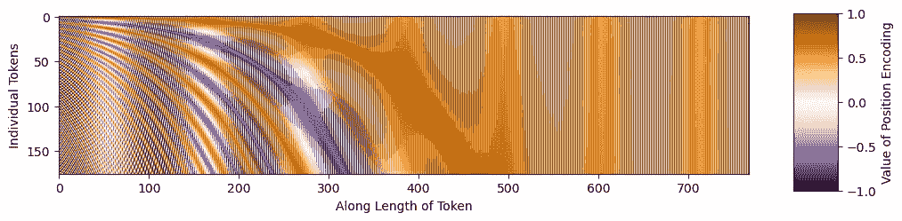

代码输出（图像由作者提供）

让我们放大查看令牌的开始部分。

```py
fig = plt.figure()
plt.imshow(PE[0, :, 0:301], cmap='PuOr_r')
plt.xlabel('Along Length of Token')
plt.ylabel('Individual Tokens');
cbar_ax = fig.add_axes([0.95, .2, 0.05, 0.6])
plt.clim([-1, 1])
plt.colorbar(label='Value of Position Encoding', cax=cbar_ax);
#plt.savefig(os.path.join(figure_path, 'zoomedinPE.png'), bbox_inches='tight')
```

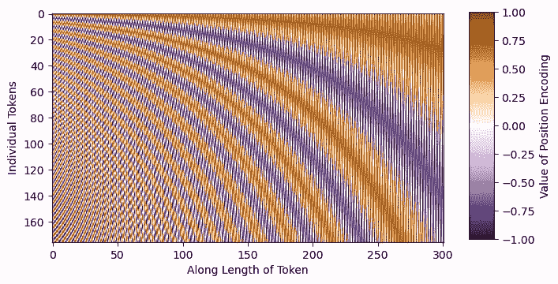

代码输出（图像由作者提供）

它确实具有正弦结构！

## 将位置嵌入应用于令牌

现在，我们可以将位置嵌入添加到标记中！我们将使用《黄昏山脉》³，并采用与上述相同的*补丁标记化*方法。这样，我们将得到 15 个标记，每个标记的长度为 20²=400。有关补丁标记化的更多详细信息，请参阅视觉变换器文章。回想一下，这些补丁看起来是这样的：

```py
fig = plt.figure(figsize=(10,6))
plt.imshow(mountains, cmap='Purples_r')
plt.hlines(np.arange(P, H, P)-0.5, -0.5, W-0.5, color='w')
plt.vlines(np.arange(P, W, P)-0.5, -0.5, H-0.5, color='w')
plt.xticks(np.arange(-0.5, W+1, 10), labels=np.arange(0, W+1, 10))
plt.yticks(np.arange(-0.5, H+1, 10), labels=np.arange(0, H+1, 10))
x_text = np.tile(np.arange(9.5, W, P), 3)
y_text = np.repeat(np.arange(9.5, H, P), 5)
for i in range(1, N+1):
    plt.text(x_text[i-1], y_text[i-1], str(i), color='w', fontsize='xx-large', ha='center')
plt.text(x_text[2], y_text[2], str(3), color='k', fontsize='xx-large', ha='center')
cbar_ax = fig.add_axes([0.95, .11, 0.05, 0.77])
plt.clim([0, 1])
plt.colorbar(cax=cbar_ax);
#plt.savefig(os.path.join(figure_path, 'mountain_patches_w_colorbar.png'), bbox_inches='tight')
```

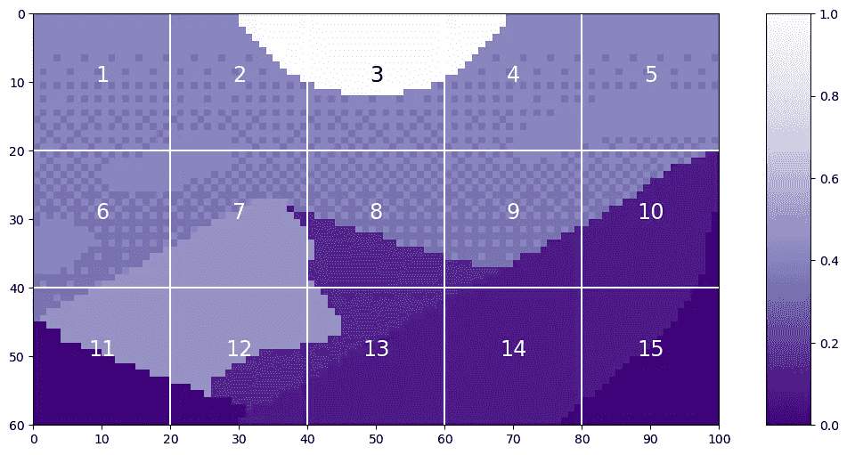

代码输出（图片由作者提供）

当我们将这些补丁转换为标记时，结果如下所示

```py
tokens = np.zeros((15, 20**2))
for i in range(15):
    patch = gray_mountains[top_y[i]:bottom_y[i], left_x[i]:right_x[i]]
    tokens[i, :] = patch.reshape(1, 20**2)
tokens = tokens.astype(int)
tokens = tokens/255

fig = plt.figure(figsize=(10,6))
plt.imshow(tokens, aspect=5, cmap='Purples_r')
plt.xlabel('Length of Tokens')
plt.ylabel('Number of Tokens')
cbar_ax = fig.add_axes([0.95, .36, 0.05, 0.25])
plt.clim([0, 1])
plt.colorbar(cax=cbar_ax)
```

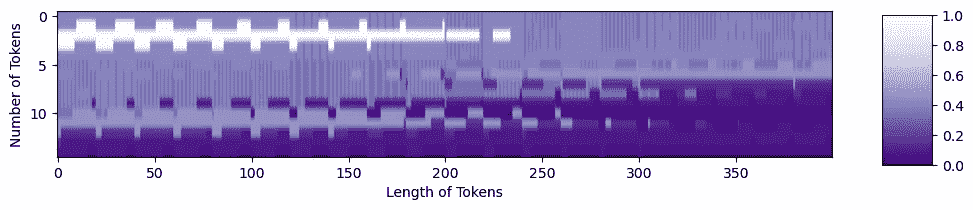

代码输出（图片由作者提供）

现在，我们可以创建一个形状正确的位置嵌入：

```py
PE = get_sinusoid_encoding(num_tokens=15, token_len=400).numpy()[0,:,:]
fig = plt.figure(figsize=(10,6))
plt.imshow(PE, aspect=5, cmap='PuOr_r')
plt.xlabel('Length of Tokens')
plt.ylabel('Number of Tokens')
cbar_ax = fig.add_axes([0.95, .36, 0.05, 0.25])
plt.clim([0, 1])
plt.colorbar(cax=cbar_ax)
```

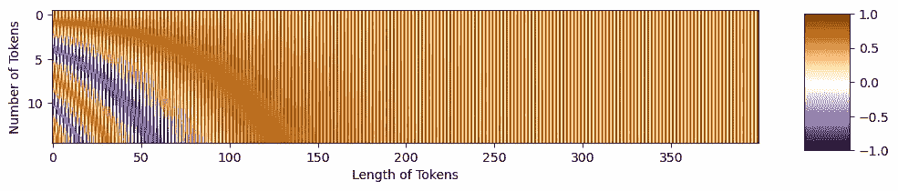

代码输出（图片由作者提供）

现在我们准备将位置嵌入添加到标记中。位置嵌入中的紫色区域会让标记变得更暗，而橙色区域会让标记变得更亮。

```py
mountainsPE = tokens + PE
resclaed_mtPE = (position_mountains - np.min(position_mountains)) / np.max(position_mountains - np.min(position_mountains))

fig = plt.figure(figsize=(10,6))
plt.imshow(resclaed_mtPE, aspect=5, cmap='Purples_r')
plt.xlabel('Length of Tokens')
plt.ylabel('Number of Tokens')
cbar_ax = fig.add_axes([0.95, .36, 0.05, 0.25])
plt.clim([0, 1])
plt.colorbar(cax=cbar_ax)
```

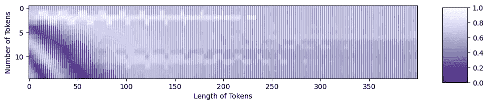

代码输出（图片由作者提供）

你可以看到原始标记的结构以及位置嵌入中的结构！这两部分信息都已经传递到变换器中。

# 结论

现在，你应该对位置嵌入如何帮助视觉变换器学习有所直觉。本文中的代码可以在[GitHub 仓库](https://github.com/lanl/vision_transformers_explained)找到，专门用于这一系列内容。T2T-ViT 论文中的代码⁴可以在[这里](https://github.com/yitu-opensource/T2T-ViT)找到。祝你愉快地进行变换！

本文已由洛斯阿拉莫斯国家实验室批准发布，发布编号为 LA-UR-23–33876。相关代码已获批准，并根据 O#4693 颁发了 BSD-3 开源许可证。

## 进一步阅读

要了解更多关于在 NLP 中的位置信息嵌入，请参阅

+   《位置编码在变换器模型中的温和介绍》：[`machinelearningmastery.com/a-gentle-introduction-to-positional-encoding-in-transformer-models-part-1/`](https://machinelearningmastery.com/a-gentle-introduction-to-positional-encoding-in-transformer-models-part-1/)

若要查看关于视觉变换器的广泛视频讲座（相关章节已标注），请参见

+   视觉变换器及其应用：[`youtu.be/hPb6A92LROc?si=GaGYiZoyDg0PcdSP`](https://youtu.be/hPb6A92LROc?si=GaGYiZoyDg0PcdSP)

    — 视觉变换器对补丁位置不变 10:44–12:52 ([`youtu.be/hPb6A92LROc?t=644&si=Keu-5i9BQ5c69mxz`](https://youtu.be/hPb6A92LROc?t=644&si=Keu-5i9BQ5c69mxz))

    — 位置嵌入 12:52–14:15 ([`youtu.be/hPb6A92LROc?t=772&si=spdlYZl-TRgbGgzn`](https://youtu.be/hPb6A92LROc?t=772&si=spdlYZl-TRgbGgzn))

## 引用

[1] Vaswani 等（2017 年）。*注意力机制就是你所需要的一切。* [`doi.org/10.48550/arXiv.1706.03762`](https://doi.org/10.48550/arXiv.1706.03762)

[2] Dosovitskiy 等（2020 年）。*一张图片价值 16x16 个词：用于大规模图像识别的变换器。* [`doi.org/10.48550/arXiv.2010.11929`](https://doi.org/10.48550/arXiv.2010.11929)

[3] 路易斯·祖诺 ([@ansimuz](http://twitter.com/ansimuz))。 *黄昏时山脉背景*。 许可证 CC0: [`opengameart.org/content/mountain-at-dusk-background`](https://opengameart.org/content/mountain-at-dusk-background)

[4] 袁等人 (2021). *Tokens-to-Token ViT: 从头开始在 ImageNet 上训练视觉变换器*。 [`doi.org/10.48550/arXiv.2101.11986`](https://doi.org/10.48550/arXiv.2101.11986)

→ GitHub 代码: [`github.com/yitu-opensource/T2T-ViT`](https://github.com/yitu-opensource/T2T-ViT)
