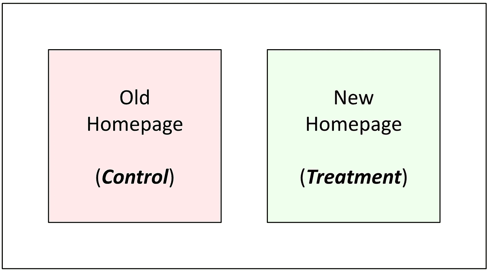

# 统计功效分析，解密

> 原文：[`towardsdatascience.com/power-analysis-demystified-429b228b76b6?source=collection_archive---------10-----------------------#2024-12-03`](https://towardsdatascience.com/power-analysis-demystified-429b228b76b6?source=collection_archive---------10-----------------------#2024-12-03)

## 从基础原理推导样本量方程

 [Rezwan Hoppe-Islam](https://medium.com/@rezwan.islam99?source=post_page---byline--429b228b76b6--------------------------------)

·发表于 [Towards Data Science](https://towardsdatascience.com/?source=post_page---byline--429b228b76b6--------------------------------) ·9 分钟阅读·2024 年 12 月 3 日

--

在规划在线实验时，出现了一个关键问题：

> 需要多少观察值才能自信地检测到一个有意义的效应？

在本文中，我们旨在全面展示样本量确定的机制——也称为统计功效分析。通过从基础原理推导样本量方程，我们将揭开这一过程的神秘面纱，帮助您深入理解统计学的基础知识。通过本指南的学习，您将能够清晰且自信地计算最小样本量。

由于计算会根据我们是测量比例还是连续性结果有所不同，我们将分别研究这两种情况。

# 1 比例度量

## 1.1 设计实验

假设我们想评估重新设计的主页对***注册账户的访客比例***的影响。我们设计了一个实验，使得实验组的访客看到新主页，而对照组的访客看到旧主页。

作者生成的图像

## 1.2 明确假设
