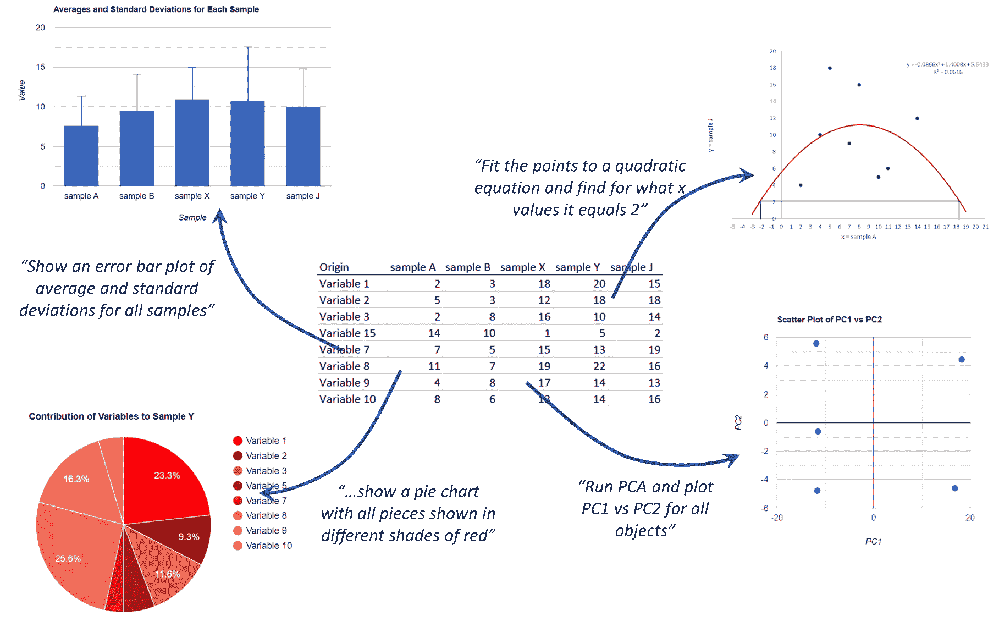

# 通过让 LLMs 访问库，利用自然语言请求进行强大的数据分析和绘图

> 原文：[`towardsdatascience.com/powerful-data-analysis-and-plotting-via-natural-language-requests-by-giving-llms-access-to-9d34841c2a5d?source=collection_archive---------1-----------------------#2024-01-24`](https://towardsdatascience.com/powerful-data-analysis-and-plotting-via-natural-language-requests-by-giving-llms-access-to-9d34841c2a5d?source=collection_archive---------1-----------------------#2024-01-24)

## 在你的网页浏览器中，让大型语言模型（LLMs）为你分析和绘制数据

 [LucianoSphere (Luciano Abriata, PhD)](https://lucianosphere.medium.com/?source=post_page---byline--9d34841c2a5d--------------------------------)

·发表于[Towards Data Science](https://towardsdatascience.com/?source=post_page---byline--9d34841c2a5d--------------------------------) ·22 分钟阅读·2024 年 1 月 24 日

--

这张图是作者根据他自己的 Web 应用截图整理的。

# 介绍：使用大型语言模型自动化数据分析

最近，我开始探索如何使用大型语言模型（LLMs）自动化数据分析，这样你就可以用自然语言向它们提问关于数据集的问题，它们会通过生成并运行代码来回答这些问题。我将这一切实现为一个 Web 应用程序，(我和你!)可以尝试这一方法的强大功能和局限性，目前完全依赖程序编写标准的 JavaScript：

 ## 通过自然语言探索数据分析，使用 LLMs——方法一

### 如何使用大型语言模型将有关数据集的问题转化为即时运行的代码，从而提供…

towardsdatascience.com

正如我在那篇文章中所解释的，我的主要兴趣是解决这个问题：

> *我能否用自己的话向 LLM 询问一个数据集的问题，并让它通过必要的数学或脚本解释这些问题并给出答案？*
