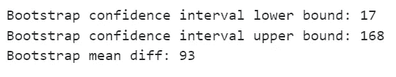

# 使用 CUPED 和双重机器学习为实验赋能

> 原文：[`towardsdatascience.com/powering-experiments-with-cuped-and-double-machine-learning-34dc2f3d3284?source=collection_archive---------2-----------------------#2024-08-15`](https://towardsdatascience.com/powering-experiments-with-cuped-and-double-machine-learning-34dc2f3d3284?source=collection_archive---------2-----------------------#2024-08-15)

## 因果 AI，探索因果推理与机器学习的结合

[](https://medium.com/@raz1470?source=post_page---byline--34dc2f3d3284--------------------------------)[](https://towardsdatascience.com/?source=post_page---byline--34dc2f3d3284--------------------------------) [Ryan O'Sullivan](https://medium.com/@raz1470?source=post_page---byline--34dc2f3d3284--------------------------------)

·发布于[Towards Data Science](https://towardsdatascience.com/?source=post_page---byline--34dc2f3d3284--------------------------------) ·阅读时长 17 分钟·2024 年 8 月 15 日

--


图片来源：[Karsten Würth](https://unsplash.com/@karsten_wuerth?utm_source=medium&utm_medium=referral) 于[Unsplash](https://unsplash.com/?utm_source=medium&utm_medium=referral)

# 这系列文章讲的是什么？

欢迎来到我的因果 AI 系列文章，我们将在这里探索因果推理如何融入机器学习模型。你将看到跨多个业务场景的多种实际应用。

在上一篇文章中，我们介绍了*如何通过因果图保护需求预测*。今天，我们将重点讨论如何使用 CUPED 和双重机器学习为实验赋能。

如果你错过了上一篇关于保护需求预测的文章，可以在这里查看：

[](/safeguarding-demand-forecasting-with-causal-graphs-591511fc8e0e?source=post_page-----34dc2f3d3284--------------------------------) ## 使用因果图保护需求预测

### 因果 AI，探索因果推理与机器学习的结合

towardsdatascience.com

# 引言

在本文中，我们将评估 CUPED 和双重机器学习是否能够增强你的实验效果。我们将通过案例研究来探索以下几个方面：

+   实验的构建模块：假设检验、功效分析、自助法。

+   什么是 CUPED，它如何帮助增强实验效果？

+   CUPED 和双重机器学习在概念上有哪些相似之处？

+   什么时候我们应该使用双重机器学习，而不是 CUPED？

完整的笔记本可以在这里找到：

[](https://github.com/raz1470/causal_ai/blob/main/notebooks/powering%20your%20experiments%20-%20cuped.ipynb?source=post_page-----34dc2f3d3284--------------------------------) [## causal_ai/notebooks/powering your experiments - cuped.ipynb at main · raz1470/causal_ai

### 该项目介绍了因果人工智能及其如何推动商业价值。 - causal_ai/notebooks/powering your experiments…

[github.com](https://github.com/raz1470/causal_ai/blob/main/notebooks/powering%20your%20experiments%20-%20cuped.ipynb?source=post_page-----34dc2f3d3284--------------------------------)

# 案例研究

## 背景

你最近加入了一个领先的在线零售商的实验团队，该零售商以其庞大的产品目录和动态用户群体而闻名。数据科学团队已部署了一种先进的推荐系统，旨在提升用户体验并推动销售。该系统与零售平台实时集成，涉及大量基础设施和工程成本。

财务团队迫切希望了解系统的财务影响，特别是它相比没有推荐的基准情境所产生的额外收入。为了评估推荐系统的有效性，您计划进行一个随机对照实验。

## 数据生成过程：实验前

我们首先创建一些实验前的数据。我们使用的数据生成过程具有以下特点：

+   3 个观察到的协变量与先前销售的近期性（x_recency）、频率（x_frequency）和价值（x_value）相关。

+   1 个未观察到的协变量，用户的月收入（u_income）。


用户生成的图像

+   使用协变量之间的复杂关系来估计我们的目标指标——销售值：


用户生成的图像

下面的 python 代码用于创建实验前的数据：

```py
np.random.seed(123)

n = 10000 # Set number of observations
p = 4 # Set number of pre-experiment covariates

# Create pre-experiment covariates
X = np.random.uniform(size=n * p).reshape((n, -1))

# Nuisance parameters
b = (
    1.5 * X[:, 0] +
    2.5 * X[:, 1] +
    X[:, 2] ** 3 +     
    X[:, 3] ** 2 +
    X[:, 1] * X[:, 2]  
)

# Create some noise
noise = np.random.normal(size=n)

# Calculate outcome
y = np.maximum(b + noise, 0)

# Scale variables for interpretation
df_pre = pd.DataFrame({"noise": noise * 1000,
                   "u_income": X[:, 0] * 1000,                   
                   "x_recency": X[:, 1] * 1000,
                   "x_frequency": X[:, 2] * 1000,
                   "x_value": X[:, 3] * 1000,
                   "y_value": y * 1000     
})

# Visualise target metric
sns.histplot(df_pre['y_value'], bins=30, kde=False)
plt.xlabel('Sales Value')
plt.ylabel('Frequency')
plt.title('Sales Value')
plt.show()
```


用户生成的图像

# 实验的基本构建块：假设检验、效能分析、自助法

在我们进入 CUPED 之前，我认为有必要先讲解一些关于实验的基础知识。

## 假设检验

假设检验有助于判断实验中观察到的差异是否具有统计学意义，或者仅仅是随机噪音。在我们的实验中，我们将用户分为两组：

+   **对照组**：不接受推荐。

+   **实验组**：接受系统的个性化推荐。

我们将假设定义如下：

+   **原假设 (H₀)**：推荐系统对收入没有影响。任何观察到的差异都是由于偶然因素造成的。

+   **备择假设 (Hₐ)**：推荐系统增加了收入。接受推荐的用户相比未接受推荐的用户产生了显著更多的收入。

为了评估假设，你将比较控制组和处理组的平均收入。然而，有几个方面需要注意：

+   **第一类错误（假阳性）**：如果实验得出结论认为推荐系统显著提高了收入，尽管实际上它没有任何效果。

+   **第二类错误（Beta，假阴性）**：如果实验未能发现推荐系统在收入上有显著增加，尽管它实际上确实带来了有意义的增长。

+   **显著性水平（Alpha）**：如果将显著性水平设置为 0.05，则意味着你接受 5%的概率错误地得出推荐系统提高收入的结论，尽管实际上并没有提升（假阳性）。

+   **功效（1 — Beta）**：达到 0.80 的功效意味着在推荐系统确实有作用的情况下，你有 80%的机会检测到收入的显著增长。较高的功效可以降低假阴性的风险。

当你开始思考实验设计时，你会设定一些初步目标：

1.  **你希望可靠地检测到效应** — 确保你平衡了检测虚假效应与未能检测到真实效应的风险。

1.  **尽可能快** — 财务部门在催促你！

1.  **保持样本量尽可能具有成本效益** — 数据科学团队的商业案例表明该系统将大幅增加收入，因此他们不希望控制组的样本量过大。

但是，如何实现这些目标呢？接下来让我们深入探讨功效分析！

## 功效分析

当我们讨论实验的功效时，通常是指确定在给定置信度下，检测到某一特定大小效应所需的最小样本量的过程。功效分析包括 3 个组件：

+   **效应大小** — H₀和 Hₐ的平均值之间的差异。我们通常需要根据对业务/行业的理解，做出合理的假设。

+   **显著性水平** — 错误得出存在效应结论的概率，通常设定为 0.05。

+   **功效** — 正确检测到效果的概率，通常设定为 0.80。

我最初发现这些直觉很难理解，但可视化真的可以帮助理解。让我们试试吧！关键区域是 H₀和 Hₐ交叉的地方——看看它是否能帮助你将上面讨论的各个组件联系起来……


用户生成的图片

更大的样本量会导致更小的**标准误差**。标准误差较小时，H₀和 Hₐ的抽样分布变得更窄，重叠部分减少。这种重叠的减少使得检测差异变得更加容易，从而提高了统计功效。

以下函数展示了如何使用 statsmodels Python 包来进行功效分析：

```py
from typing import Union
import pandas as pd
import numpy as np
import statsmodels.stats.power as smp

def power_analysis(metric: Union[np.ndarray, pd.Series], exp_perc_change: float, alpha: float = 0.05, power: float = 0.80) -> int:
    '''
    Perform a power analysis to determine the minimum sample size required for a given metric.

    Args:
        metric (np.ndarray or pd.Series): Array or Series containing the metric values for the control group.
        exp_perc_change (float): The expected percentage change in the metric for the test group.
        alpha (float, optional): The significance level for the test. Defaults to 0.05.
        power (float, optional): The desired power of the test. Defaults to 0.80.

    Returns:
        int: The minimum sample size required for each group to detect the expected percentage change with the specified power and significance level.

    Raises:
        ValueError: If `metric` is not a NumPy array or pandas Series.
    '''

    # Validate input types
    if not isinstance(metric, (np.ndarray, pd.Series)):
        raise ValueError("metric should be a NumPy array or pandas Series.")

    # Calculate statistics
    control_mean = metric.mean()
    control_std = np.std(metric, ddof=1) # Use ddof=1 for sample standard deviation
    test_mean = control_mean * (1 + exp_perc_change)
    test_std = control_std # Assume the test group has the same standard deviation as the control group

    # Calculate (Cohen's D) effect size
    mean_diff = control_mean - test_mean
    pooled_std = np.sqrt((control_std**2 + test_std**2) / 2)
    effect_size = abs(mean_diff / pooled_std)  # Cohen's d should be positive

    # Run power analysis
    power_analysis = smp.TTestIndPower()
    sample_size = round(power_analysis.solve_power(effect_size=effect_size, alpha=alpha, power=power))

    print(f"Control mean: {round(control_mean, 3)}")
    print(f"Control std: {round(control_std, 3)}")
    print(f"Min sample size: {sample_size}")

    return sample_size
```

那么，让我们用预实验数据来进行测试！

```py
exp_perc_change = 0.05 # Set the expected percentage change in the chosen metric caused by the treatment

min_sample_size = power_analysis(df_pre["y_value"], exp_perc_change
```


用户生成图像

我们可以看到，鉴于我们目标指标的分布，要检测出 5%的增加，我们需要的样本量是 1,645。

## 数据生成过程：实验数据

在你急于设置实验之前，你决定利用实验前的数据来模拟实验。

以下函数随机选择用户进行治疗，并应用治疗效应。在函数的最后，我们记录治疗前后均值的差异以及真实的 ATE（平均治疗效应）：

```py
def exp_data_generator(t_perc_change, t_samples):

    # Create copy of pre-experiment data ready to manipulate into experiment data
    df_exp = df_pre.reset_index(drop=True)

    # Calculate the initial treatment effect
    treatment_effect = round((df_exp["y_value"] * (t_perc_change)).mean(), 2)

    # Create treatment column
    treated_indices = np.random.choice(df_exp.index, size=t_samples, replace=False)
    df_exp["treatment"] = 0
    df_exp.loc[treated_indices, "treatment"] = 1

    # treatment effect
    df_exp["treatment_effect"] = 0
    df_exp.loc[df_exp["treatment"] == 1, "treatment_effect"] = treatment_effect

    # Apply treatment effect
    df_exp["y_value_exp"] = df_exp["y_value"] 
    df_exp.loc[df_exp["treatment"] == 1, "y_value_exp"] = df_exp["y_value"] + df_exp["treatment_effect"]

    # Calculate mean diff before treatment
    mean_t0_pre = df_exp[df_exp["treatment"] == 0]["y_value"].mean()
    mean_t1_pre = df_exp[df_exp["treatment"] == 1]["y_value"].mean()
    mean_diff_pre  = round(mean_t1_pre  - mean_t0_pre)

    # Calculate mean diff after treatment
    mean_t0_post = df_exp[df_exp["treatment"] == 0]["y_value_exp"].mean()
    mean_t1_post = df_exp[df_exp["treatment"] == 1]["y_value_exp"].mean()
    mean_diff_post  = round(mean_t1_post  - mean_t0_post)

    # Calculate ate
    treatment_effect = round(df_exp[df_exp["treatment"]==1]["treatment_effect"].mean())

    print(f"Diff-in-means before treatment: {mean_diff_pre}")
    print(f"Diff-in-means after treatment: {mean_diff_post}")
    print(f"ATE: {treatment_effect}")

    return df_exp
```

我们可以输入之前计算的最小样本量：

```py
np.random.seed(123)
df_exp_1 = exp_data_generator(exp_perc_change, min_sample_size)
```

让我们首先检查一下我们为接受治疗的用户创建的数据，帮助你理解该函数的作用：


用户生成图像

接下来，让我们看一下该函数打印的结果：


用户生成图像

有趣的是，我们看到在选择需要治疗的用户后，但在我们进行治疗之前，已经存在均值的差异。这个差异是由随机因素造成的。这意味着，当我们查看治疗后的用户差异时，我们并没有正确估计 ATE（平均治疗效应）。当我们讲解 CUPED 时，会回到这一点。


用户生成图像

接下来，我们将探讨一种比仅仅取均值差异更复杂的推断方法……

## 自助法

自助法是一种强大的统计技术，涉及带有放回的重抽样数据。这些重抽样的数据集被称为自助法样本，帮助我们估计从原始数据中提取统计量（如均值或中位数）的变异性。在实验中，这种方法尤其具有吸引力，因为它使我们能够计算置信区间。让我们通过一个简单的例子一步步演示…

你已经进行了一个实验，控制组和治疗组各有 1k 用户。

1.  创建自助法样本 —— 从控制组和治疗组中随机选择（有放回）1k 用户。这为控制组和治疗组各提供一个自助法样本。

1.  重复这个过程 n 次（例如 10k 次）。

1.  对每一对自助法样本，计算控制组和治疗组之间的均值差异。

1.  现在我们有了一个分布（由 10k 个自助法样本的均值差异组成），我们可以使用它来计算置信区间。


用户生成图像

## 将其应用于我们的案例研究

让我们通过案例研究来说明它是如何工作的。下面我们使用 sciPy stats Python 包来帮助计算自助法置信区间：

```py
from typing import Union
import pandas as pd
import numpy as np
from scipy import stats

def mean_diff(group_a: Union[np.ndarray, pd.Series], group_b: Union[np.ndarray, pd.Series]) -> float:
    '''
    Calculate the difference in means between two groups.

    Args:
        group_a (Union[np.ndarray, pd.Series]): The first group of data points.
        group_b (Union[np.ndarray, pd.Series]): The second group of data points.

    Returns:
        float: The difference between the mean of group_a and the mean of group_b.
    '''
    return np.mean(group_a) - np.mean(group_b)

def bootstrapping(df: pd.DataFrame, adjusted_metric: str, n_resamples: int = 10000) -> np.ndarray:
    '''
    Perform bootstrap resampling on the adjusted metric of two groups in the dataframe to estimate the mean difference and confidence intervals.

    Args:
        df (pd.DataFrame): The dataframe containing the data. Must include a 'treatment' column indicating group membership.
        adjusted_metric (str): The name of the column in the dataframe representing the metric to be resampled.
        n_resamples (int, optional): The number of bootstrap resamples to perform. Defaults to 1000.

    Returns:
        np.ndarray: The array of bootstrap resampled mean differences.
    '''

    # Separate the data into two groups based on the 'treatment' column
    group_a = df[df["treatment"] == 1][adjusted_metric]
    group_b = df[df["treatment"] == 0][adjusted_metric]

    # Perform bootstrap resampling
    res = stats.bootstrap((group_a, group_b), statistic=mean_diff, n_resamples=n_resamples, method='percentile')
    ci = res.confidence_interval

    # Extract the bootstrap distribution and confidence intervals
    bootstrap_means = res.bootstrap_distribution
    bootstrap_ci_lb = round(ci.low,)
    bootstrap_ci_ub = round(ci.high)    
    bootstrap_mean = round(np.mean(bootstrap_means))

    print(f"Bootstrap confidence interval lower bound: {bootstrap_ci_lb}")
    print(f"Bootstrap confidence interval upper bound: {bootstrap_ci_ub}")    
    print(f"Bootstrap mean diff: {bootstrap_mean}")

    return bootstrap_means
```

当我们为我们的案例研究数据运行这个方法时，我们可以看到我们现在有了一些置信区间：

```py
bootstrap_og_1 = bootstrapping(df_exp_1, "y_value_exp")
```



用户生成图像

我们的真实 ATE（平均处理效应）是 143（来自我们实验数据生成函数的实际处理效应），该值位于我们的置信区间内。然而，值得注意的是，均值差异并没有发生变化（它仍然是 93，就像我们在仅计算控制组和处理组均值差异时一样），并且处理前的差异仍然存在。

那么，如果我们想要得出更窄的置信区间怎么办？有没有办法处理处理前的差异呢？这将我们引导到 CUPED……

# 什么是 CUPED，它如何帮助提升实验效能？

## 背景

CUPED（使用实验前数据的控制实验）是一种强大的技术，旨在通过微软研究人员开发的技术来提高实验的准确性。原始论文对于任何对实验感兴趣的人来说，都是一篇具有洞察力的阅读材料：

[`ai.stanford.edu/~ronnyk/2009controlledExperimentsOnTheWebSurvey.pdf`](https://ai.stanford.edu/~ronnyk/2009controlledExperimentsOnTheWebSurvey.pdf)

CUPED 的核心思想是使用实验开始前收集的数据来减少目标指标的方差。通过这样做，你可以使实验更敏感，从而获得两个主要好处：

1.  你可以在相同的样本量下检测到更小的效果。

1.  你可以在更小的样本量下检测到相同的效果。

可以把它想象成去除“背景噪声”，这样你可以更清晰地看到“信号”。

## 方差、标准差、标准误差

当你了解 CUPED 时，可能会听到人们谈论它如何减少方差、标准差或标准误。如果你像我一样，可能会忘记这些概念之间的关系，因此在我们继续深入之前，让我们回顾一下这些概念！

+   **方差**：方差衡量每个数据点与均值的平方偏差的平均值，反映了数据集内的整体分布或离散程度。

+   **标准差**：标准差是方差的平方根，表示每个数据点与均值的平均距离，并提供了一个更易于理解的离散度量。

+   **标准误差**：标准误差量化了样本均值作为总体均值估计的精度，计算方法是将标准差除以样本大小的平方根。

## CUPED 是如何工作的？

为了理解 CUPED 是如何工作的，我们先来分解一下……

**实验前协变量** — 在 CUPED 的最简单实现中，实验前协变量是实验开始前的一段时间内测量的目标指标。因此，如果你的目标指标是销售额，那么你的协变量可以是每个客户在实验前 4 周的销售额。

你的协变量与目标指标相关，并且不受处理的影响，这一点非常重要。这也是为什么我们通常使用控制组的处理前数据。

**回归调整** — 使用线性回归来建模协变量（实验前测量）与目标指标（实验期间测量）之间的关系。然后，我们可以通过去除协变量的影响来计算 CUPED 调整后的目标指标：


用户生成的图片

值得注意的是，去除协变量的均值是为了使结果变量围绕均值进行中心化，这样当与原始目标指标进行比较时，更容易解释。

**方差减少** — 经过回归调整后，我们目标指标的方差减少了。方差较小意味着控制组和实验组之间的差异更容易被检测到，从而增加了实验的统计效能。

## 将其应用到我们的案例研究中

让我们通过案例研究来说明它是如何工作的。下面我们将 CUPED 编写成一个函数：

```py
from typing import Union
import pandas as pd
import numpy as np
import statsmodels.api as sm

def cuped(df: pd.DataFrame, pre_covariates: Union[str, list], target_metric: str) -> pd.Series:
    '''
    Implements the CUPED (Controlled Experiments Using Pre-Experiment Data) technique to adjust the target metric 
    by removing predictable variation using pre-experiment covariates. This reduces the variance of the metric and 
    increases the statistical power of the experiment.

    Args:
        df (pd.DataFrame): The input DataFrame containing both the pre-experiment covariates and the target metric. 
        pre_covariates (Union[str, list]): The column name(s) in the DataFrame corresponding to the pre-experiment covariates used for the adjustment. 
        target_metric (str): The column name in the DataFrame representing the metric to be adjusted.

    Returns:
        pd.Series: A pandas Series containing the CUPED-adjusted target metric.
    '''

    # Fit control model using pre-experiment covariates
    control_group = df[df['treatment'] == 0]
    X_control = control_group[pre_covariates]
    X_control = sm.add_constant(X_control)
    y_control = control_group[target_metric]
    model_control = sm.OLS(y_control, X_control).fit()

    # Compute residuals and adjust target metric
    X_all = df[pre_covariates]
    X_all = sm.add_constant(X_all)
    residuals = df[target_metric].to_numpy().flatten() - model_control.predict(X_all)
    adjustment_term = model_control.params['const'] + sum(model_control.params[covariate] * df[pre_covariates].mean()[covariate] for covariate in pre_covariates)
    adjusted_target = residuals + adjustment_term

    return adjusted_target
```

当我们将其应用到我们的案例研究数据中，并将调整后的目标指标与原始目标指标进行比较时，我们看到方差已减少：

```py
# Apply CUPED
pre_covariates = ["x_recency", "x_frequency", "x_value"]
target_metric = ["y_value_exp"]
df_exp_1["adjusted_target"] = cuped(df_exp_1, pre_covariates, target_metric)

# Plot results
plt.figure(figsize=(10, 6))
sns.kdeplot(data=df_exp_1[df_exp_1['treatment'] == 0], x="adjusted_target", hue="treatment", fill=True, palette="Set1", label="Adjusted Value")
sns.kdeplot(data=df_exp_1[df_exp_1['treatment'] == 0], x="y_value_exp", hue="treatment", fill=True, palette="Set2", label="Original Value")
plt.title(f"Distribution of Value by Original vs CUPED")
plt.xlabel("Value")
plt.ylabel("Density")
plt.legend(title="Distribution")
```


用户生成的图片

## 它是否减少了标准误差？

现在我们已经应用了 CUPED 并减少了方差，让我们运行引导法函数，看看它产生了什么影响：

```py
bootstrap_cuped_1 = bootstrapping(df_exp_1, "adjusted_target")
```


用户生成的图片

如果将其与我们之前使用原始目标指标的结果进行比较，你会发现置信区间更窄了：

```py
bootstrap_1 = pd.DataFrame({
    'original': bootstrap_og_1,
    'cuped': bootstrap_cuped_1
})

# Plot the KDE plots
plt.figure(figsize=(10, 6))
sns.kdeplot(bootstrap_1['original'], fill=True, label='Original', color='blue')
sns.kdeplot(bootstrap_1['cuped'], fill=True, label='CUPED', color='orange')

# Add mean lines
plt.axvline(bootstrap_1['original'].mean(), color='blue', linestyle='--', linewidth=1)
plt.axvline(bootstrap_1['cuped'].mean(), color='orange', linestyle='--', linewidth=1)
plt.axvline(round(df_exp_1[df_exp_1["treatment"]==1]["treatment_effect"].mean(), 3), color='green', linestyle='--', linewidth=1, label='Treatment effect')

# Customize the plot
plt.title('Distribution of Value by Original vs CUPED')
plt.xlabel('Value')
plt.ylabel('Density')
plt.legend()

# Show the plot
plt.show()
```


用户生成的图片

引导法（bootstrap）均值差异也逐渐接近真实的处理效应。这是因为 CUPED 对处理控制组和实验组之间的先前差异非常有效。

## 它是否减少了最小样本量？

下一个问题是，它是否减少了我们所需的最小样本量。让我们来看看吧！

```py
treatment_effect_1 = round(df_exp_1[df_exp_1["treatment"]==1]["treatment_effect"].mean(), 2)
cuped_sample_size = power_analysis(df_exp_1[df_exp_1['treatment'] == 0]['adjusted_target'], treatment_effect_1 / df_exp_1[df_exp_1['treatment'] == 0]['adjusted_target'].mean())
```


用户生成的图片

所需的最小样本量从 1,645 减少到了 901。无论是财务团队还是数据科学团队都将非常高兴，因为我们可以在较短的时间内用更小的控制样本来进行实验！

# CUPED 和双重机器学习之间有哪些概念上的相似之处？

## 背景

当我第一次读到 CUPED 时，我就想到了双重机器学习及其相似之处。如果你不熟悉双重机器学习，查看我在系列文章中的早期内容：

[](/de-biasing-treatment-effects-with-double-machine-learning-63b16fcb3e97?source=post_page-----34dc2f3d3284--------------------------------) ## 使用双重机器学习消除处理效应偏差

### 因果 AI，探索因果推理与机器学习的结合

towardsdatascience.com

请注意双重机器学习中的第一阶段结果模型：

+   ***结果模型（去噪）：*** 用于仅使用控制特征估计结果的机器学习模型。然后计算结果模型的残差。

这在概念上与我们使用 CUPED 的做法非常相似！

## 它与 CUPED 相比如何？

让我们通过案例研究数据，看看是否得到类似的结果：

```py
# Train DML model
dml = LinearDML(discrete_treatment=False)
dml.fit(df_exp_1[target_metric].to_numpy().ravel(), T=df_exp_1['treatment'].to_numpy().ravel(), X=df_exp_1[pre_covariates], W=None)
ate_dml = round(dml.ate(df_exp_1[pre_covariates]))
ate_dml_lb = round(dml.ate_interval(df_exp_1[pre_covariates])[0])
ate_dml_ub = round(dml.ate_interval(df_exp_1[pre_covariates])[1])

print(f'DML confidence interval lower bound: {ate_dml_lb}')
print(f'DML confidence interval upper bound: {ate_dml_ub}')
print(f'DML ate: {ate_dml}')
```


用户生成的图像

我们得到几乎完全相同的结果！

当我们绘制残差时，可以看到方差像在 CUPED 中一样减少（尽管我们没有添加均值来进行缩放以便于解释）：

```py
# Fit model outcome model using pre-experiment covariates
X_all = df_exp_1[pre_covariates]
X_all = sm.add_constant(X)
y_all = df_exp_1[target_metric]
outcome_model = sm.OLS(y_all, X_all).fit()

# Compute residuals and adjust target metric
df_exp_1['outcome_residuals'] = df_exp_1[target_metric].to_numpy().flatten() - outcome_model.predict(X_all)

# Plot results
plt.figure(figsize=(10, 6))
sns.kdeplot(data=df_exp_1[df_exp_1['treatment'] == 0], x="outcome_residuals", hue="treatment", fill=True, palette="Set1", label="Adjusted Target")
sns.kdeplot(data=df_exp_1[df_exp_1['treatment'] == 0], x="y_value_exp", hue="treatment", fill=True, palette="Set2", label="Original  Value")
plt.title(f"Distribution of Value by Original vs DML")
plt.xlabel("Value")
plt.ylabel("Density")
plt.legend(title="Distribution")

plt.show()
```


用户生成的图像

“那又怎么样？”我听到你问！

首先，我认为这对任何使用双重机器学习的人来说是一个有趣的观察——第一阶段结果模型有助于减少方差，因此我们应该能够获得类似 CUPED 的好处。

其次，它提出了一个问题：每种方法什么时候合适？让我们通过回答这个问题来结束本部分…

# 我们什么时候应该使用双重机器学习而不是 CUPED？

有几个原因说明为什么倾向于使用 CUPED 可能是合理的：

+   这更容易理解。

+   它更易于实现。

+   这是一个模型，而不是三个模型，这意味着你会面临更少的过拟合挑战。

然而，也有一些例外情况，双重机器学习优于 CUPED：

+   **偏倚的处理分配**——当处理分配存在偏倚时，例如使用观察数据时，双重机器学习可以处理这个问题。我的上一篇文章深入探讨了这一点：

[](/de-biasing-treatment-effects-with-double-machine-learning-63b16fcb3e97?source=post_page-----34dc2f3d3284--------------------------------) [## 使用双重机器学习去偏治疗效果](https://example.org)

### 因果 AI，探索因果推理与机器学习的结合

towardsdatascience.com](/de-biasing-treatment-effects-with-double-machine-learning-63b16fcb3e97?source=post_page-----34dc2f3d3284--------------------------------)

+   **异质治疗效果**——当你想了解个体层面的效果时，例如找出哪些人值得发送折扣，双重机器学习可以提供帮助。在我之前关于优化治疗策略的文章中，有一个很好的案例研究说明了这一点：

[](/using-double-machine-learning-and-linear-programming-to-optimise-treatment-strategies-920c20a29553?source=post_page-----34dc2f3d3284--------------------------------) [## 使用双重机器学习和线性编程优化治疗策略](https://example.org)

### 因果 AI，探索因果推理与机器学习的结合

towardsdatascience.com](/using-double-machine-learning-and-linear-programming-to-optimise-treatment-strategies-920c20a29553?source=post_page-----34dc2f3d3284--------------------------------)

# 最后的思考

今天我们进行了快速浏览实验的过程，涵盖了假设检验、功效分析和自助法（bootstrapping）。然后，我们探讨了 CUPED 如何减少标准误差并提高实验的功效。最后，我们提到了它与双重机器学习（double machine learning）的相似性，并讨论了何时应该使用每种方法。关于 CUPED，还有一些额外的关键点值得一提：

+   我们不必使用线性回归——如果我们有多个协变量，其中一些具有非线性关系，我们可以使用机器学习技术，例如提升方法（boosting）。

+   如果我们选择使用机器学习技术，我们需要确保不会对数据进行过拟合。

+   何时运行 CUPED 需要仔细思考——你是打算在实验开始前运行 CUPED，然后进行功效分析以确定减少后的样本量？还是打算在实验结束后运行它以减少标准误差？

如果你想继续深入了解因果 AI，请跟随我——在下一篇文章中，我们将探讨多重共线性是否在市场营销组合模型中影响你的因果推断！
