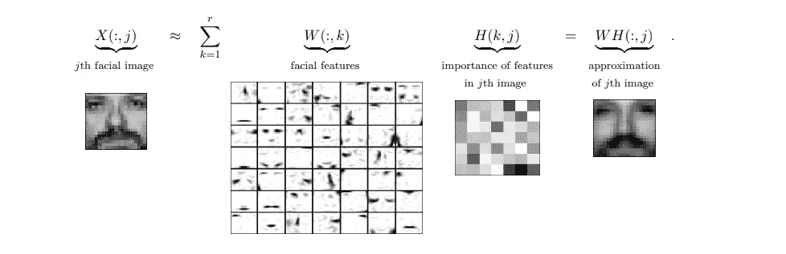
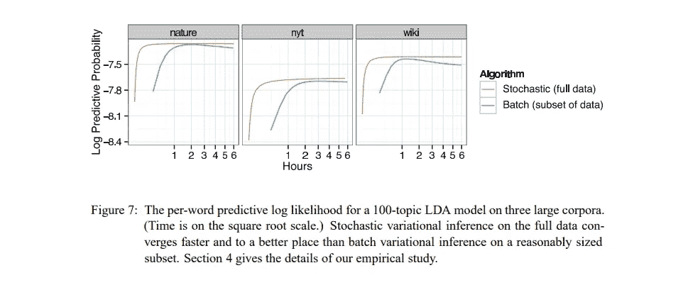

# 使用潜在狄利克雷分配（LDA）进行主题建模的实用指南

> 原文：[`towardsdatascience.com/practical-guide-to-topic-modeling-with-lda-05cd6b027bdf?source=collection_archive---------3-----------------------#2024-01-06`](https://towardsdatascience.com/practical-guide-to-topic-modeling-with-lda-05cd6b027bdf?source=collection_archive---------3-----------------------#2024-01-06)

## 在最多减少 99%的训练时间内获得更好的结果

 [Wicaksono Wijono](https://medium.com/@wwijono?source=post_page---byline--05cd6b027bdf--------------------------------)

·发布于 [Towards Data Science](https://towardsdatascience.com/?source=post_page---byline--05cd6b027bdf--------------------------------) ·14 分钟阅读·2024 年 1 月 6 日

--

潜在狄利克雷分配（简称 LDA）是一种混合成员（“软聚类”）模型，通常用于推断文档讨论的内容。当你阅读本文时，可以轻松推断它是关于机器学习、数据科学、主题建模等方面的。但当你面对上百万个文档时，无法手动阅读并标记每一个文档来提取模式和趋势。你需要像 LDA 这样的机器学习模型来帮助你。

**LDA 即使在你不处理文本数据时也能有用。**文本是*经典的*应用场景，但并不是唯一的。如果你在一家在线商店工作，你可以使用 LDA 推断产品的软分类。在分类设置中，“巧克力”必须归类为“零食”这一类，而 LDA 允许“巧克力”同时归入多个类别，如“零食”、“烘焙”、“饮料”和“酱料”。你还可以将 LDA 应用于点击流数据，根据观察到的用户行为对页面进行分组和分类。

由于 LDA 是一个概率模型，它可以很好地与其他概率模型（如泊松分解）结合使用。你可以通过 LDA 嵌入项目，然后使用 PF**学习用户偏好**。在新闻文章的背景下，这可以为“冷启动”推荐提供帮助，当一篇文章刚发布时（或许用于推送通知？），在新闻变得过时之前。

我的资历？我花了一个学期专注于贝叶斯推理算法，并从头开始编写 LDA 代码，以理解其内部工作原理。之后，我在一家新闻集团工作，创建了一个必须扩展到数百万篇文章的 LDA 管道。在这个规模上，许多小的选择可能决定了模型运行时间是几天还是一年。可以说，我比绝大多数数据科学家更了解 LDA。

在所有那段时间里，我从未遇到过一本能够解释如何*正确*使用 LDA 的资源，特别是在大规模应用时。本文可能是第一个。希望它对你有用，不管你是谁。简而言之：

1.  使用 spaCy 而不是 NLTK 进行分词

1.  使用特定的 scikit-learn 实现的 LDA

1.  将 learning_mode 设置为“在线”

1.  知道哪些超参数范围是合理的

1.  通过随机搜索选择超参数，使用验证熵作为标准

我假设读者已经熟悉 LDA 的工作原理及其作用。许多文章已经对其进行了说明。我不会重复那些容易找到的信息。

免责声明：本文的内容可能已经过时一两年，因为我已经很长时间没有使用 LDA，但我相信一切仍然是准确的。

# 为什么选择潜在狄利克雷分配（LDA）？

LDA 及其相关方法（[NMF](https://scikit-learn.org/stable/modules/generated/sklearn.decomposition.NMF.html)，[PF](https://poismf.readthedocs.io/en/latest/)，[截断 SVD](https://scikit-learn.org/stable/modules/generated/sklearn.decomposition.TruncatedSVD.html) 等）不过是针对计数数据进行修改的高级 [PCA](https://scikit-learn.org/stable/modules/generated/sklearn.decomposition.PCA.html)。 （顺便问一下，你看过这个精彩的 [PCA 解释](https://stats.stackexchange.com/questions/2691/making-sense-of-principal-component-analysis-eigenvectors-eigenvalues) 吗？）LDA 与其他方法的不同之处在于，它通过以下特性创建人类可解释的嵌入，呈现为主题：

+   非负。显然，计数不能为负数，但真正重要的是 **非负性迫使模型学习部分**。我最喜欢的 [短篇论文之一](http://belohlavek.inf.upol.cz/vyuka/Lee-Seung-NMF-1999-p.pdf) 说明了非负性如何迫使模型学习面部的部分，比如鼻子、眼睛、嘴巴等。相比之下，PCA 的加载向量是抽象的，因为你可以从一个部分中减去另一个部分。

从非负矩阵分解中学习到的面部部位。来源：[Gillis (2014)](https://arxiv.org/pdf/1401.5226.pdf)

+   和为 1。LDA 中的嵌入是比例。该模型假设混合成员关系，因为文本是复杂的，且很少仅涉及单一主题。

+   稀疏性。嵌入大多是零。每篇文档预计只会讨论少数几个主题。没有人会写一篇包含 100 个主题的文章。

+   人类可解释的加载向量。在 PCA 和其他嵌入算法中，通常无法明确每个维度的含义。而在 LDA 中，你可以通过查看最高概率的词语（“top n words”）来理解每个维度（“主题”）的含义。

一个常见的误解是 LDA 是一种 NLP 算法。事实上，**只要数据不太稀疏，你可以在任何计数数据上使用 LDA**。LDA 所做的仅仅是创建一个低维度的可解释的计数嵌入。你可以在用户的购买历史或浏览历史上应用 LDA，以推断出不同类型的购物习惯。我过去曾这样使用过，它效果出奇的好。Blei 教授曾在一次研讨会上提到，有一位经济学研究者正是在用 LDA 做类似的实验；那时我感到非常欣慰。

LDA 的输出经常被误解。人们将其当作分类算法，而不是混合归属模型。当 LDA 说一篇文档是 60% 政治和 40% 经济时，它实际上是在说该文档同时是政治和经济的，比例分别是 60% 和 40%。有些人误解为“文档被归类为政治，但模型不太确定”。如果是一篇长篇文章，模型可能*非常*确定这篇文档既是政治也是经济。

也有替代方法，比如[top2vec](https://github.com/ddangelov/Top2Vec)，它的概念上与[word2vec](https://en.wikipedia.org/wiki/Word2vec)相似。非常酷！然而，我认为 LDA 在几个方面优于 top2vec：

+   LDA 是一种多重归属模型，而 top2vec 假设每篇文档只属于一个主题。如果你的语料库很简单，每篇文档都紧扣一个主题，那么 top2vec 是有意义的。

+   top2vec 使用距离来推断主题，这并不符合直观理解。由于[维度诅咒](https://en.wikipedia.org/wiki/Curse_of_dimensionality)的存在，距离这一概念在高维空间中变得模糊不清。那么这些距离意味着什么呢？作为一个过于简化的例子，假设三个主题在一条数轴上：食物 — 体育 — 科学。如果一篇文档讨论的是食品科学，它就位于中间，结果变成了一篇体育文档？实际上，距离在高维空间中并非如此工作，但我的保留意见应该是显而易见的。

# 提示 #1：使用 spaCy 代替 NLTK 进行分词和词形还原

语料库在输入 LDA 之前需要经过处理。如何处理呢？[spaCy](https://spacy.io/) 在业界非常流行，而 [NLTK](https://www.nltk.org/) 在学术界非常受欢迎。它们各有优劣。在工作环境中，NLTK 并不真正可接受——不要因为你在学校用它习惯了就继续使用它。

NLTK 以慢著称。我没有进行过自己的比较，但这个人报告称，使用 spaCy 代替 NLTK 在分词时速度提升了 20 倍。

令人惊讶的是，目前还不清楚 LDA 是否从词干提取或词形还原中受益。我见过不同的观点和实验，结果互有胜负。[这篇论文](https://www.cs.cornell.edu/~xanda/winlp2017.pdf)声称词干提取会使主题更糟。进行词形还原的主要原因是为了使主题更加可解释，通过将词素归结为一个标记。

我不会对是否应该进行词形还原提供意见，但如果你决定进行词形还原，spaCy 的词形还原速度和效果都比 NLTK 更好。在 NLTK 中，我们需要设置一个词性标注管道，然后将其传递给 WordNet 词形还原器，该词形还原器会在词汇数据库中查找单词。spaCy 使用 word2vec 自动推断词性，这样它就能正确地进行词形还原——使用起来更加简单，速度也更快。

使用 spaCy 时，确保使用基于 word2vec 的**en_core_web_lg**，而不是基于 transformer 的 en_core_web_trf 语言模型。虽然 transformer 稍微准确一些（也许准确率提升 1%），但根据 [spaCy 的速度基准测试](https://spacy.io/usage/facts-figures#benchmarks-speed)，它的速度慢了大约 15 倍。我自己在工作中也观察到了这一差距。对于数百万篇文章，transformer 实在太慢了，因为处理所有内容需要几个月的时间才能完成词形还原和分词。

# 提示 #2：使用 scikit-learn，而不要触碰其他包来进行 LDA。

这或许是最重要且最令人惊讶的建议：无条件使用 [sklearn 的 LDA 实现](https://scikit-learn.org/stable/modules/generated/sklearn.decomposition.LatentDirichletAllocation.html)。性能差异简直无法比拟。我们将其与两个流行的 LDA 模型拟合包进行比较：

+   [mallet](https://mimno.github.io/Mallet/topics.html) 使用折叠吉布斯采样，一种 MCMC 算法。（如果你想了解更多关于 MCMC 的内容，可以查看 [我的文章](https://medium.com/towards-data-science/bayesian-inference-algorithms-mcmc-and-vi-a8dad51ad5f5)。）MCMC 以慢和不可扩展而著称。更糟糕的是，吉布斯采样经常卡在局部极值；大多数 NLP 问题是高度多模态的，这使得 mallet 无法应用于真实世界的任务。

+   [gensim](https://radimrehurek.com/gensim/) 使用随机变分推断（SVI），这是随机梯度下降的贝叶斯类比。作为 LDA 更新规则的一部分，gensim 选择精确计算 [digamma 函数](https://en.wikipedia.org/wiki/Digamma_function)，这是一项极为昂贵的操作。而 sklearn 选择了对其进行近似计算，从而实现了 10 到 20 倍的速度提升。更糟糕的是，**gensim 的 SVI 实现是错误的**，没有任何函数参数可以修复它。准确地说：如果你一次性输入整个语料库，gensim 的 SVI 会正常运行；但如果你在每次迭代时提供一个样本，gensim 的 LDA 就永远无法收敛。

这一点关于 gensim 的发现让我很吃惊。它是一个非常流行的包（每月超过 300 万次下载！），专门用于主题建模——它怎么可能比 sklearn 差，sklearn 是一个通用包呢？在工作中，我花了很多天进行故障排除。我深入研究了源代码。结果，我发现源代码的更新方程有错误。

我在学校时从头开始编写了使用 SVI 训练的 LDA。它运行得非常低效（我是数据科学家，不是机器学习工程师！），但输出是正确的。我知道模型在每次迭代时应该如何更新。gensim 的实现是不正确的。仅仅在第一次迭代之后，结果就偏差如此之大，我不得不将手动计算与 gensim 的输出进行比较，才搞清楚出了什么问题。如果你从 100 篇文档中抽样来输入 SVI 的一次迭代，gensim 会认为你的整个语料库仅有 100 篇文档，尽管你是从一百万篇文档中抽样的。你无法在 update()方法中告诉 gensim 语料库的大小。

如果你一次性提供整个语料库，gensim 运行得很好。然而，在工作中，我处理了数百万篇新闻文章，根本无法将所有内容都放入内存。在处理大规模语料库时，gensim 完全失败。

sklearn 的版本实现是正确的。

# 提示 #3：使用随机变分推断（SVI）算法进行训练

既然我们已经确定不应该使用除 sklearn 之外的任何工具，我们将参考[sklearn 的 LDA 函数](https://scikit-learn.org/stable/modules/generated/sklearn.decomposition.LatentDirichletAllocation.html)。我们将特别讨论学习方法参数： “批量”与“在线”([SVI](https://medium.com/towards-data-science/bayesian-inference-algorithms-mcmc-and-vi-a8dad51ad5f5))类似于线性回归中的“[IRLS](https://en.wikipedia.org/wiki/Iteratively_reweighted_least_squares)”与“[SGD](https://en.wikipedia.org/wiki/Stochastic_gradient_descent)”。

线性回归的运行时间为 O(n³)。IRLS 需要一次性处理整个数据集。如果我们有一百万个数据点，IRLS 需要 10¹⁸单位的时间。使用 SGD，我们可以在每次迭代中抽取 1,000 个数据点，并运行 1,000 次迭代来逼近 IRLS 的精确解，这将消耗 10⁹ x 10³ = 10¹²单位的时间。在这种情况下，SGD 的运行速度是 IRLS 的一百万倍！SGD 预计会有一些不完美，因为它只是逼近 IRLS 的最优解，但通常足够接近。

使用 SVI 方法时，那个直觉就不适用了：**“在线”比“批量”更合适，而且运行速度更快**。它是严格更优的。没有任何理由使用“批量”模式。[SVI 论文](https://www.jmlr.org/papers/volume14/hoffman13a/hoffman13a.pdf)深入探讨了这一点：

来源：[Hoffman 等人（2013）](https://arxiv.org/pdf/1206.7051.pdf)

一般来说，“在线”模式的训练时间仅为“批量”模式的 10%，且能获得相同的结果。**为了在大语料库上正确使用“在线”模式，你必须将 total_samples 设置为语料库中所有文档的总数**；否则，如果样本量仅占语料库的一小部分，LDA 模型将无法在合理的时间内收敛。你还需要使用 partial_fit()方法，一次处理一个小批量数据。我将在下一节中讨论其他设置。

# 提示 #4：了解超参数的合理搜索空间

根据 sklearn 的参数，LDA 有六个可调的超参数：

+   **n_components**（默认为 10）：主题的数量。显而易见。

+   **doc_topic_prior**（默认为 1/n_components）：局部参数的先验。贝叶斯先验相当于正则化，等同于用虚假数据进行填充。**doc_topic_prior × n_components**表示每篇文档中添加的虚假词汇数量。如果你分析的是推文，1 到 2 个虚假词汇可能是有意义的，但 1000 个虚假词汇完全没有意义。如果你分析的是短篇小说，1 到 2 个虚假词汇几乎可以忽略不计，而 1000 个虚假词汇则是合理的。请运用你的判断力。通常，除非每篇文档非常长，否则值设置为 1 以下。你的搜索空间可以设置为{0.001, 0.01, 0.1, 1}。

+   **topic_word_prior**（默认为 1/n_components）：全局参数的先验。再说一遍，贝叶斯先验相当于正则化，等同于用虚假数据进行填充。**topic_word_prior × n_components × n_features**表示在任何训练之前，模型中添加的虚假词汇数。n_features 是模型或语料库中标记的数量。如果该乘积为 1000，并且你分析的推文每条平均 10 个词，那么你就会向语料库中添加 100 条虚假推文。请运用你的判断力。

+   **learning_decay**（默认为 0.7）：确定每次迭代时步长的缩小程度。较低的 learning_decay 值使得步长更慢地缩小——模型可以在多模态目标函数中探索更多模式，但收敛速度较慢。**你必须将 learning_decay 设置为 0.5 < learning_decay ≤ 1，才能使 LDA 收敛**（这适用于任何 SGD 算法，必须满足[Robbins-Monro 条件](https://www.columbia.edu/~ww2040/8100F16/RM51.pdf)）。有趣的是，gensim 的默认值是 0.5，这会误导不了解的用户，训练一个无法收敛的模型。从经验上来看，0.7 到 0.8 之间的值能获得最佳结果。

+   **learning_offset**（默认为 10）：确定初始步长。较高的值会导致较小的初始步长。从经验来看，当 batch_size 相对于语料库中的文档数量较小时，模型会从较高的 learning_offset 中受益，通常设置在 100 以上。你希望采取较大的步伐。搜索{1, 2, 3, 4}的效果不如搜索{1, 10, 100, 1000}。

+   **batch_size**（默认值 = 128）：每次迭代时 SVI 看到的文档数量。可以将其视为一个不精确的指南针。batch_size 越大，你对自己朝正确方向迈步的确定性就越强，但计算的时间也会越长。根据我的经验，128 太小了，因为步骤往往走错方向，这使得模型更难以收敛。我推荐一个大约 2–10 千的 batch_size，SVI 可以轻松处理。如果计算时间不成问题，更大的 batch_size 几乎总是更好。在超参数调优时，我通常会在心里设定一个固定数量的（带替换的）文档，比如 500k，并设置运行 50 次 batch_size 为 10,000 的迭代，或 250 次 batch_size 为 2,000 的迭代，以比较哪个设置能在计算上获得更多的回报。然后，我会保持这些设置，进行更多的迭代训练。你需要为`partial_fit()`方法提供一个随机采样的文档，大小为 batch_size。

# 提示#5：使用随机搜索和熵损失调优超参数

**在如今的时代，随机搜索应该是超参数调优的默认算法。** 在仅 60 次迭代内，随机搜索有超过 95%的概率找到搜索空间中最佳 5%的超参数（[证明](https://stats.stackexchange.com/questions/496098/does-random-search-depend-on-the-number-of-dimensions-searched/496125)）。当然，如果你的搜索空间完全错过了最佳区域，你永远无法获得良好的性能。

[这篇论文](https://www.jmlr.org/papers/volume13/bergstra12a/bergstra12a.pdf)由 Bergstra 和 Bengio 撰写，说明了随机搜索能够合理地击败网格搜索。网格搜索对不影响特定用例的超参数赋予了过多的关注。如果两个超参数中只有一个对目标有显著影响，那么一个 3x3 的网格仅会尝试那个超参数的三个值；而 9 点的随机搜索则会尝试该超参数的九个不同值，这给了你更多的机会去找到一个优秀的值。网格搜索也常常会忽略那些表现优良的狭窄区域。

使用 SVI 拟合的 LDA 有六个可调超参数（如果使用全批次，则只有三个）。如果我们想为每个超参数尝试少至三个值，那么我们的网格搜索将经历 3⁶ = 729 次迭代。使用随机搜索将其减少到 60 次（通常）能获得更好的结果，这显而易见。

随机搜索应该配置为“智能地”采样。`n_components`可以从离散均匀分布中采样，但其他超参数，如`doc_topic_prior`，应从对数正态分布或对数均匀分布中采样，也就是说，与其在{1, 2, 3, 4}中采样，不如在{0.01, 0.1, 1, 10}之间均匀采样更为智能。

如果你想稍微比随机搜索做得更好，你可以通过[hyperopt 包](https://github.com/hyperopt/hyperopt/wiki/FMin)使用 TPE。与使用高斯过程的贝叶斯优化不同，TPE 设计上更适合混合使用连续和离散（n_components）超参数。然而，考虑到投入的工作量，它带来的改进非常有限，因此在大多数情况下不值得使用。

好的，现在我们已经确认随机搜索比网格搜索更好……那我们如何知道哪个超参数组合表现最佳呢？

主题建模有一个特定的度量指标：[主题一致性](https://fse.studenttheses.ub.rug.nl/28618/1/s2863685_alfiuddin_hadiat_CCS_thesis.pdf)。它有多种形式，例如 UMass 和 UCI。根据我的经验，一致性在实际应用中并不是一个好的度量标准，因为它通常无法在验证集上计算。当一个词汇没有出现在验证集中时，这个度量就会试图除以零。主题一致性对于超参数调优是没用的。

传统上，语言模型的评估使用[困惑度](https://en.wikipedia.org/wiki/Perplexity)，定义为 2^熵。然而，当超参数不好时，这个数值可能非常大，导致数值溢出错误。sklearn 的 LDA 有一个[score](https://scikit-learn.org/stable/modules/generated/sklearn.decomposition.LatentDirichletAllocation.html#sklearn.decomposition.LatentDirichletAllocation.score)方法，它是负熵的近似值。**使用 sklearn 的 score**。分数越高越好。（如果 score 方法仍然遇到溢出问题，你将需要自己创建对数困惑度方法。）

# 提示：你可以为主题创建先验

LDA 的输出可能非常不一致且随机。这是任何 NLP 问题的固有特性。目标函数是多模态的，而 SVI LDA 只适合于一个单一模式。即使使用完全相同的设置重新运行 LDA，也可能得到不同的主题。

有时候，我们需要更好地控制 LDA 所学习的主题。例如，业务相关方可能需要确保存在十个特定的主题。你*可以*尝试一遍又一遍地运行 LDA，直到这十个主题出现，但你更有可能在玩轮盘时运气更好。

解决方案？**尽管 sklearn 文档中说 topic_word_prior 接受一个单一的浮动值，它其实可以接受一个矩阵！** 我深入源码发现，sklearn 实际上创建了一个矩阵，矩阵中的所有元素都是输入的浮动值。然而，如果你提供了正确维度的矩阵，LDA 会使用你提供的矩阵。

一个好的先验会在模型训练开始之前，通过为每个文档中的某些单词进行颜色编码。来源：[rawpixel](https://www.rawpixel.com/image/5921950/photo-image-public-domain-hand-kid)

假设你需要一个篮球话题和一个高尔夫话题。你可以将一个话题的先验填充为包含高概率篮球相关词汇的分布。同样地，处理高尔夫话题，然后将另一个话题的先验填充为均匀分布。当你训练模型时，LDA 会*更有可能*生成这两个话题。

我说的是*更有可能*。LDA 是通过随机方法拟合的。我们无法根据初始设置预料它最终会在哪里结束。

然而，通过对设置进行一些调整，我们可以增加这些话题出现的可能性：提高 learning_offset 值，并增加 learning_decay 值，同时进行更多迭代（因为模型变得更慢，收敛需要更多时间）。相反，这两个超参数的低值将立即抹去你设置的任何先验。

# 最后

希望本文能清楚地表明，99%的训练时间减少并不是为了吸引眼球。一个对 LDA 知之甚少的人，合理的做法是使用 NLTK 进行分词，采用 gensim 的随机变分推断算法，然后在一个低效的搜索空间内进行网格搜索。从 NLTK 切换到 spaCy 可以提升 8 到 20 倍的速度，但这是模型管道中的一个单独且相对较小的部分。我们将重点关注模型训练方面。遵循本文中的所有建议可以带来以下改进：

+   对 LDA 不太熟悉的人可能会使用 gensim。sklearn 对目标函数的实现本身就能将训练时间缩短 10 到 20 倍。我们保守估计，它可以将训练时间缩短至原来的 10%。

+   或者，LDA 不熟悉的人可能会从 sklearn 开始，但使用‘批处理’模式。从全批次变分推断切换到随机变分推断可以将时间缩短 10 倍。这也将训练时间缩短至 10%。

+   我们需要调优六个超参数。如果我们想尝试每个参数的 3 个不同值并进行网格搜索，那将需要 729 次迭代。而随机搜索只需要 60 次迭代就能表现得很好，而且它很可能会超过网格搜索。这相当于减少了 10 倍的计算量，将训练时间缩短到原来的 1%。

将模型训练时间减少 100 倍并不是唯一的结果。如果你按照本文中的建议进行操作，模型应该会生成更合适的主题，使其更有意义。

数据科学的很多部分仅仅是对算法的表面理解，并随机地投掷东西，看看什么会有效。专业知识常常被标签化为过于学究（尤其在“科学”领域！）。然而，深入理解让我们能够更加高效地使用工具，我敦促大家深入研究我们选择使用的工具。
