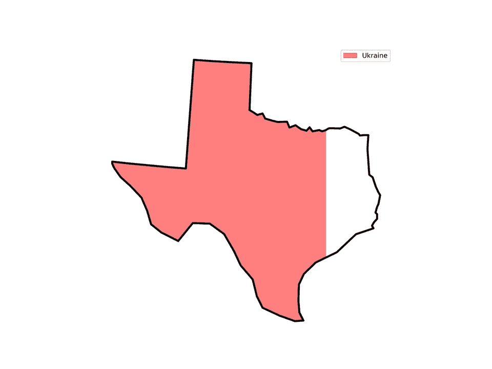
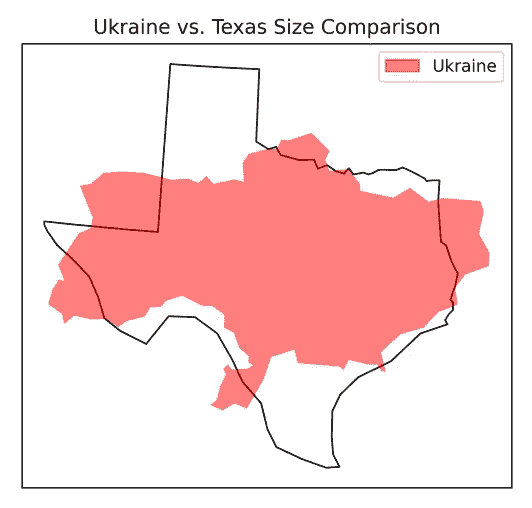

# 精确比较地理区域与 GeoPandas

> 原文：[`towardsdatascience.com/precisely-compare-geographical-regions-with-geopandas-b7d4acadf83c?source=collection_archive---------7-----------------------#2024-10-08`](https://towardsdatascience.com/precisely-compare-geographical-regions-with-geopandas-b7d4acadf83c?source=collection_archive---------7-----------------------#2024-10-08)

## 快速成功的数据科学

## 用面积测量填充地图

 [Lee Vaughan](https://medium.com/@lee_vaughan?source=post_page---byline--b7d4acadf83c--------------------------------)

·发表于[Towards Data Science](https://towardsdatascience.com/?source=post_page---byline--b7d4acadf83c--------------------------------) ·8 分钟阅读·2024 年 10 月 8 日

--

一张填充了乌克兰地区的德克萨斯州地图（作者提供）

我之前写过一篇关于如何通过重叠地图来比较地理区域（如国家和州）的大小的文章。以下是一个使用德克萨斯州和乌克兰作为例子的示范：

重叠的德克萨斯州和乌克兰地图（作者提供）

这种方法有效，除非地区的形状差异非常显著。例如，在下图中，哪个更大：智利还是德克萨斯州？

重叠的德克萨斯州和智利地图（作者提供）

这个问题促使 Medium 成员[Anurag](https://medium.com/@gusainanurag58)在文章中留下了以下（转述）评论：

> “是否可以用德克萨斯州的面积来填充其他国家的面积？不同于仅仅将两个国家重叠在一起，我认为这样会更容易观察和理解。”
