# 使用线性回归预测房价（Python 实现）

> 原文：[`towardsdatascience.com/predict-housing-price-using-linear-regression-in-python-bfc0fcfff640?source=collection_archive---------2-----------------------#2024-11-06`](https://towardsdatascience.com/predict-housing-price-using-linear-regression-in-python-bfc0fcfff640?source=collection_archive---------2-----------------------#2024-11-06)

## 通过波士顿住房数据集，讲解成本计算、梯度下降和正则化

[](https://medium.com/@yqelisa?source=post_page---byline--bfc0fcfff640--------------------------------)[](https://towardsdatascience.com/?source=post_page---byline--bfc0fcfff640--------------------------------) [Elisa Yao](https://medium.com/@yqelisa?source=post_page---byline--bfc0fcfff640--------------------------------)

·发表于 [Towards Data Science](https://towardsdatascience.com/?source=post_page---byline--bfc0fcfff640--------------------------------) ·14 分钟阅读·2024 年 11 月 6 日

--

当大语言模型（LLMs）因其复杂性最近引起人们的广泛关注时，线性回归显得有些过时和简单。那么，了解它还有意义吗？

我的答案是“有”，因为它是更复杂模型的基石，包括大语言模型（LLMs）。

创建一个线性回归模型可以像运行三行代码一样简单：

```py
from sklearn.linear_model import LinearRegression
regressor = LinearRegression()
regressor.fit(X_train, y_train)
```

然而，这并没有展示模型的结构。为了得到最优的建模结果，我们需要**了解背后发生了什么**。在本文中，我将逐步分解如何使用一个简单的“波士顿住房”数据集在 Python 中实现线性回归的**过程**。

# 什么是线性回归

**线性**——当绘制在二维空间中时，如果展示预测变量 *x* 和预测结果 *y* 之间关系的点沿直线散布，那么我们认为这种关系可以用这条直线表示。

**回归**——一种统计方法，用于估算一个或多个预测变量（自变量）与一个预测变量（因变量）之间的关系。

**线性回归**将预测变量描述为预测变量的线性组合。抽象这种关系的直线称为**最佳拟合线**，下图中的红色直线即为示例。

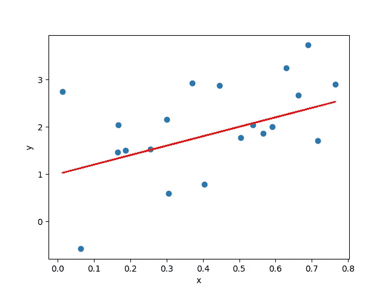

线性关系和最佳拟合线示例（图源：作者）

# 数据描述

为了将我们的目标集中在展示 Python 中线性回归的步骤上，我选择了波士顿住房数据集，数据集内容如下：

+   **简洁**——便于调试

+   **简单** — 让我们花更少的时间理解数据或进行特征工程

+   **清洁** — 需要最小的数据清洗

数据集最初由[Harrison 和 Rubinfeld 的（1978 年）《享乐住房价格研究》](https://www.law.berkeley.edu/files/Hedonic.PDF)整理。它最初包含：

+   13 个预测变量 — 包括人口统计属性、环境属性和经济属性

> - CRIM — 每个城镇的人均犯罪率
> 
> - ZN — 用于建造大于 25,000 平方英尺地块的住宅用地比例
> 
> - INDUS — 每个城镇非零售业务用地的比例
> 
> - CHAS — 查尔斯河虚拟变量（如果区域边界为河流则为 1；否则为 0）
> 
> - NOX — 氮氧化物浓度（每 1000 万分之一）
> 
> - RM — 每个住宅的平均房间数
> 
> - AGE — 1940 年之前建造的自有住宅单位比例
> 
> - DIS — 到五个波士顿就业中心的加权距离
> 
> - RAD — 通往放射状高速公路的可达性指数
> 
> - TAX — 每$10,000 的全值房产税税率
> 
> - PTRATIO — 每个城镇的师生比
> 
> - LSTAT — 低收入群体的百分比

+   1 个目标变量（变量名为“MEDV”）— 所有者自住住房的中位数价值（以$1000 为单位），位于特定位置

你可以[在这里](https://faculty.tuck.dartmouth.edu/images/uploads/faculty/business-analytics/Boston_Housing.xlsx)下载原始数据。

使用`pandas`加载数据到 Python 中：

```py
import pandas as pd

# Load data
data = pd.read_excel("Boston_Housing.xlsx")
```

查看数据集的行数（观察值）和列数（变量）：

```py
data.shape
# (506, 14)
```

我们练习中的**建模问题**是：给定某位置的属性，尝试预测该位置的**中位住房价格**。

我们使用两个单独的对象 *x* 和 *y* 来存储目标变量和预测变量，遵循数学和机器学习的符号约定。

```py
# Split up predictors and target
y = data['MEDV']
X = data.drop(columns=['MEDV'])
```

**可视化**数据集，通过直方图和散点图：

```py
import numpy as np
import matplotlib.pyplot as plt

# Distribution of predictors and relationship with target
for col in X.columns:
    fig, ax = plt.subplots(1, 2, figsize=(6,2))
    ax[0].hist(X[col])
    ax[1].scatter(X[col], y)
    fig.suptitle(col)
    plt.show()
```

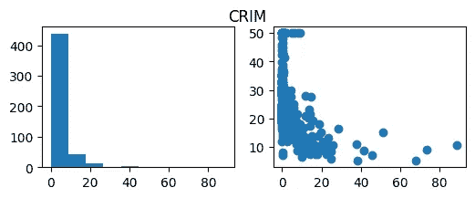

直方图和散点图的示例输出（图源：作者）

可视化变量的目的是查看是否需要对变量进行**转换**，并识别各个变量与目标之间的**关系类型**。例如，目标可能与一些预测变量存在线性关系，但与其他变量存在线性或多项式关系。这进一步**推断出使用哪些模型**来解决问题。

# 成本计算

模型捕捉预测变量与目标之间关系的好坏，可以通过预测结果与真实值的**偏差**来**衡量**。量化这种偏差的函数被称为**成本函数**。

**成本**越小，模型越能更好地捕捉预测变量与目标之间的关系。这意味着，从数学角度看，**模型训练**过程的目标是**最小化**成本函数的结果。

对于回归问题，有不同的成本函数可以使用：平方误差和（SSE）、均方误差（MSE）、平均绝对误差（MAE）……

**均方误差（MSE）**是最常用的线性回归成本函数，也是许多 R 和 Python 统计包中的默认成本函数。其数学表达式如下：

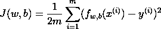

注意：分母中的 2 是为了使计算更加简洁。

为了使用均方误差（MSE）作为我们的成本函数，我们可以在 Python 中创建以下函数：

```py
def compute_cost(X, y, w, b): 
    m = X.shape[0] 

    f_wb = np.dot(X, w) + b
    cost = np.sum(np.power(f_wb - y, 2))

    total_cost = 1 / (2 * m) * cost

    return total_cost
```

# 梯度下降

**梯度**——函数在某一点的切线斜率。在多变量微积分中，梯度是一个向量，指向某一点上坡度最陡的方向。

**下降**——朝着成本函数的最小值移动。

**梯度下降**——一种迭代调整参数的小步法，通过梯度的引导，达到函数的最低点。这是一种**数值**方法，用于线性回归中获得所需的参数。

相比之下，还有一种方法可以**解析**求解最优参数——普通最小二乘法（OLS）。有关如何在 Python 中实现的详细信息，请参见[这篇 GeekforGeeks 文章](https://www.geeksforgeeks.org/linear-regression-python-implementation/)。实际上，由于计算复杂度较高，它不像梯度下降方法那样具有良好的可扩展性。因此，在我们的案例中，我们使用梯度下降。

在每次梯度下降迭代中：

+   **梯度**决定了**下降的方向**

+   **学习率**决定了**下降的幅度**

为了计算梯度，我们需要理解有 2 个参数会改变成本函数的值：

+   ***w***——每个预测变量的权重向量

+   ***b***——偏置项

注意：由于所有观察值（*xⁱ*）在训练过程中保持不变，它们会对计算结果产生影响，但它们是常数，而不是变量。

数学上，梯度是：

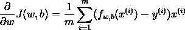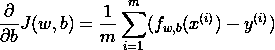

相应地，我们在 Python 中创建以下函数：

```py
def compute_gradient(X, y, w, b):
    m, n = X.shape
    dj_dw = np.zeros((n,))
    dj_db = 0.

    err = (np.dot(X, w) + b) - y
    dj_dw = np.dot(X.T, err)    # dimension: (n,m)*(m,1)=(n,1)
    dj_db = np.sum(err)

    dj_dw = dj_dw / m
    dj_db = dj_db / m

    return dj_db, dj_dw
```

使用这个函数，我们得到成本函数的梯度，并在设定的学习率下，迭代更新参数。

由于它是一个逻辑循环，我们需要定义停止条件，可能是以下任意一种：

+   我们达到了设定的**迭代次数**

+   **成本**降低到某个阈值以下

+   **改进**低于某个阈值

如果我们选择迭代次数作为停止条件，我们可以将梯度下降过程写成：

```py
def gradient_descent(X, y, w_in, b_in, cost_function, gradient_function, alpha, num_iters):
    J_history = []
    w = copy.deepcopy(w_in)
    b = b_in

    for i in range(num_iters):
        dj_db, dj_dw = gradient_function(X, y, w, b)

        w = w - alpha * dj_dw
        b = b - alpha * dj_db

        cost = cost_function(X, y, w, b)
        J_history.append(cost)

        if i % math.ceil(num_iters/10) == 0:
            print(f"Iteration {i:4d}: Cost {J_history[-1]:8.2f}")

    return w, b, J_history
```

将其应用于我们的数据集：

```py
iterations = 1000
alpha = 1.0e-6

w_out, b_out, J_hist = gradient_descent(X_train, y_train, w_init, b_init, compute_cost, compute_gradient, alpha, iterations)
```

```py
Iteration    0: Cost   169.76
Iteration  100: Cost   106.96
Iteration  200: Cost   101.11
Iteration  300: Cost    95.90
Iteration  400: Cost    91.26
Iteration  500: Cost    87.12
Iteration  600: Cost    83.44
Iteration  700: Cost    80.15
Iteration  800: Cost    77.21
Iteration  900: Cost    74.58
```

我们可以使用以下函数可视化成本随着迭代次数增加而下降的过程：

```py
def plot_cost(data, cost_type):
    plt.figure(figsize=(4,2))
    plt.plot(data)
    plt.xlabel("Iteration Step")
    plt.ylabel(cost_type)
    plt.title("Cost vs. Iteration")
    plt.show() 
```

这是我们训练过程的图示：

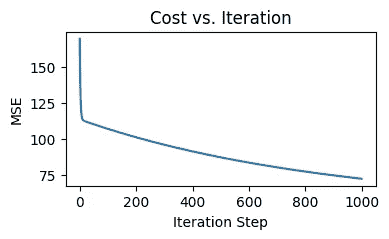

成本函数值随迭代次数变化的情况（图源：作者）

# 预测

进行预测本质上是将模型应用于我们关注的数据集，以获得输出值。这些值是**模型“认为”** **在给定一组预测值的情况下，目标值应该是什么**。

在我们的案例中，我们应用线性函数：

```py
def predict(X, w, b):
    p = np.dot(X, w) + b
    return p
```

使用以下代码获取预测结果：

```py
y_pred = predict(X_test, w_out, b_out)
```

# 结果评估

我们如何评估模型的表现？

一种方法是通过成本函数，如前所述：

```py
def compute_mse(y1, y2):
    return np.mean(np.power((y1 - y2),2))
```

```py
mse = compute_mse(y_test, y_pred)
print(mse)
```

这是我们在测试数据集上的均方误差（MSE）：

```py
132.83636802687786
```

另一种方法更为直观——将预测值与实际值进行可视化。如果模型做出完美预测，那么`y_test`的每个元素都应该等于`y_pred`的相应元素。如果我们将`y_test`绘制在*x*轴上，`y_pred`绘制在*y*轴上，这些点将形成一条**对角线**。

这是我们用于比较的自定义绘图函数：

```py
def plot_pred_actual(y_actual, y_pred):
    x_ul = int(math.ceil(max(y_actual.max(), y_pred.max()) / 10.0)) * 10
    y_ul = x_ul

    plt.figure(figsize=(4,4))
    plt.scatter(y_actual, y_pred)
    plt.xlim(0, x_ul)
    plt.ylim(0, y_ul)
    plt.xlabel("Actual values")
    plt.ylabel("Predicted values")
    plt.title("Predicted vs Actual values")
    plt.show()
```

在应用到我们的训练结果后，我们发现这些点看起来与直线完全不符：

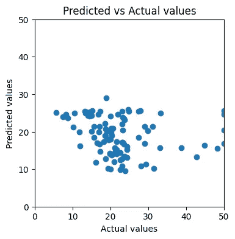

预测值与实际值的散点图（图像来源：作者）

这应该引发我们的思考：我们如何改进模型的表现？

# 特征缩放

梯度下降过程对特征的尺度敏感。如左侧的等高线图所示，当不同特征的学习率保持一致时，如果特征的尺度不同，达到全局最小值的路径可能会在成本函数上来回跳跃。

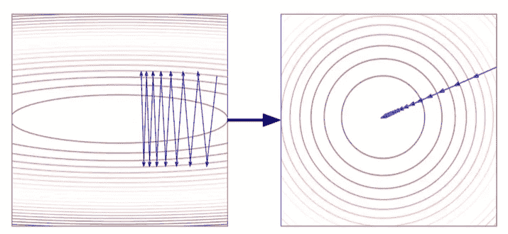

当特征未缩放与已缩放时，成本函数达到全局最小值的路径（来源：[DataMListic](https://www.youtube.com/watch?v=CFA7OFYDBQY)）

在将所有特征缩放到相同的范围后，我们可以观察到成本函数到达全局最小值的路径更加平滑和直接。

进行特征缩放的方法有很多种，这里我们选择**标准化**将所有特征转化为均值为 0，标准差为 1。

下面是如何在 Python 中标准化特征：

```py
from sklearn.preprocessing import StandardScaler

standard_scaler = StandardScaler()
X_train_norm = standard_scaler.fit_transform(X_train)
X_test_norm = standard_scaler.transform(X_test)
```

现在我们在标准化数据集上进行梯度下降：

```py
iterations = 1000
alpha = 1.0e-2

w_out, b_out, J_hist = gradient_descent(X_train_norm, y_train, w_init, b_init, compute_cost, compute_gradient, alpha, iterations)

print(f"Training result: w = {w_out}, b = {b_out}")
print(f"Training MSE = {J_hist[-1]}")
```

```py
Training result: w = [-0.87200786  0.83235112 -0.35656148  0.70462672 -1.44874782  2.69272839
 -0.12111304 -2.55104665  0.89855827 -0.93374049 -2.151963   -3.7142413 ], b = 22.61090500500162
Training MSE = 9.95513733581214
```

与上轮训练相比，我们在 200 次迭代之前获得了更陡峭且平滑的成本下降：


标准化数据集上每次迭代的成本（图像来源：作者）

如果我们再次绘制预测值与实际值的图像，看到的点会更加接近一条直线：


在标准化数据集上，预测值与实际值的散点图（图像来源：作者）

为了量化模型在测试集上的表现：

```py
mse = compute_mse(y_test, y_pred)
print(f"Test MSE = {mse}")
```

```py
Test MSE = 35.66317674147827
```

我们看到均方误差从 132.84 下降到 35.66！我们还可以做些什么来进一步提高模型？

# 正则化 — 岭回归

我们注意到，在最后一轮训练中，训练集的 MSE 为 9.96，测试集的 MSE 为 35.66。我们能否将测试集的表现推向更接近训练集的水平？

这里是**正则化**。它惩罚大参数，防止模型对训练集过于拟合。

正则化主要有两种流行方式：

+   **L1 正则化** — 使用权重的 L1 范数（**绝对值**，也称为“曼哈顿范数”）作为惩罚项。

+   **L2 正则化** — 使用权重的 L2 范数（**平方值**，也称为“欧几里得范数”）作为惩罚项。

让我们首先尝试**岭回归**，它使用 L2 正则化作为模型的新版本。其梯度下降过程比**LASSO 回归**（使用 L1 正则化）更容易理解。

带 L1 正则化的损失函数如下所示：

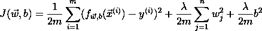

**Lambda** 控制惩罚的程度。当 lambda 较大时，惩罚程度较高，模型趋向于欠拟合。

我们可以将计算转化为以下函数：

```py
def compute_cost_ridge(X, y, w, b, lambda_ = 1): 
    m = X.shape[0] 

    f_wb = np.dot(X, w) + b
    cost = np.sum(np.power(f_wb - y, 2))    

    reg_cost = np.sum(np.power(w, 2))

    total_cost = 1 / (2 * m) * cost + (lambda_ / (2 * m)) * reg_cost

    return total_cost
```

对于梯度下降过程，我们使用以下函数来计算带正则化的梯度：

```py
def compute_gradient_ridge(X, y, w, b, lambda_):
    m = X.shape[0]

    err = np.dot(X, w) + b - y
    dj_dw = np.dot(X.T, err) / m + (lambda_ / m) * w
    dj_db = np.sum(err) / m

    return dj_db, dj_dw
```

将这两步合并在一起，我们得到岭回归的梯度下降函数：

```py
def gradient_descent(X, y, w_in, b_in, cost_function, gradient_function, alpha, lambda_=0.7, num_iters=1000):
    J_history = []
    w = copy.deepcopy(w_in)
    b = b_in

    for i in range(num_iters):
        dj_db, dj_dw = gradient_function(X, y, w, b, lambda_)

        w = w - alpha * dj_dw
        b = b - alpha * dj_db

        cost = cost_function(X, y, w, b, lambda_)
        J_history.append(cost)

        if i % math.ceil(num_iters/10) == 0:
            print(f"Iteration {i:4d}: Cost {J_history[-1]:8.2f}")

    return w, b, J_history
```

在我们的标准化数据集上训练模型：

```py
iterations = 1000
alpha = 1.0e-2
lambda_ = 1

w_out, b_out, J_hist = gradient_descent(X_train_norm, y_train, w_init, b_init, compute_cost_ridge, compute_gradient_ridge, alpha, lambda_, iterations)
```

```py
print(f"Training result: w = {w_out}, b = {b_out}")
print(f"Training MSE = {J_hist[-1]}")
```

```py
Training result: w = [-0.86996629  0.82769399 -0.35944104  0.7051097  -1.43568137  2.69434668
 -0.12306667 -2.53197524  0.88587909 -0.92817437 -2.14746836 -3.70146378], b = 22.61090500500162
Training MSE = 10.005991756561285
```

训练的损失略高于我们之前的模型版本。

学习曲线看起来与上一轮的结果非常相似：

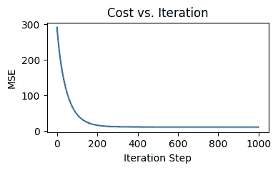

岭回归每次迭代的成本（作者提供的图片）

预测值与实际值的图几乎与我们从上一轮得到的结果相同：


岭回归的预测值与实际值的散点图（作者提供的图片）

我们得到了测试集的均方误差（MSE）为 35.69，稍微高于没有正则化时的值。

# 正则化 — LASSO 回归

最后，让我们尝试 LASSO 回归！LASSO 代表**最小绝对收缩和选择算子**。

这是带有 L2 正则化的损失函数：

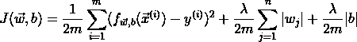

LASSO 回归训练过程中复杂的地方在于，绝对值函数的导数在*w=0*时是未定义的。因此，实际上在 LASSO 回归中使用**坐标下降法**。它一次专注于一个坐标，找到最小值后再切换到下一个坐标。

下面是我们在 Python 中实现的方式，灵感来自于[Sicotte (2018)](https://xavierbourretsicotte.github.io/lasso_implementation.html)和[D@Kg 的笔记本（2022）](https://www.kaggle.com/code/ddatad/coordinate-descent-for-lasso-normal-regression/notebook)。

首先，我们定义软阈值函数，这是单变量优化问题的解：

```py
def soft_threshold(rho, lamda_):
    if rho < - lamda_:
        return (rho + lamda_)
    elif rho >  lamda_:
        return (rho - lamda_)
    else: 
        return 0
```

第二步，计算预测的残差：

```py
def compute_residuals(X, y, w, b):
    return y - (np.dot(X, w) + b)
```

使用残差来计算 rho，这是子导数：

```py
def compute_rho_j(X, y, w, b, j):
    X_k = np.delete(X, j, axis=1)    # remove the jth element
    w_k = np.delete(w, j)    # remove the jth element

    err = compute_residuals(X_k, y, w_k, b)

    X_j = X[:,j]
    rho_j = np.dot(X_j, err)

    return rho_j
```

将所有内容整合在一起：

```py
def coordinate_descent_lasso(X, y, w_in, b_in, cost_function, lambda_, num_iters=1000, tolerance=1e-4):
    J_history = []
    w = copy.deepcopy(w_in)
    b = b_in
    n = X.shape[1]

    for i in range(num_iters):
        # Update weights
        for j in range(n):
            X_j = X[:,j]
            rho_j = compute_rho_j(X, y, w, b, j)
            w[j] = soft_threshold(rho_j, lambda_) / np.sum(X_j ** 2)

        # Update bias
        b = np.mean(y - np.dot(X, w))
        err = compute_residuals(X, y, w, b)

        # Calculate total cost
        cost = cost_function(X, y, w, b, lambda_)
        J_history.append(cost)

        if i % math.ceil(num_iters/10) == 0:
            print(f"Iteration {i:4d}: Cost {J_history[-1]:8.2f}")

        # Check convergence
        if np.max(np.abs(err)) < tolerance:
            break

    return w, b, J_history
```

将其应用到我们的训练集：

```py
iterations = 1000
lambda_ = 1e-4
tolerance = 1e-4

w_out, b_out, J_hist = coordinate_descent_lasso(X_train_norm, y_train, w_init, b_init, compute_cost_lasso, lambda_, iterations, tolerance)
```

与岭回归的梯度下降过程相比，训练过程迅速收敛：

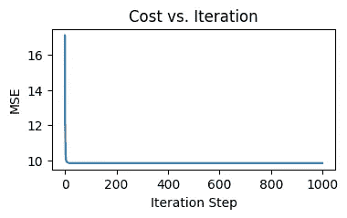

LASSO 回归每次迭代的成本（图像来源：作者）

然而，训练结果没有显著改善：

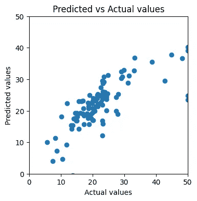

LASSO 回归的预测值与实际值的散点图（图像来源：作者）

最终，我们实现了 34.40 的均方误差（MSE），这是我们尝试的所有方法中最低的。

# 解释结果

我们如何用人类语言解释模型训练结果？让我们以 LASSO 回归的结果为例，因为它在我们尝试的模型变化中表现最佳。

我们可以通过打印在上一节中获得的`w_out`和`b_out`来得到**权重**和**偏差**：

```py
print(f"Training result: w = {w_out}, b = {b_out}")
```

```py
Training result: w = [-0.86643384  0.82700157 -0.35437324  0.70320366 -1.44112303  2.69451013
 -0.11649385 -2.53543865  0.88170899 -0.92308699 -2.15014264 -3.71479811], b = 22.61090500500162
```

在我们的案例中，有 13 个预测变量，因此该数据集有 13 个维度。在每个维度中，我们可以将预测变量`x_i`与目标变量`y`绘制成散点图。回归线的**斜率**即为权重`w_i`。

具体来说，第一维度是*“CRIM — 按城镇计算的每人犯罪率”*，而我们的`w_1`是-0.8664。这意味着，`x_i`每增加一个单位，`y`预计将**减少**-0.8664 个单位。

请注意，在我们运行训练过程之前，已经对数据集进行了**缩放**，因此现在我们需要**反转**这一过程，以便获得预测变量*“按城镇计算的每人犯罪率”*与目标变量*“特定位置上业主自住住房的中位数价格（单位：$1000）”*之间的直观关系。

为了反转缩放过程，我们需要获得比例向量：

```py
print(standard_scaler.scale_)
```

```py
[8.12786482e+00 2.36076347e+01 6.98435113e+00 2.53975353e-01
 1.15057872e-01 6.93831576e-01 2.80721481e+01 2.07800639e+00
 8.65042138e+00 1.70645434e+02 2.19210336e+00 7.28999160e+00]
```

在这里我们找到了我们第一个预测模型所用的比例：8.1278。我们将权重-0.8664 除以比例 8.1278，得到**-0.1066**。

**这意味着：**当其他因素保持不变时，如果每人犯罪率**增加**1 个百分点，该位置的中位数住房价格将**下降**$1000 * (-0.1066) = $106.6。

# 总结

本文揭示了在 Python 中实现线性回归的详细过程，超越了仅仅调用高阶`scikit-learn`函数。

+   我们研究了回归的目标——最小化成本函数，并在 Python 中编写了成本函数。

+   我们逐步分解了梯度下降过程。

+   我们创建了绘图函数来可视化训练过程并评估结果。

+   我们讨论了提高模型性能的方法，并发现 LASSO 回归在我们尝试的模型中取得了最低的测试均方误差（MSE）。

+   最后，我们使用一个预测变量作为示例来说明如何解释训练结果。

# 参考文献

[1] A. Ng, *监督式机器学习：回归与分类*（2022 年），[`www.coursera.org/learn/machine-learning`](https://www.coursera.org/learn/machine-learning)

[2] D. Harrison 和 D. L. Rubinfeld, *居住性住房价格与对清洁空气的需求*（1978 年），[`www.law.berkeley.edu/files/Hedonic.PDF`](https://www.law.berkeley.edu/files/Hedonic.PDF)

[3] *线性回归（Python 实现）*（2024），[`www.geeksforgeeks.org/linear-regression-python-implementation/`](https://www.geeksforgeeks.org/linear-regression-python-implementation/)

[4] *为什么我们要在机器学习中进行特征缩放*（2022），[`www.youtube.com/watch?v=CFA7OFYDBQY`](https://www.youtube.com/watch?v=CFA7OFYDBQY)

[5] X. Sicotte, *Lasso 回归：坐标下降法实现*（2018），[`xavierbourretsicotte.github.io/lasso_implementation.html`](https://xavierbourretsicotte.github.io/lasso_implementation.html)

[6] D@Kg, *LASSO 与普通回归的坐标下降法*（2022），[`www.kaggle.com/code/ddatad/coordinate-descent-for-lasso-normal-regression/notebook`](https://www.kaggle.com/code/ddatad/coordinate-descent-for-lasso-normal-regression/notebook)

[7] Fairlearn，*重新审视波士顿房价数据集*，[`fairlearn.org/main/user_guide/datasets/boston_housing_data.html#revisiting-the-boston-housing-dataset`](https://fairlearn.org/main/user_guide/datasets/boston_housing_data.html#revisiting-the-boston-housing-dataset)

[8] V. Rathod, *关于波士顿房价数据集的所有知识*（2020），[`rpubs.com/vidhividhi/LRversusDT`](https://rpubs.com/vidhividhi/LRversusDT)

[9] A. Gupta, *机器学习中的正则化*（2023），[`www.geeksforgeeks.org/gradient-descent-in-linear-regression/`](https://www.geeksforgeeks.org/gradient-descent-in-linear-regression/)

[10] 墨尔本大学，*线性回归中的解释变量重新缩放*，[`scc.ms.unimelb.edu.au/resources/reporting-statistical-inference/rescaling-explanatory-variables-in-linear-regression`](https://scc.ms.unimelb.edu.au/resources/reporting-statistical-inference/rescaling-explanatory-variables-in-linear-regression)
