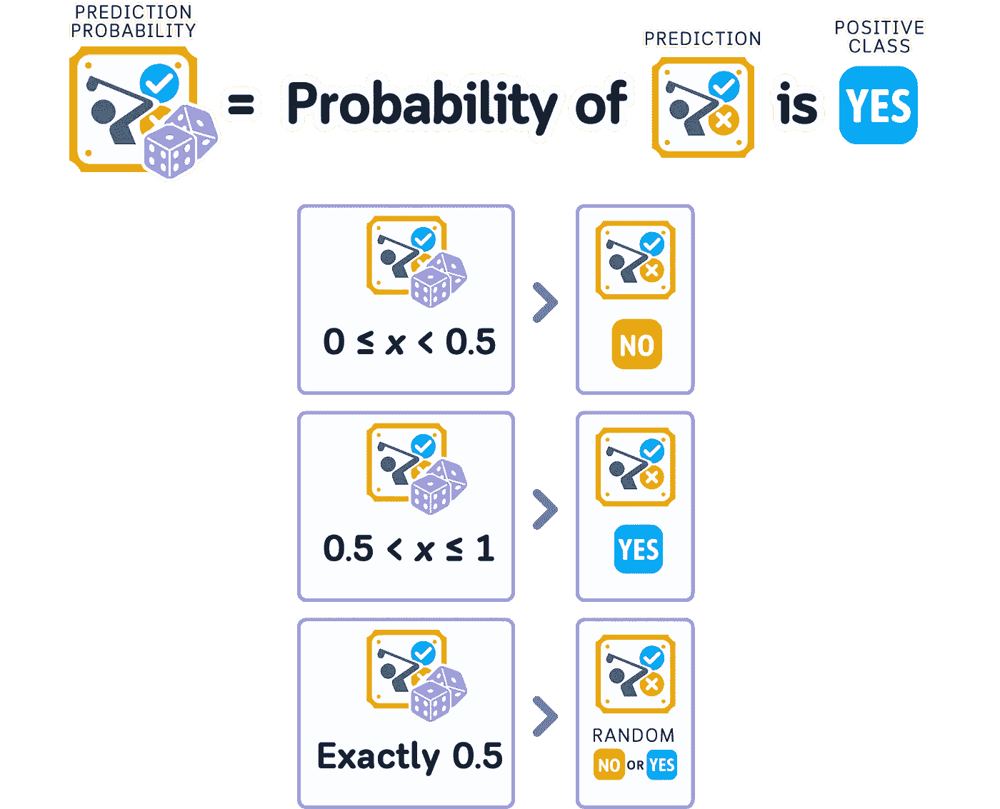

# 预测概率解释：带有代码示例的可视化指南，适合初学者

> 原文：[`towardsdatascience.com/predicted-probability-explained-a-visual-guide-with-code-examples-for-beginners-7c34e8994ec2?source=collection_archive---------3-----------------------#2024-12-10`](https://towardsdatascience.com/predicted-probability-explained-a-visual-guide-with-code-examples-for-beginners-7c34e8994ec2?source=collection_archive---------3-----------------------#2024-12-10)

## 模型评估与优化

## 7 种基本分类器揭示其预测置信度的数学原理

[](https://medium.com/@samybaladram?source=post_page---byline--7c34e8994ec2--------------------------------)[](https://towardsdatascience.com/?source=post_page---byline--7c34e8994ec2--------------------------------) [Samy Baladram](https://medium.com/@samybaladram?source=post_page---byline--7c34e8994ec2--------------------------------)

·发表于[Towards Data Science](https://towardsdatascience.com/?source=post_page---byline--7c34e8994ec2--------------------------------) ·17 分钟阅读·2024 年 12 月 10 日

--

分类模型不仅告诉你它们认为答案是什么——它们还告诉你**它们对这个答案的确定程度**。这种确定性通过概率分数显示出来。高分意味着模型非常自信，而低分则意味着它对预测的结果不确定。

每个分类模型计算这些概率分数的方式不同。简单的模型和复杂的模型各自有自己的方法来确定每种可能结果的概率。

我们将探讨七种基本的分类模型，并直观地分析每种模型是如何计算其概率分数的。无需水晶球——我们将让这些概率计算一目了然！


所有视觉效果：作者使用 Canva Pro 创建，已针对移动设备进行优化；在桌面设备上可能会显得过大。

# 定义

预测概率（或称“类别概率”）是一个从 0 到 1（或 0%到 100%）的数值，表示模型对其答案的信心水平。如果该数值为 1，表示模型对其答案非常确定。如果为 0.5，模型基本上是在猜测——就像抛硬币一样。

## 概率分数的组成部分

当模型需要在两个类别之间做出选择时（称为二分类），有三条主要规则适用：

1.  预测概率必须介于 0 和 1 之间

1.  两个选项发生的概率总和必须等于 1

1.  较高的概率意味着模型对其选择更有信心


对于二分类问题，当我们谈论预测概率时，通常是指正类的概率。更高的概率意味着模型认为正类更有可能发生，而较低的概率则意味着模型认为负类更有可能。



为确保这些规则得到遵守，模型使用数学函数将其计算结果转换为适当的概率。每种类型的模型可能使用不同的函数，这会影响它们表达置信度的方式。

# 预测与概率

在分类问题中，模型会选择它认为最有可能发生的类别——即具有最高概率分数的类别。但两个不同的模型可能会选择相同的类别，同时它们对该类别的信心程度可能有所不同。它们的预测概率分数告诉我们每个模型有多确定，即使它们做出了相同的选择。


这些不同的概率分数告诉我们一个重要的事实：即使模型选择了相同的类别，它们可能会以不同的方式理解数据。

> 一个模型可能对其选择非常确定，而另一个模型可能信心较弱——尽管它们做出了相同的预测。

# 📊 使用的数据集

为了理解预测概率是如何计算的，我们将继续使用[我之前关于分类算法的文章中使用的相同数据集](https://medium.com/@samybaladram/list/classification-algorithms-b3586f0a772c)。我们的目标仍然是：根据天气预测某人是否会打高尔夫。


列：‘Overcast（通过三列进行独热编码）’，‘Temperature’（温度，单位为华氏度），‘Humidity’（湿度，单位为%），‘Windy’（风，Yes/No）以及‘Play’（是否打球，目标特征）

```py
import pandas as pd
import numpy as np
from sklearn.metrics import accuracy_score
from sklearn.model_selection import train_test_split

# Create and prepare dataset
dataset_dict = {
    'Outlook': ['sunny', 'sunny', 'overcast', 'rainy', 'rainy', 'rainy', 'overcast', 
                'sunny', 'sunny', 'rainy', 'sunny', 'overcast', 'overcast', 'rainy',
                'sunny', 'overcast', 'rainy', 'sunny', 'sunny', 'rainy', 'overcast',
                'rainy', 'sunny', 'overcast', 'sunny', 'overcast', 'rainy', 'overcast'],
    'Temperature': [85.0, 80.0, 83.0, 70.0, 68.0, 65.0, 64.0, 72.0, 69.0, 75.0, 75.0,
                   72.0, 81.0, 71.0, 81.0, 74.0, 76.0, 78.0, 82.0, 67.0, 85.0, 73.0,
                   88.0, 77.0, 79.0, 80.0, 66.0, 84.0],
    'Humidity': [85.0, 90.0, 78.0, 96.0, 80.0, 70.0, 65.0, 95.0, 70.0, 80.0, 70.0,
                 90.0, 75.0, 80.0, 88.0, 92.0, 85.0, 75.0, 92.0, 90.0, 85.0, 88.0,
                 65.0, 70.0, 60.0, 95.0, 70.0, 78.0],
    'Wind': [False, True, False, False, False, True, True, False, False, False, True,
             True, False, True, True, False, False, True, False, True, True, False,
             True, False, False, True, False, False],
    'Play': ['No', 'No', 'Yes', 'Yes', 'Yes', 'No', 'Yes', 'No', 'Yes', 'Yes', 'Yes',
             'Yes', 'Yes', 'No', 'No', 'Yes', 'Yes', 'No', 'No', 'No', 'Yes', 'Yes',
             'Yes', 'Yes', 'Yes', 'Yes', 'No', 'Yes']
}

# Prepare data
df = pd.DataFrame(dataset_dict)
```

由于某些算法可能需要标准化的数值，我们还将对数值特征进行[标准化缩放](https://medium.com/towards-data-science/scaling-numerical-data-explained-a-visual-guide-with-code-examples-for-beginners-11676cdb45cb)，并对分类特征，包括目标特征，进行独热编码：


```py
from sklearn.preprocessing import StandardScaler
df = pd.get_dummies(df, columns=['Outlook'], prefix='', prefix_sep='', dtype=int)
df['Wind'] = df['Wind'].astype(int)
df['Play'] = (df['Play'] == 'Yes').astype(int)

# Rearrange columns
column_order = ['sunny', 'overcast', 'rainy', 'Temperature', 'Humidity', 'Wind', 'Play']
df = df[column_order]

# Prepare features and target
X,y = df.drop('Play', axis=1), df['Play']
X_train, X_test, y_train, y_test = train_test_split(X, y, train_size=0.5, shuffle=False)

# Scale numerical features
scaler = StandardScaler()
X_train[['Temperature', 'Humidity']] = scaler.fit_transform(X_train[['Temperature', 'Humidity']])
X_test[['Temperature', 'Humidity']] = scaler.transform(X_test[['Temperature', 'Humidity']])
```

现在，让我们来看一下以下 7 种分类算法是如何计算这些概率的：


# 哑巴分类器概率

[](/dummy-classifier-explained-a-visual-guide-with-code-examples-for-beginners-009ff95fc86e?source=post_page-----7c34e8994ec2--------------------------------) ## 哑巴分类器解析：带代码示例的可视化指南，适合初学者

### 通过简单的基准模型设定机器学习的标准

towardsdatascience.com

虚拟分类器是一种不从数据中学习模式的预测模型。相反，它遵循一些基本规则，例如：选择最常见的结果，基于每个结果在训练中出现的频率做随机预测，总是选择一个答案，或在等概率的选项中随机选择。虚拟分类器忽略所有输入特征，只遵循这些规则。

当这个模型完成训练时，它记住的只是一些数字，显示每个结果发生的频率，或它被告知使用的常数值。它不会学习特征与结果之间的关系。


在二分类任务中，虚拟分类器使用最基本的方法来计算预测概率。由于它仅记住了每个结果在训练数据中出现的频率，它就将这些相同的数字作为每次预测的概率分数——要么是 0，要么是 1。


这些概率分数对于所有新数据来说完全相同，因为该模型并不会查看或响应任何新数据的特征。

```py
from sklearn.dummy import DummyClassifier
import pandas as pd
import numpy as np

# Train the model
dummy_clf = DummyClassifier(strategy='stratified', random_state=42)
dummy_clf.fit(X_train, y_train)

# Print the "model" - which is just the class probabilities
print("THE MODEL:")
print(f"Probability of not playing (class 0): {dummy_clf.class_prior_[0]:.3f}")
print(f"Probability of playing (class 1): {dummy_clf.class_prior_[1]:.3f}")
print("\nNOTE: These probabilities are used for ALL predictions, regardless of input features!")

# Make predictions and get probabilities
y_pred = dummy_clf.predict(X_test)
y_prob = dummy_clf.predict_proba(X_test)

# Create results dataframe
results_df = pd.DataFrame({
    'True Label': y_test,
    'Prediction': y_pred,
    'Probability of Play': y_prob[:, 1]
})

print("\nPrediction Results:")
print(results_df)
print(f"Accuracy: {accuracy_score(y_test, y_pred)}")
```

# k-最近邻（KNN）概率

[](/k-nearest-neighbor-classifier-explained-a-visual-guide-with-code-examples-for-beginners-a3d85cad00e1?source=post_page-----7c34e8994ec2--------------------------------) ## K 最近邻分类器详解：面向初学者的可视化指南和代码示例

### 友邻方法在机器学习中的应用

towardsdatascience.com

K-最近邻（kNN）是一种预测模型，它采用了不同的方法——它不是学习规则，而是将所有训练示例存储在内存中。当它需要对新数据做出预测时，它会衡量这些数据与每个存储的示例之间的相似度，找到最相似的 k 个（k 是我们选择的数字），并基于这些邻居做出决策。

当这个模型完成训练时，它所存储的只有完整的训练数据集、我们选择的 k 值以及一种衡量两个数据点相似度的方法（默认使用欧几里得距离）。


在计算预测概率时，kNN 会查看那些最相似的 k 个样本，并统计每个类别的样本数量。概率分数就是属于某一类别的邻居数量除以 k。


由于 kNN 通过除法计算概率分数，它只能根据 k 给出特定的值（例如，对于 k=5，唯一可能的概率分数是 0/5（0%）、1/5（20%）、2/5（40%）、3/5（60%）、4/5（80%）和 5/5（100%））。这意味着 kNN 无法像其他模型那样给出更多的置信度级别。

```py
from sklearn.neighbors import KNeighborsClassifier
import pandas as pd
import numpy as np

# Train the model
k = 3  # number of neighbors
knn = KNeighborsClassifier(n_neighbors=k)
knn.fit(X_train, y_train)

# Print the "model"
print("THE MODEL:")
print(f"Number of neighbors (k): {k}")
print(f"Training data points stored: {len(X_train)}")

# Make predictions and get probabilities
y_pred = knn.predict(X_test)
y_prob = knn.predict_proba(X_test)

# Create results dataframe
results_df = pd.DataFrame({
   'True Label': y_test,
   'Prediction': y_pred,
   'Probability of Play': y_prob[:, 1]
})

print("\nPrediction Results:")
print(results_df)
print(f"Accuracy: {accuracy_score(y_test, y_pred)}")
```

# 朴素贝叶斯概率

[](/bernoulli-naive-bayes-explained-a-visual-guide-with-code-examples-for-beginners-aec39771ddd6?source=post_page-----7c34e8994ec2--------------------------------) ## 伯努利朴素贝叶斯解释：初学者的视觉指南与代码示例

### 通过是/否概率解锁预测能力

towardsdatascience.com

朴素贝叶斯是一种预测模型，使用概率数学和“朴素”规则：它假设每个特征独立地影响结果。朴素贝叶斯有不同的类型：高斯朴素贝叶斯适用于连续值，而伯努利朴素贝叶斯适用于二元特征。由于我们的数据集有许多 0 和 1 特征，下面我们将重点讲解伯努利模型。

当这个模型训练完成时，它会记住概率值：一个值表示正类发生的频率，对于每个特征，值表示在正类结果下不同特征值出现的可能性。


为了计算预测概率，朴素贝叶斯将多个概率相乘：每个类别发生的概率，以及在该类别中观察到每个特征值的概率。这些乘积的概率随后会进行归一化，使其和为 1，从而得到最终的概率得分。


由于朴素贝叶斯使用概率数学，它的概率得分自然落在 0 和 1 之间。然而，当某些特征强烈指向某一类别时，模型可能会给出非常接近 0 或 1 的概率得分，表明它对预测非常有信心。

```py
from sklearn.naive_bayes import BernoulliNB
import pandas as pd

# Train the model
nb = BernoulliNB()
nb.fit(X_train, y_train)

# Print the "model"
print("THE MODEL:")
df = pd.DataFrame(
   nb.feature_log_prob_.T, 
   columns=['Log Prob (No Play)', 'Log Prob (Play)'], 
   index=['sunny', 'overcast', 'rainy', 'Temperature', 'Humidity', 'Wind']
)
df = df.round(3)
print("\nFeature Log-Probabilities:")
print(df)

print("\nClass Priors:")
priors = pd.Series(nb.class_log_prior_, index=['No Play', 'Play']).round(3)
print(priors)

# Make predictions and get probabilities
y_pred = nb.predict(X_test)
y_prob = nb.predict_proba(X_test)

# Create results dataframe
results_df = pd.DataFrame({
   'True Label': y_test,
   'Prediction': y_pred,
   'Probability of Play': y_prob[:, 1]
})

print("\nPrediction Results:")
print(results_df)
print(f"Accuracy: {accuracy_score(y_test, y_pred)}")
```

# 决策树概率

[](/decision-tree-classifier-explained-a-visual-guide-with-code-examples-for-beginners-7c863f06a71e?source=post_page-----7c34e8994ec2--------------------------------) ## 决策树分类器解释：初学者的视觉指南与代码示例

### 我们最喜欢的倒立树的新视角

towardsdatascience.com

决策树分类器通过针对输入数据创建一系列是/否问题来工作。它逐一构建这些问题，总是选择最有用的问题，能够最好地将数据分成不同的组。它会不断提问，直到到达每个分支的最终答案。

当这个模型训练完成时，它会创建一棵树，其中每个节点代表一个关于数据的问题。每个分支表示根据答案应采取的路径，而每个分支的末端则显示该类别在训练数据中出现的频率。


在计算预测概率时，决策树会根据新数据依次回答所有问题，直到到达某一分支的末端。概率分数基于每个类别在训练期间有多少训练样本最终到达该分支。


由于决策树的概率分数来源于计数每个分支端点的训练样本，因此它们只能是训练中见过的特定值。这意味着模型只能给出与它在学习过程中发现的模式匹配的概率分数，这限制了它的置信度水平的精确度。

```py
from sklearn.tree import DecisionTreeClassifier, plot_tree
import pandas as pd
import matplotlib.pyplot as plt

# Train the model
dt = DecisionTreeClassifier(random_state=42, max_depth=3)  # limiting depth for visibility
dt.fit(X_train, y_train)

# Print the "model" - visualize the decision tree
print("THE MODEL (DECISION TREE STRUCTURE):")
plt.figure(figsize=(20,10))
plot_tree(dt, feature_names=['sunny', 'overcast', 'rainy', 'Temperature', 
                           'Humidity', 'Wind'], 
         class_names=['No Play', 'Play'],
         filled=True, rounded=True, fontsize=10)
plt.show()

# Make predictions and get probabilities
y_pred = dt.predict(X_test)
y_prob = dt.predict_proba(X_test)

# Create results dataframe
results_df = pd.DataFrame({
   'True Label': y_test,
   'Prediction': y_pred,
   'Probability of Play': y_prob[:, 1]
})

print("\nPrediction Results:")
print(results_df)
print(f"Accuracy: {accuracy_score(y_test, y_pred)}")
```

# 逻辑回归概率

[](/logistic-regression-explained-a-visual-guide-with-code-examples-for-beginners-81baf5871505?source=post_page-----7c34e8994ec2--------------------------------) ## 逻辑回归解析：初学者的视觉指南与代码示例

### 找到最适合数据的完美权重

towardsdatascience.com

尽管名称为逻辑回归，逻辑回归模型通过一个数学方程来预测两个类别之间的概率。对于输入数据中的每个特征，它通过赋予特征一个数字（权重）来学习该特征的重要性。它还会学习一个额外的数字（偏差），以帮助做出更好的预测。为了将这些数字转化为预测概率，它使用了一个 sigmoid 函数，该函数将最终答案保持在 0 和 1 之间。

当该模型完成训练时，它所记住的只是这些权重——每个特征的一个数字，加上偏差值。这些数字是它进行预测所需要的全部内容。


在二分类中计算预测概率时，逻辑回归首先将每个特征值与其权重相乘，然后将所有结果相加，再加上偏差。这些和可能是任何数字，因此模型使用 sigmoid 函数将其转换为 0 到 1 之间的概率。


与只能给出特定概率分数的其他模型不同，逻辑回归可以给出介于 0 和 1 之间的任何概率。输入数据距离模型从一个类别切换到另一个类别的点（决策边界）越远，概率就越接近 0 或 1。接近这个切换点的数据点的概率接近 0.5，显示模型对这些预测的信心较低。

```py
from sklearn.linear_model import LogisticRegression
import pandas as pd

# Train the model
lr = LogisticRegression(random_state=42)
lr.fit(X_train, y_train)

# Print the "model"
print("THE MODEL:")
model_df = pd.DataFrame({
   'Feature': ['sunny', 'overcast', 'rainy', 'Temperature', 'Humidity', 'Wind'],
   'Coefficient': lr.coef_[0]
})
model_df['Coefficient'] = model_df['Coefficient'].round(3)
print("Coefficients (weights):")
print(model_df)

print(f"\nIntercept (bias): {lr.intercept_[0]:.3f}")
print("\nPrediction = sigmoid(intercept + sum(coefficient * feature_value))")

# Make predictions and get probabilities
y_pred = lr.predict(X_test)
y_prob = lr.predict_proba(X_test)

# Create results dataframe
results_df = pd.DataFrame({
   'True Label': y_test,
   'Prediction': y_pred,
   'Probability of Play': y_prob[:, 1]
})

print("\nPrediction Results:")
print(results_df)
print(f"Accuracy: {accuracy_score(y_test, y_pred)}")
```

# 支持向量机（SVM）概率

[](/support-vector-classifier-explained-a-visual-guide-with-mini-2d-dataset-62e831e7b9e9?source=post_page-----7c34e8994ec2--------------------------------) ## 支持向量分类器解析：使用迷你 2D 数据集的视觉指南

### 找到最佳的“线”来区分类别？当然...

[towardsdatascience.com

支持向量机（SVM）分类器通过寻找最佳边界线（或面）来区分不同的类别。它关注那些离边界最近的点（即支持向量）。虽然基本的 SVM 找到的是直线边界，但它也可以通过使用叫做核函数的数学函数来创建弯曲的边界。

当这个模型完成训练时，它记住了三件事：边界附近的重要点（支持向量），每个点的重要性（权重），以及任何关于弯曲边界的设置（核函数参数）。这些共同定义了边界如何以及在哪里分离各个类别。


在二分类中计算预测概率时，支持向量机（SVM）需要额外的步骤，因为它最初并不是为了提供概率分数而设计的。它使用一种叫做 Platt Scaling 的方法，通过添加一个逻辑回归层，将距离边界的距离转换为概率。这些距离经过 sigmoid 函数处理，得到最终的概率分数。


由于 SVM 是以这种间接的方式计算概率，得分显示的是点离边界的距离，而不是模型的真实置信度。离边界较远的点会得到接近 0 或 1 的概率分数，而靠近边界的点则会得到接近 0.5 的分数。这意味着概率分数更多地反映了点相对于边界的位置，而非模型对其预测的实际信心。

```py
from sklearn.svm import SVC
import pandas as pd
import numpy as np

# Train the model
svm = SVC(kernel='rbf', probability=True, random_state=42)
svm.fit(X_train, y_train)

# Print the "model"
print("THE MODEL:")
print(f"Kernel: {svm.kernel}")
print(f"Number of support vectors: {svm.n_support_}")
print("\nSupport Vectors (showing first 5 rows):")

# Create dataframe of support vectors
sv_df = pd.DataFrame(
   svm.support_vectors_,
   columns=['sunny', 'overcast', 'rainy', 'Temperature', 'Humidity', 'Wind']
)
print(sv_df.head().round(3))

# Show which classes these support vectors belong to
print("\nSupport vector classes:")
for i, count in enumerate(svm.n_support_):
   print(f"Class {i}: {count} support vectors")

# Make predictions and get probabilities
y_pred = svm.predict(X_test)
y_prob = svm.predict_proba(X_test)

# Create results dataframe
results_df = pd.DataFrame({
   'True Label': y_test,
   'Prediction': y_pred,
   'Probability of Play': y_prob[:, 1]
})

print("\nPrediction Results:")
print(results_df)
print(f"Accuracy: {accuracy_score(y_test, y_pred)}")
```

# 多层感知机概率

[](/multilayer-perceptron-explained-a-visual-guide-with-mini-2d-dataset-0ae8100c5d1c?source=post_page-----7c34e8994ec2--------------------------------) ## 多层感知机详解：带有迷你 2D 数据集的可视化指南

### 剖析一个小型神经网络的数学原理（附带图示）

[towardsdatascience.com

多层感知机（MLP）分类器是一种神经网络，通过几个层级的连接节点（神经元）处理数据。每个神经元计算其输入的加权总和，使用一个函数（如 ReLU）对这个数值进行转换，然后将结果传递到下一层。对于二分类问题，最后一层使用 sigmoid 函数输出一个介于 0 和 1 之间的值。

当这个模型完成训练时，它记住了两件主要的事：相邻层神经元之间的连接强度（权重和偏置），以及网络的结构（每一层有多少层和神经元）。


在二分类问题中，**多层感知机**（MLP）通过其层次处理数据，每一层都根据前一层的信息组合出更复杂的特征。最终一层生成一个数字，通过**Sigmoid 函数**将其转换为 0 到 1 之间的概率。


**多层感知机**（MLP）能够比许多其他模型找到更复杂的数据模式，因为它以更先进的方式组合特征。最终的概率分数显示了网络的置信度——接近 0 或 1 的分数意味着网络对其预测非常有信心，而接近 0.5 的分数则表示网络的不确定性较大。

```py
from sklearn.neural_network import MLPClassifier
import pandas as pd
import numpy as np

# Train the model with a simple architecture
mlp = MLPClassifier(hidden_layer_sizes=(4,2), random_state=42)
mlp.fit(X_train, y_train)

# Print the "model"
print("THE MODEL:")
print("Network Architecture:")
print(f"Input Layer: {mlp.n_features_in_} neurons (features)")
for i, layer_size in enumerate(mlp.hidden_layer_sizes):
   print(f"Hidden Layer {i+1}: {layer_size} neurons")
print(f"Output Layer: {mlp.n_outputs_} neurons (classes)")

# Show weights for first hidden layer
print("\nWeights from Input to First Hidden Layer:")
weights_df = pd.DataFrame(
   mlp.coefs_[0],
   columns=[f'Hidden_{i+1}' for i in range(mlp.hidden_layer_sizes[0])],
   index=['sunny', 'overcast', 'rainy', 'Temperature', 'Humidity', 'Wind']
)
print(weights_df.round(3))

print("\nNote: Additional weights and biases exist between subsequent layers")

# Make predictions and get probabilities
y_pred = mlp.predict(X_test)
y_prob = mlp.predict_proba(X_test)

# Create results dataframe
results_df = pd.DataFrame({
   'True Label': y_test,
   'Prediction': y_pred,
   'Probability of Play': y_prob[:, 1]
})

print("\nPrediction Results:")
print(results_df)
print(f"Accuracy: {accuracy_score(y_test, y_pred)}")
```

# 模型比较

总结一下，以下是每个分类器计算预测概率的方式：

1.  **虚拟分类器**：对所有预测使用相同的概率分数，这些分数仅基于每个类别在训练集中出现的频率，忽略所有输入特征。

1.  **K 近邻**：概率分数是属于每个类别的相似邻居的比例。只能给出基于 k 的特定比例（例如 3/5 或 7/10）。

1.  **朴素贝叶斯**：将初始的类概率与每个特征值的概率相乘，然后调整结果使其总和为 1。概率分数表示特征在每个类中出现的可能性。

1.  **决策树**：根据每个类别在最终分支中出现的频率来给出概率分数。只能使用训练过程中看到的概率值。

1.  **逻辑回归**：使用**Sigmoid 函数**将加权的特征组合转换为概率分数。可以给出介于 0 和 1 之间的任意概率，且随着距离决策边界的变化平滑变化。

1.  **支持向量机**：需要额外的步骤（Platt 缩放）来创建概率分数，使用**Sigmoid 函数**将距离边界的值转换为概率。这些距离决定了模型的置信度。

1.  **多层感知机**（MLP）：通过多个层次的转换处理数据，最后通过**Sigmoid 函数**输出概率分数。通过复杂的特征组合创建概率分数，给出 0 到 1 之间的任意值。

# 最后的说明

观察每个模型如何计算预测概率，能揭示一个重要的信息：每个模型都有自己表达置信度的方式。有些模型，如**虚拟分类器**和**决策树**，只能使用基于其训练数据的某些概率分数。而像**逻辑回归**和**神经网络**这样的模型可以给出介于 0 和 1 之间的任意概率，使得它们在表达不确定性时更为精确。

这里有个有趣的地方：尽管所有这些模型都给出介于 0 和 1 之间的数值，但这些数值对于每个模型来说含义不同。有些模型通过简单计数得到分数，有些则通过测量与边界的距离来计算，还有一些通过复杂的特征计算得到结果。这意味着一个模型给出的 70%概率，和另一个模型的 70%概率告诉我们的是完全不同的信息。

在选择模型时，不要只看准确率。思考一下它计算预测概率的方式是否适合你的具体需求。

# 🌟 预测概率代码总结

```py
import pandas as pd
from sklearn.model_selection import train_test_split
from sklearn.preprocessing import StandardScaler
from sklearn.metrics import accuracy_score

# The models
from sklearn.dummy import DummyClassifier
from sklearn.neighbors import KNeighborsClassifier
from sklearn.naive_bayes import BernoulliNB
from sklearn.tree import DecisionTreeClassifier
from sklearn.linear_model import LogisticRegression
from sklearn.svm import SVC
from sklearn.neural_network import MLPClassifier

# Load and prepare data
dataset_dict = {
    'Outlook': ['sunny', 'sunny', 'overcast', 'rainy', 'rainy', 'rainy', 'overcast', 'sunny', 'sunny', 'rainy', 'sunny', 'overcast', 'overcast', 'rainy', 'sunny', 'overcast', 'rainy', 'sunny', 'sunny', 'rainy', 'overcast', 'rainy', 'sunny', 'overcast', 'sunny', 'overcast', 'rainy', 'overcast'],
    'Temperature': [85.0, 80.0, 83.0, 70.0, 68.0, 65.0, 64.0, 72.0, 69.0, 75.0, 75.0, 72.0, 81.0, 71.0, 81.0, 74.0, 76.0, 78.0, 82.0, 67.0, 85.0, 73.0, 88.0, 77.0, 79.0, 80.0, 66.0, 84.0],
    'Humidity': [85.0, 90.0, 78.0, 96.0, 80.0, 70.0, 65.0, 95.0, 70.0, 80.0, 70.0, 90.0, 75.0, 80.0, 88.0, 92.0, 85.0, 75.0, 92.0, 90.0, 85.0, 88.0, 65.0, 70.0, 60.0, 95.0, 70.0, 78.0],
    'Wind': [False, True, False, False, False, True, True, False, False, False, True, True, False, True, True, False, False, True, False, True, True, False, True, False, False, True, False, False],
    'Play': ['No', 'No', 'Yes', 'Yes', 'Yes', 'No', 'Yes', 'No', 'Yes', 'Yes', 'Yes', 'Yes', 'Yes', 'No', 'No', 'Yes', 'Yes', 'No', 'No', 'No', 'Yes', 'Yes', 'Yes', 'Yes', 'Yes', 'Yes', 'No', 'Yes']
}
df = pd.DataFrame(dataset_dict)
df = pd.get_dummies(df, columns=['Outlook'], prefix='', prefix_sep='', dtype=int)
df['Wind'] = df['Wind'].astype(int)
df['Play'] = (df['Play'] == 'Yes').astype(int)

# Prepare features and target
X,y = df.drop('Play', axis=1), df['Play']
X_train, X_test, y_train, y_test = train_test_split(X, y, train_size=0.5, shuffle=False)

# Scale numerical features
scaler = StandardScaler()
X_train[['Temperature', 'Humidity']] = scaler.fit_transform(X_train[['Temperature', 'Humidity']])
X_test[['Temperature', 'Humidity']] = scaler.transform(X_test[['Temperature', 'Humidity']])

# Train the model
clf = DummyClassifier(strategy='stratified', random_state=42)
# clf = KNeighborsClassifier(n_neighbors=3)
# clf = BernoulliNB()
# clf = DecisionTreeClassifier(random_state=42, max_depth=3)
# clf = LogisticRegression(random_state=42)
# clf = SVC(kernel='rbf', probability=True, random_state=42)
# clf = MLPClassifier(hidden_layer_sizes=(4,2), random_state=42)

# Fit and predict
clf.fit(X_train, y_train)
y_pred = clf.predict(X_test)
y_prob = clf.predict_proba(X_test)

# Create results dataframe
results_df = pd.DataFrame({
   'True Label': y_test,
   'Prediction': y_pred,
   'Probability of Play': y_prob[:, 1]
})

print("\nPrediction Results:")
print(results_df)

# Print accuracy
print(f"Accuracy: {accuracy_score(y_test, y_pred)}")
```

## 技术环境

本文使用的是 Python 3.7 和 scikit-learn 1.5。虽然讨论的概念具有广泛的适用性，但具体的代码实现可能会因版本不同而有所不同。

## 关于插图

除非另有说明，所有图片均由作者创建，并融入了来自 Canva Pro 的授权设计元素。

𝙎𝙚𝙚 𝙢𝙤𝙧𝙚 𝙈𝙤𝙙𝙚𝙡 𝙀𝙫𝙖𝙡𝙪𝙖𝙩𝙞𝙤𝙣 & 𝙊𝙥𝙩𝙞𝙢𝙞𝙯𝙖𝙩𝙞𝙤𝙣 𝙢𝙚𝙩𝙝𝙤𝙙𝙨 𝙝𝙚𝙧𝙚:


[Samy Baladram](https://medium.com/@samybaladram?source=post_page-----7c34e8994ec2--------------------------------)

## 模型评估与优化

[查看列表](https://medium.com/@samybaladram/list/model-evaluation-optimization-331287896864?source=post_page-----7c34e8994ec2--------------------------------)3 个故事

𝙔𝙤𝙪 𝙢𝙞𝙜𝙝𝙩 𝙖𝙡𝙨𝙤 𝙡𝙞𝙠𝙚:


[Samy Baladram](https://medium.com/@samybaladram?source=post_page-----7c34e8994ec2--------------------------------)

## 分类算法

[查看列表](https://medium.com/@samybaladram/list/classification-algorithms-b3586f0a772c?source=post_page-----7c34e8994ec2--------------------------------)8 个故事

[Samy Baladram](https://medium.com/@samybaladram?source=post_page-----7c34e8994ec2--------------------------------)

## 集成学习

[查看列表](https://medium.com/@samybaladram/list/ensemble-learning-673fc83cd7db?source=post_page-----7c34e8994ec2--------------------------------)4 个故事
