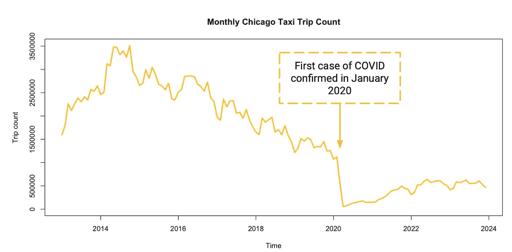

# 使用 R 时间序列模型预测芝加哥出租车出行次数 — BSTS

> 原文：[`towardsdatascience.com/predicting-chicago-taxi-trips-with-r-time-series-model-bsts-f857efe38bb4?source=collection_archive---------9-----------------------#2024-06-04`](https://towardsdatascience.com/predicting-chicago-taxi-trips-with-r-time-series-model-bsts-f857efe38bb4?source=collection_archive---------9-----------------------#2024-06-04)

## 逐步教程，教你如何使用 R 时间序列模型预测每日出租车出行次数

[](https://medium.com/@leaw77172?source=post_page---byline--f857efe38bb4--------------------------------)[](https://towardsdatascience.com/?source=post_page---byline--f857efe38bb4--------------------------------) [Lea Wu](https://medium.com/@leaw77172?source=post_page---byline--f857efe38bb4--------------------------------)

·发布于[Towards Data Science](https://towardsdatascience.com/?source=post_page---byline--f857efe38bb4--------------------------------) ·阅读时间 9 分钟·2024 年 6 月 4 日

--


照片来自[Waldemar](https://unsplash.com/@waldemarbrandt67w?utm_source=medium&utm_medium=referral)提供，来自[Unsplash](https://unsplash.com/?utm_source=medium&utm_medium=referral)

# **介绍**

想象一下，你正在为你的出租车公司制定营销策略，或者正在考虑作为新竞争者进入市场——预测大城市中的出租车出行次数可能是一个有趣的商业问题。或者，如果你和我一样只是一个好奇的居民，那么这篇文章非常适合你学习如何使用 R 的贝叶斯结构时间序列（BSTS）模型来预测每日出租车出行次数，并发现一些有趣的洞察。

在本文中，我将带你走过包括数据准备、探索性数据分析、时间序列建模、预测结果分析和商业洞察等过程。我旨在预测 2023 年下半年每日的出租车出行次数。

# 数据准备

数据来自[芝加哥数据门户](https://data.cityofchicago.org/Transportation/Taxi-Trips-2013-2023-/wrvz-psew/about_data)。 (你会在这个平台找到各类政府数据的访问权限！) 在网站上，只需找到“Action”下拉列表来查询数据。


芝加哥数据门户提供查询工具以获取选定数据

在查询工具中，你会找到过滤器、分组和列管理工具。你可以简单地下载原始数据集。然而，为了减少计算复杂度，我将数据按接送时间戳分组，以便每 15 分钟聚合一次出行次数。

> 在对数据集进行探索时，我还筛选出了 0 出行里程和 N/A 接送区号（意味着接送位置不在芝加哥范围内）的记录。您应当探索数据，以决定如何查询数据。它应该基于您分析的使用场景。

然后，导出处理后的数据。下载可能需要一些时间！

# 探索性数据分析

理解数据是数据预处理和模型选择推理中最关键的一步。在接下来的部分，我深入探讨了数据集的不同特征，包括季节性、趋势，以及对平稳性和滞后自相关的统计检验。

**季节性**指的是数据中定期波动的现象，这些波动以规律的间隔发生。这些模式在特定时间段内重复，例如天、周、月或季度。

为了理解季节性，我们首先按日期和月份聚合出行次数以可视化其影响。

```py
library(lubridate)
library(dplyr)
library(xts)
library(bsts)
library(forecast)
library(tseries)

demand_data <- read.csv("taxi_trip_data.csv")
colnames(demand_data) <- c('trip_cnt','trip_datetime') 
demand_data$trip_datetime <- mdy_hms(demand_data$trip_datetime)
demand_data$rounded_day <- floor_date(demand_data$trip_datetime, unit = "day")
demand_data$rounded_month <- floor_date(demand_data$trip_datetime, unit = "month")

monthly_agg <- demand_data %>%
    group_by(rounded_month) %>%
    summarise(
        trip_cnt = sum(trip_cnt, na.rm = TRUE)
)

daily_agg <- demand_data %>%
    group_by(rounded_day) %>%
    summarise(
        trip_cnt = sum(trip_cnt, na.rm = TRUE)
)
```

芝加哥的出租车需求在 2014 年达到了峰值，随后显示出下降趋势和年度季节性，并在 2020 年因 COVID 而大幅减少。



每月出租车出行数量 | 图表由作者提供

COVID 前的每日出行量表明了每周季节性，周五和周六的出行量较高。


每日出租车出行数量 | 图表由作者提供

有趣的是，后 COVID 时期的每周季节性发生了变化，周四现在需求最高。这为 COVID 干预提供了假设。


COVID 后每日出租车出行数量 | 图表由作者提供

**趋势**在时间序列数据中指的是数据随时间的变化模式或趋势，包括增加、减少或保持稳定。我将数据框架转换为时间序列数据，以进行 STL 分解并监控趋势。

```py
zoo_data <- zoo(daily_agg$trip_cnt, order.by = daily_agg$rounded_day)
start_time <- as.numeric(format(index(zoo_data)[1], "%Y"))
ts_data <- ts(coredata(zoo_data), start = start_time, frequency = 365)
stl_decomposition <- stl(ts_data, s.window = "periodic")
plot(stl_decomposition)
```

STL 分解结果表明存在非线性趋势。季节性部分也显示了年度季节性。经过仔细观察年度季节性，我发现每年感恩节和圣诞节的需求最低。


STL 分解 | 图表由作者提供


假日的每日出租车出行数量 | 图表由作者提供

如果时间序列的数据统计属性（例如均值、方差和自相关）随时间保持不变，则该时间序列被视为**平稳**。从上面的图表我们可以看出，该数据并不是平稳的，因为它表现出了趋势和季节性。如果您希望更加稳健，ADF 和 KPSS 测试通常用于分别验证非平稳和平稳的原假设。

```py
adf.test(zoo_data)
kpss.test(zoo_data)
```

**滞后自相关** 衡量时间序列与其滞后值在连续时间间隔中的相关性。它解释了当前值与过去值之间的关系。通过分析滞后的自相关，我们可以识别模式，帮助我们选择合适的时间序列模型（例如，理解自相关结构有助于确定 ARIMA 模型中 AR 和 MA 成分的阶数）。图表显示出在许多滞后期有显著的自相关。

```py
acf(zoo_data)
```


ACF 结果 | 图表由作者提供

# 数据转换

EDA 提供了关于我们如何转换和预处理数据以实现最佳预测结果的关键见解。

COVID 显著改变了时间序列。包含变化如此大的数据是不合理的。在这里，我使用 2020 年 6 月至 2023 年 6 月的数据来拟合模型。尽管如此，依然保持了 6:1 的训练-测试比率，预测 2023 年下半年的数据。

```py
train <- window(zoo_data, start = as.Date("2020-07-01"), end = as.Date("2023-06-30"))
test <- window(zoo_data, start = as.Date("2023-07-01"), end = as.Date("2023-12-31"))
```

非平稳数据显示出巨大的方差和非线性趋势。在这里，我应用了对数和差分转换，以减轻这些特征对预测性能的影响。

```py
train_log <- log(train + 1) 
train_diff <- diff(train, differences = 1)
```

以下代码在对数转换后的数据上操作，因为它在初步测试中表现出了更好的预测性能。

# 选择和设计模型

让我们快速回顾一下 EDA 的发现：

1.  多重季节性和非线性趋势

1.  假期和事件的影响：假期等重要事件会影响出租车需求。

1.  长期预测范围：我们需要预测 180 天的数据。

鉴于这些特征，贝叶斯结构时间序列（BSTS）模型是一个合适的选择。BSTS 模型通过贝叶斯方法将时间序列分解为多个成分，捕捉随着时间变化的潜在变量。关键成分通常包括：

1.  趋势成分

1.  季节性成分

1.  回归成分：考虑了可能影响时间序列的外部变量的影响。

这是我用来预测出租车出行的模型：

```py
ss <- AddSemilocalLinearTrend(list(), train_log) 
ss <- AddSeasonal(ss, train_log, nseasons = 7)
ss <- AddSeasonal(ss, train_log, nseasons = 365)
ss <- AddMonthlyAnnualCycle(ss, train_log)
ss <- AddRegressionHoliday(ss, train_log, holiday_list)
model_log_opti <- bsts(train_log, state.specification = ss, niter = 5000, verbose = TRUE, seed=1014)
summary(model_log_opti)
```

**AddSemilocalLinearTrend()** 从 EDA 中看出，我们的数据趋势不是随机游走。因此，我们使用半局部线性趋势，该趋势假设水平成分按照随机游走变化，但斜率成分遵循基于可能非零值的 AR1 过程。这对于长期预测非常有用。

**AddSeasonal()** 季节性模型可以看作是对`nseasons`虚拟变量的回归。在这里，我们通过将`nseasons`设置为 7 和 365 来包含每周和每年的季节性。

**AddMonthlyAnnualCycle()** 这表示每个月的贡献。或者，您也可以在`AddSeasonal()`中将`nseasons=12`来处理月度季节性。

**AddRegressionHoliday()** 在 EDA 中我们学习到感恩节和圣诞节对出租车出行有负面影响。此函数使用回归估算每个假期或事件的影响。为此，我请了一位熟悉芝加哥的朋友（当然是 ChatGPT）提供芝加哥的重大假期和事件列表。例如，芝加哥马拉松可能会增加出租车出行次数。


照片来自[Joseph Two](https://unsplash.com/@josephjtwo?utm_source=medium&utm_medium=referral)，由[Unsplash](https://unsplash.com/?utm_source=medium&utm_medium=referral)提供

然后我设置了这些日期：

```py
christmas <- NamedHoliday("Christmas")
new_year <- NamedHoliday("NewYear")
thanksgiving <- NamedHoliday("Thanksgiving")
independence_day <- NamedHoliday("IndependenceDay")
labor_day <- NamedHoliday("LaborDay")
memorial_day <- NamedHoliday("MemorialDay")
```

```py
auto.show <- DateRangeHoliday("Auto_show", start = as.Date(c("2013-02-09", "2014-02-08", "2015-02-14", "2016-02-13", "2017-02-11"
                                                             , "2018-02-10", "2019-02-09", "2020-02-08", "2021-07-15", "2022-02-12"
                                                             , "2023-02-11")), 
                              end = as.Date(c("2013-02-18", "2014-02-17", "2015-02-22", "2016-02-21", "2017-02-20"
                                                , "2018-02-19", "2019-02-18", "2020-02-17"
                                                , "2021-07-19", "2022-02-21", "2023-02-20")))
st.patrick <- DateRangeHoliday("stPatrick", start = as.Date(c("2013/3/16", "2014/3/15", "2015/3/14", "2016/3/12"
                                                              , "2017/3/11", "2018/3/17", "2019/3/16", "2020/3/14"
                                                              , "2021/3/13", "2022/3/12", "2023/3/11")), 
                              end = as.Date(c("2013/3/16", "2014/3/15", "2015/3/14", "2016/3/12"
                                                              , "2017/3/11", "2018/3/17", "2019/3/16", "2020/3/14"
                                                              , "2021/3/13", "2022/3/12", "2023/3/11")))
air.show <- DateRangeHoliday("air_show", start = as.Date(c("2013/8/17", "2014/8/16", "2015/8/15", "2016/8/20"
                                                           , "2017/8/19", "2018/8/18", "2019/8/17"
                                                           , "2021/8/21", "2022/8/20", "2023/8/19")), 
                              end = as.Date(c("2013/8/18", "2014/8/17", "2015/8/16", "2016/8/21", "2017/8/20"
                                              , "2018/8/19", "2019/8/18", "2021/8/22", "2022/8/21", "2023/8/20")))
lolla <- DateRangeHoliday("lolla", start = as.Date(c("2013/8/2", "2014/8/1", "2015/7/31", "2016/7/28", "2017/8/3"
                                                     , "2018/8/2", "2019/8/1", "2021/7/29", "2022/7/28", "2023/8/3")), 
                              end = as.Date(c("2013/8/4", "2014/8/3", "2015/8/2", "2016/7/31", "2017/8/6", "2018/8/5"
                                              , "2019/8/4", "2021/8/1", "2022/7/31", "2023/8/6")))
marathon <- DateRangeHoliday("marathon", start = as.Date(c("2013/10/13", "2014/10/12", "2015/10/11", "2016/10/9", "2017/10/8"
                                                        , "2018/10/7", "2019/10/13", "2021/10/10", "2022/10/9", "2023/10/8")), 
                              end = as.Date(c("2013/10/13", "2014/10/12", "2015/10/11", "2016/10/9", "2017/10/8"
                                                        , "2018/10/7", "2019/10/13", "2021/10/10", "2022/10/9", "2023/10/8")))
```

**DateRangeHoliday()** 允许我们定义每年日期不同或持续多天的事件。**NameHoliday()** 用于处理联邦假期。

然后，定义这些假期的列表，用于 AddRegressionHoliday()属性：

```py
holiday_list <- list(auto.show, st.patrick, air.show, lolla, marathon
              , christmas, new_year, thanksgiving, independence_day
              , labor_day, memorial_day)
```

我发现[这个网站](https://rdrr.io/cran/bsts/)在探索不同成分和参数时非常有帮助。

拟合结果显示，该模型成功捕捉到了时间序列中的各个成分。

```py
fitted_values <- as.numeric(residuals.bsts(model_log_opti, mean.only=TRUE)) + as.numeric(train_log)
train_hat <- exp(fitted_values) - 1
plot(as.numeric(train), type = "l", col = "blue", ylim=c(500, 30000), main="Fitted result")
lines(train_hat, col = "red")
legend("topleft", legend = c("Actual value", "Fitted value"), col = c("blue", "red"), lty = c(1, 1), lwd = c(1, 1))
```


BSTS 拟合结果 | 作者绘制的图表

在残差分析中，尽管残差的均值为零，但仍然存在一定的季节性。此外，残差在前几个滞后期表现出自相关性。


BSTS 模型的残差 | 作者绘制的图表


残差的自相关函数（ACF） | 作者绘制的图表

然而，将这些结果与原始时间序列进行比较后，可以明显看出，模型成功捕捉了大部分的季节性、假期效应和趋势成分。这表明 BSTS 模型有效地识别了数据中的关键模式，剩下的只是一些小的残差结构，需进一步研究。

# 预测结果与见解

现在，让我们评估模型的预测结果。记得转换预测值，因为模型提供的是对数值。

```py
horizon <- length(test)
pred_log_opti <- predict(model_log_opti, horizon = horizon, burn = SuggestBurn(.1, ss))
forecast_values_log_opti <- exp(pred_log_opti$mean) - 1
```

```py
plot(as.numeric(test), type = "l", col = "blue", ylim=c(500, 30000), main="Forecast result", xlab="Time", ylab="Trip count")
lines(forecast_values_log_opti, col = "red")
legend("topleft", legend = c("Actual value", "Forecast value"), col = c("blue", "red"), lty = c(1, 1), lwd = c(1, 1))
```


预测值与实际值 | 作者绘制的图表

该模型的平均绝对百分比误差（MAPE）为 9.76%，成功捕捉了季节性和假期效应。

对假期和事件效应的分析为商业策略提供了宝贵的见解。以下图表展示了假期回归的影响：

```py
PlotHoliday(thanksgiving, model_log_opti)
PlotHoliday(marathon, model_log_opti)
```

联邦假期的前一天对出行数量有显著的负面影响。例如，感恩节和感恩节前一天出租车出行量都出现明显下降。这一减少可能是由于需求下降或供应受限。公司可以进一步调查这些原因，并制定相应的策略应对。


假期效应 | 作者绘制的图表

与最初的假设相反，像芝加哥马拉松这样的大型事件并没有显著增加出租车需求。这表明，在这些事件期间，需求可能并不像预期的那样高。进行客户细分研究有助于识别可能受事件影响的特定群体，从而揭示针对性营销和服务的潜在机会。通过芝加哥的子区域细分数据也能提供更好的洞察。事件的影响可能因不同的社区而异，了解这些差异有助于制定更具地方性的策略。


事件影响 | 图表由作者提供

# 结论

所以这就是你如何使用 BSTS 模型来预测芝加哥出租车的需求！你可以尝试不同的状态组件或参数，看看模型如何不同地拟合数据。希望你享受这个过程，如果你觉得这篇文章有帮助，请给我点赞！
