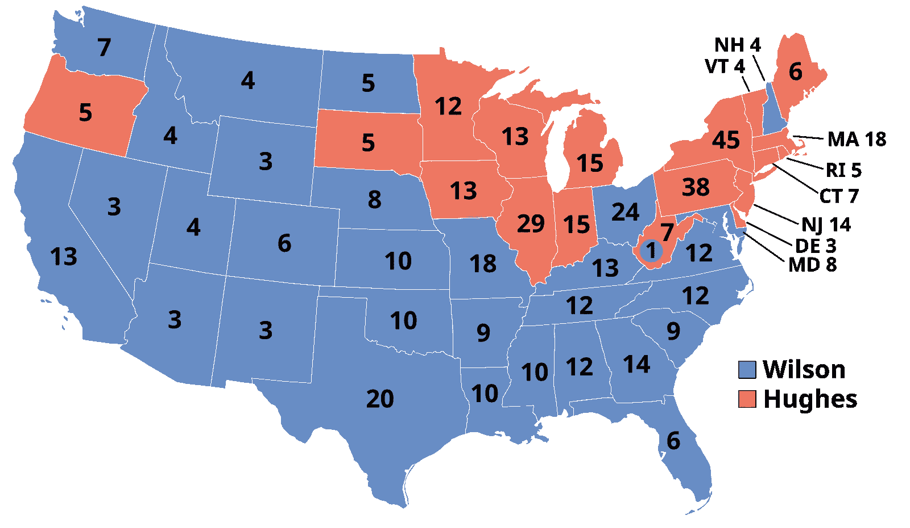

# 我如何预测自 1916 年以来的每一场选举

> 原文：[`towardsdatascience.com/predicting-every-election-since-1916-10810bee3c14?source=collection_archive---------0-----------------------#2024-11-08`](https://towardsdatascience.com/predicting-every-election-since-1916-10810bee3c14?source=collection_archive---------0-----------------------#2024-11-08)

## 以及“选举评论员预测”如何暴露了他们对概率的误解

 [Harys Dalvi](https://medium.com/@crackalamoo?source=post_page---byline--10810bee3c14--------------------------------)

·发表于[Towards Data Science](https://towardsdatascience.com/?source=post_page---byline--10810bee3c14--------------------------------) ·阅读时间 9 分钟·2024 年 11 月 8 日

--

仅凭 91 行 C++代码，我完美预测了自 1916 年以来的每一场美国总统选举。那是 28 场连胜的选举，包括 2024 年最新的一场。

疯狂的是，我并没有依赖任何复杂的民调数据趋势、选民情绪或政策分析来做出这些预测。我只是运用了基本的概率原理。

1916 年美国总统选举结果。公有领域。由[AndyHogan14，维基共享资源](https://en.wikipedia.org/wiki/File:ElectoralCollege1916.svg)提供。

好吧，我承认我有点作弊了。但说实话，这也许并不比那些声称自 1980 年起就能预测每场选举的政治评论员做得过分。

每次选举周期，你都会看到新闻报道某些人正确预测了若干年内的每一场选举。最近，我看到关于[Allan Lichtman](https://en.wikipedia.org/wiki/Allan_Lichtman)的报道，他正确预测了 1984 年至 2020 年间的 11 场大选中的大部分。他的选举预测系统叫做“13 Keys”，由 13 个是非问题组成，用来预测选举的赢家。[1]

但是后来 Allan Lichtman 错误预测了 2024 年大选。这是否让那些声称拥有复杂选举预测系统的选举评论员的预测能力受到质疑？
