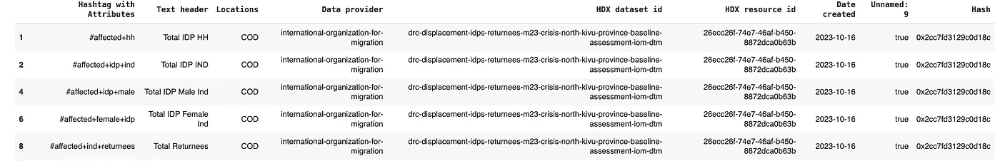
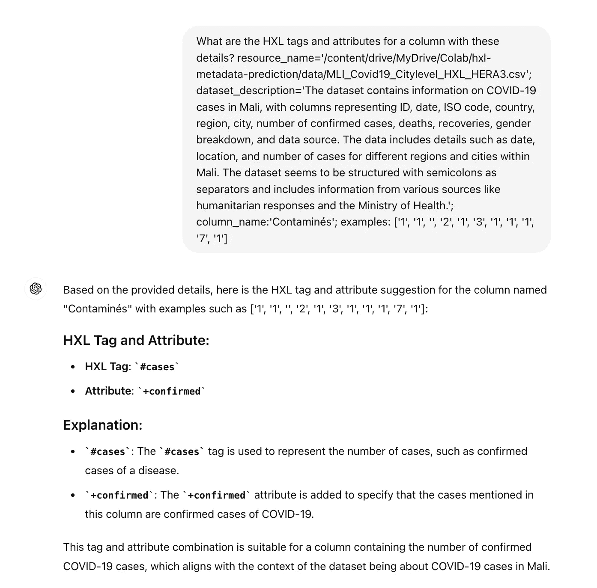
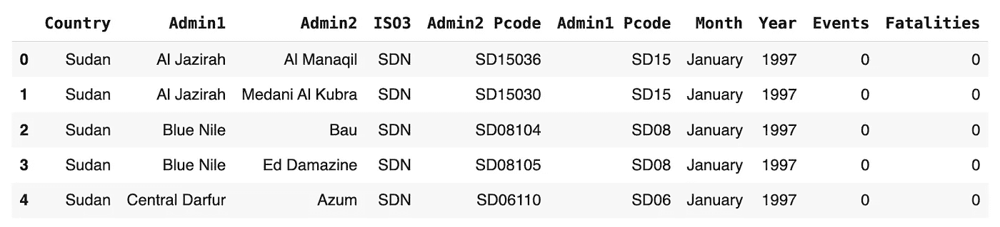
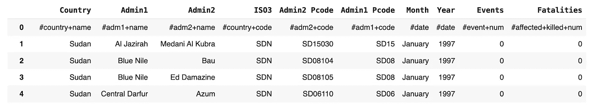
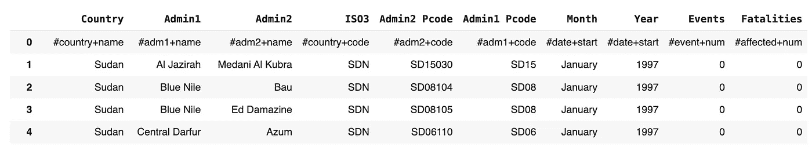

# 使用 LLM 预测人道主义数据集的元数据第二部分——微调的替代方法

> 原文：[`towardsdatascience.com/predicting-metadata-for-humanitarian-datasets-with-llms-part-2-an-alternative-to-fine-tuning-953a49c657cf?source=collection_archive---------5-----------------------#2024-08-03`](https://towardsdatascience.com/predicting-metadata-for-humanitarian-datasets-with-llms-part-2-an-alternative-to-fine-tuning-953a49c657cf?source=collection_archive---------5-----------------------#2024-08-03)

[](https://medium.com/@astrobagel?source=post_page---byline--953a49c657cf--------------------------------)[](https://towardsdatascience.com/?source=post_page---byline--953a49c657cf--------------------------------) [Matthew Harris](https://medium.com/@astrobagel?source=post_page---byline--953a49c657cf--------------------------------)

·发布于 [Towards Data Science](https://towardsdatascience.com/?source=post_page---byline--953a49c657cf--------------------------------) ·29 分钟阅读·2024 年 8 月 3 日

--


来源：GPT-4o

TL;DR

*在人道主义响应领域，可能会有成千上万的表格数据集（CSV 和 Excel），其中许多包含拯救生命的关键信息。数据可能由数百个不同的组织提供，且命名约定、语言和数据标准各异，因此了解表格中每一列的含义（元数据）对于找到合适的数据并理解其如何组合至关重要。大部分元数据是手动设置的，这既耗时又容易出错，因此任何自动化方法都可能在帮助人们方面产生实际影响。在本文中，我们重新审视了先前的分析“*[*使用 GPT-3 预测人道主义数据集的元数据*](https://medium.com/towards-data-science/predicting-metadata-for-humanitarian-datasets-using-gpt-3-b104be17716d)*”，以了解过去 18 个月的进展如何为更高效、节省时间的方法铺平道路，用于设置表格数据的元数据。*”

*通过使用带有元数据标签的 CSV 和 Excel 数据集，来自于* [*人道主义数据交换平台*](https://data.humdata.org/) *(HDX)，我们展示了微调 GPT-4o-mini 在预测* [*人道主义交换语言*](https://hxlstandard.org/) *(HXL)标签和属性时的良好效果，尤其是对于与位置和日期相关的最常见标签。然而，对于那些较少出现的标签和属性，这一技术可能会受到训练数据质量不佳的限制，原因在于人工标签错误或人们没有使用所有可能的 HXL 元数据组合。它还存在一个限制，即当元数据标准发生变化时，它无法进行调整，因为训练数据不会反映这些变化。*

*鉴于现在有了更强大的 LLM 可用，我们测试了一种技术，直接提示 GPT-4o 或 GPT-4o-mini，而不是进行微调，在系统提示中提供完整的 HXL 核心架构定义，因为现在可以使用更大的上下文窗口。事实证明，当使用 GPT-4o 时，这种方法比微调更准确，能够支持较少见的 HXL 标签和属性，并且不需要定制的训练数据，使得管理和部署更加简便。然而，它的成本较高，但如果使用 GPT-4o-mini，则成本较低，尽管性能略有下降。通过这种方法，我们提供了一个简单的 Python 类，位于* [*GitHub Gist*](https://gist.github.com/dividor/e693997c1fc7e0d94f8228cebc397014) *，可以在数据处理管道中自动为表格数据集添加 HXL 元数据标签和属性。*

# 生成性 AI 发展得**非常**迅速！

大约 18 个月前，我写了一篇博客文章 [使用 GPT-3 预测人道主义数据集的元数据](https://medium.com/towards-data-science/predicting-metadata-for-humanitarian-datasets-using-gpt-3-b104be17716d)。

没错，是使用 GPT-3，不是 GPT-3.5！🙂

即便如此，早在那时，大型语言模型（LLM）的微调就已在预测[人道主义交换语言](https://hxlstandard.org/)（HXL）元数据字段方面表现出色，尤其是在令人惊叹的[人道主义数据交换平台](https://data.humdata.org/)（HDX）上的表格数据集。在那项研究中，训练数据代表了 HDX 上的 HXL 数据分布，因此包含了与位置和日期相关的最常见标签。这些标签对于将不同数据集按位置和时间关联起来至关重要，这是利用数据优化人道主义响应的一个关键因素。

LLM 领域此后已取得了… **巨大的**进展。

因此，在本文中，我们将重新审视这一技术，将其扩展到涵盖不太常见的 HXL 标签和属性，并探讨目前可用的其他选项，适用于需要将复杂、高层次的分类法应用于数据的情况。我们还将探讨预测当前在人为标注的训练数据中未包含的较少见的 HXL 标准标签和属性的能力。

# 设置

你可以通过在[Google Colab](https://colab.research.google.com/)中打开这些笔记本，或者在本地运行它们来跟随本次分析：

+   [generate-test-train-data.ipynb](https://github.com/datakind/hxl-metadata-prediction/blob/main/generate-test-train-data.ipynb) — 用于创建测试和训练数据集的笔记本

+   [openai-hxl-prediction.ipynb](https://github.com/datakind/hxl-metadata-prediction/blob/main/openai-hxl-prediction.ipynb) — 探索微调和提示以预测 HXL 数据集的笔记本

请参阅仓库中的[README](https://github.com/datakind/hxl-metadata-prediction/blob/main/README.md)获取安装说明。

# 来自人道主义数据交换平台的 HXL 数据

对于本研究，在 HDX 团队的帮助下，我们将使用从 HDX 平台提取的数据，通过他们运行的爬虫过程跟踪平台上 HXL 元数据标签和属性的使用情况。你可以在[GitHub](https://github.com/HXLStandard)找到很棒的 HXL 资源，但如果你想跟随本次分析，我也将源数据保存到了 Google Drive，因为爬虫需要几天时间才能处理 HDX 上成千上万的表格数据集。

数据如下所示，每个 HXL 标签化的表格列为一行…



本研究中使用的数据示例，每行代表一个表格数据列。

# 核心 HXL 架构

[HXL 明信片](https://hxlstandard.org/standard/1-1final/postcards/)是一个非常好的概述，展示了核心架构中最常见的 HXL 标签和属性。对于我们的分析，我们将应用[HDX](https://data.humdata.org/dataset/hxl-core-schemas)上提供的完整标准，并提供了一个支持的标签和属性的[电子表格](https://docs.google.com/spreadsheets/d/1En9FlmM8PrbTWgl3UHPF_MXnJ6ziVZFhBbojSJzBdLI/edit?usp=sharing)…


本研究中使用的“核心 HXL 架构”摘录，来源于[Humanitarian Data Exchange](https://data.humdata.org/dataset/hxl-core-schemas)

# 数据处理

[generate-test-train-data.ipynb](https://github.com/datakind/hxl-metadata-prediction/blob/main/generate-test-train-data.ipynb)笔记本提供了创建测试和训练数据集的所有步骤，但这里有一些要注意的关键点：

**1\. 删除自动化管道重复的 HXL 数据**

在本研究中，我通过使用每个表格数据集（CSV 和 Excel 文件）中列名称的 MDF 哈希，删除由自动化管道上传到 HDX 的数据中的重复项。例如，某个组织创建的人口统计 CSV 文件通常与每个特定国家的 CSV 或 Excel 文件非常相似，因此我们只保留一个示例。这对数据起到了平衡作用，通过删除非常相似的重复数据，提供了更多的 HXL 标签和属性变异性。

**2\. 限制数据为有效的 HXL 格式**

大约 50% 的带有 HXL 标签的 HDX 数据使用了在[HXL 核心架构](https://docs.google.com/spreadsheets/d/1En9FlmM8PrbTWgl3UHPF_MXnJ6ziVZFhBbojSJzBdLI/edit?usp=sharing)中未指定的标签或属性，因此这些数据会被从训练集和测试集中移除。

**3\. 数据增强**

作为一个（大部分是！）人类，在决定在某一列使用哪些 HXL 标签和属性时，我会查看该列的数据，也会查看表格中所有数据。对于这个分析，我们也对 LLM 微调和提示数据做同样的处理，添加每一列的数据摘录。还使用 LLM（GPT-3.5-Turbo）对数据的摘要来为表格添加描述，使它们一致，因为 HDX 上的摘要格式各不相同，可能是几页，也可能是几句话。

**4\. 仔细划分数据以创建训练/测试集**

许多机器学习管道通过随机划分数据来创建训练集和测试集。然而，对于 HDX 数据，这样做会导致来自同一组织的列和文件出现在训练集和测试集中。我认为这种方式对预测测试来说有点太简单了，因此我选择按组织划分数据，确保测试集中的组织不出现在训练数据中。此外，同一母公司下的子公司——例如“ocha-iraq”和“ocha-libya”——也不能同时出现在训练集和测试集中，以使预测更加真实。我的目标是测试预测，假设这些组织的数据从未被见过。

在完成上述所有步骤并进行降采样以节省成本后，我们得到了**2,883**行训练集数据和**485**行测试集数据。

# 创建 JSONL 微调提示文件

在我原来的文章中，我选择使用一个完成模型，但随着[GPT-4o-mini](https://openai.com/index/gpt-4o-mini-advancing-cost-efficient-intelligence/)的发布，我改为生成适合微调*聊天*模型的提示（有关可用模型的更多信息，请参见[此处](https://platform.openai.com/docs/guides/fine-tuning/which-models-can-be-fine-tuned)）。

每个提示的格式是…

```py
{
  "messages": [
    {
      "role": "system", 
      "content": "<SYSTEM PROMPT>"
    }, 
    {
      "role": "user", 
      "content": "<INPUT PROMPT>"
    }, 
    {
      "role": "assistant", 
      "content": "<EXPECTED OUTPUT>"
    }
  ]
} 
```

注意：上述内容已格式化以便清晰阅读，但 JSONL 中每条记录会在一行内显示。

利用数据摘录、LLM 生成的表格描述以及我们收集的列名，我们现在可以生成类似于这样的提示…

```py
{
  "messages": [
    {
      "role": "system", 
      "content": "You are an assistant that replies with HXL tags and attributes"
    }, 
    {
      "role": "user", 
      "content": "What are the HXL tags and attributes for a column with these details? 
                    resource_name='admin1-summaries-earthquake.csv'; 
                    dataset_description='The dataset contains earthquake data for various 
                                         administrative regions in Afghanistan, 
                                         including country name, admin1 name, latitude, 
                                         longitude, aggregation type, indicator name, 
                                         and indicator value. The data includes maximum 
                                         earthquake values recorded in different regions, 
                                         with corresponding latitude and longitude coordinates. 
                                         The dataset provides insights into the seismic 
                                         activity in different administrative areas of 
                                         Afghanistan.'; 
                   column_name:'indicator'; 
                   examples: ['earthquake', 'earthquake', 'earthquake', 'earthquake', 'earthquake', 'earthquake', 'earthquake', 'earthquake', 'earthquake', 'earthquake', 'earthquake']"
      }, 
      {
        "role": "assistant", 
        "content": "#indicator+name"
      }
  ]
}
```

# 微调 GPT-4o-mini

我们现在拥有了适合微调 OpenAI 聊天模型的测试和训练文件格式，因此让我们开始微调我们的模型…

```py
def fine_tune_model(train_file, model_name="gpt-4o-mini"):
    """
    Fine-tune an OpenAI model using training data.

    Args:
        prompt_file (str): The file containing the prompts to use for fine-tuning.
        model_name (str): The name of the model to fine-tune. Default is "davinci-002".

    Returns:
        str: The ID of the fine-tuned model.
    """

    # Upload file to OpenAI for fine-tuning
    file = client.files.create(
        file=open(train_file, "rb"),
        purpose="fine-tune"
    )
    file_id = file.id
    print(f"Uploaded training file with ID: {file_id}")

    # Start the fine-tuning job
    ft = client.fine_tuning.jobs.create(
        training_file=file_id,
        model=model_name
    )
    ft_id = ft.id
    print(f"Fine-tuning job started with ID: {ft_id}")

    # Monitor the status of the fine-tuning job
    ft_result = client.fine_tuning.jobs.retrieve(ft_id)
    while ft_result.status != 'succeeded':
        print(f"Current status: {ft_result.status}")
        time.sleep(120)  # Wait for 60 seconds before checking again
        ft_result = client.fine_tuning.jobs.retrieve(ft_id)
        if 'failed' in ft_result.status.lower():
            sys.exit()

    print(f"Fine-tuning job {ft_id} succeeded!")

    # Retrieve the fine-tuned model
    fine_tuned_model = ft_result.fine_tuned_model
    print(f"Fine-tuned model: {fine_tuned_model}")

    return fine_tuned_model

model = fine_tune_model("hxl_chat_prompts_train.jsonl", model_name="gpt-4o-mini-2024-07-18")
```

在上面，我们使用的是新的[GPT-4-mini 模型](https://openai.com/index/gpt-4o-mini-advancing-cost-efficient-intelligence/)，该模型目前由 OpenAI 提供免费微调服务…

> “现在到 9 月 23 日，GPT-4o mini 可以免费调优，最多达到每日 2M 训练令牌的限制。超过 2M 训练令牌的部分将按$3.00/百万令牌收费。从 9 月 24 日起，调优训练将收费$3.00/百万令牌。查看[调优文档](http://url3243.email.openai.com/ls/click?upn=u001.IQLfsj4kk-2BK7JhymNusRMkuuWNTB2xtKMTOzsaHXXCxL87wc9xXN3T3-2B7A50MnxBgM-2FSPU6KI18qmN7e0qEq7w-3D-3DYSY8_HWAk4DGcP5bOseprwmP7vlMwrd2PVXgyuPjLpW3O5VwKbv89B-2BC2CHyio6JopT7iV9PDDQbS-2BN2x-2FOMYyECPpE2WpDWUaqXamxCNxLNFb3Rwb-2BHV-2FnmELwjcwafGYmpXvFXZ3a1UDAGj-2FI8RPRJ92m05wFP91cNzwWmQw2EWFsPrLyLakbHisdbOdu-2B4S0ScKBkmbmuJc7Ib-2Ftz7vKHoD5rdIHoytDF68pW1ivyzpO5isDzndxqHjHSEoXNrAMaOs0RnmRsG-2Btwq2onQS1WmIokXr00y08IHtcHQMGB8k2caZ5qZ1FzXlQ7tM-2F42kCwNCt4-2BmFy-2Bt8mm9-2BtTS6Qd9pEf9tpuFFcI14VFgdiiUINrbkZX-2BvxRqD924FparfXWICjMx3q6U3F78-2B0okeN23HKQddDiZ9ufm5tITBwbvTYG4vXxKkrvM1fg-2BY-2FSI1Zgu7AMY95FNOKhHZjjVYIXSEFJh5oN0U3K3ceVerRfgU0o1sp8yLH-2F4yaMjmyNjp9gAL5CiSYfTqIx0hHAETq3DyTWqiJMx5Fpsg8sAiqHj3Dgwqj5hydZgeMopCnrf3Cfo7Uf09kxixficprhjJLtC-2BOYDB9QH3AyxBxKCpKupl026DU1bx7HoE0Rcytak3Zy6lolc6PczWAxmgGmi8bkEWsMxj8VS-2BhSSPF7qHIr0a-2BP020bgEng-2BZL0HUgfiJpig0i4DhENBp-2BQokwZMcgMdFpOhJVou0cF-2BcxDprFi2U2xhrxn5es5vY0TTwpQjqAhs-2BoK-2FZpbE0zkuyQ9tTtlInaU26DOBv1RHaiFTN-2F8GTEHoxvkJ1OHhhds3ATTWUCGwOhUOZ-2Fl5JjWzYdCDPeOgqnxlQd8b1i-2BJuaBRnhUjpQ7TzPnWkCur4qMtI-2BYKM3tD2d0RxTYTYfQ3GoNsZ-2FBo5Mf4Rb3lKQt59vxsLqKYe33qRjeFo12Ke3dS20gxD7Zxtpu57q1z0xuMgwj9uDDqrPTZh9qbUDYGc1IsbRhOAjL5z4kAYR2jGvTi2SFq9f2AiA1swOO3CORlZpwn5Y6BA-3D-3D)以获取更多有关免费访问的详细信息。”

即使按$3.00/百万个令牌计算，对于这个任务来说，成本也相当低，整个调优过程大约需要 7 美元，测试文件中有超过 200 万个令牌。需要记住的是，对于这个特定任务，调优应该是一个少见的事件，一旦我们拥有这样的模型，它可以被重复使用。

调优产生了以下输出……

```py
Uploaded training file with ID: file-XXXXXXXXXXXXXXX
Fine-tuning job started with ID: ftjob-XXXXXXXXXXXXXXX
Current status: validating_files
Current status: validating_files
Current status: running
Current status: running
Current status: running
Current status: running
Current status: running
Current status: running
Current status: running
Current status: running
Current status: running
Current status: running
Current status: running
Current status: running
Current status: running
Current status: running
Current status: running
Current status: running
Current status: running
Current status: running
Current status: running
Fine-tuning job ftjob-XXXXXXXXXXXXXXX succeeded!
Fine-tuned model: ft:gpt-4o-mini-2024-07-18::XXXXXXX
```

花了大约 45 分钟。

# 测试我们调优后的模型以预测 HXL

现在我们有了一个精心调优的新模型，可以预测 HXL 标签和属性，我们可以使用测试文件来进行测试……

```py
def make_chat_predictions(prompts, model, temperature=0.1, max_tokens=13):
    """
    Generate chat predictions based on given prompts using the OpenAI chat model.

    Args:
        prompts (list): A list of prompts, where each prompt is a dictionary containing a list of messages.
                        Each message in the list has a 'role' (either 'system', 'user', or 'assistant') and 'content'.
        model (str): The name or ID of the OpenAI chat model to use for predictions.
        temperature (float, optional): Controls the randomness of the predictions. Higher values (e.g., 0.5) make the
                                       output more random, while lower values (e.g., 0.1) make it more deterministic.
                                       Defaults to 0.1.
        max_tokens (int, optional): The maximum number of tokens in the predicted response. Defaults to 13.

    Returns:
        pandas.DataFrame: A DataFrame containing the results of the chat predictions. Each row in the DataFrame
                          corresponds to a prompt and includes the prompt messages, the actual message, and the
                          predicted message.

    """
    results = []
    for p in prompts:
        actual = p["messages"][-1]["content"]
        p["messages"] = p["messages"][0:2]
        completion = client.chat.completions.create(
            model=model,
            messages=p["messages"],
            temperature=temperature,
            max_tokens=max_tokens
        )
        predicted = completion.choices[0].message.content
        predicted = filter_for_schema(predicted)

        res = {
            "prompt": p["messages"],
            "actual": actual,
            "predicted": predicted
        }

        print(f"Predicted: {predicted}; Actual: {actual}")

        results.append(res)

    results = pd.DataFrame(results)

    return results

def filter_for_schema(text):
    """
    Filters the input text to extract approved HXL schema tokens.

    Args:
        text (str): The input text to be filtered.

    Returns:
        str: The filtered text containing only approved HXL schema tokens.
    """

    if " " in text:
        text = text.replace(" ","")

    tokens_raw = text.split("+")
    tokens = [tokens_raw[0]]
    for t in tokens_raw[1:]:
        tokens.append(f"+{t}")

    filtered = []
    for t in tokens:
        if t in APPROVED_HXL_SCHEMA:
            if t not in filtered:
                filtered.append(t)
    filtered = "".join(filtered)

    if len(filtered) > 0 and filtered[0] != '#':
        filtered = ""

    return filtered

def output_prediction_metrics(results, prediction_field="predicted", actual_field="actual"):
    """
    Prints out model performance report for HXL tag prediction. Metrics are for
    just predicting tags, as well as predicting tags and attributes.

    Parameters
    ----------
    results : dataframe
        Dataframe of results
    prediction_field : str
        Field name of element with prediction. Handy for comparing raw and post-processed predictions.
    actual_field: str
        Field name of the actual result for comparison with prediction
    """
    y_test = []
    y_pred = []
    y_justtag_test = []
    y_justtag_pred = []
    for index, r in results.iterrows():
        if actual_field not in r and predicted_field not in r:
            print("Provided results do not contain expected values.")
            sys.exit()
        y_pred.append(r[prediction_field])
        y_test.append(r[actual_field])
        actual_tag = r[actual_field].split("+")[0]
        predicted_tag = r[prediction_field].split("+")[0]
        y_justtag_test.append(actual_tag)
        y_justtag_pred.append(predicted_tag)

    print(f"LLM results for {prediction_field}, {len(results)} predictions ...")
    print("\nJust HXL tags ...\n")
    print(f"Accuracy: {round(accuracy_score(y_justtag_test, y_justtag_pred),2)}")
    print(
        f"Precision: {round(precision_score(y_justtag_test, y_justtag_pred, average='weighted', zero_division=0),2)}"
    )
    print(
        f"Recall: {round(recall_score(y_justtag_test, y_justtag_pred, average='weighted', zero_division=0),2)}"
    )
    print(
        f"F1: {round(f1_score(y_justtag_test, y_justtag_pred, average='weighted', zero_division=0),2)}"
    )

    print(f"\nTags and attributes with {prediction_field} ...\n")
    print(f"Accuracy: {round(accuracy_score(y_test, y_pred),2)}")
    print(
        f"Precision: {round(precision_score(y_test, y_pred, average='weighted', zero_division=0),2)}"
    )
    print(
        f"Recall: {round(recall_score(y_test, y_pred, average='weighted', zero_division=0),2)}"
    )
    print(
        f"F1: {round(f1_score(y_test, y_pred, average='weighted', zero_division=0),2)}"
    )

    return

with open(TEST_FILE) as f:
    X_test = [json.loads(line) for line in f]

results = make_chat_predictions(X_test, model)

output_prediction_metrics(results)

print("Done")
```

上述内容中需要注意的是，所有预测都经过了 HXL 标准中定义的允许标签和属性的筛选。

这给出了以下结果……

```py
LLM results for predicted, 458 predictions ...

Just HXL tags ...

Accuracy: 0.83
Precision: 0.85
Recall: 0.83
F1: 0.82

Tags and attributes with predicted ...

Accuracy: 0.61
Precision: 0.6
Recall: 0.61
F1: 0.57 
```

“仅 HXL 标签”是指预测 HXL 的第一部分，例如，如果完整的 HXL 是#affected+infected+f，模型正确预测了#affected 部分。“标签和属性”是指预测完整的 HXL 字符串，即‘#affected+infected+f’，这是一个更具挑战性的任务，因为存在许多可能的组合。

性能并不完美，但也不算太差，特别是我们平衡了数据集，减少了位置和日期标签及属性的数量（即让这个研究稍微更具挑战性）。即使如此，仍然有成千上万的人道主义响应表格没有 HDX，即使是上述性能也可能带来价值。

让我们看看预测与人工标注数据不一致的案例……

# 审查人类标注的 HXL 数据

预测结果已保存到电子表格中，我手动查看了大多数与标签不一致的预测。你可以在[这里](https://docs.google.com/spreadsheets/d/19BfVEU4hQJYUrliRKzfu5rXagK8CjoDH/edit?usp=sharing&ouid=107814789436940136200&rtpof=true&sd=true)找到这项分析，并在下文进行总结……


有趣的是，在某些情况下，LLM 实际上是正确的，例如在添加*额外的*HXL 属性时，而这些属性在人工标注的数据中没有包含。也有一些情况下，人工标注的 HXL 完全合理，但 LLM 预测了另一个标签或属性，这个标签或属性也可以被解释为正确。例如，在某些国家，#region 也可以是#admin1，而某些情况下判断一个是+id 还是+code 也很难决定，两者都是合适的。

使用上述类别，我创建了一个新的测试集，其中纠正了期望的 HXL 标签。在重新运行预测后，我们得到了改进的结果……

```py
 Just HXL tags ...

Accuracy: 0.88
Precision: 0.88
Recall: 0.88
F1: 0.88

Tags and attributes with predicted ...

Accuracy: 0.66
Precision: 0.71
Recall: 0.66
F1: 0.66
```

# 在没有微调的情况下预测 HXL，而仅仅是通过提示来使用 GPT-4o

上述内容表明人类标注的数据本身可能是错误的。HXL 标准设计得非常出色，但对于开发人员和数据科学家来说，在数据上设置 HXL 标签和属性时，记住它们可能是一个挑战。HXL 团队已经提供了一些[令人惊叹的工具](https://hxlstandard.org/tools/)，但有时 HXL 仍然是错误的。这给依赖这些人类标注数据进行训练的微调方法带来了问题，尤其是对于那些人类不常使用的标签和属性，这些标签和属性的表示较少。它还存在一个限制，即无法在元数据标准发生变化时进行调整，因为训练数据不会反映这些变化。

自 18 个月前的初步分析以来，各个 LLM 提供商已经显著提高了他们的模型。OpenAI 当然发布了他们的旗舰产品[GPT-4o](https://openai.com/index/hello-gpt-4o/)，其具有 128k 个 token 的上下文窗口，这一点很重要，另外，这也是一个数据点，表明基础模型的成本正在下降（例如，GPT-4-Turbo 与 GPT-4o 的比较[见此](https://huggingface.co/spaces/philschmid/llm-pricing)）。考虑到这些因素，我开始思考……

***如果模型变得更强大且使用成本更低，我们是否可以完全避免微调，仅通过提示就能预测 HXL 标签和属性？***

这不仅意味着减少清理数据和微调模型的工程工作，还可能具有一个巨大优势，即能够包括人类标注的训练数据中未包含但属于 HXL 标准的 HXL 标签和属性。这是强大 LLM 的一个潜在巨大优势，可以通过零样本和少样本提示进行分类。

# 为预测 HXL 创建提示

像 GPT-4o 这样的模型是基于网页数据训练的，所以我想先做一个测试，使用我们的提示之一来看看它是否已经知道关于 HXL 标签的所有信息…



我们看到的是，它似乎知道 HXL 的语法，但答案不正确（正确答案是‘#affected+infected’），并且选择了不在 HXL 标准中的标签和属性。这实际上类似于我们在人类标注的 HXL 中看到的情况。

如果我们在系统提示中提供[HXL 标准](https://docs.google.com/spreadsheets/d/1En9FlmM8PrbTWgl3UHPF_MXnJ6ziVZFhBbojSJzBdLI/edit?pli=1&gid=319251406#gid=319251406)的最重要部分怎么样？

```py
def generate_hxl_standard_prompt(local_data_file):
  """
  Generate a standard prompt for predicting Humanitarian Markup Language (HXL) tags and attributes.

  Args:
    local_data_file (str): The path to the local data file containing core hashtags and attributes.

  Returns:
    str: The generated HXL standard prompt.

  """

  core_hashtags = pd.read_excel(local_data_file, sheet_name='Core hashtags')
  core_hashtags = core_hashtags.loc[core_hashtags["Release status"] == "Released"]
  core_hashtags = core_hashtags[["Hashtag", "Hashtag long description", "Sample HXL"]]

  core_attributes = pd.read_excel(local_data_file, sheet_name='Core attributes')
  core_attributes = core_attributes.loc[core_attributes["Status"] == "Released"]
  core_attributes = core_attributes[["Attribute", "Attribute long description", "Suggested hashtags (selected)"]]

  print(core_hashtags.shape)
  print(core_attributes.shape)

  core_hashtags = core_hashtags.to_dict(orient='records')
  core_attributes = core_attributes.to_dict(orient='records')

  hxl_prompt= f"""
  You are an AI assistant that predicts Humanitarian Markup Language (HXL) tags and attributes for columns of data where the HXL standard is defined as follows:

  CORE HASHTAGS:

  {json.dumps(core_hashtags,indent=4)}

  CORE ATTRIBUTES:

  {json.dumps(core_attributes, indent=4)}

  Key points:

  - ALWAYS predict hash tags
  - NEVER predict a tag which is not a valid core hashtag
  - NEVER start with a core hashtag, you must always start with a core hashtag
  - Always try and predict an attribute if possible
  - Do not use attribute +code if the data examples are human readable names

  You must return your result as a JSON record with the fields 'predicted' and 'reasoning', each is of type string.

  """

  print(len(hxl_prompt.split(" ")))
  print(hxl_prompt)
  return hxl_prompt
```

这给了我们如下的提示…

```py
You are an AI assistant that predicts Humanitarian Markup Language (HXL) tags and attributes for columns of data where the HXL standard is defined as follows:

  CORE HASHTAGS:

  [
    {
        "Hashtag": "#access",
        "Hashtag long description": "Accessiblity and constraints on access to a market, distribution point, facility, etc.",
        "Sample HXL": "#access +type"
    },
    {
        "Hashtag": "#activity",
        "Hashtag long description": "A programme, project, or other activity. This hashtag applies to all levels; use the attributes +activity, +project, or +programme to distinguish different hierarchical levels.",
        "Sample HXL": "#activity +project"
    },
    {
        "Hashtag": "#adm1",
        "Hashtag long description": "Top-level subnational administrative area (e.g. a governorate in Syria).",
        "Sample HXL": "#adm1 +code"
    },
    {
        "Hashtag": "#adm2",
        "Hashtag long description": "Second-level subnational administrative area (e.g. a subdivision in Bangladesh).",
        "Sample HXL": "#adm2 +name"
    },
    {
        "Hashtag": "#adm3",
        "Hashtag long description": "Third-level subnational administrative area (e.g. a subdistrict in Afghanistan).",
        "Sample HXL": "#adm3 +code"
    },
    {
        "Hashtag": "#adm4",
        "Hashtag long description": "Fourth-level subnational administrative area (e.g. a barangay in the Philippines).",
        "Sample HXL": "#adm4 +name"
    },
    {
        "Hashtag": "#adm5",
        "Hashtag long description": "Fifth-level subnational administrative area (e.g. a ward of a city).",
        "Sample HXL": "#adm5 +code"
    },
    {
        "Hashtag": "#affected",
        "Hashtag long description": "Number of people or households affected by an emergency. Subset of #population; superset of #inneed.",
        "Sample HXL": "#affected +f +children"
    },
    {
        "Hashtag": "#beneficiary",
        "Hashtag long description": "General (non-numeric) information about a person or group meant to benefit from aid activities, e.g. \"lactating women\".",
        "Sample HXL": "#beneficiary +name"
    },
    {
        "Hashtag": "#capacity",
        "Hashtag long description": "The response capacity of the entity being described (e.g. \"25 beds\").",
        "Sample HXL": "#capacity +num"
    },

... Truncated for brevity

    },
    {
        "Hashtag": "#targeted",
        "Hashtag long description": "Number of people or households targeted for humanitarian assistance. Subset of #inneed; superset of #reached.",
        "Sample HXL": "#targeted +f +adult"
    },
    {
        "Hashtag": "#value",
        "Hashtag long description": "A monetary value, such as the price of goods in a market, a project budget, or the amount of cash transferred to beneficiaries. May be used together with #currency in financial or cash data.",
        "Sample HXL": "#value +transfer"
    }
]

  CORE ATTRIBUTES:

  [
    {
        "Attribute": "+abducted",
        "Attribute long description": "Hashtag refers to people who have been abducted.",
        "Suggested hashtags (selected)": "#affected, #inneed, #targeted, #reached"
    },
    {
        "Attribute": "+activity",
        "Attribute long description": "The implementers classify this activity as an \"activity\" proper  (may imply different hierarchical levels in different contexts).",
        "Suggested hashtags (selected)": "#activity"
    },
    {
        "Attribute": "+adolescents",
        "Attribute long description": "Adolescents, loosely defined (precise age range varies); may overlap +children and +adult.  You can optionally create custom attributes in addition to this to add precise age ranges, e.g. \"+adolescents +age12_17\".",
        "Suggested hashtags (selected)": "#affected, #inneed, #targeted, #reached, #population"
    },
    {
        "Attribute": "+adults",
        "Attribute long description": "Adults, loosely defined (precise age range varies); may overlap +adolescents and +elderly. You can optionally create custom attributes in addition to this to add precise age ranges, e.g. \"+adults +age18_64\".",
        "Suggested hashtags (selected)": "#affected, #inneed, #targeted, #reached, #population"
    },
    {
        "Attribute": "+approved",
        "Attribute long description": "Date or time when something was approved.",
        "Suggested hashtags (selected)": "#date"
    },
    {
        "Attribute": "+bounds",
        "Attribute long description": "Boundary data (e.g. inline GeoJSON).",
        "Suggested hashtags (selected)": "#geo"
    },
    {
        "Attribute": "+budget",
        "Attribute long description": "Used with #value to indicate that the amount is planned/approved/budgeted rather than actually spent.",
        "Suggested hashtags (selected)": "#value"
    },
    {
        "Attribute": "+canceled",
        "Attribute long description": "Date or time when something (e.g. an #activity) was canceled.",
        "Suggested hashtags (selected)": "#date"
    },
    {
        "Attribute": "+children",
        "Attribute long description": "The associated hashtag applies to non-adults, loosely defined (precise age range varies; may overlap +infants and +adolescents). You can optionally create custom attributes in addition to this to add precise age ranges, e.g. \"+children +age3_11\".",
        "Suggested hashtags (selected)": "#affected, #inneed, #targeted, #reached, #population"
    },
    {
        "Attribute": "+cluster",
        "Attribute long description": "Identifies a sector as a formal IASC humanitarian cluster.",
        "Suggested hashtags (selected)": "#sector"
    },
    {
        "Attribute": "+code",
        "Attribute long description": "A unique, machine-readable code.",
        "Suggested hashtags (selected)": "#region, #country, #adm1, #adm2, #adm3, #adm4, #adm5, #loc, #beneficiary, #activity, #org, #sector, #subsector, #indicator, #output, #crisis, #cause, #impact, #severity, #service, #need, #currency, #item, #need, #service, #channel, #modality, #event, #group, #status"
    },
    {
        "Attribute": "+converted",
        "Attribute long description": "Date or time used for converting a monetary value to another currency.",
        "Suggested hashtags (selected)": "#date"
    },
    {
        "Attribute": "+coord",
        "Attribute long description": "Geodetic coordinates (lat+lon together).",
        "Suggested hashtags (selected)": "#geo"
    },
    {
        "Attribute": "+dest",
        "Attribute long description": "Place of destination (intended or actual).",
        "Suggested hashtags (selected)": "#region, #country, #adm1, #adm2, #adm3, #adm4, #adm5, #loc"
    },
    {
        "Attribute": "+displaced",
        "Attribute long description": "Displaced people or households. Refers to all types of displacement: use +idps or +refugees to be more specific.",
        "Suggested hashtags (selected)": "#affected, #inneed, #targeted, #reached, #population"
    },
    {
        "Attribute": "+elderly",
        "Attribute long description": "Elderly people, loosely defined (precise age range varies). May overlap +adults. You can optionally create custom attributes in addition to this to add precise age ranges, e.g. \"+elderly +age65plus\".",
        "Suggested hashtags (selected)": "#affected, #inneed, #targeted, #reached, #population"
    },

... Truncated for brevity

    {
        "Attribute": "+url",
        "Attribute long description": "The data consists of web links related to the main hashtag (e.g. for an #org, #service, #activity, #loc, etc).",
        "Suggested hashtags (selected)": "#contact, #org, #activity, #service, #meta"
    },
    {
        "Attribute": "+used",
        "Attribute long description": "Refers to a #service, #item, etc. that affected people have actually consumed or otherwise taken advantage of.",
        "Suggested hashtags (selected)": "#service, #item"
    }
]

  Key points:

  - ALWAYS predict hash tags
  - NEVER predict a tag which is not a valid core hashtag
  - NEVER start with a core hashtag, you must always start with a core hashtag
  - Always try and predict an attribute if possible

  You must return your result as a JSON record with the fields 'predicted' and 'reasoning', each is of type string.
```

它相当长（上面已被截断），但包含了 HXL 标准的要点。

直接提示方法的另一个优势是，我们还可以要求 LLM 在预测 HXL 时提供其推理过程。当然，这可能包括幻觉，但我发现它对于优化提示非常有帮助。

对于用户提示，我们将使用与微调时相同的信息，包括摘录和 LLM 生成的表格总结…

```py
What are the HXL tags and attributes for a column with these details? resource_name='/content/drive/MyDrive/Colab/hxl-metadata-prediction/data/IFRC Appeals Data for South Sudan8.csv'; 
   dataset_description='The dataset contains information on various 
                        appeals and events related to South Sudan, 
                        including details such as the type of appeal, 
                        status, sector, amount requested and funded, 
                        start and end dates, as well as country-specific 
                        information like country code, region, and average 
                        household size. The data includes appeals for 
                        different crises such as floods, population 
                        movements, cholera outbreaks, and Ebola preparedness, 
                        with details on beneficiaries and confirmation needs. 
                        The dataset also includes metadata such as IDs, 
                        names, and translation modules for countries and regions.'; 
   column_name:'aid'; 
   examples: ['18401', '17770', '17721', '16858', '15268', '15113', '14826', '14230', '12788', '9286', '8561']
```

将所有内容综合起来，并同时对比 GPT-4o-mini 和 GPT-4o 的提示结果…

```py
def call_gpt(prompt, system_prompt, model, temperature, top_p, max_tokens):
    """
    Calls the GPT model to generate a response based on the given prompt and system prompt.

    Args:
        prompt (str): The user's input prompt.
        system_prompt (str): The system's input prompt.
        model (str): The name or ID of the GPT model to use.
        temperature (float): Controls the randomness of the generated output. Higher values (e.g., 0.8) make the output more random, while lower values (e.g., 0.2) make it more deterministic.
        top_p (float): Controls the diversity of the generated output. Higher values (e.g., 0.8) make the output more diverse, while lower values (e.g., 0.2) make it more focused.
        max_tokens (int): The maximum number of tokens to generate in the response.

    Returns:
        dict or None: The generated response as a dictionary object, or None if an error occurred during generation.
    """
    response = client.chat.completions.create(
        model=model,
        messages= [
            {"role": "system", "content": system_prompt},
            {"role": "user", "content": prompt}
        ],
        max_tokens=2000,
        temperature=temperature,
        top_p=top_p,
        frequency_penalty=0,
        presence_penalty=0,
        stop=None,
        stream=False,
        response_format={ "type": "json_object" }
    )

    result = response.choices[0].message.content
    result = result.replace("```json","").replace("```py","")
    try:
        result = json.loads(result)
        result["predicted"] = result["predicted"].replace(" ","")
    except:
        print(result)
        result = None
    return result

def make_prompt_predictions(prompts, model, temperature=0.1, top_p=0.1, \
                            max_tokens=2000, debug=False, actual_field="actual"):
    """
    Generate predictions for a given set of prompts using the specified model.

    Args:
        prompts (pandas.DataFrame): A DataFrame containing the prompts to generate predictions for.
        model (str): The name of the model to use for prediction.
        temperature (float, optional): The temperature parameter for the model's sampling. Defaults to 0.1.
        top_p (float, optional): The top-p parameter for the model's sampling. Defaults to 0.1.
        max_tokens (int, optional): The maximum number of tokens to generate for each prompt. Defaults to 2000.
        debug (bool, optional): Whether to print debug information during prediction. Defaults to False.
        actual_field (str, optional): The name of the column in the prompts DataFrame that contains the actual values. Defaults to "actual".

    Returns:
        pandas.DataFrame: A DataFrame containing the results of the predictions, including the prompt, actual value, predicted value, and reasoning.

    """

    num_prompts = len(prompts)
    print(f"Number of prompts: {num_prompts}")

    results = []
    for index, p in prompts.iterrows():

        if index % 50 == 0:
            print(f"{index/num_prompts*100:.2f}% complete")

        prompt = p["prompt"]
        prompt = ast.literal_eval(prompt)
        prompt = prompt[1]["content"]
        actual = p[actual_field]

        result = call_gpt(prompt, hxl_prompt, model, temperature, top_p, max_tokens)

        if result is None:
            print("    !!!!! No LLM result")
            predicted = ""
            reasoning = ""
        else:
            predicted = result["predicted"]
            reasoning = result["reasoning"]

        if debug is True:
            print(f"Actual: {actual}; Predicted: {predicted}; Reasoning: {reasoning}")

        results.append({
            "prompt": prompt,
            "actual": actual,
            "predicted": predicted,
            "reasoning": reasoning
        })

    results = pd.DataFrame(results)

    print(f"\n\n===================== {model} Results =========================\n\n")
    output_prediction_metrics(results)
    print(f"\n\n=================================================================")

    results["match"] = results['predicted'] == results['actual']
    results.to_excel(f"{LOCAL_DATA_DIR}/hxl-metadata-prompting-only-prediction-{model}-results.xlsx", index=False)

    return results

for model in ["gpt-4o-mini","gpt-4o"]:
  print(f"Model: {model}")
  results = make_prompt_predictions(X_test, model, temperature=0.1, top_p=0.1, max_tokens=2000)
```

我们得到…

```py
===================== gpt-4o-mini Results =========================

LLM results for predicted, 458 predictions ...

Just HXL tags ...

Accuracy: 0.77
Precision: 0.83
Recall: 0.77
F1: 0.77

Tags and attributes with predicted ...

Accuracy: 0.53
Precision: 0.54
Recall: 0.53
F1: 0.5

===================== gpt-4o Results =========================

LLM results for predicted, 458 predictions ...

Just HXL tags ...

Accuracy: 0.86
Precision: 0.86
Recall: 0.86
F1: 0.85

Tags and attributes with predicted ...

Accuracy: 0.71
Precision: 0.7
Recall: 0.71
F1: 0.69

=================================================================
```

提醒一下，微调后的模型产生了以下结果…

```py
Just HXL tags ...

Accuracy: 0.83
Precision: 0.85
Recall: 0.83
F1: 0.82

Tags and attributes with predicted ...

Accuracy: 0.61
Precision: 0.6
Recall: 0.61
F1: 0.57
```

*仅使用提示的 GPT-4o 与 GPT-4o-mini 相比如何？*

从上面的数据来看，我们发现 GPT-4o-mini 仅使用提示预测标签的准确率为 77%，低于 GPT-4o-mini 微调后的 83%和 GPT-4o 仅使用提示的 86%。尽管如此，性能仍然不错，即便直接使用也能改善 HXL 覆盖率。

*仅使用提示与微调模型的对比如何？*

GPT-4o 仅使用提示的结果是所有模型中最好的，在标签上的准确率为 86%，在标签和属性上的准确率为 71%。实际上，经过更多对测试数据的分析以纠正错误的人类标签后，性能可能会更好。

让我们仔细看看 GPT-4o 出错的情况…

```py
df = pd.read_excel(f"{LOCAL_DATA_DIR}/hxl-metadata-prompting-only-prediction-gpt-4o-results.xlsx")

breaks = df[df["match"]==False]
print(breaks.shape)

for index, row in breaks.iterrows():
  print("\n======================================== ")
  pprint.pp(f"\nPrompt: {row['prompt']}")
  print()
  print(f"Actual", row["actual"])
  print(f"Predicted", row["predicted"])
  print()
  pprint.pp(f'Reasoning: \n{row["reasoning"]}')
```

```py
'\n'
 'Prompt: What are the HXL tags and attributes for a column with these '
 'details? '
 "resource_name='/content/drive/MyDrive/Colab/hxl-metadata-prediction/data/IFRC "
 "Appeals Data for South Sudan8.csv'; dataset_description='The dataset "
 'contains information on various appeals and events related to South Sudan, '
 'including details such as the type of appeal, status, sector, amount '
 'requested and funded, start and end dates, as well as country-specific '
 'information like country code, region, and average household size. The data '
 'includes appeals for different crises such as floods, population movements, '
 'cholera outbreaks, and Ebola preparedness, with details on beneficiaries and '
 'confirmation needs. The dataset also includes metadata such as IDs, names, '
 "and translation modules for countries and regions.'; column_name:'dtype.id'; "
 "examples: ['12', '5', '1', '1', '12', '12', '1', '6', '1', '1', '7']")

Actual #cause+id
Predicted #meta+id

('Reasoning: \n'
 "The column 'dtype.id' contains numeric identifiers (e.g., '12', '5', '1') "
 'which are likely to be internal identifiers for data records. According to '
 'the HXL standard, the appropriate hashtag for internal identifiers is '
 "'#meta' with the attribute '+id'.")

======================================== 
('\n'
 'Prompt: What are the HXL tags and attributes for a column with these '
 'details? '
 "resource_name='/content/drive/MyDrive/Colab/hxl-metadata-prediction/data/IFRC "
 "Appeals Data for South Sudan8.csv'; dataset_description='The dataset "
 'contains information on various appeals and events related to South Sudan, '
 'including details such as the type of appeal, status, sector, amount '
 'requested and funded, start and end dates, as well as country-specific '
 'information like country code, region, and average household size. The data '
 'includes appeals for different crises such as floods, population movements, '
 'cholera outbreaks, and Ebola preparedness, with details on beneficiaries and '
 'confirmation needs. The dataset also includes metadata such as IDs, names, '
 "and translation modules for countries and regions.'; "
 "column_name:'dtype.name'; examples: ['Flood', 'Population Movement', "
 "'Epidemic', 'Epidemic', 'Flood', 'Flood', 'Epidemic', 'Complex Emergency', "
 "'Epidemic', 'Epidemic', 'Civil Unrest']")

Actual #cause+name
Predicted #event+type

('Reasoning: \n'
 "The examples provided in the column ('Flood', 'Population Movement', "
 "'Epidemic', 'Complex Emergency', 'Civil Unrest') describe different types of "
 'events or incidents within a crisis or emergency. According to the HXL '
 'standard, the appropriate hashtag for this type of data is #event, and the '
 'attribute +type is used to specify the type or category of the event.')

======================================== 
('\n'
 'Prompt: What are the HXL tags and attributes for a column with these '
 'details? '
 "resource_name='/content/drive/MyDrive/Colab/hxl-metadata-prediction/data/IFRC "
 "Appeals Data for South Sudan8.csv'; dataset_description='The dataset "
 'contains information on various appeals and events related to South Sudan, '
 'including details such as the type of appeal, status, sector, amount '
 'requested and funded, start and end dates, as well as country-specific '
 'information like country code, region, and average household size. The data '
 'includes appeals for different crises such as floods, population movements, '
 'cholera outbreaks, and Ebola preparedness, with details on beneficiaries and '
 'confirmation needs. The dataset also includes metadata such as IDs, names, '
 "and translation modules for countries and regions.'; "
 "column_name:'status_display'; examples: ['Active', 'Active', 'Closed', "
 "'Closed', 'Closed', 'Closed', 'Closed', 'Closed', 'Closed', 'Closed', "
 "'Closed']")

Actual #status+name
Predicted #status+code

('Reasoning: \n'
 "The column 'status_display' contains values such as 'Active' and 'Closed', "
 'which describe the status of appeals or events. The appropriate HXL hashtag '
 'for project or activity status is #status. Since the values are categorical '
 'and represent different statuses, the attribute +code is suitable to '
 'indicate these status codes.')

======================================== 
('\n'
 'Prompt: What are the HXL tags and attributes for a column with these '
 'details? '
 "resource_name='/content/drive/MyDrive/Colab/hxl-metadata-prediction/data/IFRC "
 "Appeals Data for South Sudan8.csv'; dataset_description='The dataset "
 'contains information on various appeals and events related to South Sudan, '
 'including details such as the type of appeal, status, sector, amount '
 'requested and funded, start and end dates, as well as country-specific '
 'information like country code, region, and average household size. The data '
 'includes appeals for different crises such as floods, population movements, '
 'cholera outbreaks, and Ebola preparedness, with details on beneficiaries and '
 'confirmation needs. The dataset also includes metadata such as IDs, names, '
 "and translation modules for countries and regions.'; "
 "column_name:'region.id'; examples: ['0', '0', '0', '0', '0', '0', '0', '0', "
 "'0', '0', '0']")

Actual #adm1+code
Predicted #region+id

('Reasoning: \n'
 "The column 'region.id' contains numeric identifiers for regions, which "
 'aligns with the HXL tag #region and the attribute +id. The examples provided '
 'are all numeric, indicating that these are likely unique identifiers for '
 'regions.')

======================================== 
```

请注意，我们现在有了一个“推理”字段，用来说明为什么选择这些标签。这是很有用的，并且对于优化提示以提高性能是一个重要部分。

从上面的示例来看，我们看到了一些熟悉的场景，这些场景出现在分析微调模型失败的预测时…

+   +id 和+code 的模糊性

+   #region 和#adm1 互换使用

+   #event 与更详细的标签如#cause 的对比

这些似乎属于那种根据 HXL 定义，给定列可能有两个标签的类别。但也有一些明显的不一致之处，需要进一步调查。

尽管如此，使用 GPT-4o 预测 HXL 标签和属性得出了最好的结果，我认为这是在可接受的水平，因为很多数据完全缺失 HXL 元数据，且许多包含这些数据的集合有错误的标签和属性。

# 成本比较

让我们看看每种技术和模型的成本比较……

```py
 def num_tokens_from_string(string: str, encoding_name: str) -> int:
    """
    Returns the number of tokens in a text string using toktoken.
    See: https://github.com/openai/openai-cookbook/blob/main/examples/How_to_count_tokens_with_tiktoken.ipynb

    Args:
        string (str): The text string to count the tokens for.
        encoding_name (str): The name of the encoding to use.

    Returns:
        num_tokens: The number of tokens in the text string.

    """
    encoding = tiktoken.get_encoding(encoding_name)
    num_tokens = len(encoding.encode(string))
    return num_tokens

def calc_costs(data, model, method="prompting"):
  """
  Calculate token costs for a given dataset, method and model.
  Note: Only for inference costs, not fine-tuning

  Args:
    data (pandas.DataFrame): The data to get the tokens for.
    method (str, optional): The method to use. Defaults to "prompting".
    model (str): The model to use, eg "gpt-4o-mini"

  Returns:
    input_tokens: The number of input tokens.
    output_tokens: The number of output tokens.

  """
  # See https://openai.com/api/pricing/
  price = {
      "gpt-4o-mini": {
          "input": 0.150,
          "output": 0.600
      },
      "gpt-4o": {
          "input": 5.00,
          "output": 15.00
      }
  }
  input_tokens = 0
  output_tokens = 0
  for index, p in data.iterrows():
      prompt = p["prompt"]
      prompt = ast.literal_eval(prompt)
      input = prompt[1]["content"] 
      # If prompting, we must include system prompt
      if method == "prompting":
        input += " " + hxl_prompt
      output = p["Corrected actual"]
      input_tokens += num_tokens_from_string(str(input), "cl100k_base")
      output_tokens += num_tokens_from_string(str(output), "cl100k_base") 

  input_cost = input_tokens / 1000000 * price[model]["input"]
  output_cost = output_tokens / 1000000 * price[model]["output"]

  print(f"\nFor {data.shape[0]} table columns where we predicted HXL tags ...")
  print(f"{method} prediction with model {model}, {input_tokens} input tokens = ${input_cost}")
  print(f"Fine-tuning prediction GPT-4o-mini {output_tokens} output tokens = ${output_cost}\n")

hxl_prompt = generate_hxl_standard_prompt(HXL_SCHEMA_LOCAL_FILE, debug=False)
X_test2 = pd.read_excel(f"{LOCAL_DATA_DIR}/hxl-metadata-fine-tune-prediction-results-review.xlsx", sheet_name=0)

calc_costs(X_test2, method="fine-tuning", model="gpt-4o-mini")
calc_costs(X_test2, method="prompting", model="gpt-4o-mini")
calc_costs(X_test2, method="prompting", model="gpt-4o")
```

结果是……

```py
For 458 table columns where we predicted HXL tags ...
fine-tuning prediction with model gpt-4o-mini, 99738 input tokens = $0.014960699999999999
Fine-tuning prediction GPT-4o-mini 2001 output tokens = $0.0012006

For 458 table columns where we predicted HXL tags ...
prompting prediction with model gpt-4o-mini, 2688812 input tokens = $0.4033218
Fine-tuning prediction GPT-4o-mini 2001 output tokens = $0.0012006

For 458 table columns where we predicted HXL tags ...
prompting prediction with model gpt-4o, 2688812 input tokens = $13.44406
Fine-tuning prediction GPT-4o-mini 2001 output tokens = $0.030015000000000003
```

注：上述仅为推理成本，生成表格数据摘要时使用 GPT-3.5 可能会有非常小的额外费用。

给定测试集，预测 **458 列** 的 HXL 标签……

**微调**：

正如预期的那样，微调后的 GPT-4o mini 模型（微调花费大约 $7）推理成本非常低，约为 $0.02。

**仅预测**：

+   仅使用 GPT-4o 进行预测的成本较高，因为每次都需要将 HXL 标准传递给系统提示，费用为 $13.44。

+   GPT-4o-mini 尽管性能有所下降，但每次调用的费用更为合理，为 $0.40。

因此，使用 GPT-4o 的易用性是有代价的，但 GPT-4o-mini 是一个具有吸引力的替代选择。

最后，值得注意的是，在许多情况下，设置 HXL 标签可能不是实时的，例如对于修正已上传数据集的爬虫进程。这意味着可以使用新的[OpenAI 批量 API](https://platform.openai.com/docs/guides/batch/overview)，从而将成本降低 50%。

# 用于预测 HXL 标签的 Python 类

将这些内容结合在一起，我创建了一个 Github gist [hxl_utils.py](https://gist.github.com/dividor/e693997c1fc7e0d94f8228cebc397014)。可以从 GitHub 下载并将文件放入当前工作目录中。

让我们下载一个文件来测试它……

```py
# See HDX for this file: https://data.humdata.org/dataset/sudan-acled-conflict-data
DATAFILE_URL="https://data.humdata.org/dataset/5efad450-8b15-4867-b7b3-8a25b455eed8/resource/3352a0d8-2996-4e70-b618-3be58699be7f/download/sudan_hrp_civilian_targeting_events_and_fatalities_by_month-year_as-of-25jul2024.xlsx"
local_data_file = f"{LOCAL_DATA_DIR}/{DATAFILE_URL.split('/')[-1]}"

# Save data file locally 
urllib.request.urlretrieve(DATAFILE_URL, local_data_file)

# Read it to get a dataframe
df = pd.read_excel(local_data_file, sheet_name=1)
```



使用这个数据框，我们来预测 HXL 标签……

```py
from hxl_utils import HXLUtils

hxl_utils = HXLUtils(LOCAL_DATA_DIR, model="gpt-4o")
data = hxl_utils.add_hxl(df,"sudan_hrp_civilian_targeting_events_and_fatalities_by_month-year_as-of-25jul2024.xlsx")

print("\n\nAFTER: \n\n")
display(data)
```



就这样，得到了些漂亮的 HXL 标签！

让我们看看 GPT-4o-mini 表现如何……

```py
hxl_utils = HXLUtils(LOCAL_DATA_DIR, model="gpt-4o-mini")
data = hxl_utils.add_hxl(df,"sudan_hrp_civilian_targeting_events_and_fatalities_by_month-year_as-of-25jul2024.xlsx")
```

结果是……



很不错！gpt-4o 给出了“#affected+killed+num”作为最后一列，而“gpt-4o-mini”则给出了“#affected+num”，但这很可能可以通过一些巧妙的提示工程来解决。

坦率地说，这不是一个非常具挑战性的数据集，但它能够正确预测事件和死亡的标签，而这些标签比地点和日期要少见。

# 未来工作

我认为一个重要的收获是，直接提示技术能够在无需训练的情况下取得不错的结果。是的，推理成本更高，但如果需要数据科学家整理错误标注的微调数据，也许并不那么贵。这将取决于组织和元数据的使用场景。

这里是一些可能在未来工作中考虑的领域……

**改进的测试数据**

这个分析快速审查了测试集，以修正数据中不正确的 HXL 标签或存在多个可能值的标签。可以在这方面投入更多时间，正如在机器学习中，地面真相是关键。

**提示工程与超参数调优**

上述分析使用了非常基础的提示词，并没有应用任何真正的工程方法或策略，这些方法肯定可以通过改进来提高性能。通过评估集和像[Promptflow](https://github.com/microsoft/promptflow)这样的框架，可以测试不同的提示词变体。此外，我们还可以添加更多的上下文数据，例如在决定行政级别时，这可能因国家而异。最后，我们使用了固定的超参数，如温度、top_p 以及完成标记长度。所有这些都可以调整，从而提高性能。

**成本优化**

仅使用提示词的方法无疑是一个强有力的选择，并简化了组织如何通过 GPT-4o 自动为其数据设置 HXL 标签。当然，这种方法有成本上的考虑，因为它较为昂贵，但预测只发生在低频率的模式变化时，而不是当底层数据本身发生变化时，随着 OpenAI 提供新的[批量提交](https://openai.com/api/pricing/)选项以及 LLM 成本不断下降，这项技术对许多组织来说是可行的。GPT-4o-mini 的表现也很好，且成本只是其一小部分。

**应用于其他元数据标准**

将这项技术应用于其他元数据和标注标准会很有趣，我确信许多组织已经在使用 LLMs 来实现这一点。

*如果你愿意，请点赞这篇文章，如果你关注我，我将非常高兴！你可以在* [*这里*](https://medium.com/@astrobagel)* 找到更多文章。*
