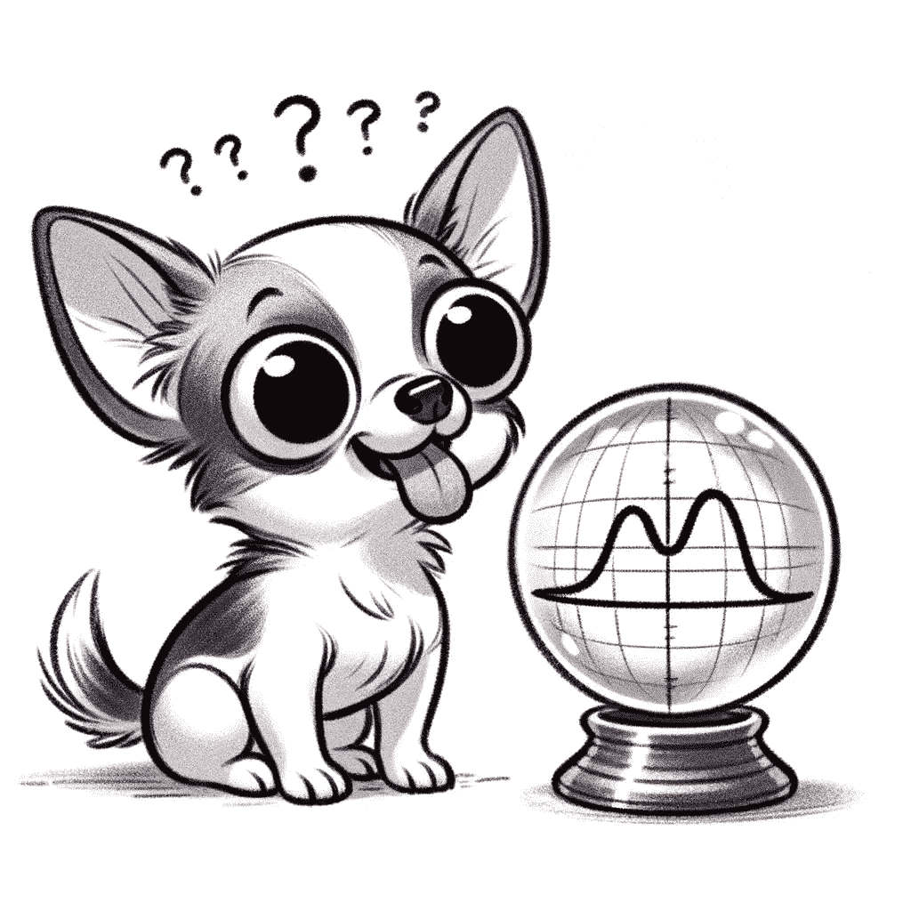
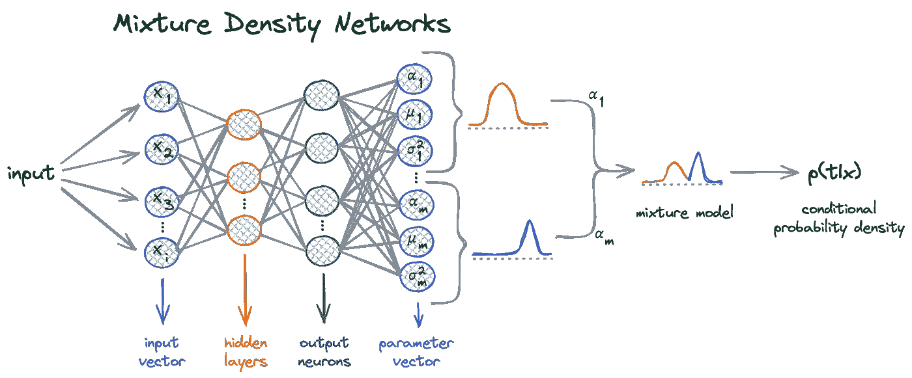
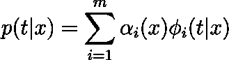
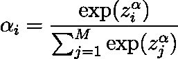
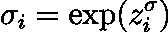
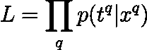
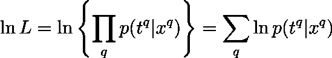
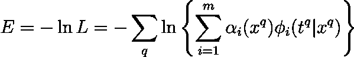
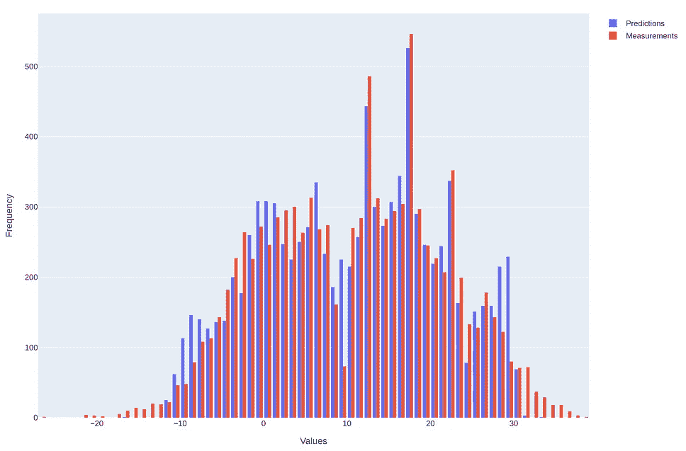
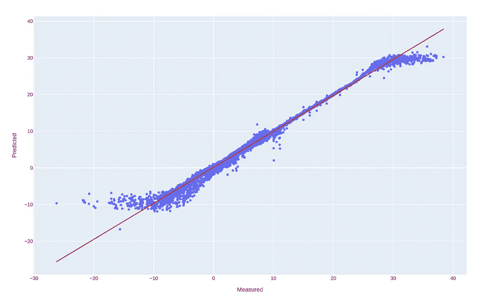

# 预测不可预测的未来 🔮

> 原文：[`towardsdatascience.com/predicting-the-unpredictable-905f634acc20?source=collection_archive---------5-----------------------#2024-05-19`](https://towardsdatascience.com/predicting-the-unpredictable-905f634acc20?source=collection_archive---------5-----------------------#2024-05-19)

## 混合密度网络的魔力解析

[](https://pandego.medium.com/?source=post_page---byline--905f634acc20--------------------------------)[](https://towardsdatascience.com/?source=post_page---byline--905f634acc20--------------------------------) [Miguel Dias, PhD](https://pandego.medium.com/?source=post_page---byline--905f634acc20--------------------------------)

·发布于 [Towards Data Science](https://towardsdatascience.com/?source=post_page---byline--905f634acc20--------------------------------) ·6 分钟阅读·2024 年 5 月 19 日

--

厌倦了神经网络做出的糟糕预测吗？🤦‍♂️ 希望它们能预测的不仅仅是平均未来吗？那么就来试试混合密度网络（MDNs）吧，这是一种超级强化的方式，它不仅能猜测未来——它预测了一整幅可能性的光谱！



当你尝试预测未来，但看到的却只是高斯曲线时。

## 来自过去的震撼

克里斯托弗·M·比晓普（Christopher M. Bishop）在 1994 年的论文 [Mixture Density Networks](https://publications.aston.ac.uk/id/eprint/373/1/NCRG_94_004.pdf)¹ 中开启了这场魔法。这是一本经典之作！📚 比晓普基本上说了：“为什么只满足于一个猜测，而不来一大堆呢？”于是，MDNs 就此诞生。

# MDNs：不确定性的巫师

MDNs 将你那枯燥的传统神经网络转变为一个强大的预测工具。为什么只满足于一个预测，而不享受一整桌的潜在结果呢？



如果生活抛给你复杂且不可预测的情境，MDNs 已经准备好了带有概率的安全网。

## 核心思想

在 MDN 中，目标变量 *t* 在给定输入 *x* 的情况下，其概率密度表示为核函数的线性组合，通常是高斯函数，尽管不限于此。用数学的说法就是：



其中 𝛼*ᵢ(x)* 是混合系数，谁不喜欢一份好混合呢，对吧？🎛️ 这些系数决定了每个组件 *𝜙ᵢ(t|x) —* 在模型中，每个高斯分布的*权重*。

## 烘焙高斯分布 ☕

每个高斯组件 *𝜙ᵢ(t|x)* 都有其自己的均值 𝜇*ᵢ(x)* 和方差 𝜎*ᵢ*²。


## 用系数混合 🎧

混合系数𝛼*ᵢ*至关重要，因为它们平衡了每个高斯分量的影响，通过*softmax*函数来确保它们的总和为 1：



## 神奇的参数 ✨ 均值与方差

均值𝜇*ᵢ*和方差𝜎*ᵢ*²定义了每个高斯分布。猜猜看？方差必须是正的！我们通过使用网络输出的指数来实现这一点：



# 训练我们的魔法 🧙‍♀️

好的，那么我们怎么训练这个“怪兽”呢？其实，这一切都关于最大化我们观察到的数据的似然性。复杂的术语，我知道。让我们看看实际应用。

## 对数似然法术 ✨

在 MDN 模型下，我们数据的似然性是每个数据点分配的概率的乘积。用数学术语来说：



这基本上是在说，*“嘿，在我们的模型下，获得这些数据的机会有多大？”*。但乘积可能会变得混乱，因此我们取对数（因为数学喜欢对数），这样我们就能把乘积转化为求和：



现在，关键来了：我们实际上是想要最小化负对数似然，因为我们的优化算法喜欢最小化目标。因此，将*p(t|x)*的定义代入，我们实际上最小化的误差函数是：



这个公式看起来可能很吓人，但它只是在说我们将所有数据点的对数概率求和，然后加上一个负号，因为最小化才是我们喜欢的。

# 从数学到代码中的魔法 🧑‍💻

现在，这是如何将我们的魔法转化为 Python 代码的示范，你可以在[这里](https://github.com/pandego/mdn-playground)找到完整代码：

[](https://github.com/pandego/mdn-playground?source=post_page-----905f634acc20--------------------------------) [## GitHub — pandego/mdn-playground: 混合密度网络的游乐场。

### 混合密度网络的游乐场。通过在…上创建一个账户来为 pandego/mdn-playground 的开发做贡献。

github.com](https://github.com/pandego/mdn-playground?source=post_page-----905f634acc20--------------------------------)

## 损失函数

```py
def mdn_loss(alpha, sigma, mu, target, eps=1e-8):
    target = target.unsqueeze(1).expand_as(mu)
    m = torch.distributions.Normal(loc=mu, scale=sigma)
    log_prob = m.log_prob(target)
    log_prob = log_prob.sum(dim=2)
    log_alpha = torch.log(alpha + eps)  # Avoid log(0) disaster
    loss = -torch.logsumexp(log_alpha + log_prob, dim=1)
    return loss.mean()
```

这里是分解：

1.  `target = target.unsqueeze(1).expand_as(mu)`: 扩展目标以匹配`mu`的形状。

1.  `m = torch.distributions.Normal(loc=mu, scale=sigma)`: 创建正态分布。

1.  `log_prob = m.log_prob(target)`: 计算对数概率。

1.  `log_prob = log_prob.sum(dim=2)`: 对对数概率求和。

1.  `log_alpha = torch.log(alpha + eps)`: 计算混合系数的对数。

1.  `loss = -torch.logsumexp(log_alpha + log_prob, dim=1)`: 合并并计算对数和指数的概率。

1.  `return loss.mean()`: 返回平均损失。

## 神经网络

让我们创建一个准备好处理魔法的神经网络：

```py
class MDN(nn.Module):
    def __init__(self, input_dim, output_dim, num_hidden, num_mixtures):
        super(MDN, self).__init__()
        self.hidden = nn.Sequential(
            nn.Linear(input_dim, num_hidden),
            nn.Tanh(),
            nn.Linear(num_hidden, num_hidden),
            nn.Tanh(),
        )
        self.z_alpha = nn.Linear(num_hidden, num_mixtures)
        self.z_sigma = nn.Linear(num_hidden, num_mixtures * output_dim)
        self.z_mu = nn.Linear(num_hidden, num_mixtures * output_dim)
        self.num_mixtures = num_mixtures
        self.output_dim = output_dim

    def forward(self, x):
        hidden = self.hidden(x)
        alpha = F.softmax(self.z_alpha(hidden), dim=-1)
        sigma = torch.exp(self.z_sigma(hidden)).view(-1, self.num_mixtures, self.output_dim)
        mu = self.z_mu(hidden).view(-1, self.num_mixtures, self.output_dim)
        return alpha, sigma, mu
```

注意到对 𝛼*ᵢ* 应用了 *softmax* `alpha = F.softmax(self.z_alpha(hidden), dim=-1)`，使其总和为 1，且对 𝜎*ᵢ* 应用了指数函数 `sigma = torch.exp(self.z_sigma(hidden)).view(-1, self.num_mixtures, self.output_dim)`，以确保其为正值，正如前面所解释的那样。

## 预测结果

从 MDNs 中获取预测值有些技巧。下面是如何从混合模型中进行采样：

```py
def get_sample_preds(alpha, sigma, mu, samples=10):
    N, K, T = mu.shape
    sampled_preds = torch.zeros(N, samples, T)
    uniform_samples = torch.rand(N, samples)
    cum_alpha = alpha.cumsum(dim=1)
    for i, j in itertools.product(range(N), range(samples)):
        u = uniform_samples[i, j]
        k = torch.searchsorted(cum_alpha[i], u).item()
        sampled_preds[i, j] = torch.normal(mu[i, k], sigma[i, k])
    return sampled_preds
```

以下是详细信息：

1.  `N, K, T = mu.shape`：获取数据点数、混合组件数和输出维度。

1.  `sampled_preds = torch.zeros(N, samples, T)`：初始化张量以存储采样的预测值。

1.  `uniform_samples = torch.rand(N, samples)`：为采样生成均匀随机数。

1.  `cum_alpha = alpha.cumsum(dim=1)`：计算混合权重的累积和。

1.  `for i, j in itertools.product(range(N), range(samples))`：遍历每一个数据点和样本的组合。

1.  `u = uniform_samples[i, j]`：为当前样本获取一个随机数。

1.  `k = torch.searchsorted(cum_alpha[i], u).item()`：查找混合组件的索引。

1.  `sampled_preds[i, j] = torch.normal(mu[i, k], sigma[i, k])`：从选定的高斯组件中采样。

1.  `return sampled_preds`：返回采样的预测值张量。

# 实际例子：预测‘显热温度’ 🌡️

让我们使用一个简单的[天气数据集](https://www.kaggle.com/datasets/muthuj7/weather-dataset)应用 MDNs 来预测 *“显热温度”*。我用一个 50 层隐藏层的网络训练了一个 MDN，结果怎么样？它棒极了！🎸

完整代码请见[这里](https://github.com/pandego/mdn-playground)。以下是一些结果：



‘显热温度’的直方图 **(左)** 和散点图 **(右)**，实际测量值与预测值（R² = .99 和 MAE = .5）。

结果非常不错，通过一些超参数调整和数据预处理，比如去除异常值和重采样，结果会更加优秀！

# 未来是多模态的 🎆

假设数据展示了复杂的模式，例如来自金融市场或生物特征的数据库。线性回归在这种情况下会遇到困难，无法捕捉到底层动态。非线性回归可能对数据的拟合更好，但在量化不确定性或捕捉多个潜在结果时依然存在不足。MDNs 超越了这一点，提供了一个全面的模型，预测各种可能性，每种可能性都有其对应的概率！

拥抱混沌！

这些神经网络小能手在预测混乱、复杂的场景中表现出色，传统模型在这些场景中往往力不从心。股市预测、天气猜测或预见下一个病毒式传播的表情包 🦄 — MDNs 为你提供保障。

MDNs 太棒了！

但 MDN 不仅仅是预测——它们为你提供了一系列可能的未来。它们是你理解不确定性的水晶球🔮，能够捕捉复杂的关系，并提供对未来的概率性窥探。对于研究人员、从业者或人工智能爱好者来说，MDN 是机器学习广阔而神奇领域中的一个迷人前沿！

## 参考文献

[1] Christopher M. Bishop, [混合密度网络](https://publications.aston.ac.uk/id/eprint/373/1/NCRG_94_004.pdf)（1994），神经计算研究小组报告。

*除非另有注明，所有图片均为作者提供。*
