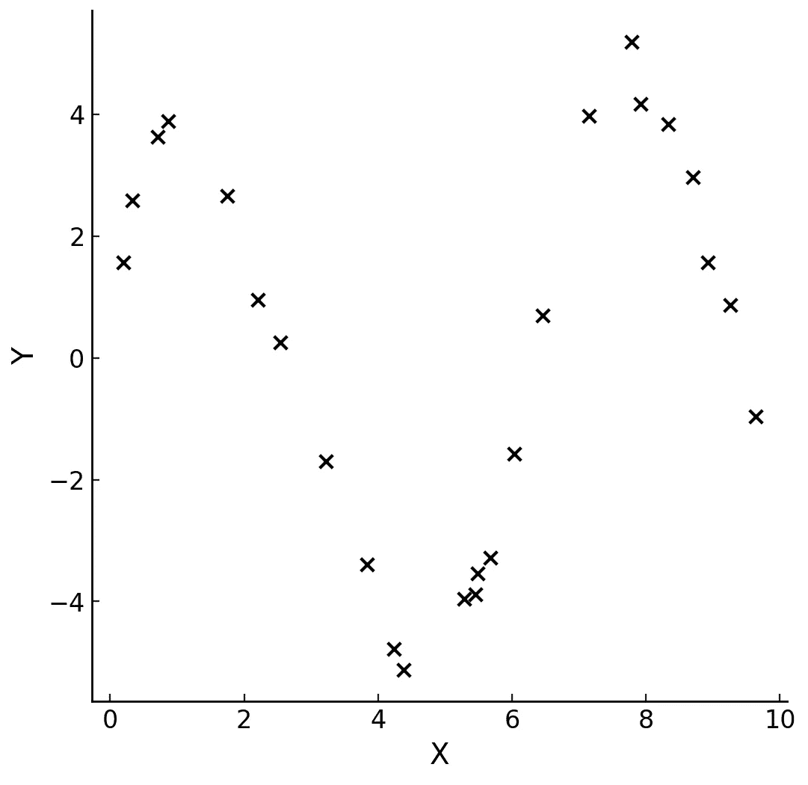

# 预测能力分数：计算方法、优缺点及 JavaScript 代码

> 原文：[`towardsdatascience.com/predictive-power-score-calculation-pros-cons-and-javascript-code-165ec4c593ca?source=collection_archive---------12-----------------------#2024-10-29`](https://towardsdatascience.com/predictive-power-score-calculation-pros-cons-and-javascript-code-165ec4c593ca?source=collection_archive---------12-----------------------#2024-10-29)

## 一个项目，用于学习一般的相关性，并在 Web 浏览器中使用 Brain.js 和 Tensorflow.js 测试神经网络

 [LucianoSphere (Luciano Abriata, PhD)](https://lucianosphere.medium.com/?source=post_page---byline--165ec4c593ca--------------------------------)

·发表于[Towards Data Science](https://towardsdatascience.com/?source=post_page---byline--165ec4c593ca--------------------------------) ·7 分钟阅读·2024 年 10 月 29 日

--

显然，X 和 Y 中绘制的值之间存在某种关系，但像皮尔逊相关系数这样的常规相关系数将返回一个接近 0 的得分。然而，结合适当模型的预测能力分数能够识别这种相关性。图由作者绘制。

预测能力分数（以下简称 PPS）是一个统计指标，用于衡量两个变量之间预测关系的强度。但与传统的相关性度量（例如皮尔逊相关系数*r*）不同，后者仅适用于两个连续变量之间的线性关系，PPS 旨在处理更多样的关系，包括非线性关系和分类数据。

## PPS 及其关键点，第一个示例

PPS 的范围从 0 到 1，其中 0 表示没有预测能力（该变量无法预测目标），而 1 表示完美的预测能力（该变量完美预测目标）。

请注意，由于 PPS 始终等于或大于零，因此它并不提供关系的方向性信息，这一点与皮尔逊相关系数 r 不同，后者的范围从-1（反相关）到+1（完全正相关）。PPS 仅衡量一个变量预测另一个变量的效果……
