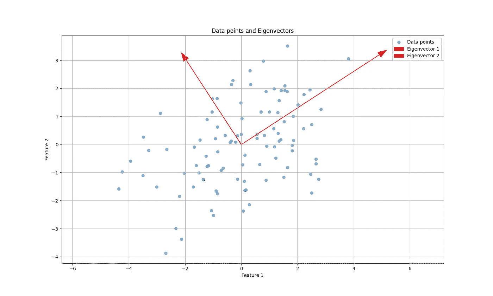

# 主成分分析简明教程：逐步指南

> 原文：[`towardsdatascience.com/principal-component-analysis-made-easy-a-step-by-step-tutorial-184f295e97fe?source=collection_archive---------1-----------------------#2024-06-08`](https://towardsdatascience.com/principal-component-analysis-made-easy-a-step-by-step-tutorial-184f295e97fe?source=collection_archive---------1-----------------------#2024-06-08)

## 从头实现 PCA 算法，使用 Python

[](https://marcusmvls-vinicius.medium.com/?source=post_page---byline--184f295e97fe--------------------------------)[](https://towardsdatascience.com/?source=post_page---byline--184f295e97fe--------------------------------) [Marcus Sena](https://marcusmvls-vinicius.medium.com/?source=post_page---byline--184f295e97fe--------------------------------)

·发表于[Towards Data Science](https://towardsdatascience.com/?source=post_page---byline--184f295e97fe--------------------------------) ·阅读时间 9 分钟·2024 年 6 月 8 日

--


图片由[Volodymyr Hryshchenko](https://unsplash.com/@lunarts?utm_source=medium&utm_medium=referral)提供，来源于[Unsplash](https://unsplash.com/?utm_source=medium&utm_medium=referral)

很多成熟的 Python 包（如 scikit-learn）实现了机器学习算法，如主成分分析（PCA）算法。那么，为什么还要费劲去学习算法的工作原理呢？

深入理解背后的数学概念对于基于算法输出做出更好的决策并避免将算法视为“黑盒”至关重要。

在本文中，我将展示 PCA 算法内部工作原理的直观理解，涵盖诸如*降维*、*特征向量*和*特征值*等关键概念，之后我们将实现一个 Python 类来封装这些概念并在数据集上执行 PCA 分析。

无论你是一个试图建立扎实概念理解的机器学习初学者，还是一个有兴趣创建自定义机器学习应用并需要了解算法如何在幕后工作的从业者，这篇文章都适合你。

> 目录
> 
> 1\. 降维
> 
> 2\. 主成分分析是如何工作的？
> 
> 3\. Python 中的实现
> 
> 4\. 评估与解释
> 
> 5\. 结论与下一步

# 1\. 降维

机器学习中的许多实际问题都涉及具有成千上万甚至数百万个特征的数据集。训练这样的大数据集计算上非常繁重，解释得出的解决方案可能更具挑战性。

随着特征数量的增加，数据点变得更加稀疏，距离度量的有效性减弱，因为点与点之间的距离不那么明显，这使得很难区分哪些点是接近的，哪些是远离的。这被称为*维度灾难*。

数据的稀疏性使得模型训练更加困难，并且更容易过拟合，从而捕捉噪声而非潜在的模式。这导致模型对新数据的泛化能力较差。

降维在数据科学和机器学习中被用来减少数据集中的变量或特征数量，同时尽可能保留原始信息。这一技术有助于简化复杂数据集、提高计算效率，并且有助于数据可视化。


图片由作者使用 DALL-E 生成。

# 2. 主成分分析是如何工作的？

用来缓解维度灾难的最常用技术之一是主成分分析（PCA）。PCA 通过寻找能够解释数据集中最大方差的轴来减少数据集中的特征数量，同时保留大部分有用的信息。这些轴被称为*主成分*。

由于 PCA 的目标是找到数据集的低维表示，同时保持大部分的方差，而不是进行预测，因此它被视为一种**无监督学习**算法。

那么，为什么保持方差就意味着保留重要信息呢？

> 假设你正在分析一个关于城市犯罪的数据集。数据中有许多特征，包括“侵害人身犯罪 - 有伤”和“侵害人身犯罪 - 无伤”。显然，发生高比例第一类犯罪的地方，也必然发生高比例第二类犯罪。

换句话说，示例中的两个特征高度相关，因此可以通过减少数据中的冗余（例如受害人是否受伤）来降低该数据集的维度。

PCA 算法不过是一个实现这一目标的复杂方法。

现在，让我们通过以下步骤来逐步解析 PCA 算法的内部工作原理：

## **步骤 1：居中数据**

主成分分析（PCA）受数据尺度的影响，因此首先需要做的是减去数据集每个特征的均值，从而确保所有特征的均值都为 0。


数据居中前后的对比（图片由作者提供）。

## **步骤 2：计算协方差矩阵**

现在，我们需要计算协方差矩阵，以捕捉数据中每对特征之间的变化关系。如果数据集有*n*个特征，最终得到的协方差矩阵将具有*n* x *n*的形状。

在下图中，相关性较强的特征具有接近红色的颜色。当然，每个特征与自身的相关性最高。


协方差矩阵的热图（图片由作者提供）。

## 第 3 步：特征值分解

接下来，我们需要执行协方差矩阵的特征值分解。如果你不记得的话，给定协方差矩阵Σ（一个方阵），特征值分解是寻找一组标量（特征值）和向量（特征向量）的过程，使得：


特征值性质（图片由作者使用[codecogs](https://editor.codecogs.com/)绘制）。

其中：

+   Σ是 n×n 的协方差矩阵。

+   *v*是一个非零向量，称为特征向量。

+   *λ*是与特征向量*v*相关的标量，称为特征值。

> **特征向量**表示数据中最大方差的方向（主成分），而**特征值**量化了每个主成分所捕获的方差。

如果矩阵**A**可以分解为特征值和特征向量，则可以表示为：


矩阵的特征分解（图片由作者使用[codecogs](https://editor.codecogs.com/)绘制）。

其中：

+   **Q**是一个矩阵，其列是**A**的特征向量。

+   Λ 是一个对角矩阵，其对角元素是**A**的特征值。

通过这种方式，我们可以使用相同的步骤来求解协方差矩阵的特征值和特征向量。



绘制特征向量（图片由作者提供）。

在上图中，我们可以看到第一个特征向量指向数据方差最大的方向，第二个特征向量指向第二大方差的方向。

## 第 4 步：选择主成分

如前所述，特征值量化了数据在其对应特征向量方向上的方差。因此，我们将特征值按降序排序，并仅保留前 n 个所需的*主成分*。

下图展示了在二维 PCA 中，每个主成分捕获的方差比例。


2 个主成分的解释方差（图片由作者提供）。

## 第 5 步：投影数据

最后，我们需要将原始数据投影到所选主成分所表示的维度上。为此，我们必须将中心化后的数据集与协方差矩阵分解中找到的特征向量矩阵相乘。


将原始数据集投影到 n 维空间（图像来自作者使用 [codecogs](https://editor.codecogs.com/)）。

# 3\. 在 Python 中的实现

现在，我们已经深刻理解了主成分分析的关键概念，是时候编写一些代码了。

首先，我们需要设置环境，导入 numpy 包进行数学计算，并导入 matplotlib 进行可视化：

```py
import numpy as np
import matplotlib.pyplot as plt
```

接下来，我们将把上一节中涉及的所有概念封装成一个 Python 类，并包含以下方法：

+   **init 方法**

构造函数方法，用于初始化算法的参数：所需的组件数量、用于存储组件向量的矩阵，以及用于存储每个选定维度解释方差的数组。

+   **fit 方法**

在 fit 方法中，上一节介绍的前四个步骤已经通过代码实现。此外，还计算了每个成分的解释方差。

+   **Transform 方法**

transform 方法执行上一节中介绍的最后一步：将数据投影到选定的维度上。

+   **绘制解释方差**

最后一个方法是一个辅助函数，用于绘制每个选定主成分的解释方差的条形图。

这是完整的代码：

```py
class PCA:
    def __init__(self, n_components):
        self.n_components = n_components
        self.components = None
        self.mean = None
        self.explained_variance = None

    def fit(self, X):
        # Step 1: Standardize the data (subtract the mean)
        self.mean = np.mean(X, axis=0)
        X_centered = X - self.mean

        # Step 2: Compute the covariance matrix
        cov_matrix = np.cov(X_centered, rowvar=False)

        # Step 3: Compute the eigenvalues and eigenvectors
        eigenvalues, eigenvectors = np.linalg.eig(cov_matrix)

        # Step 4: Sort the eigenvalues and corresponding eigenvectors
        sorted_indices = np.argsort(eigenvalues)[::-1]
        eigenvalues = eigenvalues[sorted_indices]
        eigenvectors = eigenvectors[:, sorted_indices]

        # Step 5: Select the top n_components
        self.components = eigenvectors[:, :self.n_components]

        # Calculate explained variance
        total_variance = np.sum(eigenvalues)
        self.explained_variance = eigenvalues[:self.n_components] / total_variance

    def transform(self, X):
        # Step 6: Project the data onto the selected components
        X_centered = X - self.mean
        return np.dot(X_centered, self.components)

    def plot_explained_variance(self):
        # Create labels for each principal component
        labels = [f'PCA{i+1}' for i in range(self.n_components)]

        # Create a bar plot for explained variance
        plt.figure(figsize=(8, 6))
        plt.bar(range(1, self.n_components + 1), self.explained_variance, alpha=0.7, align='center', color='blue', tick_label=labels)
        plt.xlabel('Principal Component')
        plt.ylabel('Explained Variance Ratio')
        plt.title('Explained Variance by Principal Components')
        plt.show()
```

# 4\. 评估与解释

现在是时候在使用 numpy 包创建的模拟数据集上应用我们刚刚实现的类了。数据集有 10 个特征和 100 个样本。

```py
# create simulated data for analysis
np.random.seed(42)
# Generate a low-dimensional signal
low_dim_data = np.random.randn(100, 4)

# Create a random projection matrix to project into higher dimensions
projection_matrix = np.random.randn(4, 10)

# Project the low-dimensional data to higher dimensions
high_dim_data = np.dot(low_dim_data, projection_matrix)

# Add some noise to the high-dimensional data
noise = np.random.normal(loc=0, scale=0.5, size=(100, 10))
data_with_noise = high_dim_data + noise

X = data_with_noise
```

在执行 PCA 之前，仍然有一个问题：**我们如何选择正确或最佳的维度数量**？通常，我们需要寻找那些加起来至少占数据集解释方差 95% 的组件数量。

为了做到这一点，让我们看看每个主成分是如何贡献于数据集的总方差的：

```py
# Apply PCA
pca = PCA(n_components=10)
pca.fit(X)
X_transformed = pca.transform(X)

print("Explained Variance:\n", pca.explained_variance)

>> Explained Variance (%):
 [55.406, 25.223, 11.137, 5.298, 0.641, 0.626, 0.511, 0.441, 0.401, 0.317]
```

接下来，让我们绘制方差的累积和，看看在哪个维度数上我们能够达到总方差的 95% 最优值。


解释的方差作为组件数量的函数（图像来自作者）。

如上图所示，数据集的最佳维度数为 4，总解释方差为 97.064%。换句话说，我们将一个具有 10 个特征的数据集转化为一个只有 3 个维度的数据集，同时保留了超过 97% 的原始信息。

> 这意味着原始的 10 个特征大部分是高度相关的，而算法将这些高维数据转化为不相关的主成分。

# 5\. 结论与下一步

我们使用仅包含 numpy 包的代码创建了一个 PCA 类，它成功地将一个数据集的维度从 10 个特征减少到仅 4 个，同时保留了约 97% 的数据方差。

此外，我们还探索了一种方法，获取 PCA 分析的最佳主成分数量，该数量可以根据我们所面临的问题进行自定义（例如，我们可能只对保留 90% 方差感兴趣）。

这展示了 PCA 分析在解决前面提到的维度灾难中的潜力。此外，我希望留下几点供进一步探索：

+   使用 PCA 算法对降维后的数据集执行分类或回归任务，并比较在原始数据集与 PCA 变换后的数据集上训练的模型的性能，以评估降维的影响。

+   使用 PCA 进行数据可视化，将高维数据转化为更易解释的形式，并揭示原始特征空间中未显现的模式。

+   考虑探索其他降维技术，例如 *t-分布随机邻域嵌入*（t-SNE）和 *线性判别分析*（LDA）。

完整代码可在[此处](https://github.com/Marcussena/ML-and-Ai-from-scratch/tree/main/PCA)获取。

[](https://github.com/Marcussena/ML-and-Ai-from-scratch/tree/main/PCA?source=post_page-----184f295e97fe--------------------------------) [## ML-and-Ai-from-scratch/PCA 主分支 · Marcussena/ML-and-Ai-from-scratch

### 从零开始实现机器学习和人工智能算法的 Python 代码 - ML-and-Ai-from-scratch/PCA 主分支 ·…

github.com](https://github.com/Marcussena/ML-and-Ai-from-scratch/tree/main/PCA?source=post_page-----184f295e97fe--------------------------------)

请随时使用并改进代码、发表评论、提出建议，并通过 [LinkedIn](https://www.linkedin.com/in/marcus-sena-660198150/)、[X](https://twitter.com/MarcusMVLS) 和 [Github](https://github.com/Marcussena/ML-and-Ai-from-scratch) 与我联系。

# 参考文献

[1] Willmott, Paul. (2019). *机器学习：应用数学导论*。Panda Ohana Publishing.

[2] Géron, A. (2017). *动手学机器学习*。O’Reilly Media Inc.

[3] Grus, Joel. (2015). *从零开始学数据科学*。O’Reilly Media Inc.

[4] Datagy.io. *如何在 Python 中执行 PCA*。2024 年 6 月 2 日检索自 [`datagy.io/python-pca/`](https://datagy.io/python-pca/).
