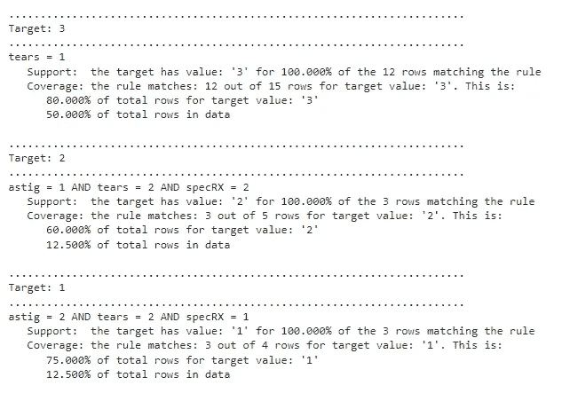

# Python 中的 PRISM 规则

> 原文：[`towardsdatascience.com/prism-rules-in-python-14d2cfd801a3?source=collection_archive---------3-----------------------#2024-06-02`](https://towardsdatascience.com/prism-rules-in-python-14d2cfd801a3?source=collection_archive---------3-----------------------#2024-06-02)

## 一个简单的 Python 规则归纳系统

[](https://medium.com/@wkennedy934?source=post_page---byline--14d2cfd801a3--------------------------------)[](https://towardsdatascience.com/?source=post_page---byline--14d2cfd801a3--------------------------------) [W Brett Kennedy](https://medium.com/@wkennedy934?source=post_page---byline--14d2cfd801a3--------------------------------)

·发表于 [Towards Data Science](https://towardsdatascience.com/?source=post_page---byline--14d2cfd801a3--------------------------------) ·12 分钟阅读·2024 年 6 月 2 日

--

这篇文章是关于可解释预测模型系列的一部分。之前的文章涵盖了 ikNN 和 [加法决策树](https://medium.com/towards-data-science/additive-decision-trees-85f2feda2223)。PRISM 是一个现有的算法（虽然我确实创建了一个 Python 实现），而这个系列的重点是原创算法，但我觉得它足够有用，值得单独写一篇文章。尽管这是一个老想法，但我发现它与大多数其他可解释模型在分类任务中具有竞争力，并且我已经使用过很多次。

PRISM 相对简单，但在机器学习中，有时最复杂的解决方案效果最好，有时最简单的解决方案效果最佳。然而，当我们希望有可解释的模型时，简单性带来的好处是显而易见的。

PRISM 是一个规则归纳工具。也就是说，它创建一组规则，从其他特征预测目标特征。

规则在机器学习中至少有两个非常重要的目的。一个是预测。类似于决策树、线性回归、GAMs、ikNN、[加法决策树](https://medium.com/towards-data-science/additive-decision-trees-85f2feda2223)、决策表以及其他少数工具，它们可以提供可解释的分类模型。

规则也可以仅作为理解数据的一种技术。事实上，即使没有标签，它们也可以以无监督的方式使用，通过创建一组规则从其他特征预测每个特征（轮流将表中的每个特征视为目标列），这可以突出数据中的任何强烈模式。

在 Python 中，还有其他用于创建规则的工具，包括非常强大的[imodels 库](https://github.com/csinva/imodels)。然而，创建既准确又易于理解的规则集仍然具有挑战性。通常，规则归纳系统无法创建合理准确的模型，或者即使能够创建，也只能通过生成大量规则和包含许多术语的规则来实现。例如，像这样的规则：

如果 color = ‘blue’ 且 height < 3.4 且 width > 3.2 且 length > 33.21 且 temperature > 33.2 且 temperature < 44.2 且 width < 5.1 且 weight > 554.0 且 … 那么…

当规则包含五个或十个以上的术语时，它们可能变得难以理解。如果术语足够多，规则最终可能变得无法解释。而且，如果规则集包含超过一定数量的规则，那么整个规则集就变得难以跟随（如果每个规则包含许多术语，则更是如此）。

# PRISM 规则

PRISM 是一个规则归纳系统，最早由 Chendrowska 提出 [[1]](https://github.com/Brett-Kennedy/PRISM-Rules#references) [[2]](https://github.com/Brett-Kennedy/PRISM-Rules#references)，并在《数据挖掘原理》一书中进行了描述 [[3]](https://github.com/Brett-Kennedy/PRISM-Rules#references)。

我未能找到 Python 实现，因此我创建了一个。PRISM 规则的主页面是：[`github.com/Brett-Kennedy/PRISM-Rules`](https://github.com/Brett-Kennedy/PRISM-Rules)。

PRISM 支持生成规则，既可以作为描述性模型：用于描述表中的模式（以特征之间的关联形式）；也可以作为预测性模型。它通常生成一组非常简洁、干净且可解释的规则。

作为一个预测性模型，它提供了所谓的*全局*和*局部*解释（在可解释 AI (XAI) 的术语中）。也就是说，它是完全可解释的，既可以理解整体模型，也可以理解单个预测。

在测试多个规则归纳系统时，我发现 PRISM 经常生成最简洁的规则集。尽管没有一个系统始终表现最好，通常需要尝试几个规则归纳工具。

生成的规则是析取范式（即 OR 形式的 AND），每个规则都是一个或多个术语的 AND，其中每个术语的形式为 Feature = Value，该值来自该特征的值集合。例如：生成的规则可能是这样的形式：

目标值为：‘blue’ 的规则：

+   如果 feat_A = ‘hot’ 且 feat_C = ‘round’ 那么 ‘blue’

+   如果 feat_A = ‘warm’ 且 feat_C = ‘square’ 那么 ‘blue’

目标值为：‘red’ 的规则：

+   如果 feat_A = ‘cold’ 且 feat_C = ‘triangular’ 那么 ‘red’

+   如果 feat_A = ‘cool’ 且 feat_C = ‘triangular’ 那么 ‘red’

该算法严格处理分类特征，无论是在 X 列还是 Y 列。因此，该实现会自动将任何数值型列进行分箱，以支持该算法。默认情况下，会使用三个等量的箱子（表示特征的低、中、高值），但这可以通过 nbins 参数进行配置（可以使用更多或更少的箱子）。

## PRISM 算法

对于本节内容，我们假设我们将 PRISM 用作预测模型，特别是作为分类器。

该算法通过为目标列中的每个类创建一组规则来工作。例如，如果在 Iris 数据集上执行，其中目标列有三个值（Setosa、Versicolour 和 Virginica），则会分别有与 Setosa、Versicolour 和 Virginica 相关的规则集。

生成的规则应该按照“最先触发的规则”的方式进行读取，因此所有规则都按合理的顺序生成和呈现（对于每个目标类，从最相关到最不相关的顺序）。例如，在检查与 Setosa 相关的规则集时，我们将有一组预测何时鸢尾花是 Setosa 的规则，这些规则将按从最具预测力到最不具预测力的顺序排列。同样地，其他两个类的规则集也会这样排列。

## 生成规则

在这里，我们将描述 PRISM 用来为一个类生成规则的算法。以 Iris 数据集为例，假设我们即将为 Setosa 类生成规则。

首先，PRISM 找到最佳规则来预测目标值。对于 Setosa 类，第一条规则会尽可能地预测出 Setosa 的记录。也就是说，我们在其他特征的某个子集里找到一组唯一的值，这些值最能预测一条记录是否为 Setosa。这就是 Setosa 的第一条规则。

然而，第一条规则并不能覆盖所有的 Setosa 记录，因此我们会创建额外的规则来覆盖剩余的 Setosa 行（或尽可能多的行）。

每当发现一条规则时，匹配该规则的行会被移除，然后寻找下一条最佳规则来描述剩余的目标值行。

每条规则可以包含任意数量的项。

对于目标列中的每个其他值，我们从完整数据集开始，随着规则的发现逐步移除行，并生成其他规则来解释剩余的行。因此，在找到 Setosa 的规则后，PRISM 会生成 Versicolour 的规则，然后是 Virginica 的规则。

## 覆盖率和支持度

该实现通过输出与每条规则相关的统计信息，增强了《数据挖掘原理》一书中描述的算法，因为许多生成的规则可能比其他规则更为相关，或者恰恰相反，具有显著较低的意义。

同时，跟踪每条规则的简单统计信息可以提供参数，指定每条规则的最小*覆盖度*（规则适用的训练数据中的最小行数）；以及最小*支持度*（规则匹配的行中，目标类别与期望值匹配的最小概率）。这些有助于减少噪音（仅对模型的描述性或预测性能力贡献较小的额外规则），尽管这可能导致某些目标类别没有规则，或者规则覆盖的行数很少，可能没有涵盖一个或多个目标列值的所有行。在这种情况下，用户可能希望调整这些参数。

# 与决策树的比较

决策树是最常见的可解释模型之一，可能是最常见的。当足够小的时候，它们可以是合理的可解释的，也许与任何模型类型一样可解释，并且对于许多问题（尽管肯定不是所有问题）都能达到相当准确的结果。然而，它们作为可解释模型有其局限性，而 PRISM 就是为了解决这个问题而设计的。

决策树并非专门设计为可解释的；它们具备可解释性的属性仅仅是决策树的一个便利特性。例如，它们常常长得比容易理解的程度要大，通常会重复很多子树，因为特征之间的关系必须在树内重复多次才能被正确捕捉。

此外，单个预测的决策路径可能包括一些与最终预测无关，甚至误导性的节点，从而进一步减少了压缩性。

Cendrowska 论文提供了无法通过树轻松表示的简单规则集的示例。例如：

+   规则 1：如果 a = 1 且 b = 1，则 class = 1

+   规则 2：如果 c = 1 且 d = 1，则 class = 1

这会导致一个意外复杂的树。事实上，这是一个导致决策树过于复杂的常见模式：“当两个（潜在的）规则没有任何共同的属性时，这种情况在实际中很可能会频繁发生” [[3]](https://github.com/Brett-Kennedy/PRISM-Rules#references)

规则通常可以生成比决策树更易于解释的模型（尽管反过来也常常如此），并且在任何需要可解释模型的项目中都非常有用。而且，当目标不是构建预测模型，而是理解数据时，使用多个模型可能会有助于捕捉数据的不同元素。

## 安装

该项目由一个单一的[python 文件](https://github.com/Brett-Kennedy/PRISM-Rules/blob/main/prism_rules.py)组成，可以通过以下方式下载并包含到任何项目中：

```py
from prism_rules import PrismRules
```

# 使用 sklearn 的 Wine 数据集的示例

GitHub 页面提供了两个示例笔记本，提供了使用该工具的简单但全面的示例。该工具本身非常直观。要使用该工具生成规则，只需创建一个 PrismRules 对象，并通过数据集调用 get_prism_rules() 方法，指定目标列：

```py
import pandas as pd
from sklearn.datasets import load_wine

data = datasets.load_wine()
df = pd.DataFrame(data.data, columns=data.feature_names)
df['Y'] = data['target']
display(df.head())

prism = PrismRules()
_ = prism.get_prism_rules(df, 'Y')
```

## 结果

该数据集的目标列有三个值，因此会生成三组规则：

```py
................................................................
Target: 0
................................................................

proline = High AND alcohol = High
   Support:  the target has value: '0' for 100.000% of the 39 rows matching the rule 
   Coverage: the rule matches: 39 out of 59 rows for target value: 0\. This is:
      66.102% of total rows for target value: 0
      21.910% of total rows in data

proline = High AND alcalinity_of_ash = Low
   Support:  The target has value: '0' for 100.000% of the 10 remaining rows matching the rule 
   Coverage: The rule matches: 10 out of 20 rows remaining for target value: '0'. This is:
      50.000% of remaining rows for target value: '0'
      16.949% of total rows for target value: 0
      5.618% of total rows in data0

................................................................
Target: 1
................................................................
color_intensity = Low AND alcohol = Low
   Support:  the target has value: '1' for 100.000% of the 46 rows matching the rule 
   Coverage: the rule matches: 46 out of 71 rows for target value: 1\. This is:
      64.789% of total rows for target value: 1
      25.843% of total rows in data

color_intensity = Low
   Support:  The target has value: '1' for 78.571% of the 11 remaining rows matching the rule 
   Coverage: The rule matches: 11 out of 25 rows remaining for target value: '1'. This is:
      44.000% of remaining rows for target value: '1'
      15.493% of total rows for target value: 1
      6.180% of total rows in data

................................................................
Target: 2
................................................................
flavanoids = Low AND color_intensity = Med
   Support:  the target has value: '2' for 100.000% of the 16 rows matching the rule 
   Coverage: the rule matches: 16 out of 48 rows for target value: 2\. This is:
      33.333% of total rows for target value: 2
      8.989% of total rows in data

flavanoids = Low AND alcohol = High
   Support:  The target has value: '2' for 100.000% of the 10 remaining rows matching the rule 
   Coverage: The rule matches: 10 out of 32 rows remaining for target value: '2'. This is:
      31.250% of remaining rows for target value: '2'
      20.833% of total rows for target value: 2
      5.618% of total rows in data

flavanoids = Low AND color_intensity = High AND hue = Low
   Support:  The target has value: '2' for 100.000% of the 21 remaining rows matching the rule 
   Coverage: The rule matches: 21 out of 22 rows remaining for target value: '2'. This is:
      95.455% of remaining rows for target value: '2'
      43.750% of total rows for target value: 2
      11.798% of total rows in data
```

对于每条规则，我们可以看到支持度和覆盖度。

支持度表示有多少行支持该规则；也就是说，在规则适用的行中，有多少行是符合的。这里的第一条规则是：

```py
proline = High AND alcohol = High
   Support:  the target has value: '0' for 100.000% of the 39 rows matching the rule
```

这表明，在 39 行数据中，其中 proline = High（特征 proline 具有高数值）和 alcohol = High（特征 alcohol 具有高数值），在 100%的情况下，目标值为 0。

覆盖度表示规则覆盖了多少行。对于第一条规则，这是：

```py
Coverage: the rule matches: 39 out of 59 rows for target value: 0\. This is:
      66.102% of total rows for target value: 0
      21.910% of total rows in data
```

这表示覆盖度，包括行数和数据中行数的百分比。

# 生成预测示例

要生成预测，我们只需调用`predict()`，并传入一个具有与拟合模型时相同特征的数据框（尽管目标列可以选择省略，如本示例所示）。

```py
y_pred = prism.predict(df.drop(columns=['Y']))
```

这样，PRISM 规则可以与任何其他预测模型等效使用，如决策树、随机森林、XGBoost 等。

然而，在生成预测时，一些行可能不匹配任何规则。在这种情况下，默认情况下将使用训练过程中目标列中最常见的值（可以通过访问 prism.default_target 查看）。`predict()`方法还支持一个参数 leave_unknown。如果将其设置为 True，则任何不匹配规则的记录将被标记为“无预测”。在这种情况下，即使原始目标列是数值型的，预测结果也将以字符串类型返回。

更多示例可在示例笔记本中查看。

# 带有数值数据的示例

在此示例中，我们使用 sklearn 的`make_classification()`方法来创建数值数据（目标列除外），然后将其进行分箱。默认情况下，每个数值特征会分为三个箱。

```py
x, y = make_classification(
    n_samples=1000, 
    n_features=20,    
    n_informative=2,
    n_redundant=2,
    n_repeated=0,
    n_classes=2,
    n_clusters_per_class=1,
    class_sep=2,
    flip_y=0, 
    random_state=0
    )

df = pd.DataFrame(x)
df['Y'] = y
prism = PrismRules()
_ = prism.get_prism_rules(df, 'Y')
```

## 结果

数据被按每列的低、中、高值进行分箱。结果是每个目标类别一组规则。

```py
Target: 0
1 = High
   Support:  the target has value: '0' for 100.000% of the 333 rows matching the rule 
   Coverage: the rule matches: 333 out of 500 rows for target value: 0\. This is:
      66.600% of total rows for target value: 0
      33.300% of total rows in data

15 = Low AND 4 = Med
   Support:  The target has value: '0' for 100.000% of the 63 remaining rows matching the rule 
   Coverage: The rule matches: 63 out of 167 rows remaining for target value: '0'. This is:
      37.725% of remaining rows for target value: '0'
      12.600% of total rows for target value: 0
      6.300% of total rows in data

4 = High AND 1 = Med
   Support:  The target has value: '0' for 100.000% of the 47 remaining rows matching the rule 
   Coverage: The rule matches: 47 out of 104 rows remaining for target value: '0'. This is:
      45.192% of remaining rows for target value: '0'
      9.400% of total rows for target value: 0
      4.700% of total rows in data
```

# 《数据挖掘原理》书中的示例

这个示例可以在 github 页面的其中一个示例笔记本中找到。



PRISM 生成了三条规则：

+   如果 tears = 1，那么目标 = 3

+   如果 astig = 1 并且 tears = 2 并且 specRX = 2，那么目标 = 2

+   如果 astig = 2 并且 tears = 2 并且 specRX = 1，那么目标 = 1

# 执行时间

该算法通常能够在几秒钟或几分钟内生成一组规则，但如果需要减少算法的执行时间，可以使用数据的一个样本来代替完整的数据集。该算法在数据样本上通常表现得非常好，因为模型在寻找的是一般性的模式，而不是例外，这些模式在任何足够大的样本中都会出现。

关于模型调优的更多说明可以在 github 页面上找到。

# 结论

不幸的是，目前可用的可解释预测模型选项相对较少。此外，没有任何一个可解释的模型能够对所有数据集既足够准确又足够可解释。因此，在可解释性很重要的情况下，测试多个可解释模型可能是值得的，包括决策树、其他规则诱导工具、广义加性模型（GAMs）、ikNN、[加性决策树](https://medium.com/towards-data-science/additive-decision-trees-85f2feda2223)和 PRISM 规则。

PRISM 规则经常生成简洁、可解释的规则，并且通常具有较高的准确性，尽管这会因项目而异。虽然与其他预测模型类似，仍然需要进行一定的调整。

# 参考文献

[1] Chendrowska, J. (1987) PRISM：一种诱导模块化规则的算法。《国际人机研究杂志》，第 27 卷，349–370 页。

[2] Chendrowska, J. (1990) 《专家系统的知识获取：从示例中诱导模块化规则》。博士论文，开放大学。

[3] Bramer, M. (2007) 《数据挖掘原理》，Springer 出版社。
