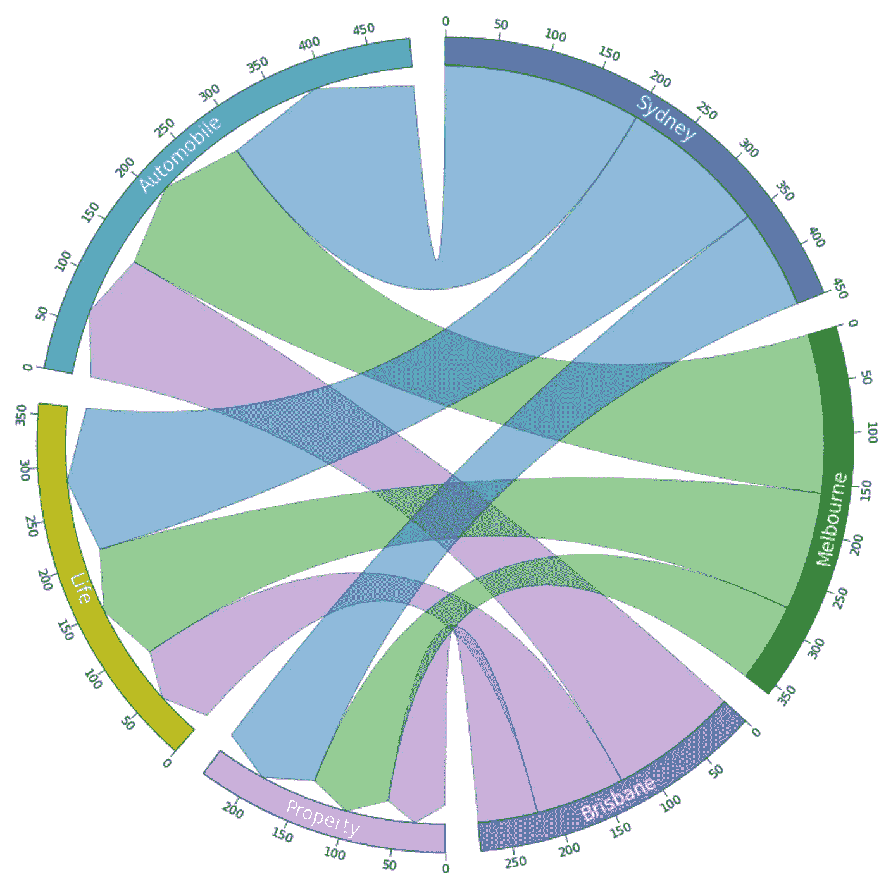

# 可能是展示多对多比例关系的最佳数据可视化方式

> 原文：[`towardsdatascience.com/probably-the-best-data-visualisation-for-showing-many-to-many-proportion-in-python-40bdd24365d5?source=collection_archive---------3-----------------------#2024-03-17`](https://towardsdatascience.com/probably-the-best-data-visualisation-for-showing-many-to-many-proportion-in-python-40bdd24365d5?source=collection_archive---------3-----------------------#2024-03-17)

## 如何使用 PyCirclize 绘制带有链接的炫酷 Chord 图

 [Christopher Tao](https://christophertao.medium.com/?source=post_page---byline--40bdd24365d5--------------------------------)

·发表于 [Towards Data Science](https://towardsdatascience.com/?source=post_page---byline--40bdd24365d5--------------------------------) ·阅读时间：8 分钟·2024 年 3 月 17 日

--

在我之前的文章中，我介绍了一个名为`PyCirclize`的 Python 库。它可以帮助我们以极小的努力生成非常漂亮的 Circos 图（或者如果你喜欢的话，也可以叫做 Chord 图）。如果你想了解它是如何让数据可视化变得“圆润”的，请不要错过。

 ## 让你的 Python 数据可视化图表更加“圆润”

### PyCirclize 库的基本使用 — Circos 图

towardsdatascience.com

不过，如果你只对带链接的 Chord 图感兴趣，也不用担心。本文将确保你理解如何绘制这种类型的图表。

在本文中，我将介绍`PyCirclize`可以绘制的另一种类型的 Chord 图。那就是带链接的 Chord 图，它能够非常好地可视化多对多实体之间的比例关系，而且至今是所有已知典型图表类型中最好的一个。

在我们开始之前，确保使用`pip`按照如下方式安装该库。然后，我们就可以开始了。让我们一起来探索这个炫酷的图表吧！
