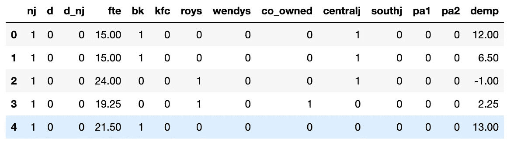
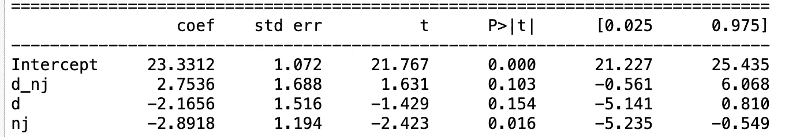

# 产品准实验：当标准 A/B 测试不可行时的统计学技术

> 原文：[`towardsdatascience.com/product-quasi-experimentation-statistical-techniques-when-standard-a-b-testing-is-not-possible-68d516a59b1c?source=collection_archive---------5-----------------------#2024-07-19`](https://towardsdatascience.com/product-quasi-experimentation-statistical-techniques-when-standard-a-b-testing-is-not-possible-68d516a59b1c?source=collection_archive---------5-----------------------#2024-07-19)

## 当随机化 A/B 测试不可行时，最常用技术的指南

[](https://medium.com/@ntetsika.magda?source=post_page---byline--68d516a59b1c--------------------------------)[](https://towardsdatascience.com/?source=post_page---byline--68d516a59b1c--------------------------------) [Magda Ntetsika](https://medium.com/@ntetsika.magda?source=post_page---byline--68d516a59b1c--------------------------------)

·发布于[Towards Data Science](https://towardsdatascience.com/?source=post_page---byline--68d516a59b1c--------------------------------) ·阅读时间 6 分钟·2024 年 7 月 19 日

--


图片由[Choong Deng Xiang](https://dengxiang.pages.dev/)提供，来源：[Unsplash](https://unsplash.com/?utm_source=medium&utm_medium=referral)

随机对照试验（RCT）是最经典的产品 A/B 测试形式。在科技行业，公司广泛使用 A/B 测试来衡量算法变化对用户行为的影响，或者新用户界面对用户参与度的影响。

单位的随机化确保实验结果与处理分配无关，消除了选择偏差，从而使我们能够依赖统计理论的假设，从观察中得出结论。

然而，随机分配并非总是可行的，即实验的受试者不能随机分配到对照组和处理组。有些情况下，由于溢出效应或不道德，定向特定用户是不切实际的，因此实验需要在城市或国家级别进行；或者在某些情况下，例如测试软件更新时，无法实际强制用户进入处理组。在这些情况下，由于随机化被违反，统计学技术需要应用，因为一旦随机化被破坏，统计理论的基本假设就不再有效。

让我们来看一些最常用的技术，简单来说它们是如何工作的，以及它们在何时被应用。

# 统计学技术

## 差异中的差异（DiD）

这种方法通常用于实验对象在群体层面聚集的情况。最常见的情况是实验对象是城市或国家。例如，当一家公司通过仅在特定城市或国家（处理组）推出新功能，并将其结果与其他城市/国家（对照组）进行比较时。请注意，在这种情况下，城市或国家通常是根据其产品市场契合度进行选择的，而不是随机分配的。这种方法有助于确保测试结果与目标市场相关且具有可推广性。

DiD 衡量的是控制组和处理组在干预前后期间平均结果差异的变化。如果处理对实验对象没有影响，你会期望看到处理组和对照组之间的差异始终如一。这意味着两组的趋势将是相似的，干预后不会有显著的变化或偏离。

因此，DiD 比较处理组和对照组在处理后的平均结果，并在假设两组在处理前有平行趋势且在处理后趋势保持平行的零假设下（Ho）寻找统计显著性。如果处理没有效果，处理组和对照组将展示相似的趋势。然而，如果处理有效，趋势将在干预后发生分化，处理组在方向、斜率或水平上会有显著的变化，相较于对照组。

如果平行趋势假设成立，DiD 可以提供可信的处理效应估计。然而，如果趋势不平行，结果可能会产生偏差，这时可能需要使用替代方法（例如，下面讨论的合成控制方法）或进行调整，以获得可靠的处理效应估计。

***DiD 应用***

让我们通过查看使用 DiD 方法分析最低工资上调对就业影响的[Card 和 Krueger 研究（1993）](https://www.aeaweb.org/articles?id=10.1257%2Faer.90.5.1397)，来了解 DiD 在实践中的应用。该研究分析了新泽西州和宾夕法尼亚州的 410 家快餐店，研究了新泽西州最低工资从每小时$4.25 增加到$5.05 后的影响。新泽西州的全职等效就业与宾夕法尼亚州的就业情况进行了对比，分析了最低工资上涨前后两州的差异。在这个自然实验中，新泽西州成为了处理组，宾夕法尼亚州则为对照组。

我使用这份来自研究的[数据集](http://www.principlesofeconometrics.com/poe5/poe5csv.html)尝试复制 DiD 分析。

```py
import pandas as pd
import statsmodels.formula.api as smf 

df = pd.read_csv('njmin3.csv')
df.head()
```



数据集如通过此[数据集](http://www.principlesofeconometrics.com/poe5/poe5csv.html)获取

在数据中，“nj”列为 1 表示新泽西州，列“d”为 1 表示新泽西州最低工资增加后，列“d_nj”为 nj × d 交互作用。

基于基本的 DiD 回归方程，这里 fte（即全职就业）是

fte_it = α+ β * nj_it + γ * d_t + δ * (nj_it × d_t) + ϵ_it

其中 ϵ_it 是误差项。

```py
model = smf.ols(formula = "fte ~ d_nj + d + nj", data = df).fit()
print(model.summary())
```



关键感兴趣的参数是 nj × d 交互作用（即“d_nj”），它估计了干预的平均治疗效果。回归结果显示，“d_nj”在统计上不显著（因为 p 值为 0.103 > 0.05），这意味着最低工资法对就业没有影响。

## 合成对照

合成对照方法比较感兴趣的单位（受治疗的城市/国家）与未受影响单位（对照组中的城市/国家）的加权平均值，其中权重是以一种方式选择的，使得合成对照单位最能匹配治疗单位的治疗前行为。

治疗单位的治疗后结果然后与合成单位进行比较，合成单位作为一个反事实估计，即如果治疗单位没有接受治疗，会发生什么。通过使用对照单位的加权平均值，合成对照方法可以创建一个更准确和个性化的反事实场景，减少偏差并改善治疗效果的估计。

想要更详细解释合成对照方法如何运作的例子，我发现 理解合成对照方法 特别有帮助。

## 倾向得分匹配（PSM）

想象设计一个实验来评估比如说 Prime 订阅对每位客户收入的影响。你无法随机分配用户订阅或不订阅。相反，你可以使用倾向得分匹配来找到类似 Prime 用户（治疗组）的非 Prime 用户（对照组），基于年龄、人口统计和行为等特征。

匹配中使用的倾向得分基本上是单位在给定一组观察特征的情况下接受特定治疗的概率，它是使用 logistic 回归或其他统计方法计算的。一旦计算出倾向得分，治疗组和对照组的单位将根据这些分数进行匹配，创建一个统计上类似于治疗组的合成对照组。通过这种方式，你可以创建一个可比较的对照组来估计 Prime 订阅的效果。

同样，当研究新功能或干预对青少年和父母的影响时，你可以使用 PSM 创建一个类似于治疗组的对照组，确保更准确地估计治疗效果。这些方法有助于减轻混杂变量和偏倚，从而更可靠地评估非随机设置中的治疗效果。

## 要点

当标准的 A/B 测试和单位的随机化不可能时，我们不能再依赖统计理论的假设来从观察到的数据中得出结论。一旦随机化被违反，就需要应用统计技术，如 DiD、合成对照和 PSM。

除了这些之外，还有更多的技术，也很受欢迎，除了这里讨论的技术，还有诸如工具变量（IV）、贝叶斯结构时间序列（BSTS）和回归断点设计（RDD）等技术，用于在随机化不可能或根本没有对照组的情况下估计治疗效果。
