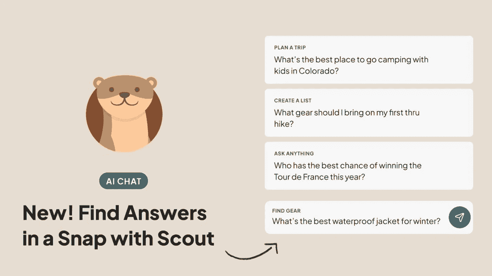

# 在 Django 中生产化 LLM RAG 应用 — 第一部分：Celery

> 原文：[`towardsdatascience.com/productionize-llm-rag-app-in-django-part-i-celery-26053b4acad6?source=collection_archive---------6-----------------------#2024-04-15`](https://towardsdatascience.com/productionize-llm-rag-app-in-django-part-i-celery-26053b4acad6?source=collection_archive---------6-----------------------#2024-04-15)

## 使用 Celery 和 Slack 监控自动化 Pinecone 每日 Upsert 任务

 [Wen Yang](https://medium.com/@wen_yang?source=post_page---byline--26053b4acad6--------------------------------)

·发表于 [Towards Data Science](https://towardsdatascience.com/?source=post_page---byline--26053b4acad6--------------------------------) ·阅读时间：8 分钟·2024 年 4 月 15 日

--

图片来源：Outside Inc

自从我上次发布关于 LLM 的文章已经有一段时间了，我很高兴地分享我的原型已经成功地生产化，并成为 Outside 公司首个基于 LLM 技术的聊天机器人——Scout。如果你是 Outside+ 的会员，可以访问 [`scout.outsideonline.com/`](https://scout.outsideonline.com/) 进行体验。

这段旅程始于 2023 年 3 月，我开始了一个周末的好奇心项目。我有了一个想法：利用 OpenAI 的 LLM 和 Outside 的内容作为知识库，构建一个问答型聊天机器人。后来，我在我们内部的产品展示会上分享了这个原型，激起了大家浓厚的兴趣。我感到非常兴奋，Scout 很快就成为了一个正式项目。2023 年 11 月 28 日，我们将 Scout 推向了部分 Outside+ 会员。时至今天，2024 年 4 月 12 日，已经有超过 28.3k 的独立用户使用了这一户外伴侣 AI 工具。

我无法表达对这段充满奇迹的经历有多感激，我一直计划写一系列文章，分享一些幕后故事，讲述如何将 LLM 和 RAG 技术应用到实际的应用程序中。目前我计划覆盖以下三个部分：

+   🦦 第一部分：使用 Celery 和 Slack 监控自动化 Pinecone 每日 Upsert

+   🦦 第二部分：构建 LLM Websocket API…
