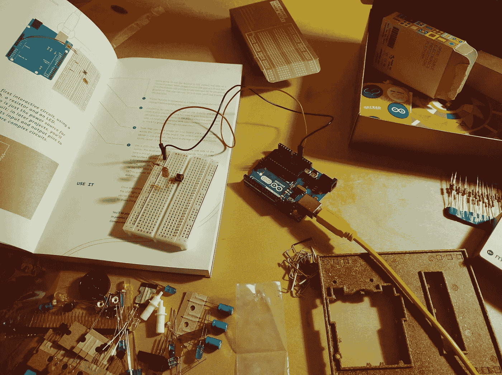

# 使用 CrewAI 代理编程 Arduino

> 原文：[`towardsdatascience.com/programming-an-arduino-with-crewai-agents-3ac5ad200fdf?source=collection_archive---------5-----------------------#2024-09-23`](https://towardsdatascience.com/programming-an-arduino-with-crewai-agents-3ac5ad200fdf?source=collection_archive---------5-----------------------#2024-09-23)

## 电子学与大型语言模型（LLMs）的互动

 [Miguel Otero Pedrido](https://medium.com/@migueloteropedrido?source=post_page---byline--3ac5ad200fdf--------------------------------)

·发布于[Towards Data Science](https://towardsdatascience.com/?source=post_page---byline--3ac5ad200fdf--------------------------------) ·阅读时长 7 分钟·2024 年 9 月 23 日

--

来源：图片由[Praveen Thirumurugan](https://unsplash.com/es/@praveentcom)提供，来自[Unsplash](https://unsplash.com/es)

> 你可以在这个[GitHub 仓库](https://github.com/neural-maze/crewai_llama3_arduino)中找到本教程的代码。

虽然我不认为自己是 Arduino 编程方面的专家，但我确实很喜欢在空闲时间构建电子项目。所以前几天，我脑海中突然冒出了一个想法：**我了解一些 AI，也了解一些 Arduino，那把它们结合起来怎么样？**

在过去几周尝试过[**CrewAI**](https://www.crewai.com/) **[1]**之后，我进行了一项实验：**将 CrewAI 与 Arduino 连接**。此外，我还认为使用一些本地的 LLM，如[**Ollama**](https://ollama.com/) **[2]**提供的 LLM，会很有趣。

但在我们开始编写代码之前，你可能不太熟悉 Arduino。那么，让我们从基础知识开始。

# 什么是 Arduino？

来源：图片由[Spencer](https://unsplash.com/es/@spen)提供，来自[Unsplash](https://unsplash.com/es)

一个[**Arduino**](https://www.arduino.cc/en/about) **[3]**是一个小型可编程计算机，它允许你构建自己的电子项目，从简单的电路（例如闪烁 LED）到可以移动的高级机器人。

简单来说，在使用 Arduino 平台时，你需要理解以下内容…
