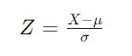
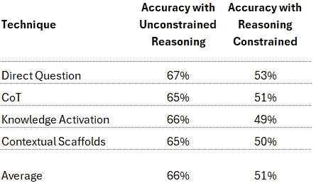
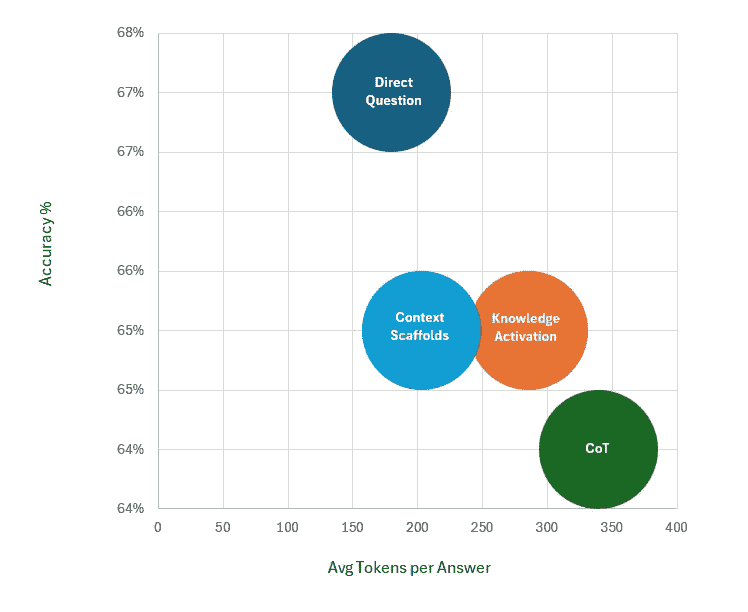
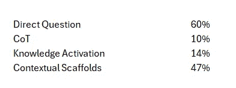
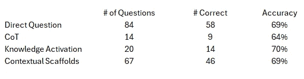

# 认知灵活性的提示工程

> 原文：[`towardsdatascience.com/prompt-engineering-for-cognitive-flexibility-44e490e3473d?source=collection_archive---------4-----------------------#2024-07-11`](https://towardsdatascience.com/prompt-engineering-for-cognitive-flexibility-44e490e3473d?source=collection_archive---------4-----------------------#2024-07-11)

## 来自 MMLU-Pro 实验的实践见解与分析

 [朱塞佩·斯卡拉莫尼亚](https://medium.com/@hominum_universalis?source=post_page---byline--44e490e3473d--------------------------------)

·发表于[Towards Data Science](https://towardsdatascience.com/?source=post_page---byline--44e490e3473d--------------------------------) ·9 分钟阅读·2024 年 7 月 11 日

--

来源：图片由作者提供，并使用 MidJourney 生成

## 引言

开发能够执行思考、规划和决策等任务的 AI 代理，并且具有人类水平的熟练度，是当前研究和讨论的一个重要领域。目前，LLM（大语言模型）已经成为这些代理的基础构建块。随着我们追求越来越复杂的能力，无论使用的是哪种 LLM，我们不可避免地会反复遇到相同类型的问题，包括：

1.  模型是否具备完成任务所需的必要知识，并能够高效、准确地执行任务？

1.  如果有合适的知识，如何可靠地激活它？

1.  模型是否能够模仿复杂的认知行为，如推理、规划和决策，达到一个可以接受的熟练度？

本文通过我最近进行的一项小型实验来探讨这些问题，该实验利用了最新的[MMLU-Pro](https://huggingface.co/datasets/TIGER-Lab/MMLU-Pro)基准。实验结果带来了一些关于认知灵活性的重要见解，以及我们如何将这一概念从认知科学应用到我们的 AI 代理和提示工程工作中。

## **背景**

**MMLU-Pro — 一项多项选择挑战**

最近发布的 MMLU-Pro（大规模多任务语言理解）基准测试通过提出比前身 MMLU[1]更强大、更具挑战性的任务，测试 AI 模型的能力边界。目标是创建一个全面的评估，涵盖多个学科，要求模型具有广泛的知识基础，并展示在不同情境中应用这些知识的能力。为此，MMLU-Pro 通过 14 个不同知识领域中的非常具有挑战性的推理导向选择题来测试模型。

我们都非常熟悉来自自己学术经历的选择题考试。我们在这些类型的考试中使用的策略通常包括推理、解决问题、回忆、排除、推断和有根据的猜测。我们能够在这些策略之间无缝切换，这一能力由认知灵活性支撑，使我们能够根据每个具体问题的要求调整我们的解题方式。

认知灵活性包含了诸如在不同概念之间切换以及同时思考多个概念等心理能力。它使我们能够根据当前的情境调整我们的思维方式。这个概念在我们的 AI 代理和提示工程工作中可能会有用吗？在我们探讨之前，让我们来看一个来自 MMLU-Pro“商业”类别的样题：

问题 205：如果每股年盈余的均值为$8.6，标准差为$3.4，那么观察到的每股盈余小于$5.5 的概率是多少？

答案：A: 0.3571, B: 0.0625, C: 0.2345, D: 0.5000, E: 0.4112, F: 0.1814, G: 0.3035, H: 0.0923, I: 0.2756, J: 0.1587

尽管被归类为“商业”问题，这道题实际上需要统计学知识。我们需要标准化该值，并计算它离均值有多少个标准差，以获取概率估算。这是通过计算 Z 分数来完成的，计算方式如下：

其中：

X 是待求值（在本例中为$5.50）

μ是均值（给定为$8.6）。

σ是标准差（给定为$3.4）

如果将这些值代入公式，我们得到-0.09118。然后，我们查阅标准正态分布表，发现 Z 小于-0.9118 的概率约为 18.14%，这对应我们选择中的答案“F”。

我认为可以肯定地说，这对一个 LLM 来说是一个非平凡的问题。正确答案不能仅凭记忆，需要通过计算得出。一个 LLM 是否具备解决此类问题所需的知识和认知灵活性？我们可以采用哪些提示工程策略？

**提示工程来拯救**

在用 LLM 解决上述问题时，我们可能会考虑：我们选择的模型是否具备所需的统计学知识？假设它具备这些知识，如何可靠地激活与标准正态分布相关的知识？最后，模型能否模仿数学推理步骤来得出正确答案？

广为人知的“思维链”（CoT）提示工程策略似乎非常合适。该策略依赖于提示模型在得出最终答案之前生成中间推理步骤。基本上有两种方法。

**思维链（CoT）**：涉及少量示例提示，在此过程中提供推理过程的示例来指导模型 [2]。

**零-shot 思维链（Zero-Shot CoT）**：涉及提示模型生成推理步骤而不使用先前的示例，通常使用诸如“让我们一步步思考”之类的短语 [3]。

还有许多其他策略，通常依赖于预生成特征激活的结合，即在初始提示中聚焦于激活知识，以及生成内在特征激活，即在模型生成输出时动态激活知识，每次生成一个令牌。

## **小型实验**

**实验设计**

在设计小型实验时，我使用了 ChatGPT-4o 并随机从 MMLU-Pro 数据集中每个 14 个知识领域中抽取了 10 个问题。实验的目标是评估两个主要方面：

1.  **不同提示工程技术的有效性：** 具体来说，使用不同技术来激活模型中所需知识和期望行为的影响。这些技术的选择旨在与不同程度的认知灵活性相匹配，且均为零-shot 技术。

1.  **故意限制推理和认知灵活性带来的影响：** 具体来说，限制模型自由推理的能力（因此严重限制认知灵活性）如何影响准确性。

测试的不同提示技巧依赖于以下模板：

**直接提问** — {问题}。从以下选项中选择正确答案：{答案}。请用字母和选定的答案回答。

**思维链（CoT）** — {问题}。让我们一步步思考，从以下选项中选择正确答案：{答案}。请用字母和选定的答案回答。

**知识领域激活** — {问题}。让我们考虑所需的知识和概念，并从以下选项中选择正确答案：{答案}。请用字母和选定的答案回答。

**情境框架** — {问题}。我的期望是你能正确回答这个问题。为自己创建一个操作性情境，以最大化实现我的期望，并从以下选项中选择正确答案：{答案}。请用字母和选定的答案回答。 [4]

直接提问方法作为基准，可能让模型发挥出最高程度的认知灵活性。链式推理（CoT）可能导致最少的认知灵活性，因为模型被指示逐步进行。知识领域激活和情境支架的表现介于直接提问和链式推理之间。

有意限制推理是通过采纳上述提示模板的最后一行来实现的，即“仅回复所选字母和答案”，并进一步明确为“*仅*回复所选字母和答案，*且不包含其他内容*。”

如果你对我用于运行实验的代码和结果感兴趣，可以在这个[GitHub 仓库](https://github.com/gfranco78/cognitive-flex-exp)找到。

**结果**

以下是不同提示方法及其推理受限变体的结果：

所有未限制推理的提示方法表现相似，直接提问方法的表现略优于其他方法。这有些出乎意料，因为 MMLU-Pro 论文[1]报告称，直接提问表现较差，而少量示例的链式推理（CoT）表现显著提高。我不会在这里详细讨论这一差异，因为这项小型实验的目的是不是为了复制他们的实验设置。

对于这项小型实验来说，更重要的是，当推理被故意限制时，所有技术的准确率都有所下降，从平均 66%下降到 51%。这一结果符合我们的预期。更相关的观察是，所有技术在生成前知识激活方面都没有成功超越直接提问方法，在直接提问中，生成前的特征激活主要来自模型接触问题和答案选项中的文本。

这些高层次结果的总体结论表明，提升提示工程有效性的最佳组合可能涉及以下内容：

1.  允许模型在一定程度上发挥认知灵活性，最佳示例是直接提问方法。

1.  允许模型自由推理，使推理过程成为生成的一部分。

**计算成本维度**

尽管不常讨论，但随着大语言模型（LLMs）在不同行业应用场景中的应用，令牌效率变得越来越重要。下图展示了每种未限制提示方法的准确性与回答中生成的平均令牌数之间的关系。

尽管准确性的差异并不是主要关注点，但“直接问题”方法的效率值得注意，每个答案平均生成 180 个标记，而 CoT 方法每个答案大约生成 339 个标记（即多出 88%）。由于准确性相当，这让我们推测，当涉及到生成内在知识激活时，CoT 相较于其他策略平均效率较低，产生了过多冗长的结果。但是什么导致了这种过度冗长呢？为了解答这一问题，分析不受约束的推理提示以及模型选择仅用答案而没有推理痕迹回答的次数是很有帮助的，哪怕并没有明确指示这么做。结果如下：

仅生成答案的实例百分比，即使没有严格要求这么做

更有趣的是，当模型选择直接回答而没有任何推理痕迹时，准确性表现如何，这在下表中有所展示：

即使是设计上特别需要推理和解决问题的 MMLU-Pro 问题，在没有被提示过度约束时，模型似乎表现出类似于根据特定问题选择不同策略的能力，准确率从 64% 到 70% 不等，并且没有生成任何推理痕迹。

**实际意义**

从这些结果中得到的实际启示是，直接的提示策略往往和过于结构化的策略一样有效。尽管 CoT 旨在通过激发特定的特征激活来模拟推理，但它并不总是必要或最优，特别是当过多生成标记成为问题时。相反，鼓励模型发挥其认知灵活性可能是一个更合适的策略。

## **结论：为 AI 代理铺平认知灵活性的道路**

这项小型实验的发现提供了关于大语言模型（LLMs）和 AI 代理认知灵活性重要性的有力见解。在人类认知中，认知灵活性指的是在面对任务或需求变化时，能够调整思维和行为的能力。它包括在不同概念之间切换，同时维持多个概念，并根据需要转移注意力。在 LLM 的语境下，可以理解为模型能够根据文本刺激动态调整其内部激活。

继续关注该领域技术和技巧的开发，可能会在各种复杂任务环境中显著提升人工智能代理的能力。例如，与 Anthropic 在其近期论文“[Scaling Monosemanticity: Extracting Interpretable Features from Claude 3 Sonnet](https://transformer-circuits.pub/2024/scaling-monosemanticity/index.html)”中提出的其他见解一起探索这一思想，可能会产生技术，使我们能够根据任务的复杂性和领域动态观察并调整使用的认知灵活性水平。

随着我们推动人工智能的边界，认知灵活性可能是创建不仅能可靠执行任务，还能理解并适应现实世界复杂性的模型的关键。

感谢阅读，并关注我以获取未来与这项工作相关的探索成果。如果你希望讨论，请随时在[LinkedIn](https://www.linkedin.com/in/giuseppe-scalamogna-8b389145/)与我联系。

除非另有注明，本文中的所有图片均由作者提供。

**参考文献：**

[1] Yubo Wang, Xueguang Ma, Ge Zhang, Yuansheng Ni, Abhranil Chandra, Shiguang Guo, Weiming Ren, Aaran Arulraj, Xuan He, Ziyan Jiang, Tianle Li, Max Ku, Kai Wang, Alex Zhuang, Rongqi Fan, Xiang Yue, Wenhu Chen: MMLU-Pro: 更强大且具有挑战性的多任务语言理解基准。[*arXiv:2406.01574*](https://arxiv.org/abs/2406.01574)，*2024*

[2] Jason Wei, Xuezhi Wang, Dale Schuurmans, Maarten Bosma, Brian Ichter, Fei Xia, Ed Chi, Quoc Le, Denny Zhou: 连锁推理提示在大型语言模型中引发推理。[*arXiv:2201.11903v6*](https://arxiv.org/abs/2201.11903v6)，*2023*

[3] Takeshi Kojima, Shixiang Shane Gu, Machel Reid, Yutaka Matsuo, Yusuke Iwasawa: 大型语言模型是零-shot 推理者。[*arXiv:2205.11916v4*](https://arxiv.org/abs/2205.11916v4)，*2023*

[4] Giuseppe Scalamogna, 通用提示工程路线图：情境支架框架（CSF），[*https://medium.com/towards-data-science/a-universal-roadmap-for-prompt-engineering-the-contextual-scaffolds-framework-csf-fdaf5a9fa86a*](https://medium.com/towards-data-science/a-universal-roadmap-for-prompt-engineering-the-contextual-scaffolds-framework-csf-fdaf5a9fa86a)，*2023*
