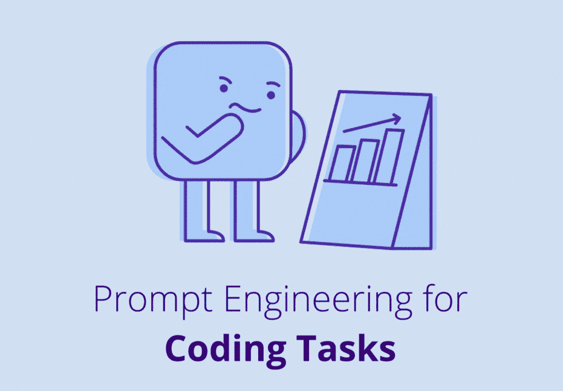

# 编程任务的提示工程

> 原文：[`towardsdatascience.com/prompt-engineering-llms-coding-chatgpt-artificial-intelligence-c16620503e4e?source=collection_archive---------2-----------------------#2024-04-12`](https://towardsdatascience.com/prompt-engineering-llms-coding-chatgpt-artificial-intelligence-c16620503e4e?source=collection_archive---------2-----------------------#2024-04-12)

## 通过提示工程提升 LLMs 的代码生成能力

 [Andrea Valenzuela](https://medium.com/@andvalenzuela?source=post_page---byline--c16620503e4e--------------------------------)

·发表于[Towards Data Science](https://towardsdatascience.com/?source=post_page---byline--c16620503e4e--------------------------------) ·7 分钟阅读·2024 年 4 月 12 日

--

自制图片。

如果你曾经使用 ChatGPT 帮助编写一段你一直推迟的繁琐 Python 脚本，或者寻找完成大学编程作业的最佳方法，你可能已经意识到，**尽管大型语言模型（LLMs）在某些编程任务中可能有所帮助，但它们通常难以生成高效且高质量的代码**。

我们并不是唯一对将 LLMs 作为编程助手感兴趣的人。许多公司对使用 LLMs 进行编程的兴趣迅速增长，这促使了 LLM 驱动的编程助手的开发，如[GitHub Copilot](https://github.com/features/copilot)。

使用 LLMs 进行编程面临着显著的挑战，正如我们在文章《为什么 LLMs 不适合编程》中讨论的那样。尽管如此，还是有一些提示工程技巧可以改善某些任务的代码生成。

在本文中，**我们将介绍一些有效的提示工程技巧，以增强代码生成**。

*让我们深入探讨！*

# 提示工程

LLMs 的提示工程涉及**精心设计提示语，以最大化模型输出的质量和相关性**。这个过程既是一门艺术，也是一门科学，因为它需要理解……
